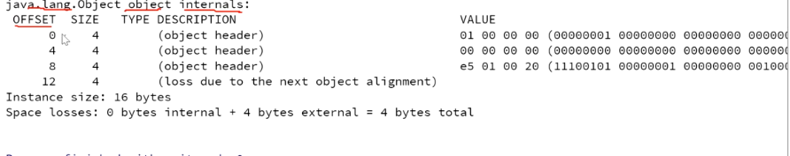
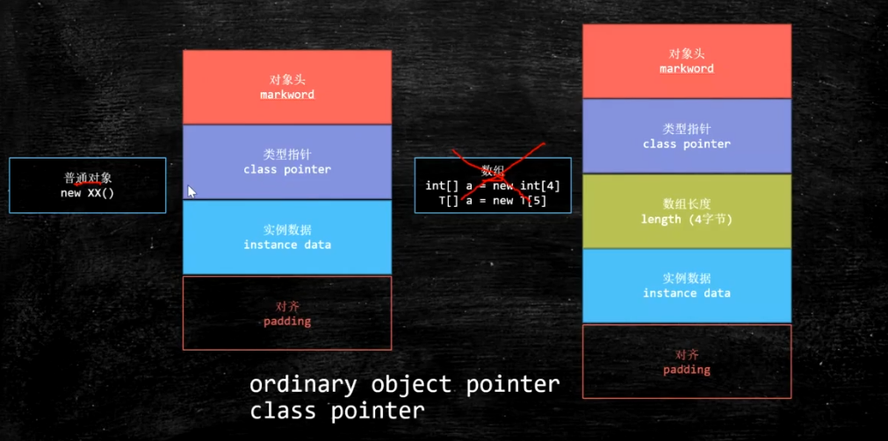
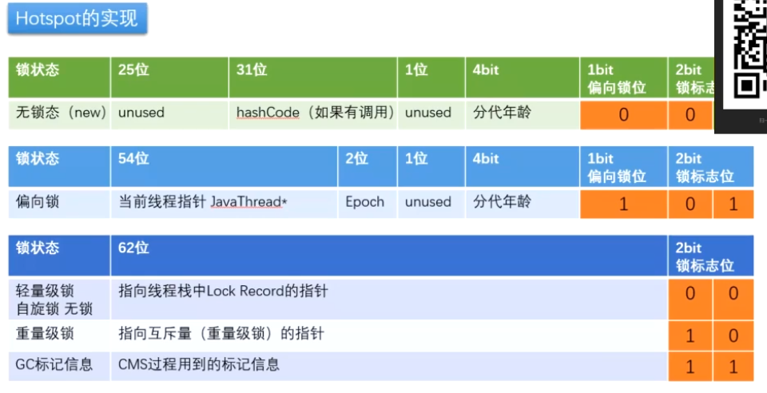

## Synchorized

### Synchorized 锁原理

- synchorized关键字提供了一种锁的机制，能够确保共享变量的互斥访问，从而防止数据不一致的问题的出现
- synchorized锁的不是代码而是对象，synchorized 不是锁，而是某线程在执行到 synchorized方法或者代码块的时候获取到了 对象头中的monitor锁		
- synchorized 提供的代码块或者方法只是保证了互斥性，也就是说只会有一个线程获取到mutex 的monitor锁
- synchorized的作用域要尽量小一点，因为synchorized修饰的方法或者代码块是互斥的monitor锁必须保证是同一个，避免多个锁的交叉导致死锁

- synchorized关键字包括monitorenter和 monitorexit 两个jvm指令，他能够保证 在如何时候任何线程 执行到minitor enter成功之前都必须从主内存中获取数据，而不是从缓存中，在monitor enter运行成功之后共享变量被更新后的值必须刷入主内存

- synchorized的指令严格遵守java hanppens-before原则，一个monitor exit指令之前必须有一个monitor enter指令，

- synchorzied 的锁操作要依赖于Java对象头来进行设置

- synchorized使用的锁对象是存储在java对象头中的，每个对象都存在一个monitor与之关联，monitor可以和对象一起创建销毁，也可以在线程进入时创建

- 每一个对象都与一个monitor相关联，一个monitor的 lock 的锁只能被一个线程在同一时间获得

- synchorized 关键字依赖于 字节码 monitorenter 和 monitorexist关键字

- synchorized方法 依赖于 ACC_SYNCHORIZED 字节指令

> 注意：
>
> 一般在字节码中会出现两个monitorexit指令，是为了防止在synchorized代码块中执行出现异常时，可以正常退出synchorized代码块


### Object 锁

synchorized 并不是锁，它只是提供了代码的同步机制，真正的锁的是 object 对象，每一个对象都有相对应的对象头与 ObjectMonitor对象（只有膨胀为重量级锁的时候才会生成），不管是 普通对象也好  class 对象也好（class 也是对象）都是可以用来做对象锁的。


#### 对象头

对象锁是与每个对象的对象头有关系，那么对象头布局是什么样子的？

首先说几个相关面试题：

- 1、Object o = new Object() 在内存中占用了多少个字节？

- 2、对象在内存中的布局是什么样子的？


1、先声明一个普通的Object 对象

```java
Object o = new Object();
```


2、使用JOL 打印对象头信息，如图： 



0 - 4 代表的是对象头，4 - 4 代表是对象头 (那么 0-8 对应下图中的 markword)

8 - 4 代表的是对象头（对应下图中的class pointor）

因为是一个空的object 对象，所以没有实例数据则不占用字节数

12 - 4 （需要对齐的字节数，因为不能为8整除）


**对象头内存布局图：**



markword ： 与 synchorized 相关的信息放在这里

class pointor ：类型指针，指向该对象对应的类信息（在 metaspace中）

instance data：实例数据指针，例如：int i ， String n 每一个指针占用4个字节（开启指针压缩的情况下）

padding：对齐，当整个的字节数不能为8整除的时候，需要内存对齐

-XX:+UseCompressedClassPointers ：开启类指针压缩，就是java对象头中的类指针

-XX:+UseCompressedOops：开启对象实例数据指针压缩，对应java实例数据指针，就是java对象头中的 instance data

> 注意：
>
> 如果jvm虚拟机是64位的话，那么每个指针的大小也是64位，对应 8个字节，如果开启上面的 jvm参数选项，则指针由8字节压缩为4个字节，如果该实例变量是基本类型变量的话则占用4个字节，只有引用类型指针才会存在指针压缩一说


根据以上介绍：markword 8个字节，class pointor 4个字节，instance data 0字节（由于new Object 实例中是空的）

所以需要 对齐，那么则需要补充4个字节

**示例：**

```java
class User {
    int id;
    String name;
}

该对象在内存中占用多少字节？
    
首先 markword 占用 8个字节，class pointor 占用8个字节，开启类指针压缩 4个，
实例变量
    id ： 基本类型 占用4个字节
    name：如果开启引用类型压缩指针 4个字节，没有开启8个字节
    
占用空间：8 + 4(8) + 4 + 4(8) = 20/28 + 4/4(padding 对齐) = 24/32
```


**使用工具**

```xml
<dependency>
	<groupId>org.openjdk.jol</groupId>
    <artifatId>jol-core</artifatId>
    <version>0.9</version>
</dependency>
```


#### 对象头中的MarkWrod 与 Synchorized

synchorized 与 object 对象的 加、解锁是如何实现的呢？

```java
synchorized(object) {
    //do something
}
```

在jdk1.6之前，只要执行到 synchorized 代码块，那么该对象锁就是一个重量级锁，在1.6之后对此进行了优化 ，升级过程如下：

new （无锁） -> 偏向锁 - 轻量级锁 （无锁，自旋锁，自适应自旋锁）- 重量级锁



markworkd 一共64位，8个字节，上图介绍了锁升级的各个阶段 markword的变化过程

无锁 0 0 1 

偏向锁 1 0 1

轻量级锁 0 0

重量级锁 1 0

GC 标记信息 1 1

> 拓展
>
> 4bit 能代表最大的值为15，那么 gc 中分代年龄可否被调整到30，答案是不可以，因为分代年龄的bit 最大为 4bit


### Monitor 分类

synchronized 关键字是借助于字节码指令monitorenter 和monitorexit 来实现的

- monitor enter
  如过monitor的计数器为0，意味着这个monitor的lock还没有被获得，某个线程获取之后会对该计数器加1，那么该线程就是 这个monitor的所有者了
  如过一个拥有该monitor所有权的线程重入，则导致该monitor的计数器再次累加
  如过monitor已经被其他线程拥有，则当前线程获取monitor所有全的时候会被阻塞直到monitor的计数器为0的时候才能再次获取monitor的所有权
- monitor exit
  释放对monitor的所有权，想要释放某个对象关联的monitor的所有权的前提是，你曾经获取了所有权，当计数器为0的时候将不再拥有该monitor的所有权，如过有重入的话每次都会减1，当减为0的时候被monitor block的线程将再次尝试获取该monitor

monitor type

- this monitor
  public synchorized void test1()

- class monitor

- public synchorized static void test1()

> 注意 ：
> DemoClass.class 本身就是一个对象
> 在非static方法也可以使用当前对象所属的class对象作为monitor，因为他本

  


### synchronize 优化

synchronize 优化 分别包括如下：

- 锁消除

  JIT编译时，对运行上下分进行分析，消除不可能存在竞争的锁

- 锁降级

- 锁升级（也就是说在jdk1.6之后，当线程再次进入synchorized代码块时，并不会直接变为重量级锁）

  无锁-》偏向锁-》轻量级锁（自旋锁，自适应自旋锁）-》重量级锁

- 锁粗化

  通过扩大加锁的范围来避免加锁和解锁

  


### ObjectMonitor 对象

每一个对象都与一个monitor相关联，一个monitor的 lock 的锁只能被一个线程在同一时间获得，monitor可以和对象一起创建销毁，或者当线程试图获取对象锁时生成，ObjectMonitor 关键属性如下：

- EntryList  ：锁池，表示线程未获取到当前的monitor锁，而需要阻塞挂起的
- WaitSet：调用object.wait()之后 进入阻塞等待状态，这时候会将当前线程加入到该对象的WaitSet中
- count：用来表示当前线程重入该锁的次数
- owner：表示当前锁被哪个线程所拥有

### java对象在内存中的布局

```
synchorized使用的锁对象是存储在java对象头中的，每个对象都存在一个monitor与之关联，monitor可以和对象一起创建销毁，也可以在线程进入时创建
```

 

 

##### 对象头

对象头的数据长度在`32`位和`64`位(未开启压缩指针)的虚拟机中分别为`32bit`和`64bit`。对象头由以下三个部分组成：

- Mark Word：记录了对象和锁的有关信息，储存对象自身的运行时数据，如哈希码(HashCode)、`GC`分代年龄、锁标志位、线程持有的锁、偏向线程`ID`、偏向时间戳、对象分代年龄等。**注意这个Mark Word结构并不是固定的，它会随着锁状态标志的变化而变化，而且里面的数据也会随着锁状态标志的变化而变化，这样做的目的是为了节省空间**。
- 类型指针：指向对象的类元数据的指针，虚拟机通过这个指针来确定这个对象是哪个类的实例。
- 数组长度：这个属性只有数组对象才有，储存着数组对象的长度。

在`32`位虚拟机下，`Mark Word`的结构和数据可能为以下`5`种中的一种。


在`64`位虚拟机下，`Mark Word`的结构和数据可能为以下`2`种中的一种。


这里重点注意**是否偏向锁**和**锁标志位**，这两个标识和`synchronized`的锁膨胀息息相关。


##### **自旋**

当有个线程`A`去请求某个锁的时候，这个锁正在被其它线程占用，但是线程`A`并不会马上进入阻塞状态，而是循环请求锁(自旋)。这样做的目的是因为很多时候持有锁的线程会很快释放锁的，线程`A`可以尝试一直请求锁，没必要被挂起放弃`CPU`时间片，因为线程被挂起然后到唤醒这个过程开销很大,当然如果线程`A`自旋指定的时间还没有获得锁，仍然会被挂起。

##### **自适应性自旋**

自适应性自旋是自旋的升级、优化，自旋的时间不再固定，而是由前一次在同一个锁上的自旋时间及锁的拥有者的状态决定。例如**线程如果自旋成功了，那么下次自旋的次数会增多**，因为`JVM`认为既然上次成功了，那么这次自旋也很有可能成功，那么它会允许自旋的次数更多。反之，如果**对于某个锁，自旋很少成功**，那么在以后获取这个锁的时候，自旋的次数会变少甚至忽略，避免浪费处理器资源。有了自适应性自旋，随着程序运行和性能监控信息的不断完善，`JVM`对程序锁的状况预测就会变得越来越准确，`JVM`也就变得越来越聪明。

##### 锁消除

锁消除是指虚拟机即时编译器在运行时，**对一些代码上要求同步，但是被检测到不可能存在共享数据竞争的锁进行消除**。

##### 锁粗化

在使用锁的时候，需要让同步块的作用范围尽可能小，这样做的目的是**为了使需要同步的操作数量尽可能小，如果存在锁竞争，那么等待锁的线程也能尽快拿到锁**

 


### synchorized 汇编底层实现

java - XX:+UnlockDiagnosticVMOptions -XX:+PrintAssembly T （打印出底层的加锁解锁汇编指令）


**注意：**

- synchronize 是非公平锁

- Thread 对象并不属于正常的 object 锁对象


