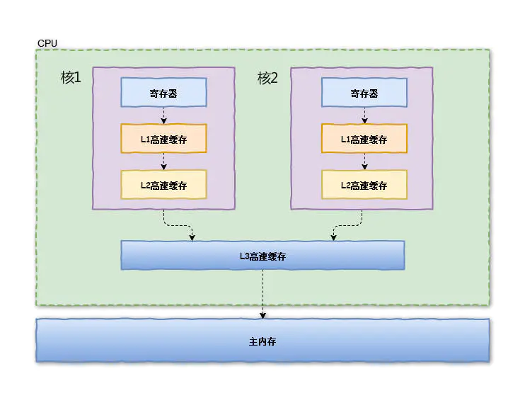
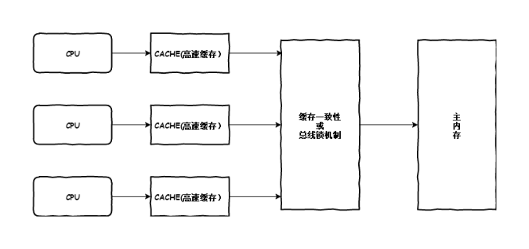
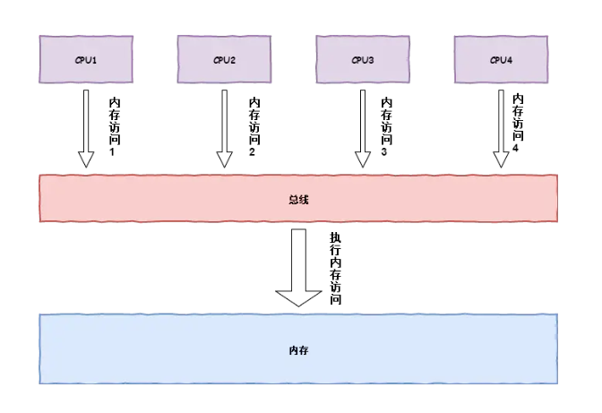

### Volatile 关键字

在介绍Volatile关键字之前，先说一下Java Memory Model 俗称 JMM模型

#### 物理计算机的额内存模型

在理解java内存模型之前，我们先来了解一下，物理计算机的内存模型，其对Java内存模型有着很大的参考意义。
 在物理计算机中，我们需要处理的数据都在内存中，处理器处理数据，需要从内存中获取相应的数据，然后存入内存中，为了提高计算机的处理速度（**读取数据，存储数据有IO消耗）**，我们常常会在CPU(处理器)中加入**高速缓存（Cache Memory）**，也就是将数据缓存到处理器中，当处理器处理完数据后，再将处理的数据结果存储在内存中。具体如下图所示：

  

当CPU（处理器）要读取一个数据时，首先从一级缓存中查找，如果没有找到再从二级缓存中查找，如果还是没有就从三级缓存或内存中查找。一般来说，每级缓存的命中率大概都在80%左右，也就是说全部数据量的80%都可以在一级缓存中找到，只剩下20%的总数据量才需要从二级缓存、三级缓存或内存中读取。

> 寄存器到  L1 的时间 < L2 < L3 < 主内存，但是往往 L1 会很小 大约 几十KB， L3 大概 十几M，所以在缓存中找不到想要的数据时，往往要从 L1 开始 依次向上查找，而查找的数据 往往是 几倍甚至 几百 几万 倍

#### 物理计算机的数据缓存不一致问题

虽然高速缓缓冲提高了CPU(处理器)处理数据的速度问题。在多线程中运行就会有问题了。在多核CPU中，每条线程可能运行于不同的CPU中，因此每个线程运行时有自己的高速缓存（对单核CPU来说，其实也会出现这种问题，只不过是以线程调度的形式来分别执行的）。这时CPU缓存中的值可能和缓存中的值不一样，这就会出现缓存不一致的问题。为了解决该问题。物理机算计提供了两种方案来解决该问题。具体如下图所示：

  

**1、通过总线加lock#锁的方式**

 总线（Bus）是计算机各种功能部件之间传送信息的公共通信干线，它是由导线组成的传输线束，在计算机中数据是通过总线，在处理器和内存之间传递。 

 

 在早期的CPU当中，是通过在总线上加**LOCK#锁**的形式来解决缓存不一致的问题。因为CPU和其他部件进行通信都是通过总线来进行的，如果对总线加LOCK#锁的话，也就是说阻塞了其他CPU对其他部件访问（如内存），从而使得只能有一个CPU能使用这个变量的内存。在总线上发出了LCOK#锁的信号，那么只有等待这段代码完全执行完毕之后，其他CPU才能从其内存读取变量，然后进行相应的操作。这样就解决了缓存不一致的问题。

**2、通过缓存一致性协议**

但是由于在锁住总线期间，其他CPU无法访问内存，会导致效率低下。因此出现了第二种解决方案，通过缓存一致性协议来解决缓存一致性问题。最出名的就是Intel 的MESI协议，MESI协议保证了每个缓存中使用的共享变量的副本是一致的。它核心的思想是：当CPU写数据时，如果发现操作的变量是共享变量，即在其他CPU中也存在该变量的副本，会发出信号通知其他CPU将该变量的缓存行置为无效状态，因此当其他CPU需要读取这个变量时，发现自己缓存中缓存该变量的缓存行是无效的，那么它就会从内存重新读取。

### JMM 内存

### valitile变量规则

### happens-before 原则

