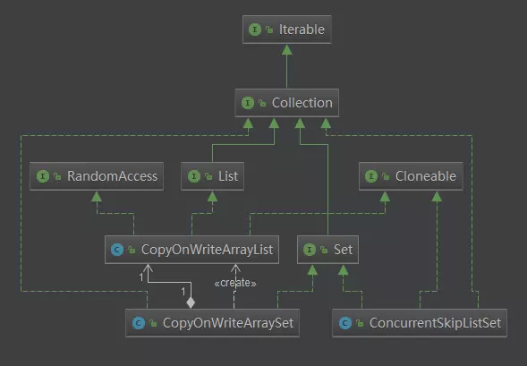
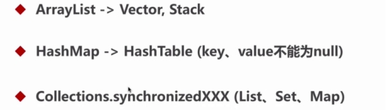
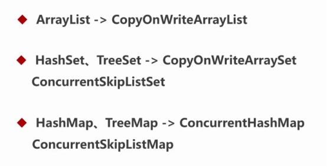

## 并发数据结构

### List和Set




```
java.util.concurrent：List和Set

-  CopyOnWriteArrayList：相当于线程安全的ArrayList，通过显式锁 ReentrantLock 实现线程安全。允许存储null值。

-  CopyOnWriteArraySet：相当于线程安全的HashSet，内部使用 CopyOnWriteArrayList 实现。允许存储null值。

- ConcurrentSkipListSet 在 Map中说明

```

老版本所对应的java安全集合

ArrayList -> Vecotr -> Statk


#### Stack 

是一种先进先出的栈数据结构，继承自Vector

```
public class Stack<E> extends Vector<E> {
    /**
     * Creates an empty Stack.
     */
    public Stack() {
    }h
}
```


#### CopyOnWriteArrayList

CopyOnWriteArrayList 使用的是写时复制技术，内部使用的是数据来记录所有的元素


##### Map


java.util.concurrent：Map

-  **ConcurrentHashMap**：线程安全的HashMap（但不允许空key或value），ConcurrentHashMap在JDK1.7之前是通过Lock和segment（分段锁）实现，1.8之后改为CAS+synchronized来保证并发安全。
-  **ConcurrentSkipListMap**：跳表结构的并发有序哈希表。不允许存储null值。
-  **ConcurrentSkipListSet**：跳表结构的并发有序集合。内部使用 ConcurrentSkipListMap 实现。不允许存储null值。


 

 

 

 

 

 

 

 