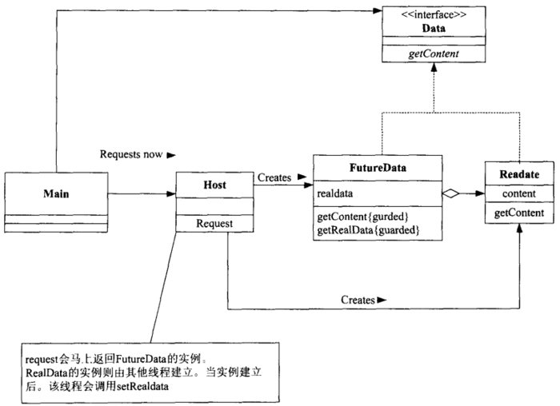
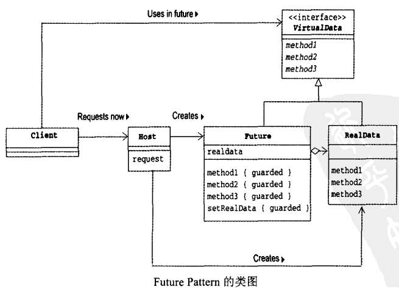

## Future 设计模式

### 定义

 Future模式用来获取线程的执行结果。在Thread-Per-Message模式中，如果调用一个线程异步执行任务，没有办法获取到返回值，就像：

```java
host.request(10,'A');
```

而Future模式送出请求后，马上就要获取返回值，就像：

```java
Data data=host.request(10,'A');
```

但是上述的返回值并不是程序的执行结果，因为线程是异步的，主线程调用该该方法时，异步线程可能才刚刚启动。需要一段时间后像下面这样获取执行结果:

```java
data.getContent();
```


### 模式案例

  


**Data接口/实现：**

```java
public interface Data {
    public abstract String getContent();
}
```

```java

public class RealData implements Data {
    private final String content;
    public RealData(int count, char c) {
        System.out.println("        making RealData(" + count + ", " + c + ") BEGIN");
        char[] buffer = new char[count];
        for (int i = 0; i < count; i++) {
            buffer[i] = c;
            try {
                Thread.sleep(100);
            } catch (InterruptedException e) {
            }
        }
        System.out.println("        making RealData(" + count + ", " + c + ") END");
        this.content = new String(buffer);
    }
    public String getContent() {
        return content;
    }
}
public class FutureData implements Data {
    private RealData realdata = null;
    private boolean ready = false;
    public synchronized void setRealData(RealData realdata) {
        if (ready) {
            return;
        }
        this.realdata = realdata;
        this.ready = true;
        notifyAll();
    }
    public synchronized String getContent() {
        while (!ready) {
            try {
                wait();
            } catch (InterruptedException e) {
            }
        }
        return realdata.getContent();
    }
}
```


**Host类：**

```java
public class Host {
    public Data request(final int count, final char c) {
        System.out.println("    request(" + count + ", " + c + ") BEGIN");
        final FutureData future = new FutureData();
        new Thread() {
            public void run() {
                RealData realdata = new RealData(count, c);
                future.setRealData(realdata);
            }
        }.start();
        System.out.println("    request(" + count + ", " + c + ") END");
        return future;
    }
}
```

*执行：*

```java
public class Main {
    public static void main(String[] args) {
        System.out.println("main BEGIN");
        Host host = new Host();
        Data data1 = host.request(10, 'A');
        Data data2 = host.request(20, 'B');
        Data data3 = host.request(30, 'C');
 
        System.out.println("main otherJob BEGIN");
        try {
            Thread.sleep(2000);
        } catch (InterruptedException e) {
        }
        System.out.println("main otherJob END");
        System.out.println("data1 = " + data1.getContent());
        System.out.println("data2 = " + data2.getContent());
        System.out.println("data3 = " + data3.getContent());
        System.out.println("main END");
    }
}
```


### 模式详解

Future模式的角色如下：

- Client（委托人）参与者

Client参与者会向Host参与者送出请求（request），Client参与者会马上得到VirtualData，作为请求结果的返回值。（案例中的Main类就是Client）

- Host参与者

Host参与者接受请求（request），然后创建线程进行异步处理。Host参与者会立即返回Future（以VirturalData的形式）。

- VirtualData（虚拟数据）参与者

VirtualData是用来统一代表Future参与者与RealData参与者。（案例中Data接口就是VirtualData参与者）

- RealData（实际数据）参与者

RealData表示实际的数据。

- Future参与者

Future参与者包含获取实际的数据和设置实际数据的方法。Host类会创建该对象，当异步线程处理完成时，会调用Future的设置数据的方法。

