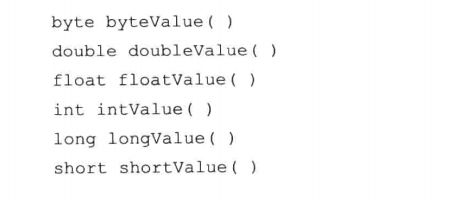
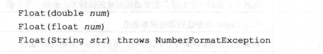
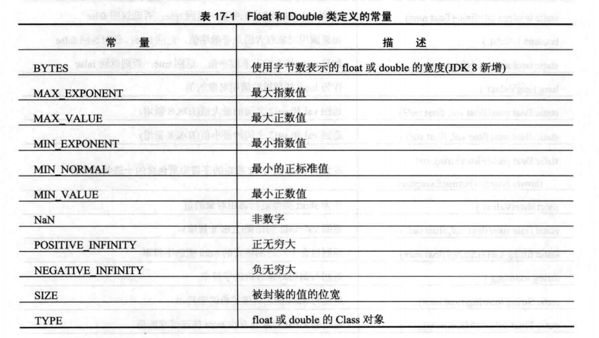
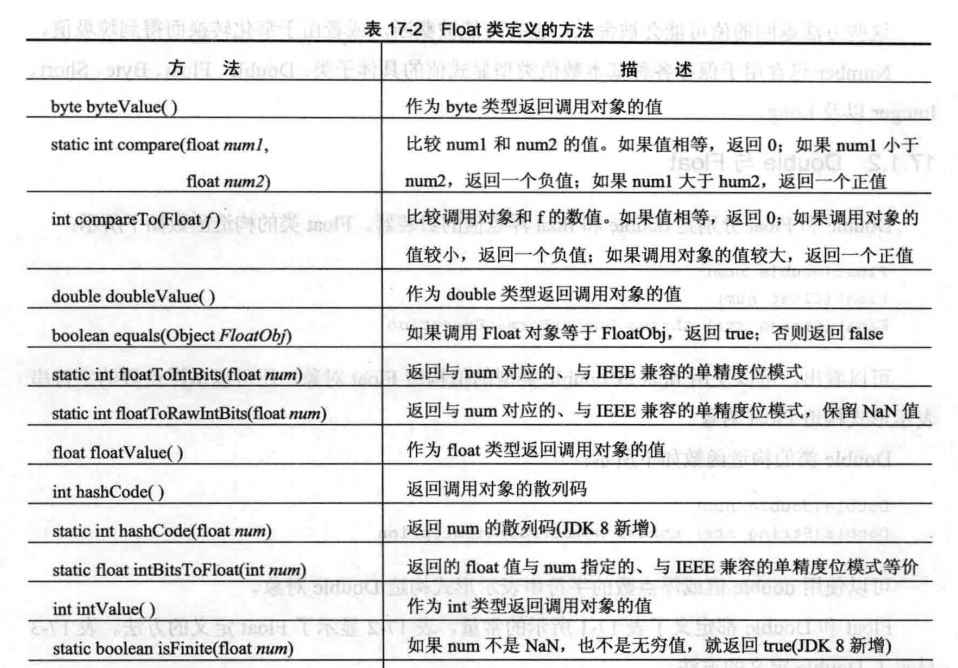
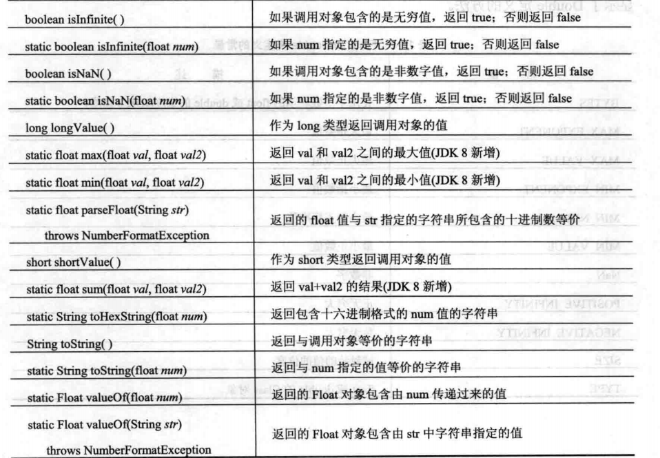
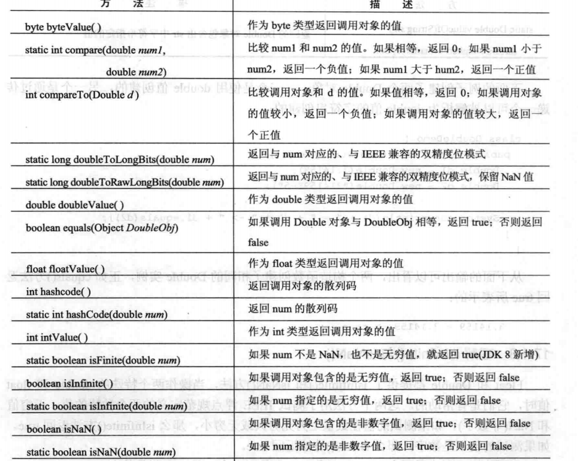
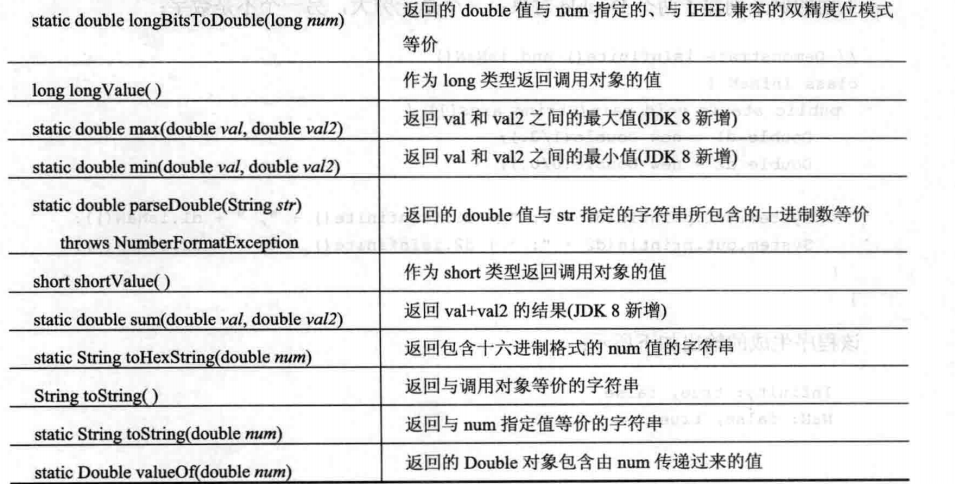
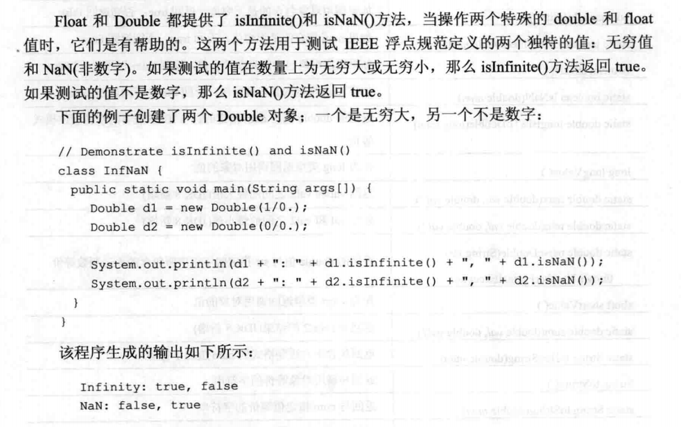

## Number

Number 类 为所有数字类型的超类，用于封装数值类型 byte、short、int、long、float、double 等基础类型

例如：doubleValue 返回的是double的值， floatValue 返回的是float的值




子类如下：

Double、Short、Integer、Long、Float、Byte、BigInteger、BigDecimal

<br>

### Double 与 Float

Doubel 与 Float 分别是 double 和 float 浮点值的封装器，

#### Float 构造函数如下：



float 值 与 double 值 都可以构造 Float 对象 


#### Double 构造函数如下：


可以使用double 值 和浮点数的字符串表示形式构造double 对象


#### Double 与 Float 对象常用的常量




#### Float 方法：






#### Double 方法如下：






#### isInfinite 与 isNaN




### Byte、Short、Integer、Long

Byte、Short、Integer、Long 分别是 整数类型 byte、short、int 以及 long的封装器

#### 常量

```
BYTES 使用字节表示整数类型的宽度
MIN_VALUE 最小值
MAX_VALUE 最大值
SIZE 被封装的值的位宽
TYPE byte、short、int 或者 long 的class 对象
```


