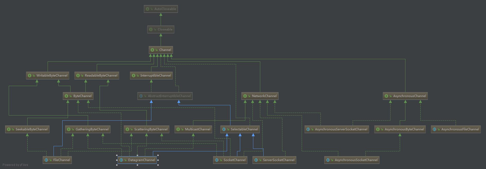

## Channel

Java NIO的通道类似流，但又有些不同：

- 既可以从通道中读取数据，又可以写数据到通道。但流的读写通常是单向的。
- 通道可以异步地读写。
- 通道中的数据总是要先读到一个Buffer，或者总是要从一个Buffer中写入。

Channel 模型图：




### Channel 重要的接口解读：

1、`AutoCloseable ` 在java中可以被理解为是可以自动关闭的接口，和 try with resource 配合使用。

2、`Channel`顶级接口，实际只提供一个`close()`。

2、`WritableByteChannel `： 用于向通道写入数据

3、ReadableByteChannel：用于从通道读取数据

4、ByteChannel：表示当前通道既可以读取，也可以写入数据，既双向通道

5、SeekableByteChannel：用于在通道中指定的位置开始写入数据，也就是可以定位到数据中的某个位置，从该位置开始写入数据，**trucate方法：   可以截取指定长度的文件 **

6、GatheringByteChannel：可以向通道写入数据，可以穿入ByteBuffer 数组。

7、ScatteringByteChannel：可以从通道读取到多个ByeBuffer 数组

8、NetworkChannel: 表示当前通道用于 网络IO，绑定、设置socket选项等。

9、AsynchronousChannel ：表示当前通道是异步IO操作

10、SelectableChannel：表示当前通道可以被注册在Selector 上，使用Selector 来管理所有的通道，这个就是多路复用提供的部分实现API。


`InterruptibleChannel`注释写了用于异步关闭or中断，大概说的是`AbstractInterruptibleChannel.begin()`的回调，中断后调用`implCloseChannel()`。


### Channel常用的实现类

- FileChannel
- DatagramChannel
- SocketChannel
- ServerSocketChannel
- AsynchronousFileChannel
- AsynchronousServerSocketChannel
- AsynchronousSocketChannel


FileChannel 从文件中读写数据。

SocketChannel 能通过TCP读写网络中的数据。

ServerSocketChannel：可以监听新进来的TCP连接，像Web服务器那样。对每一个新进来的连接都会创建一个SocketChannel。

DatagramChannel： 能通过UDP读写网络中的数据

AsynchronousFileChannel、AsynchronousServerSocketChannel、AsynchronousSocketChannel： 用于处理网络io、文件IO 相关的数据流，与nio 不同的是 这些操作是异步的，被称作是 AIO


### 基本Channel 示例

下面是一个使用FileChannel读取数据到Buffer中的示例：

```java
RandomAccessFile aFile = new RandomAccessFile("data/nio-data.txt", "rw");
FileChannel inChannel = aFile.getChannel();
ByteBuffer buf = ByteBuffer.allocate(48);
int bytesRead = inChannel.read(buf);

while (bytesRead != -1) {
	System.out.println("Read " + bytesRead);
	buf.flip();
	while(buf.hasRemaining()){
		System.out.print((char) buf.get());
	}
 
	buf.clear();
	bytesRead = inChannel.read(buf);
}

aFile.close();

```

