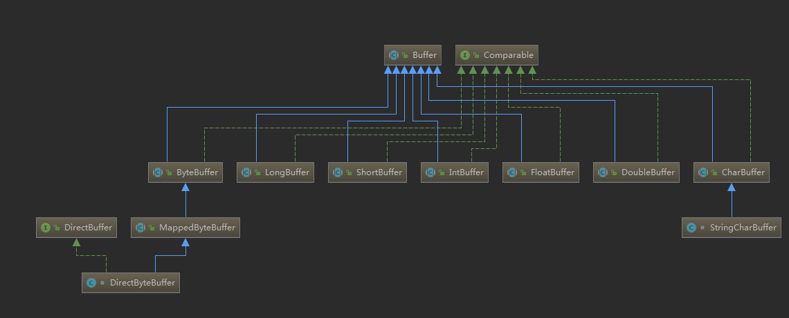

## Buffer

Buffer 常用的类图如下：



### Buffer 基本用法

使用Buffer读写数据一般遵循以下四个步骤：

1. 写入数据到Buffer
2. 调用`flip()`方法
3. 从Buffer中读取数据
4. 调用`clear()`方法或者`compact()`方法

当向buffer写入数据时，buffer会记录下写了多少数据。一旦要读取数据，需要通过flip()方法将Buffer从写模式切换到读模式。在读模式下，可以读取之前写入到buffer的所有数据。

一旦读完了所有的数据，就需要清空缓冲区，让它可以再次被写入。有两种方式能清空缓冲区：调用clear()或compact()方法。clear()方法会清空整个缓冲区。compact()方法只会清除已经读过的数据。任何未读的数据都被移到缓冲区的起始处，新写入的数据将放到缓冲区未读数据的后面。

```java
RandomAccessFile aFile = new RandomAccessFile("data/nio-data.txt", "rw");
        FileChannel inChannel = aFile.getChannel();
        //create buffer with capacity of 48 bytes
        ByteBuffer buf = ByteBuffer.allocate(48);
        int bytesRead = inChannel.read(buf); //read into buffer.
        while (bytesRead != -1) {
            buf.flip();  //make buffer ready for read
            while(buf.hasRemaining()){
                System.out.print((char) buf.get()); // read 1 byte at a time
            }
            buf.clear(); //make buffer ready for writing
            bytesRead = inChannel.read(buf);
        }
        aFile.close();
```


### Buffer 中常用的类解读

Java NIO 有以下Buffer类型

- ByteBuffer ： 字节缓冲区
- MappedByteBuffer： 零拷贝 mmap 缓冲区
- CharBuffer：字符缓冲区
- DoubleBuffer：double 缓冲区
- FloatBuffer： float 缓冲区
- IntBuffer：int 缓冲区
- LongBuffer：long 缓冲区
- ShortBuffer：short 类型缓冲区
- DirectByteBuffer ： 堆外内存


### Buffer 中的四大属性

缓冲区本质上是一块可以写入数据，然后可以从中读取数据的内存。这块内存被包装成NIO Buffer对象，并提供了一组方法，用来方便的访问该块内存。

为了理解Buffer的工作原理，需要熟悉它的三个属性：

- capacity
- position
- limit

这里有一个关于capacity，position和limit在读写模式中的说明，详细的解释在插图后面。


#### capacity

作为一个内存块，Buffer有一个固定的大小值，也叫“capacity” 表示当前缓冲区的容量,也就是最多只能写入容量值得字节，整形等数据。一旦buffer写满了就需要清空已读数据以便下次继续写入新的数据。

#### position

当写入数据到Buffer的时候需要中一个确定的位置开始，默认初始化时这个位置position为0，一旦写入了数据比如一个字节，整形数据，那么position的值就会指向数据之后的一个单元，position最大可以到capacity-1.

当从Buffer读取数据时，也需要从一个确定的位置开始。

buffer从写入模式变为读取模式时，position会归零，每次读取后，position向后移动。

#### limit

在写模式，limit的含义是我们所能写入的最大数据量。它等同于buffer的容量。

一旦切换到读模式，limit则代表我们所能读取的最大数据量，他的值等同于写模式下position的位置。

数据读取的上限时buffer中已有的数据，也就是limit的位置（原position所指的位置）。


### Buffer 常用方法

#### Buffer 的分配

 每一个Buffer类都有一个allocate方法。下面是一个分配48字节capacity的ByteBuffer的例子。

```
ByteBuffer buf = ByteBuffer.allocate(48);
```

#### 向buffer 写入数据

写数据到Buffer有两种方式：

- 从Channel写到Buffer。
- 通过Buffer的put() 方法写到Buffer里。

从Channel写到Buffer的例子

```
int bytesRead = inChannel.read(buf); ``//read into buffer.
```


通过put方法写Buffer的例子：

```
buf.put(``127``);
```

put方法有很多版本，允许你以不同的方式把数据写入到Buffer中。例如， 写到一个指定的位置，或者把一个字节数组写入到Buffer。 更多Buffer实现的细节参考JavaDoc。


#### flip()方法

flip方法将Buffer从写模式切换到读模式。调用flip()方法会将position设回0，并将limit设置成之前position的值。

换句话说，position现在用于标记读的位置，limit表示之前写进了多少个byte、char等 —— 现在能读取多少个byte、char等。


### rewind()方法

Buffer.rewind()将position设回0，所以你可以重读Buffer中的所有数据。limit保持不变，仍然表示能从Buffer中读取多少个元素（byte、char等）。


### clear()与compact()方法

一旦读完Buffer中的数据，需要让Buffer准备好再次被写入。可以通过clear()或compact()方法来完成。

如果调用的是clear()方法，position将被设回0，limit被设置成 capacity的值。换句话说，Buffer 被清空了。Buffer中的数据并未清除，只是这些标记告诉我们可以从哪里开始往Buffer里写数据。

如果Buffer中有一些未读的数据，调用clear()方法，数据将“被遗忘”，意味着不再有任何标记会告诉你哪些数据被读过，哪些还没有。

如果Buffer中仍有未读的数据，且后续还需要这些数据，但是此时想要先先写些数据，那么使用compact()方法。

compact()方法将所有未读的数据拷贝到Buffer起始处。然后将position设到最后一个未读元素正后面。limit属性依然像clear()方法一样，设置成capacity。现在Buffer准备好写数据了，但是不会覆盖未读的数据。


### mark()与reset()方法

通过调用Buffer.mark()方法，可以标记Buffer中的一个特定position。之后可以通过调用Buffer.reset()方法恢复到这个position。例如：

```java
buffer.mark();
//call buffer.get() a couple of times, e.g. during parsing.
buffer.reset();  //set position back to mark.
```


### equals()与compareTo()方法

可以使用equals()和compareTo()方法两个Buffer。


#### equals()

当满足下列条件时，表示两个Buffer相等：

1. 有相同的类型（byte、char、int等）。
2. Buffer中剩余的byte、char等的个数相等。
3. Buffer中所有剩余的byte、char等都相同。

如你所见，equals只是比较Buffer的一部分，不是每一个在它里面的元素都比较。实际上，它只比较Buffer中的剩余元素。


#### compareTo()方法

compareTo()方法比较两个Buffer的剩余元素(byte、char等)， 如果满足下列条件，则认为一个Buffer“小于”另一个Buffer：

1. 第一个不相等的元素小于另一个Buffer中对应的元素 。
2. 所有元素都相等，但第一个Buffer比另一个先耗尽(第一个Buffer的元素个数比另一个少)。


#### slice 方法


#### duplicate 方法


### DirectByteBuffer


### MappedByteBuffer


 
