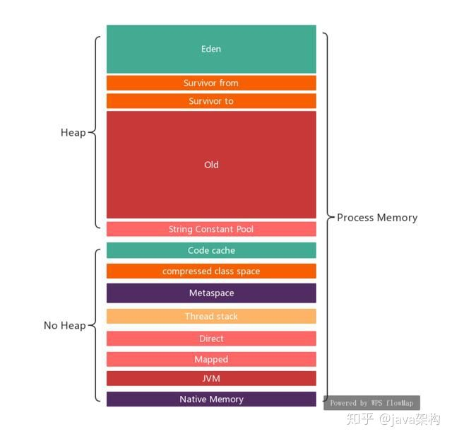

先放一张JVM的内存划分图，总体上可以分为堆和非堆（粗略划分，基于java8）





那么一个Java进程最大占用的物理内存为：

```text
Max Memory = eden + survivor + old + String Constant Pool + Code cache + compressed class space + Metaspace + Thread stack(*thread num) + Direct + Mapped + JVM + Native Memory
```

## **堆和非堆内存**

堆和非堆内存有以下几个概念：

**init**

表示JVM在启动时从操作系统申请内存管理的初始内存大小(以字节为单位)。JVM可能从操作系统请求额外的内存，也可以随着时间的推移向操作系统释放内存（经实际测试，这个内存并没有过主动释放）。这个init的值可能不会定义。

**used**

表示当前使用的内存量(以字节为单位)

**committed**

表示保证可供 Jvm使用的内存大小(以字节为单位)。 已提交内存的大小可能随时间而变化(增加或减少)。 JVM也可能向系统释放内存，导致已提交的内存可能小于 init，但是committed永远会大于等于used。

**max**

表示可用于内存管理的最大内存(以字节为单位)。

## **NMT追踪内存**

NMT(Native Memory tracking)是一种Java HotSpot VM功能，可跟踪Java HotSpot VM的内部内存使用情况（jdk8+）。

本文简单介绍下该工具的使用，主要用来解释Java中的内存

**开启**

在启动参数中添加-XX:NativeMemoryTracking=detail

**查看**

```text
jcmd 进程id VM.native_memory summary scale=MB
```

**输出结果**

```text
Native Memory Tracking:
Total: reserved=6988749KB, committed=3692013KB
 堆内存
- Java Heap (reserved=5242880KB, committed=3205008KB)
 (mmap: reserved=5242880KB, committed=3205008KB)
 类加载信息
- Class (reserved=1114618KB, committed=74642KB)
 (classes #10657)
 (malloc=4602KB #32974)
 (mmap: reserved=1110016KB, committed=70040KB)
 线程栈
- Thread (reserved=255213KB, committed=255213KB)
 (thread #248)
 (stack: reserved=253916KB, committed=253916KB)
 (malloc=816KB #1242)
 (arena=481KB #494)
 代码缓存
- Code (reserved=257475KB, committed=46551KB)
 (malloc=7875KB #10417)
 (mmap: reserved=249600KB, committed=38676KB)
 垃圾回收
- GC (reserved=31524KB, committed=23560KB)
 (malloc=17180KB #2113)
 (mmap: reserved=14344KB, committed=6380KB)
 编译器
- Compiler (reserved=598KB, committed=598KB)
 (malloc=467KB #1305)
 (arena=131KB #3)
 内部
- Internal (reserved=6142KB, committed=6142KB)
 (malloc=6110KB #23691)
 (mmap: reserved=32KB, committed=32KB)
 符号
- Symbol (reserved=11269KB, committed=11269KB)
 (malloc=8544KB #89873)
 (arena=2725KB #1)
 nmt
- Native Memory Tracking (reserved=2781KB, committed=2781KB)
 (malloc=199KB #3036)
 (tracking overhead=2582KB)
- Arena Chunk (reserved=194KB, committed=194KB)
 (malloc=194KB)
- Unknown (reserved=66056KB, committed=66056KB)
 (mmap: reserved=66056KB, committed=66056KB)
```

nmt返回结果中有reserved和committed两个值，这里解释一下：

**reserved**

reserved memory 是指JVM 通过mmaped PROT_NONE 申请的虚拟地址空间，在页表中已经存在了记录（entries），保证了其他进程不会被占用。

在堆内存下，就是xmx值，jvm申请的最大保留内存。

**committed**

committed memory 是JVM向操做系统实际分配的内存（malloc/mmap）,mmaped PROT_READ | PROT_WRITE，相当于程序实际申请的可用内存。

在堆内存下，就是xms值，最小堆内存，heap committed memory。

**注意，committed申请的内存并不是说直接占用了物理内存，由于操作系统的内存管理是惰性的，对于已申请的内存虽然会分配地址空间，但并不会直接占用物理内存，真正使用的时候才会映射到实际的物理内存。所以committed > res也是很可能的**

## **Linux内存与JVM内存**

再来说说JVM内存与该进程的内存。

现在有一个Java进程，JVM所有已使用内存区域加起来才2G（不包括Native Memory，也没有显式调用JNI的地方），但从top/pmap上看该进程res已经2.9G了

```text
#heap + noheap
Memory used total max usage
heap 1921M 2822M 4812M 39.93%
par_eden_space 1879M 2457M 2457M 76.47%
par_survivor_space 4M 307M 307M 1.56% 
cms_old_gen 37M 57M 2048M 1.84% 
nonheap 103M 121M -1 85.00%
code_cache 31M 37M 240M 13.18%
metaspace 63M 74M -1 85.51%
compressed_class_space 7M 9M 1024M 0.75%
direct 997K 997K - 100.00
mapped 0K 0K - NaN%
```


```text
#top
top -p 6267
top - 17:39:40 up 140 days, 5:39, 5 users, load average: 0.00, 0.01, 0.00
Tasks: 1 total, 0 running, 1 sleeping, 0 stopped, 0 zombie
Cpu(s): 0.2%us, 0.1%sy, 0.0%ni, 99.7%id, 0.0%wa, 0.0%hi, 0.0%si, 0.0%st
Mem: 8059152k total, 5255384k used, 2803768k free, 148872k buffers
Swap: 0k total, 0k used, 0k free, 1151812k cached
 PID USER PR NI VIRT RES SHR S %CPU %MEM TIME+ COMMAND
 6267 root 20 0 8930m 2.9g 17m S 0.0 37.6 4:13.31 java
```

那么其余的0.9G内存去哪了呢？

这时候就要介绍下JVM与Linux内存的联系了

当Java程序启动后，会根据Xmx为堆预申请一块保留内存，并不会直接使用，也不会占用物理内存

然后申请（malloc之类的方法）Xms大小的虚拟内存，但是由于操作系统的内存管理是惰性的，有一个内存延迟分配的概念。malloc虽然会分配内存地址空间，但是并没有映射到实际的物理内存，只有当对该地址空间赋值时，才会真正的占用物理内存，才会影响RES的大小。

所以可能会出现进程所用内存大于当前堆+非堆的情况。

比如说该Java程序在5分钟前，有一定活动，占用了2.6G堆内存（无论堆中的什么代），经过GC之后，虽然堆内存已经被回收了，堆占用很低，但GC的回收只是针对Jvm申请的这块内存区域，并不会调用操作系统释放内存。所以该进程的内存并不会释放，这时就会出现进程内存远远大于堆+非堆的情况。

至于Oracle文档上说的，Jvm可能会向操作系统释放内存，经过测试没有发现释放的情况。不过就算有主动释放的情况，也不太需要我们程序关心了