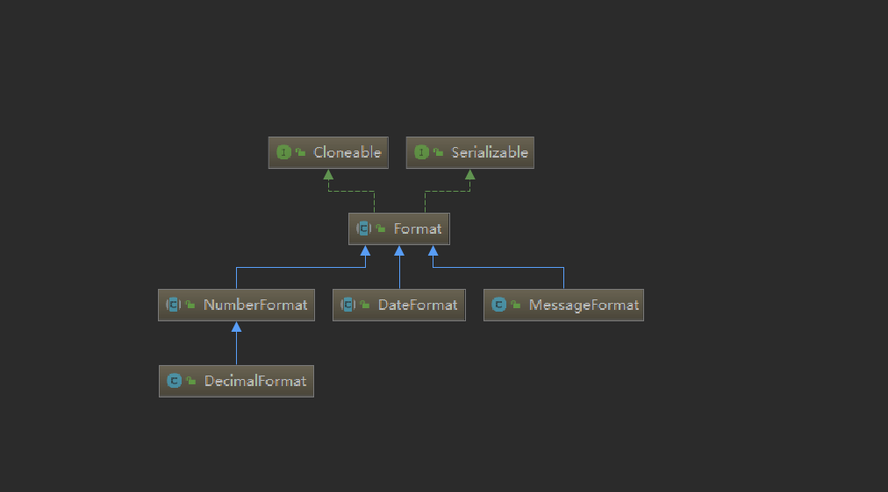

## Format 格式化信息

java 中默认提供了三种格式化类

`Format` 是一个用于格式化语言环境敏感的信息（如日期、消息和数字）的抽象基类。 

Java 为格式化日期、消息和数字分别提供了三个特殊的 `Format`  的子类：`DateFormat`、`MessageFormat` 和  `NumberFormat`。 





子类必须实现三个方法：  

- `format(Object obj, StringBuffer toAppendTo, FieldPosition pos)`  

- `formatToCharacterIterator(Object obj)`  

- `parseObject(String source, ParsePosition pos)`


大多数子类还将实现以下工厂方法：  

1. `getInstance` 获取一个适合于当前语言环境的有用的格式对象  
2. `getInstance(Locale)` 获取一个适合于指定语言环境的有用的格式对象。

由Foramt 派生出来的子类，大多都是线程不安全的，所以建议为每个线程创建各自的实例，或者使用同步方法进行同步

 


| 返回类型                  | 方法描述                                                     |
| ------------------------- | ------------------------------------------------------------ |
| `Object`                  | clone()        创建并返回此对象的一个副本。                  |
| String                    | format(java.lang.Object)   格式化一个对象以生成一个字符串。  |
| abstract  StringBuffer    | format(java.lang.Object, java.lang.StringBuffer, java.text.FieldPosition)  格式化一个对象，并将得到的文本添加到给定的字符缓冲区。 |
| AttributedCharacterIterat | formatToCharacterIterator(java.lang.Object) 格式化一个对象，生成一个 `AttributedCharacterIterator`。 |
| ` Object`                 | parseObject(java.lang.String)        从给定字符串的开始处解析文本以生成一个对象。 |
| abstract  Object          | parseObject(java.lang.String, java.text.ParsePosition)   解析字符串文本，生成一个对象。 |


### NumberFormat

 NumberFormat表示数字的格式化类 

**官方描述**

 NumberFormat帮助您格式化和解析任何区域设置的数字。您的代码可以完全独立于小数点，千位分隔符的区域设置约定，甚至是使用的特定十进制数字，或者数字格式是否为十进制。 


**获取NumberFormat 的实例**

```java
//创建 一个整数格式 地区用系统默认的
NumberFormat integerNumber = NumberFormat.getIntegerInstance(Locale.getDefault());

```

- 使用getInstance或getNumberInstance获取正常的数字格式。
- 使用getIntegerInstance得到的整数格式。
- 使用getCurrencyInstance来获取货币数字格式。
- 使用getPercentInstance获取显示百分比的格式。


**常用方法** 

  


**使用示例：** 

 配合 `FieldPosition` 示例

```java
NumberFormat numberFormat = NumberFormat.getInstance(Locale.getDefault());
//整数部分不会每隔三个，就会有 " ,"
numberFormat.setGroupingUsed(false);
//线程安全的字符串缓冲类
StringBuffer stringBuffer = new StringBuffer();
//构造参数 是Format子类里面的 自己特有的参数，传入就行
//构造 小数部分的，所以开始 beginIndex（）是从小数点 后面算的，  但是0是从整个格式化数字，第一个算起， 包括 之间用于分组的 " ,"
FieldPosition fieldPosition = new FieldPosition(NumberFormat.FRACTION_FIELD);
stringBuffer = numberFormat.format(1234.56789, stringBuffer, fieldPosition);
System.out.println(stringBuffer.toString());
//小数部分， 所以 从5 开始
System.out.println(fieldPosition.getBeginIndex() + "   " + fieldPosition.getEndIndex());
//切割字符串
System.out.println(stringBuffer.toString().substring(fieldPosition.getBeginIndex()));
```

 运行结果
 


### DicimalFormat

DecimalFormat是NumberFormat十进制数字格式的具体子类 。它具有多种功能，旨在解析和格式化任何语言环境中的数字，包括支持西方，阿拉伯语和印度语数字。它还支持不同类型的数字，包括整数（123），定点数（123.4），科学记数法（1.23E4），百分比（12％）和货币金额（123美元）。所有这些都可以本地化。


**获取DecimalFormat 子类**

要获取特定地区(包括默认地区)的NumberFormat，请调用NumberFormat的工厂方法之一，例如getInstance()。通常，不要直接调用DecimalFormat构造函数，因为NumberFormat工厂方法可能返回DecimalFormat之外的子类。如果需要自定义format对象，可以这样做:

```java
try {
            NumberFormat f = NumberFormat.getInstance(Locale.getDefault());
            if (f instanceof DecimalFormat) {
                ((DecimalFormat) f).setDecimalSeparatorAlwaysShown(true);
                //写具体的代码
            }
        } catch (Exception e) {
            e.printStackTrace();
        }
```


**设置pattern**

DecimalFormat作为NumberFormat的具体实现子类，最大的特点就是 可以使用Pattern。来实现最大程度的对数据格式进行定制。
一个Pattern中的许多字符是按字面意思理解的;它们在解析期间匹配，在格式化期间输出不变,就是字符在Pattern中 不影响最后的数字格式化另一方面，特殊字符代表其他字符、字符串或字符类。如果要以文字形式出现在前缀或后缀中，必须引用它们(除非另有说明)。

  


**方法：**

  


**使用实例：**

- 通用格式

  ```java
  //创建一个默认的通用格式
          NumberFormat numberFormat = NumberFormat.getInstance();
          DecimalFormat numberDecimalFormat;
          //捕捉异常，以防强制类型转换出错
          try {
              //强制转换成DecimalFormat
              numberDecimalFormat = (DecimalFormat) numberFormat;
              //保留小数点后面三位，不足的补零,前面整数部分 每隔四位 ，用 “,” 符合隔开
              numberDecimalFormat.applyPattern("#,####.000");
              //设置舍入模式 为DOWN,否则默认的是HALF_EVEN
              numberDecimalFormat.setRoundingMode(RoundingMode.DOWN);
              //设置 要格式化的数 是正数的时候。前面加前缀
              numberDecimalFormat.setPositivePrefix("Prefix  ");
              System.out.println("正数前缀  "+numberDecimalFormat.format(123456.7891));
              //设置 要格式化的数 是正数的时候。后面加后缀
              numberDecimalFormat.setPositiveSuffix("  Suffix");
              System.out.println("正数后缀  "+numberDecimalFormat.format(123456.7891));
              //设置整数部分的最大位数
              numberDecimalFormat.setMaximumIntegerDigits(3);
              System.out.println("整数最大位数 "+numberDecimalFormat.format(123456.7891));
              //设置整数部分最小位数
              numberDecimalFormat.setMinimumIntegerDigits(10);
              System.out.println("整数最小位数 "+numberDecimalFormat.format(123456.7891));
              //设置小数部分的最大位数
              numberDecimalFormat.setMaximumFractionDigits(2);
              System.out.println("小数部分最大位数 "+numberDecimalFormat.format(123.4));
              //设置小数部分的最小位数
              numberDecimalFormat.setMinimumFractionDigits(6);
              System.out.println("小数部分最小位数 "+numberDecimalFormat.format(123.4));
          }catch (Exception e){
              e.printStackTrace();
          }
  ```

    


- 百分比格式

   对数字 进行 百分比 格式化 

  ```java
  //创建一个中国地区的 百分比格式
          NumberFormat perFormat = NumberFormat.getPercentInstance(Locale.CHINA);
          DecimalFormat percentFormat;
          try {
              percentFormat = (DecimalFormat) perFormat;
              //设置Pattern 会使百分比格式，自带格式失效
  //            percentFormat.applyPattern("##.00");
              //设置小数部分 最小位数为2
              percentFormat.setMinimumFractionDigits(2);
              System.out.println(percentFormat.format(0.912345));
          } catch (Exception e) {
              e.printStackTrace();
          }
  ```

   运行结果：
   


- 货币格式

  ```java
  //创建一个中国地区的 货币格式
          NumberFormat curFormat = NumberFormat.getCurrencyInstance(Locale.CHINA);
          DecimalFormat currencyFormat;
          try {
              currencyFormat = (DecimalFormat) curFormat;
              //设置Pattern 会使百分比格式，自带格式失效
  //            currencyFormat.applyPattern("##.00");
              System.out.println(currencyFormat.format(0.912345));
              //乘法 数乘以多少 这个方法是 百分比时候 设置成100   km时候 是1000
              currencyFormat.setMultiplier(100);
              System.out.println(currencyFormat.format(0.912345));
          } catch (Exception e) {
              e.printStackTrace();
          }
  ```

  运行结果：

    


- 整数格式

  因为它很简单，作用就是只解析 整数部分的。小数部分的会被舍入。
  例如 “3456.78”→3456（并且在索引6之后保留解析位置）


### DateFormat

jdk8 已经提供了更好的时间API 处理，所以不再建议使用该方法格式化


### MessageFormat

用于字符串替换，你还在用以下的这种方法吗？

```java
String.format(String format, Object... args)
```

这是String类型的静态方法，但是除此之外，JDK提供了更好用的字符串替换方法，就是

```
MessageFormat.format(String pattern, Object ... arguments)
```

MessageFormat本身与语言环境无关，而与用户提供给MessageFormat的模式和用于已插入参数的子格式模式有关，以生成适用于不同语言环境的消息。


**MessageFormat 语法：**

MessageFormat模式（主要部分）：

```java
FormatElement:
         { ArgumentIndex }：是从0开始的入参位置索引。
         { ArgumentIndex , FormatType }
         { ArgumentIndex , FormatType , FormatStyle }

 FormatType: ：指定使用不同的Format子类对入参进行格式化处理。值范围如下：
         number：调用NumberFormat进行格式化
         date：调用DateFormat进行格式化
         time：调用DateFormat进行格式化
         choice：调用ChoiceFormat进行格式化

 FormatStyle:：设置FormatType中使用的格式化样式。值范围如下：
         short
         medium
         long
         full
         integer
         currency
         percent
         SubformatPattern (子格式模式，形如#.##)
```

以str为例，在这个字符串中：

```
1. {0} 和 {1,number,short} 和 {2,number,#.#}; 都属于FormatElement，0,1,2是ArgumentIndex。
2. {1,number,short} 里面的number属于FormatType，short则属于FormatStyle。
3. {1,number,#.#} 里面的#.#就属于子格式模式。
```

指定FormatType和FormatStyle是为了生成日期格式的值、不同精度的数字、百分比类型等等。


**实例：**

> **1**、ArgumentIndex必须是非负整数，它的个数不只限于0到9这10个，它可以用0到9的数字组成，因此可以有好多个，如：

```java
String msg = "{0}{1}{2}{3}{4}{5}{6}{7}{8}";  
Object [] array = new Object[]{"A","B","C","D","E","F","G","H","I",};         
String value = MessageFormat.format(msg, array);  

System.out.println(value);  // 输出：ABCDEFGHI  
```


> **2**、格式化字符串时，两个单引号才表示一个单引号，单个单引号会被省略，除非中文单引号不会被省略，如：

```java
String value = MessageFormat.format("oh, {0} is 'a' pig", "ZhangSan");  

System.out.println(value);  // 输出：oh, ZhangSan is a pig  
```

给字母a加上单引号，如：

```java
String value = MessageFormat.format("oh, {0} is ''a'' pig", "ZhangSan");
System.out.println(value);  // 输出：oh, ZhangSan is 'a' pig
```

如果需要显示双引号要进行转移，比如：String msg = “oh, {0} is \”a\” pig”;


> **3**、单引号会使其后面的占位符均失效，导致直接输出占位符。

```java
MessageFormat.format("{0}{1}", 1, 2); // 结果12
MessageFormat.format("'{0}{1}", 1, 2); // 结果{0}{1}
MessageFormat.format("'{0}'-{1}", 1, 2); // 结果{0}-2
```

使用双引号和两个单引号没有关系，比如

```java
String value = MessageFormat.format("oh, ''{0}'' is a pig", "ZhangSan");
System.out.println(value);  // 输出：oh, 'ZhangSan' is a pig
```

又比如，使用子格式模式，多了一个单引号：

```java
String value = MessageFormat.format("oh, {0,number,#.#} is good num", Double.valueOf("3.1415"));
System.out.println(value);  // 输出：oh, 3.1 is good num
```

> **4**、无论是有引号字符串还是无引号字符串，左花括号都是不支持的，如：

```java
String value = MessageFormat.format("oh, } is good num", Double.valueOf("3.1415"));
System.out.println(value);  // 输出：oh, } is good num
```

如果使用左花括号会出现异常

```java
String value = MessageFormat.format("oh, { is good num", Double.valueOf("3.1415"));
System.out.println(value);  // java.lang.IllegalArgumentException: Unmatched braces in the pattern.
```

因此要使用到左花括号需要使用单引号配合使用

```java
MessageFormat.format(“‘{‘{0}}”, “X-rapido”); // {X-rapido}
```


还有一个有趣的现象，如果出现两个或2个以上左花括号，就会出现分割字符串，但是右花括号就没问题，虽然没有任何意义，实际应用我们也用不到

```java
String value = MessageFormat.format("oh, {{ is good num", "d");
	System.out.println(value);  // oh, 

	String value = MessageFormat.format("oh, }} is good num", "d");
System.out.println(value);  // oh, }} is good num 
```


> **5**、关于MessageFormat.format方法：

每调用一次MessageFormat.format方法，都会新创建MessageFormat的一个实例，相当于MessageFormat只使用了一次。MessageFormat类的format方法如下：

```
public static String format(String pattern, Object ... arguments)   
{  
    MessageFormat temp = new MessageFormat(pattern);  
    return temp.format(arguments);  
}  
```

因此若要多次格式同一个模式的字符串，那么创建一个MessageFormat实例在执行格式化操作比较好些

```
String message = "oh, {0} is a pig";  
MessageFormat messageFormat = new MessageFormat(message);  
Object[] array = new Object[]{"ZhangSan"};  
String value = messageFormat.format(array);  

System.out.println(value);
```


### FieldPosition 与 ParsePosition

- FieldPosition 会记录我们在格式化字符串时，所关注字段的起始位置

- ParsePostion 则代表我们从第几个字符串开始解析

```java
DateFormat df = DateFormat.getDateTimeInstance(DateFormat.LONG, DateFormat.LONG);  
    StringBuffer dest3 = new StringBuffer();  


    //关注的是几号  
    pos = new FieldPosition(DateFormat.DATE_FIELD);  


    dest3 = df.format(new Date(), dest3, pos);  
    System.out.println("dest3 = " + dest3);  
    //结果当前时间为2012年6月27日 下午04时06分56秒  则beginIndex为7 endIndex为9  
    System.out.println("FRACTION portion is at: " + pos.getBeginIndex() + ", " + pos.getEndIndex());  

    SimpleDateFormat formatter = new SimpleDateFormat("yyyy-MM-dd");  
    String input[] = { "abc 2013-10-01 Vancouver, B.C.", "1248-03-01 Ottawa, ON", "1323-06-06 Toronto, ON" };  
    for (int i = 0; i < input.length; i++) {  


        ParsePosition pp = new ParsePosition(4);//从第四位开始处理  


        Date d = formatter.parse(input[i], pp);  
        if (d == null) {  
            //结果只处理了"abc 2013-10-01 Vancouver, B.C."   
            //"1248-03-01 Ottawa, ON"从第四位开始是"8-03-01 Ottawa, ON"无法转换  
            System.err.println("Invalid date in " + input[i]);  
            continue;  
        }  
        //成功转换后ParsePosition.getIndex()就是匹配的字符串结尾的索引  
        String location = input[i].substring(pp.getIndex());  
        System.out.println(" on " + d + " in " + location);  

    }  
}  
```


###  **ChoiceFormat** 

ChoiceFormat通常用于在 MessageFormat 中处理复数。创建 ChoiceFormat 时，可以指定一个 format 数组和一个 limit 数组。这些数组的长度必须相同。

如api中用于转换星期的例子

 double[] limits = {1,2,3,4,5,6,7};

 String[] monthNames = {"Sun","Mon","Tue","Wed","Thur","Fri","Sat"};

 ChoiceFormat form = new ChoiceFormat(limits, monthNames);

 ParsePosition status = new ParsePosition(0);

 for (double i = 0.0; i <= 8.0; ++i) {

   status.setIndex(0);

   System.out.println(i + " -> " + form.format(i) + " -> "

​               \+ form.parse(form.format(i),status));

 }

*form.format(i)**根据**limits**的数字转换为**星期几的名称。**l**imit**s**中的数字必须按升序排列，**如果**提供的数字不在**limits**中，**则**选择使用第一个或最后一个索引**。*

*form.parse(form.format(i),status)**，则根据**Name**转换为**limits**中的值。*

**1.1.2.** **ChoiceFormat****的例子**

下面是ChoiceFormat的api中一个较复杂的带模式格式的例子, 和MessageFormat一起使用：

 //生成ChoiceFormat

 double[] filelimits = {0,1,2};

 String[] filepart = {"are no files","is one file","are {2} files"};//这里的2是指从testArgs中取第二个元素的值

 ChoiceFormat fileform = new ChoiceFormat(filelimits, filepart);

 

//定义Format数组testFormats，分别为ChoiceFormat,null, NumberFormat

//ChoiceFormat用于{0}, null用于{1}, NumberFormat用于{2}

 Format[] testFormats = {fileform, null, NumberFormat.getInstance()};

 

//将MessageFormat的formats设为testFormats

//testFormats中的格式顺序对应于模式字符串中的格式元素的顺序

//最好使用setFormatsByArgumentIndex方法，而不是使用setFormats

 MessageFormat pattform = new MessageFormat("There {0} on {1}");

 pattform.setFormats(testFormats);