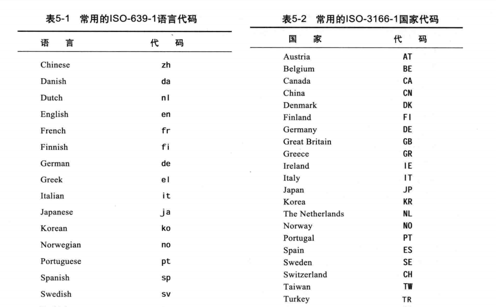
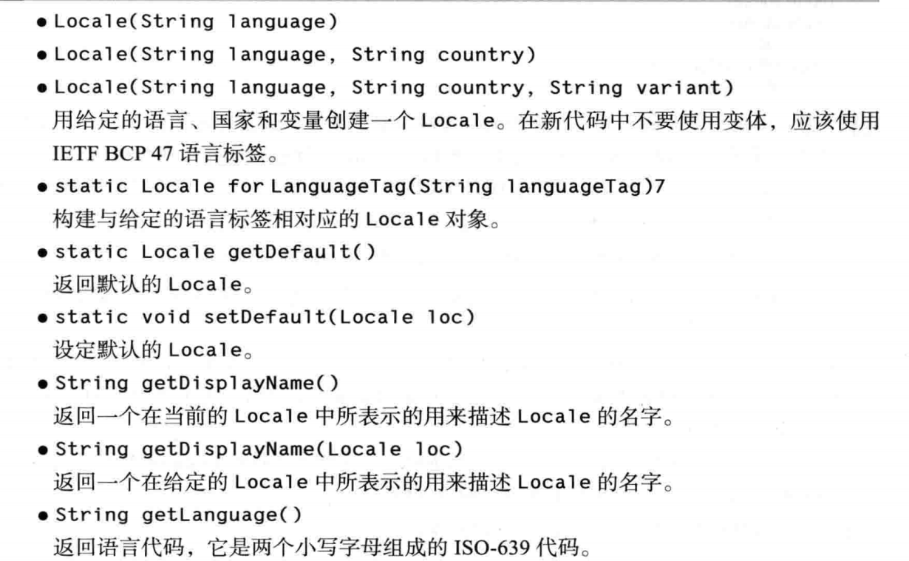
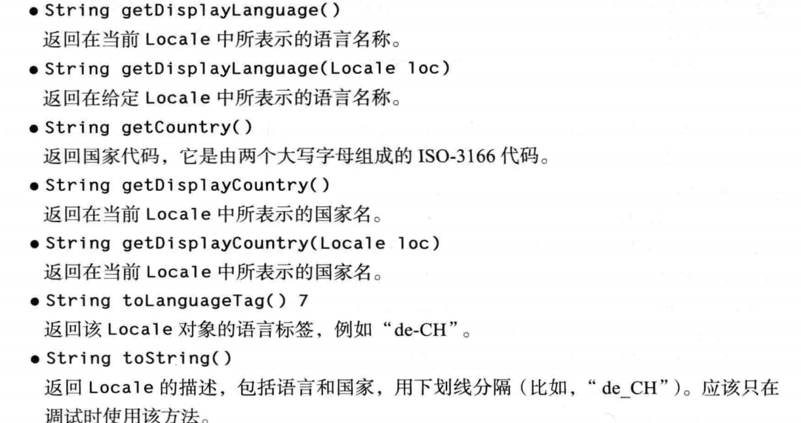
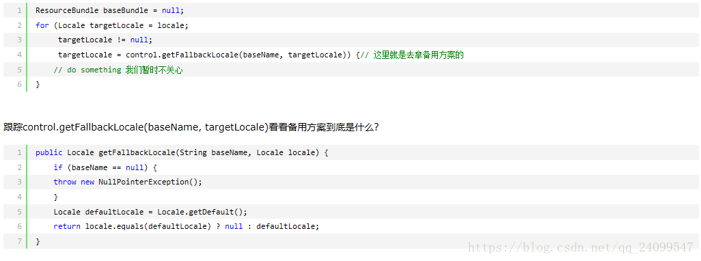
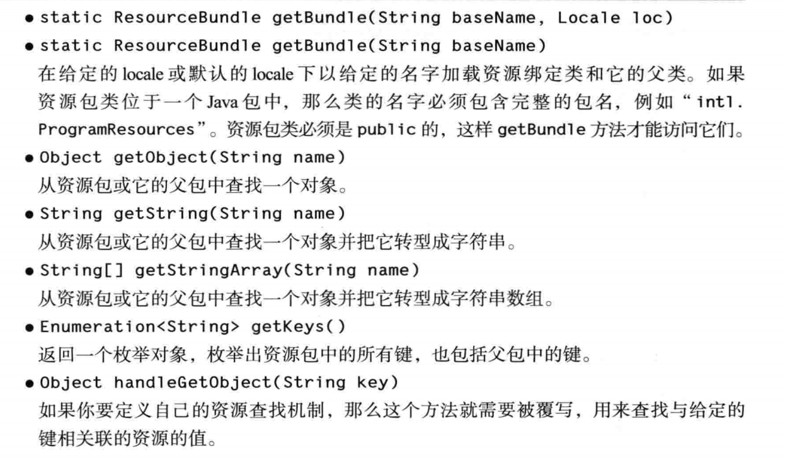

## 国际化

### Locale

Locale 常用代码




**创建实例**

Locale locale = new Locale(语言代码，国家代码);


**常用方法：**






### ResouceBundle

- 这个类主要用来解决国际化和本地化问题。国际化和本地化可不是两个概念，两者都是一起出现的。可以说，国际化的目的就是为了实现本地化。比如对于“取消”，中文中我们使用“取消”来表示，而英文中我们使用“cancel”。若我们的程序是面向国际的（这也是软件发展的一个趋势），那么使用的人群必然是多语言环境的，实现国际化就非常有必要。而ResourceBundle可以帮助我们轻松完成这个任务：当程序需要一个特定于语言环境的资源时（如 String），程序可以从适合当前用户语言环境的资源包（大多数情况下也就是.properties文件）中加载它。这样可以编写很大程度上独立于用户语言环境的程序代码，它将资源包中大部分（即便不是全部）特定于语言环境的信息隔离开来。
- 这使编写的程序可以：
  - 轻松地本地化或翻译成不同的语言
  - 一次处理多个语言环境
  - 以后可以轻松进行修改，以便支持更多的语言环境

> 说的简单点，这个类的作用就是读取资源属性文件（properties），然后根据.properties文件的名称信息（本地化信息），匹配当前系统的国别语言信息（也可以程序指定），然后获取相应的properties文件的内容。


#### 资源文件命名

使用这个类，properties需要遵循一定的命名规范。
一般的命名规范是： 自定义名\_语言代码\_国别代码.properties，如果是默认的，直接写为：自定义名.properties。

例如:
myres_en_US.properties
myres_zh_CN.properties
myres.properties(默认)

> 当在中文操作系统下，如果myres_zh_CN.properties、myres.properties两个文件都存在，则优先会使用myres_zh_CN.properties，当myres_zh_CN.properties不存在时候，会使用默认的myres.properties
>
> 没有提供语言和地区的资源文件是系统默认的资源文件。


资源文件都必须是ISO-8859-1编码，因此，对于所有非西方语系的处理，都必须先将之转换为Java Unicode Escape格式。转换方法是通过JDK自带的工具native2ascii.

> 扩展:我们可以在右击资源文件–>Properties属性–>Text file encoding–>选择ISO-8859-1(默认）
>
> 英文显示为;singable=singable
> 中文显示为:singable=\u5531\u6B4C


#### ResourceBundle的方法

获取ResourceBundle实例后可以通过下面的方法获得本地化值。
1.getObject(String key);
2.getString(String key);
3.getStringArray(String key);
4.还可以通过keySet()方法获取所有的key：Set keys = bundle.keySet();


#### 测试

1.新建4个属性文件

> res_en_US.properties：cancelKey=cancel
> res_zh_CN.properties：cancelKey=\u53D6\u6D88（取消）
> res_zh.properties：cancelKey=\u53D6\u6D88zh（取消zh）
> res.properties：cancelKey=\u53D6\u6D88default（取消default）

命名规则按照：资源名\_语言_国别.properties，每个资源文件中定义了本地化的信息，那么系统如何取到对应的资源文件呢？

```java
ResourceBundle bundle = ResourceBundle.getBundle("res", new Locale("zh", "CN"));
```

其中new Locale(“zh”, “CN”)提供本地化信息，包括语言和国家
上面这行代码，程序会首先在classpath（src目录）下寻找my_zh_CN.properties文件，若my_zh_CN.properties文件不存在，则取找my_zh.properties，如还是不存在，继续寻找my.properties,若都找不到就抛出异常。

```java
public void test1(){
  ResourceBundle bundle = ResourceBundle.getBundle("res", new Locale("zh", "CN"));
        String cancel = bundle.getString("cancelKey");
        System.out.println(cancel);  //取消
         
        bundle = ResourceBundle.getBundle("res", Locale.US);
        cancel = bundle.getString("cancelKey");
        System.out.println(cancel);  //cancel
         
        bundle = ResourceBundle.getBundle("res", Locale.getDefault());
        cancel = bundle.getString("cancelKey");
        System.out.println(cancel);  //取消
 
        bundle = ResourceBundle.getBundle("res", Locale.GERMAN);
        cancel = bundle.getString("cancelKey");
        System.out.println(cancel);  //取消
        
        bundle = ResourceBundle.getBundle("res", new Locale("zh"));
        cancel = bundle.getString("cancelKey");
        System.out.println(cancel);  //取消中文
 }
```

输出结果：

```
输出：
取消
cancel
取消
取消
取消中文
123456
```


这里前三个都在我们的预期范围之内，但是最后一个GERMAN，应该会去使用res.properties这个资源包吧？怎么使用了res_zh_CH.properties？

原来ResourceBundle为我们提供了一个fallback（也就是一个备用方案），这个备用方案就是根据当前系统的语言环境来得到的本地化信息。所以若是找不到GERMAN的，之后就会去找CHINA了，所以找到了res_zh_CH.properties这个资源包

这点我也是看了源代码才明白的，下面就贴上一些关键的源代码：


当显式定义的本地化信息并不是当前系统的本地化信息时，若未能通过显式定义的找到资源包，那么就去转而通过当前系统的本地化信息去找了~
扩展：创建Locale对象的几种方式

> 1.Locale locale = new Locale(String language,String country);
> 2.Locale locale = new Locale(String language);
> 3.Locale default1 = Locale.getDefault();


#### 应用场景

当一个网站有中英文两种切换模式时,可以通过某个标识(例如:lang=zh)作为参数传递到后台,以此来确定获取的是内容是中文的还是英文的


#### 常用方法

