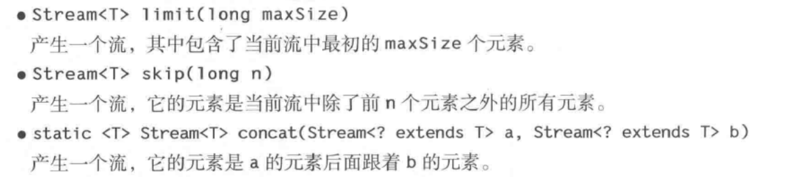
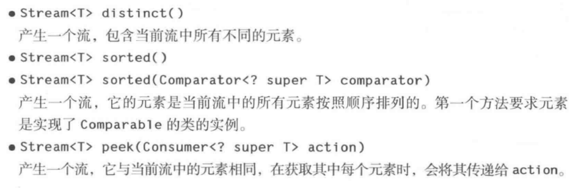
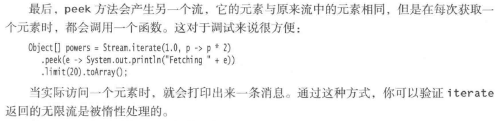
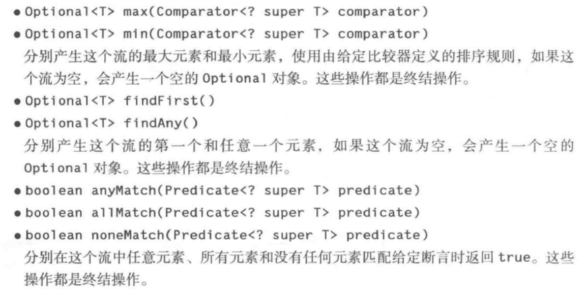

Stream 流处理

 使用到的工具类

Arrays、Collectors、Stream、StreamSupport、Spliters、Connections、Collector


针对基本类型

IntStream、DoubleStream、LongStream


stream的流程如下：

1、源数据

2、零个或者多个中间操作

3、终止操作


### Stream流 常用的方法

- Stream<T> filter 

  产生一个流，其中包含当前流中满足P的所有元素

- long count()

  产生当前流中元素的数量，是一个终止操作

- default Stream<E> stream()

- default Stream<E> parallelStream()

  产生当前集合所有元素的顺序流和并行流


### Stream类 常用方法

- Stream.of ("1","2") 

  返回一个流数据

- Stream.empty()

  返回不包含任何元素的流

**获取一个无限序列流**

- Stream.generate() 
  产生一个无限流，它的值是通过反复调用函数s 而构建的

- Stream.iterate()

  产生一个无线流，它的元素包含种子、在种子上调用f 产生的值、在前一个元素上调用f产生的值，等等


**产生一个Stream 流**

- Arrays. Stream.stream(T[] array,int startInclusive,int endExclusive)

  产生一个流，它的元素是由数组中指定范围内的元素构成的。

- Pattern.splitAsStream(CharSequence input)

  产生一个流，它的元素是输入中由该模式界定的部分

- Files.lines(Path path)

- Files.lines(Path path, Charset charset)

  产生一个流，他的元素是指定文件中的行，该文件的字符集为UTF-8，或者为指定的字符集


### Stream 常用操作

- Stream<T> filter(Predicate<? super T> predicate）

  产生一个流，它包含当前流屮所有满足断言条件的元素。 

- <R> Stream<R> mapCFunction<? superT，？extends R > mapper **)** 

  产生一个流，它包货将 mapper 应用 F与前流中所有元素所产生的结果。 

- <R> Stream<R> flatMap(Function<? super T, ? extends Stream<? extends R>> mapper)

产生一个流，它是通过将 mapper 应用于当前流中所有元素所产生的结果连接到 一起 而获得的。（注意，这里的每个结果都是一个流。）


### 返回新的Stream 流









### Stream 终止操作



forEach 遍历迭代元素

在并行流上，forEach 方法会以任意顺序遍历各个元素。如果想要按照流中的顺序来处理它们，可以调用forEachOrderd方法，当然，这个方法会丧失并行处理的部分甚至全部优势


### Stream.Builder

允许我们使用Builder 类来自由的添加元素，最后构建成为一个Stream 流


### 常用工具类

Collectors，Arryas、Collector、StreamSupport、Spliterators、Spliterator


Collectors 常用方法

```
joing


```


