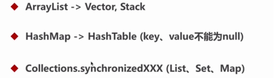

####并发数据结构

 

#####List和Set


```
java.util.concurrent：List和Set

-  CopyOnWriteArrayList：相当于线程安全的ArrayList，通过显式锁 ReentrantLock 实现线程安全。允许存储null值。

-  CopyOnWriteArraySet：相当于线程安全的HashSet，内部使用 CopyOnWriteArrayList 实现。允许存储null值。

- ConcurrentSkipListSet 在 Map中说明

```


##### Map


java.util.concurrent：Map

-  **ConcurrentHashMap**：线程安全的HashMap（但不允许空key或value），ConcurrentHashMap在JDK1.7之前是通过Lock和segment（分段锁）实现，1.8之后改为CAS+synchronized来保证并发安全。
-  **ConcurrentSkipListMap**：跳表结构的并发有序哈希表。不允许存储null值。
-  **ConcurrentSkipListSet**：跳表结构的并发有序集合。内部使用 ConcurrentSkipListMap 实现。不允许存储null值。


 

 

 

 

 

 

 

 