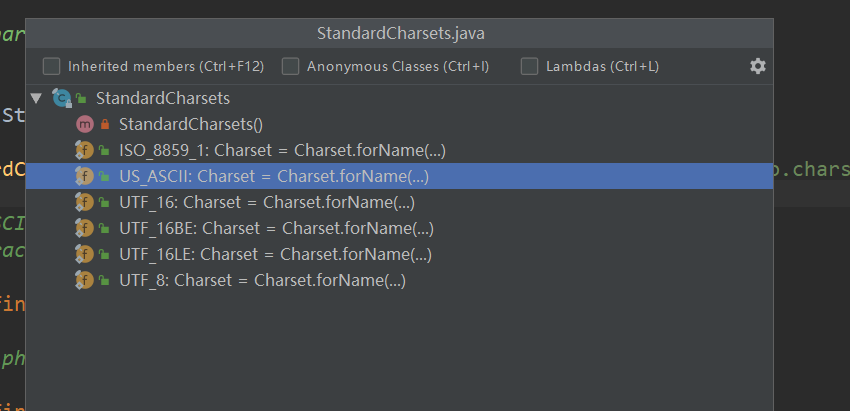

### Chasest

Charset 提供了字符集之间的字符转换

- `StandardCharsets`  标准字符集
- CharsetEncoder 字符编码
- CharsetDecoder 字符解码
- Charset 提供字符集转换的工具类


Java 暂时支持如下的标准编码 ，在  `StandardCharsets` 标准字符编码类中定义

- US-ASCII: 7位ASCII字符。
- ISO-8859-1: ISO拉丁字母
- UTF-8:这是8位UCS转换格式。
- UTF-16BE:这是16位UCS转换格式，字节顺序大
- UTF-16LE:这是16位UCS变换，以字节顺序表示。
- UTF-16: 16位UCS转换格式。




**案例：**

```java
import java.nio.ByteBuffer;
import java.nio.CharBuffer;
import java.nio.charset.CharacterCodingException;
import java.nio.charset.Charset;
import java.nio.charset.CharsetDecoder;
import java.nio.charset.CharsetEncoder;
import java.nio.charset.StandardCharsets;

public class CharsetDemo {

    public static void main(String[] args) throws CharacterCodingException {
        // 注意: StandardCharsets是jdk1.7添加的
        Charset charset = StandardCharsets.UTF_8;

        // 从字符集中创建相应的编码和解码器
        CharsetEncoder encoder = charset.newEncoder();
        CharsetDecoder decoder = charset.newDecoder();

        // 构造一个buffer
        CharBuffer charBuffer = CharBuffer.allocate(64);
        charBuffer.put('初');
        charBuffer.put('次');
        charBuffer.put('见');
        charBuffer.put('面');
        charBuffer.put(',');
        charBuffer.put('多');
        charBuffer.put('多');
        charBuffer.put('管');
        charBuffer.put('照');
        charBuffer.put('!');
        charBuffer.flip();

        // 将字符序列转换成字节序列
        ByteBuffer bb = encoder.encode(charBuffer);
        while(bb.hasRemaining()) {
            System.out.print(bb.get() + " ");
        }
        System.out.println();

        // 将字节序列转换成字符序列
        bb.flip();
        CharBuffer cb = decoder.decode(bb);
        System.out.println(cb);
    }
}
```


输出结果：

```
-27 -120 -99 -26 -84 -95 -24 -89 -127 -23 -99 -94 44 -27 -92 -102 -27 -92 -102 -25 -82 -95 -25 -123 -89 33 
初次见面,多多管照!
```

