mmap 只能映射磁盘文件


os kernnel 来决定如何将缓存的数据刷新到Co磁盘上

## NIO

### NIO 的概念

NIO有两个概念

- NEW IO，也就是java提供的新的IO API，由channel 和 buffer组成
- NO BLOCKING IO, 也就是 非阻塞的IO。


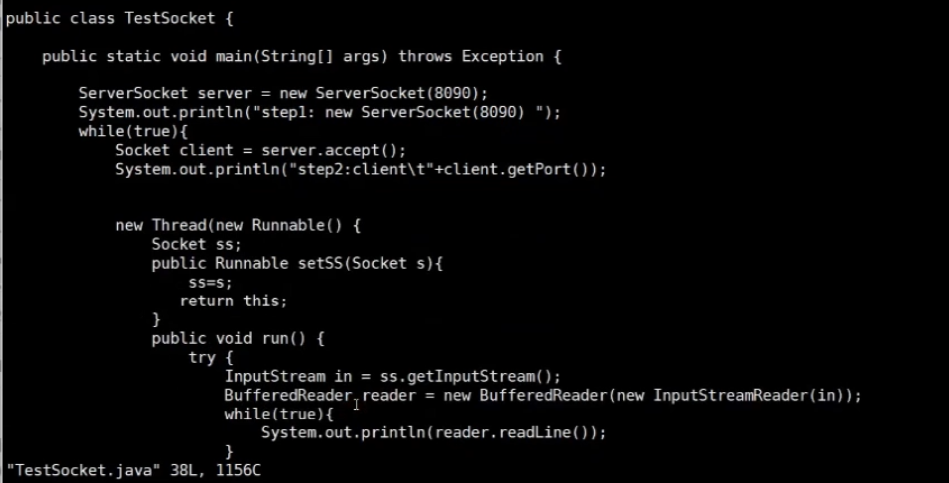


用户调用 accept方法的时候就会阻塞等待连接，

而 调用read方法的时候就会等到 client 端发送数据，如过client端一直不发送数据，就会一直阻塞等待，而NIO 解决了这个问题，使用了内核提供的非阻塞方法，可以实现一个线程监听多个socket文件描述符


### 用户空间与内核空间


### socket 概念

socket 就是一个4元组，分别对应  [clientIP + clientPort : serverIp+ServerPort]

socket 具备了唯一性，可以区分不同的网路连接，在java中 socket 封装了底层复杂的 tcp/ip 通信，包括tcp 三次握手，四次挥手，以及 在 链路层 如何找到下一个网络跃点

```
TCP/IP层次: 

TCP/IP层：tcp/ip（包装所有的数据） 
链路层：arp （包装 MAC地址以及 网关的MAC地址）
```

在应用程序中 是无法看到socket这个东西的，只能拿到socket 的文件描述符，然后根据文件描述符中包装的client 与server 来读写数据


下面是 对应的内核方法：

socket 内核方法：

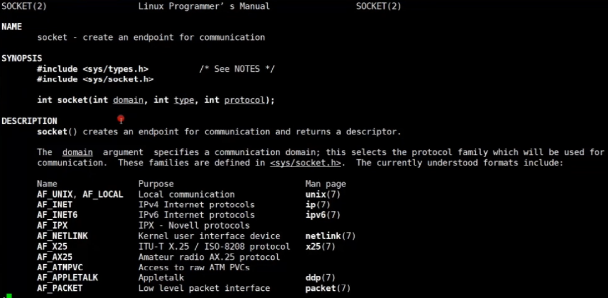

protocol : 代表的是什么协议

type： 代表的是什么类型的socket连接

返回类型： 调用成功的话会返回一个socket文件描述符来表示当前的socket 连接


**socket type 如下：**

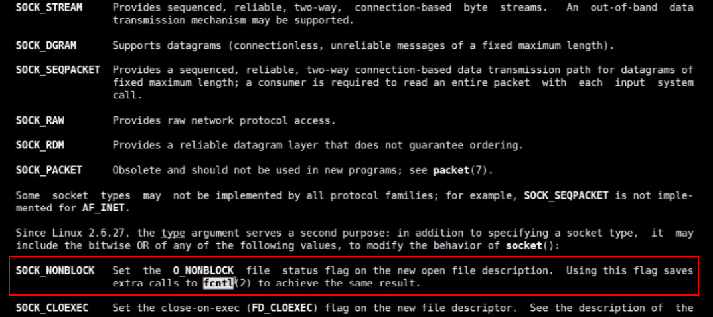


SOCKET_NOBLOCK: 表示建立socket文件描述符的时候不应该阻塞，而是立即返回, 它会调用ftcl 将该socket 设置为非阻塞状态

示例： 

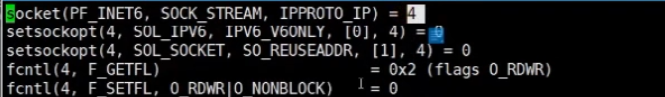

fctntl(4, FSETTFL,ORDWR|O_NOTBLOK) ：将创建的socket文件描述符设置为非阻塞状态


### 文件描述符

文件描述符概念：


0，out，1 in，2，error


socket 文件描述符概念：

当tomcat listen 某个端口的时候会调用内核产生一个文件描述符，当网络端有连接接入的时候会首先调用内核产生一个 client 到 server的 socket文件描述符

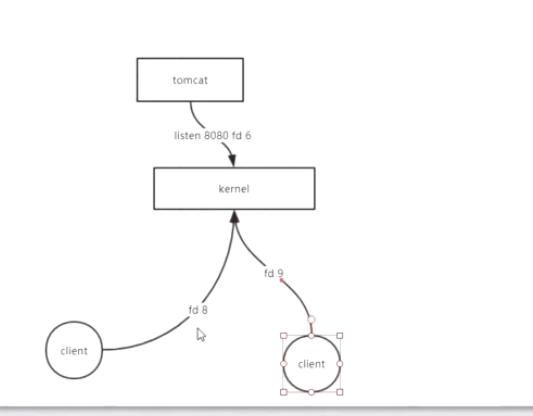


### java BIO scoket 内核调用过程

```shell
strace -ff -o ./out  java xxx.java
可以查找某个进程产生的所有线程，并且可以查看线程调用内核的方法

./out 代表存放的目录以及文件前缀   
java xxx.java 代表执行的程序
```


下面是所有的步骤以及分析：

1、程序的代码


2、执行java程序 并且查看java程序内的线程调用的内核方法


3、内核调用过程

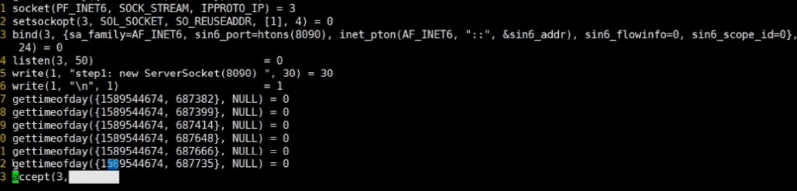

```
#1 首先调用socket 根据IP协议生成一个文件描述符（IP协议：IPV4，IPV6）

#2 bind(3,xxxx) 将该文件描述符绑定到某个IP协议的某个端口

#3 listen(3,50) 开始监听该文件描述符

#4 accept(3,   ) 等待连接接入，对应的就是java中的Serversocket的 accpet方法
```

\#1，#2，#3 三个步骤代表的就是java代码中的 new ServerSocket(9090)

\#4 的时候 就会一直阻塞等待 一直等到有新的连接请求的时候才会向下执行


4、现在 使用其他终端对 该端口进行访问

```
nc localhost 8090
```

这个时候 程序就不会在阻塞，并且开始向下执行，内核过程如下：

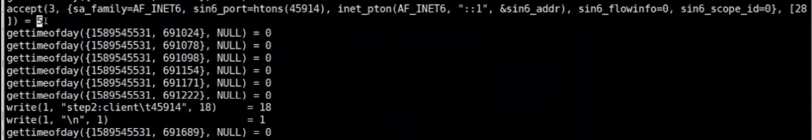

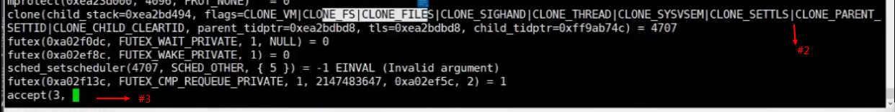


clone出来的线程调用内核过程如下：


```c
#1 accepct(xxx)=5 方法不在阻塞然后返回一个新的socket文件描述符（5就是accpet返回的新的文件描述符），代表从客户端到server端的链接

#2 clone（xxx） 对应的是java new Thread() 创建一个新的系统线程，共享进程的堆、进程的文件描述符（包括socket文件描述符）等等，但是线程栈是独立的

#3 accpet(xxx, 程序又开始阻塞，等待新的连接接入

#4 recv(5, 等待client端发送数据，5代表就是客户端与服务端建立的socket文件描述符，对应#1 返回的文件描述符
```


5、用户端开始输入数据

```
nc localhost 8090

输入数据: ksjdklskfj
```


clone线程的内核调用过程:


```
#4 recv(5,xxx) 在步骤4 中提到 当客户端连接后等待client端发送数据就会一直阻塞

#5 recv(5, client端发送数据后，server端接受数据，然后将数据写入到用户态，继续阻塞等待client端写入数据
```


调用流程图如下:

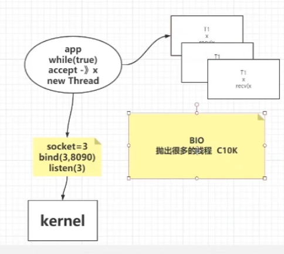


在BIO中 会有两个阻塞点，分别是accpet(x, 与 recv(x, 两个阻塞点

C10K 问题就描述了BIO的弊端，如过有1000个客户端则必须有1000个线程来处理连接，10000个客户端就得有10000个连接，而且在线程阻塞的时候会释放cpu资源，线程会挂起，线程挂起的时候cpu要保存线程的上下文信息


### JAVA NIO Socket 内核调度（非Selector模式）

手动轮训的NIO 代码：

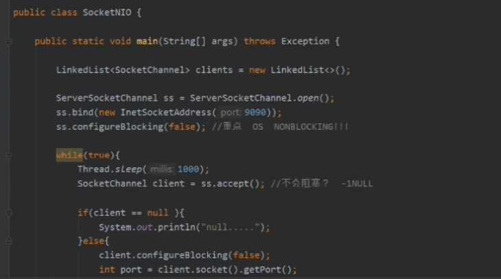

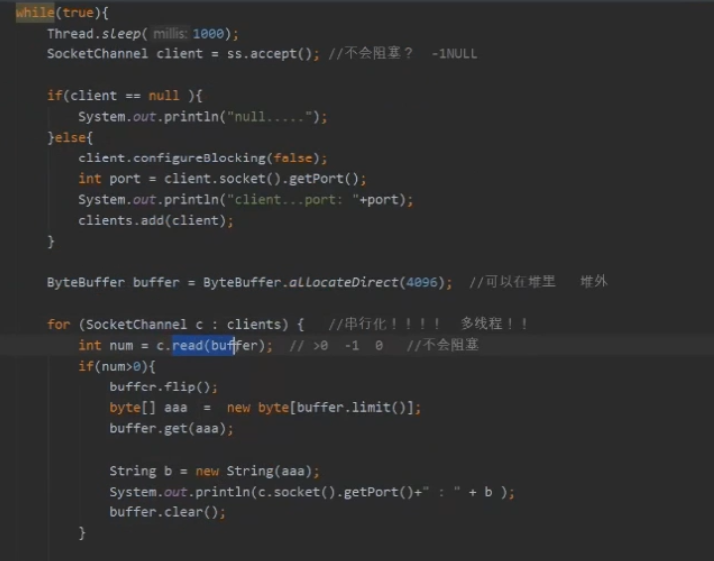

代码解释如下：

- serverSocketChannel.configureBlocking(false) ：设置的是内核的NOBLOCK 非阻塞，就是程序不应该在阻塞在 accpet 方法那里，而是应该立即返回，如过有连接则应该立即返回，没有的话就会一直返回null

- socketChannel.configureBlocking(false) ：读取数据的数据的时候也设置为非阻塞的，然后调用client.read（）读取数据，返回可能为0，-1，>0,   0代表没有数据可以读取，-1代表传输有问题，大于0代表 有数据传输


下面是所有的步骤以及分析：

1、执行java程序 并且查看java程序内的线程调用的内核方法

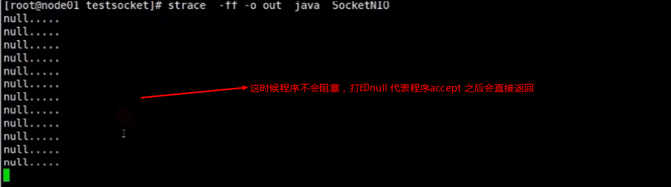


内核调用过程如下：


调用accpet 方法会一直返回-1 代表没有client 端连入，不会阻塞会一直打印该过程


2、使用nc 连接server端口

```
nc localhost 9090
```


内核调用过程如下：


当有新的连接接入的时候会返回一个新的socket文件描述符代表client端到server端的连接

注意： 这个时候产生了新的内核调用过程，因为有连接接入了，所以要关注该client端到server端的 socket 读写

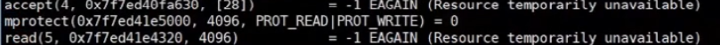

这个时候开始调用read方法返回-1 ，表示读取数据也变为了非阻塞


3、使用nc 发送数据之后 

内核调用过程如下：


这个时候 read(socket文件描述符，xxx) 就读取到了数据，并且把数据从内核态复制到了用户空间并且进行打印


**总结：**上面所述 就是所谓的非阻塞

优点：现在一个线程就可以处理所有的请求连接，并不需要clone出一个新的线程来处理请求、写入数据等等


缺点：server端要维护一个list列表来存储所有的socket连接，并且每次都要遍历这些连接看看client端1是否有数据写入，如过现在有10000个client 端，其中只有10个客户端在写入数据，那么每次轮训这10000个客户端就会空循环而且很耗时，时间复杂度直接变为了O（n）


### java NIO 多路复用 内核调度（Selector模式）

多路复用分为selcet、poll、epoll 这几种模式

所谓多路复用就是说把程序中自己轮训socket连接放入到内核中，交由内核进行管理，如过有连接接入或者说读写发生，只将这两个时间返回给程序即可，而不是所有的socket连接

**注意： 多路复用器只能给程序提供状态或者事件，正真的读写是需要程序自己 R/W（读写） IO 的，这就是所谓的同步IO模型**


流程图如下：

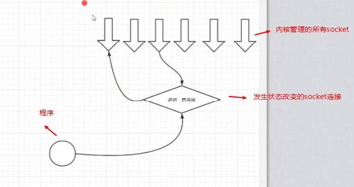


select 模式：

内核方法：

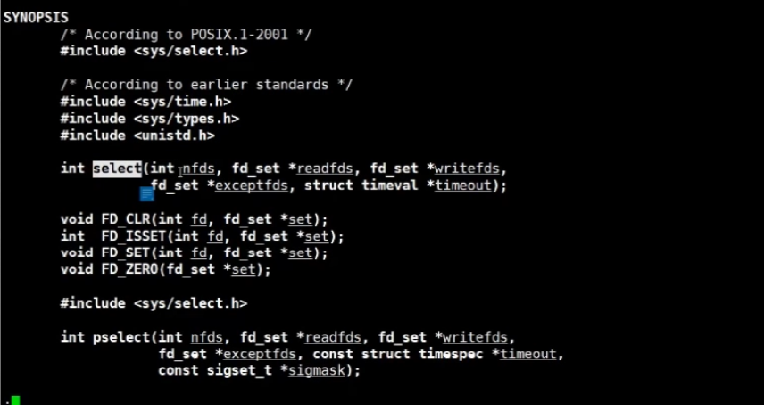


infds:  多少个文件描述符

readfds: 可读的文件描述符集合

writefds: 可写的文件描述符集合

exceptdfs:  发生异常的文件描述符结合

描述：允许一个程序可以监听多个文件描述符，等到一个或者多个文件描述符达到了ready 可用的状态 就会返回


应用程序伪代码：

```java
//创建socket文件描述符
int socket_fd = socket(xxx,IPV4)

//绑定socket 与端口
bind(socket_fd,8080) //绑定文件描述符与端口

listen(socket_fd)
    
//维护了需要交由内核处理监听的socket文件描述符
int []select_fds = [socket_fd]    
    
while(true){
    
    //每次都要将这些文件描述符拷贝到内核态然后交给内核来处理（全量复制）
    status_change_fds = select(select_socket_fds) 
        
    //new_fd: client端连接后创建的socket文件描述符   
    int new_fd = accpect(socket_fd,xxx) 
        
   	if(new_fd != null && select_fds change){
        //将新产生的文件描述符添加到文件描述符集合    
    	append(select_fds, new_fd)
    }
    
    //根据select 返回的状态改变的文件描述符来读写socket
    while(status_change_fds.size > 0){
        
        read(status_change_fds[i])
        
        //读写该socket文件描述符
    }
    
}
```

弊端： 每次都要将这些文件描述符从用户控件拷贝到内核空间，而内核只会返回某一个或者多个状态改变的文件描述符，例如：select(fd_list)=[5] 

**注意：** select 返回的只是状态或者事件表示是否可读或者可写，真正的读写还是要交给应用程序来做 例如：select(fd_set) = [5],  用户读取：read(5)


状态图：

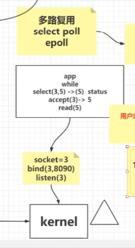

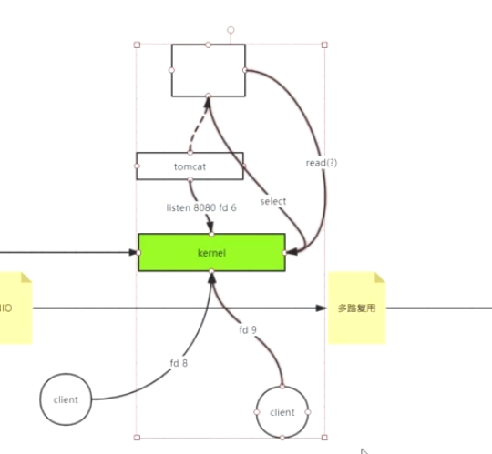


优点：

现在只需要循环select 返回的状态改变的socket文件描述符，就实现程序读写，减少了内核态到用户态的数据拷贝，read调用会变少

read 会导致数据从内核态数据拷贝给用户空间，因为每次都要去询问是否可读所以每次都需要循环调用read方法


缺点：

重复copy socket_fds 给 内核空间，每一次都要将文件描述符传递从用户空间传递给内核空间（全量复制），如过循环10W次，那么就会涉及到10W次的数据传递，而且cpu还要每次都要循环处理这些传递的文件描述符，才能知道哪些文件描述符的状态改变了


epoll 模式：

epoll 是为了解决select重复copy的弊端，在内核开辟一块空间来存储管理这些文件描述符，如过有新的socket接入，则将新的socket文件描述符传递给内核空间即可（增量复制），而且epoll不需要总是循环这些文件描述符，它会根据cpu的（网络IO）中断来感知哪些描述符的状态改变了，然后将这些改变的文件描述符返回给用户空间

中断可以被抽象成event事件

代码实现： Selector 优先会使用epoll模式，他可以是（select、poll、epoll）

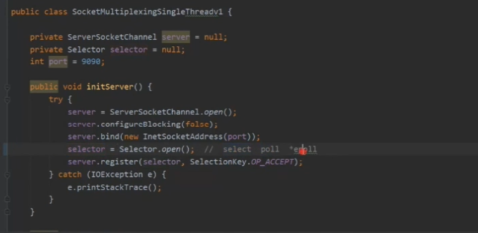

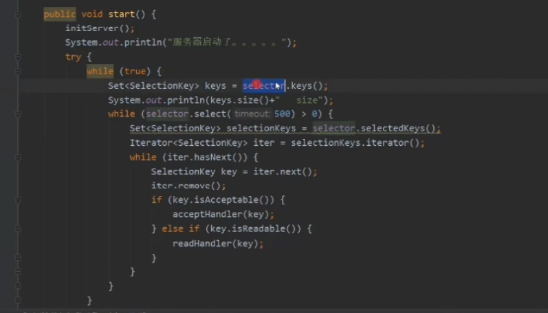

selector.select（） 询问内核是否有状态改变的socket


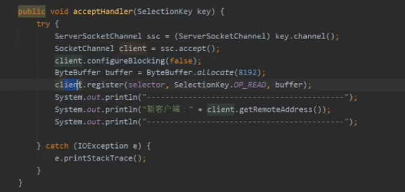

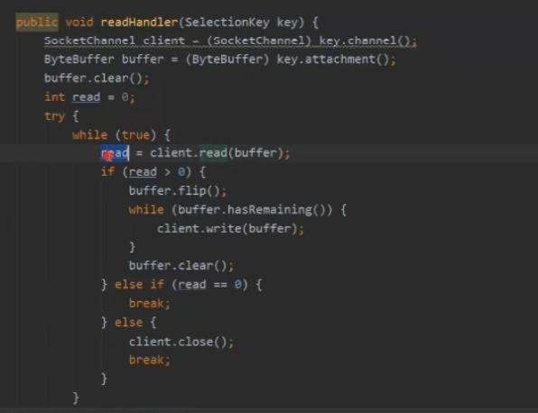


下面是所有的步骤以及分析：

1、开始调用

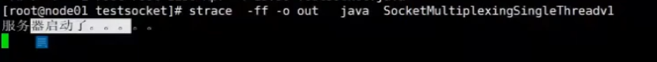


内核调用过程：

//设置为非阻塞

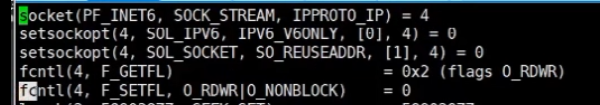


//绑定该socket到端口上


//创建了一个内核空间，并返回一个文件描述符（这里不是socket文件描述符，而是epoll开辟的内核空间的文件描述符）


// 将该文件描述符永久的放到了epoll开辟的内核空间，并且将事件类型设置为accpet 监听类型（也可以带入其他的事件类型，比如 可读，可写 。对应 java代码：seclector.register(eventKey)）

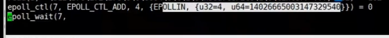

epoll_ctl(7,EPOLL_CTL_ADD，4 ) : 将文件描述符4添加到了内核空间

epoll_wait(7 ,  : 开始阻塞监听等待，并没有像select一样重复传递该数据


流程解释： 如过未来有一个client接入，就会通过cpu中断，将4放入一个空间，然后epoll_wait 就会从存储文件描述符状态改变的空间中将数据取走返回给用户空间，用户空间还是需要自己拿到文件描述符进行accpet() 或者 read write等等，还是同步的模型


状态图如下：

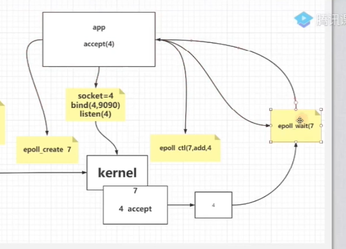


解释如下：

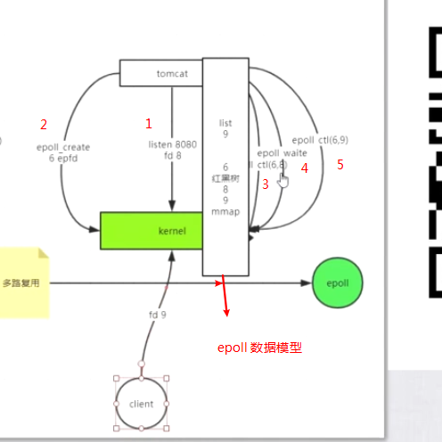

1、程序创建文件描述符，并且绑定端口到该文件描述符并且监听 fd8

2、调用epoll_create 在内核空间创建一块空间用来永久性存储那些需要监听的socket 文件描述符 返回 epfd 6

3、调用epoll_ctl(6,8) 将程序监听的文件描述符fd8 放入epoll 开辟的内核空间中，并且将事件设置为accpet

4、调用epoll_awit 阻塞等待client 端接入

5、如过现在有客户端接入产生文件描述符fd9，程序感知到后会调用epoll_ctl(6,9) 将该文件描述符也放入epoll创建的内核空间中(红黑树结构)（增量复制），并且状态设置为可以读取的状态

epoll 创建内核空间的模型： 内部是由红黑树实现并管理的文件描述符的数据结构，如过有客户端接入或者发生读写行为的话，epoll 会根据网络IO导致的cpu中断来感知到那些文件描述符发生了状态改变，然后将这些发生状态改变的文件描述符放入到一个list链表中中，程序中会不断的调用epoll_wait（或者调用epoll_wait 阻塞） 来询问是否有数据产生，然后拿到该数据就可以知道 哪些socket文件描述符状态改变了，然后进行程序操作，而 这块空间使用的是mmap函数来实现的，会直接打通用户空间到内核空间的隐射，所以不会涉及到空间数据拷贝的概念


### 零拷贝

程序访问磁盘 必须要先访问内核，然后内核读取磁盘文件将数据返回到用户空间，程序才能使用，如过要读取某个文件数据并且通过网络发出去的话，或者复制文件的话，可以使用零拷贝实现，既将数据读取到内核态之后直接由内核写入网络IO或者文件IO，少了两次从 内核-> 空间，

空间-> 到内核的操作，使用内核函数`sendfile`来实现该操作


零拷贝的理念：

所有的用户读取的磁盘IO 或者网络IO 都是从磁盘读取到内核态，再从内核态读取到用户态然后才可以在用户态来操作IO流 


**注意：如过要操作读取的IO流，就不能使用零拷贝的概念来实现，因为要操作io流就必须要把流从内核态读取到用户态空间**


零拷贝 使用的是 sendfile 方法实现的


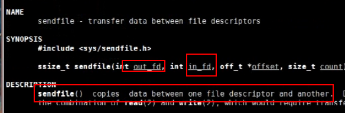


out_fd 代表的是 输出的文件描述符

in_fd 代表的是输入的文件描述符


IO数据读取：

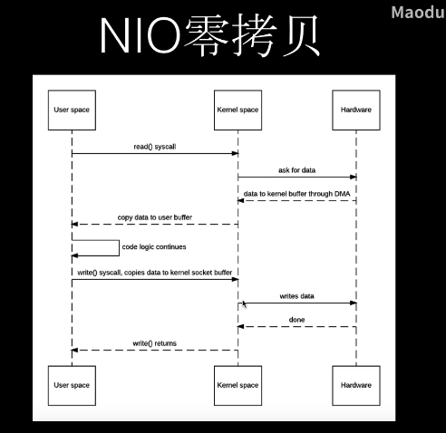


零拷贝：

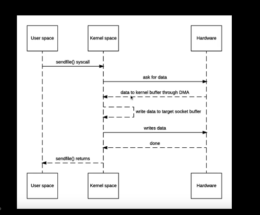


### 内存隐射 mmap

内核方法：mmap 函数

将内存空间和用户空间打通和文件也是打通的，但是文件的写入写出还是由内核来控制的，包括数据的刷入刷出到磁盘，直接将内核空间隐射到用户空间


### redis epoll 模型

redis是单线程模型，如过epoll阻塞之后


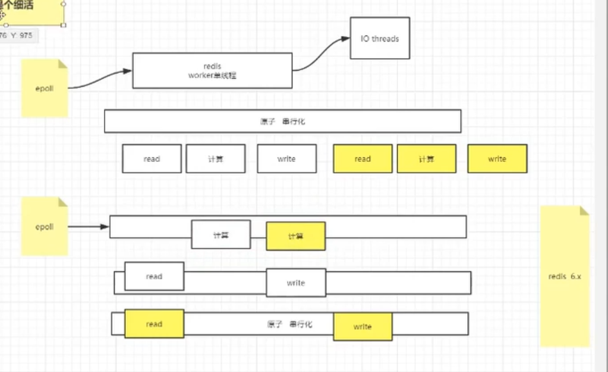


### JAVA NIO API

Selector、SelectorKey、SocketChannel、ServerSocketChannel


### 扩展

如过在java中新建了一个线程，内核就会clone出一个系统级的线程

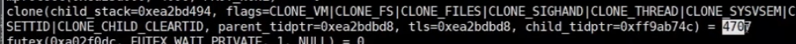