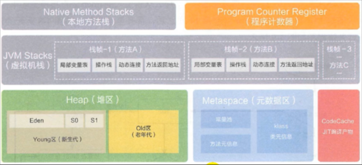

# JVM 虚拟机

JVM 主要划分为以下几个比较主要的组件，分别为：

  

- 类加载子系统
- 运行时数据库
- 执行引擎
- 本地方法接口

其中运行时数据库又划分为：堆、虚拟机栈、本地方法栈、方法区、程序计数器

**对于线程而言，堆和方法区是线程共享的，而本地方法栈、虚拟机栈、程序计数器是线程私有的**

每创建一个线程都会创建与之关联的虚拟机栈，而线程每执行一个方法，都对应是一个方法栈既栈帧，执行方法入口与方法退出都对应了 栈帧的入栈和出栈


## ClassLoader 类加载系统


## 运行时数据区

### 运行时数据区概览

其中运行时数据区主要划分为以下几个部分，以及每个部分的详细划分如图所示：

 


 灰色的为单独线程私有的，红色的为多个线程共享的。即： 

- 每个线程：独立包括程序计数器、栈、本地栈。

- 线程间共享：堆、堆外内存（永久代或元空间、代码缓存）


### 虚拟机栈

每一个线程都对应一个虚拟机栈，既虚拟机栈是线程私有的，而线程执行的每一个方法都对应一个栈帧，方法的进入和退出 对应了栈帧的入栈和出栈，虚拟机栈的生命周期同线程一致

栈是运行时单位，而堆是存储单位

- 栈解决程序的运行问题，即程序如何执行，或者说如何处理数据。

- 堆解决的是数据存储的问题，即数据怎么放，放哪里


#### 栈的存储单位

每个线程都有自己的栈，栈中的数据都是以栈帧的格式存在， 在这个线程上正在执行的每个方法都各自对应一个栈帧（Stack Frame）。 


#### 栈运行原理

 JVM直接对Java栈的操作只有两个，就是对栈帧的压栈和出栈，遵循“先进后出”/“后进先出”原则 

 在一条活动线程中，一个时间点上，只会有一个活动的栈帧。即只有当前正在执行的方法的栈帧（栈顶栈帧）是有效的，这个栈帧被称为当前栈帧（Current Frame），与当前栈帧相对应的方法就是当前方法（Current Method），定义这个方法的类就是当前类（Current Class）。 

 如果在该方法中调用了其他方法，对应的新的栈帧会被创建出来，放在栈的顶端，成为新的当前帧。 如下图：

  

 如果当前方法调用了其他方法，方法返回之际，当前栈帧会传回此方法的执行结果给前一个栈帧，接着，虚拟机会丢弃当前栈帧，使得前一个栈帧重新成为当前栈帧 


#### 栈帧的内部结构

每个栈帧中存储着：

- 局部变量表（Local Variables）
- 操作数栈（operand Stack）（或表达式栈）
- 动态链接（DynamicLinking）（或指向运行时常量池的方法引用）
- 方法返回地址（Return Address）（或方法正常退出或者异常退出的定义）
- 一些附加信息

  

并行每个线程下的栈都是私有的，因此每个线程都有自己各自的栈，并且每个栈里面都有很多栈帧，栈帧的大小主要由局部变量表 和 操作数栈决定的

  


#### 局部变量表

 局部变量表也被称之为局部变量数组或本地变量表 

-  定义为一个数字数组，主要用于存储方法参数和定义在方法体内的局部变量，这些数据类型包括各类基本数据类型、对象引用（reference），以及returnAddress类型 
- 由于栈是线程私有的，所以局部变量表不存在数据库安全问题
-  局部变量表所需的容量大小是在编译期确定下来的 
-  方法嵌套调用的次数由栈的大小决定 
-  局部变量表中的变量只在当前方法调用中有效 


#### 栈中可能出现的异常？

 Java 虚拟机规范允许Java栈的大小是动态的或者是固定不变的 

- 如果采用固定大小的Java虚拟机栈，那每一个线程的Java虚拟机栈容量可以在线程创建的时候独立选定。如果线程请求分配的栈容量超过Java虚拟机栈允许的最大容量，Java虚拟机将会抛出一个StackOverflowError 异常。

- 如果Java虚拟机栈可以动态扩展，并且在尝试扩展的时候无法申请到足够的内存，或者在创建新的线程时没有足够的内存去创建对应的虚拟机栈，那Java虚拟机将会抛出一个 OutOfMemoryError 异常。


### 堆

堆主要保存我们实例化的对象、常量池、静态变量等信息，由于堆是线程共享的，所以需要保证线程的安全问题

数组和对象可能永远不会存储在栈上，因为栈帧中保存引用，这个引用指向对象或者数组在堆中的位置。

在方法结束后，堆中的对象不会马上被移除，仅仅在垃圾收集的时候才会被移除。

堆，是GC（Garbage Collection，垃圾收集器）执行垃圾回收的重点区域

  


#### 内存划分

JDK7 堆空间的内部结构图如下所示：


JDK7 及之前的堆内存逻辑划分为三部分：young、old、永久代

- 新生代：Eden + S0 + S1
- 老年代
- 永久代


JDK8 的堆空间内部结构如下图：


 Java 8及之后堆内存逻辑上分为三部分：新生区+养老区+元空间 

- 新生代：Eden + S0 + S1
- 老年代
- MetaSpace


#### 堆空间大小设置

使用-Xms 与 -Xmx 设置

- “-Xms"用于表示堆区的起始内存，等价于`-XX:InitialHeapSize`

- “-Xmx"则用于表示堆区的最大内存，等价于`-XX:MaxHeapSize`

 一旦堆区中的内存大小超过“-Xmx"所指定的最大内存时，将会抛出OutOfMemoryError异常。 

**通常会将-Xms和-Xmx两个参数配置相同的值，其目的是为了能够在ava垃圾回收机制清理完堆区后不需要重新分隔计算堆区的大小，从而提高性能。 **

默认情况下

- 初始内存大小：物理电脑内存大小 / 64
- 最大内存大小：物理电脑内存大小 / 4


#### 年轻代与老年代

存储在jvm中的java对象可以被划分为两类：

-  一类是生命周期较短的瞬时对象，这类对象的创建和消亡都非常迅速 
-  另外一类对象的生命周期却非常长，在某些极端的情况下还能够与JVM的生命周期保持一致 

 Java堆区进一步细分的话，可以划分为年轻代（YoungGen）和老年代（oldGen） 

 其中年轻代又可以划分为Eden空间、Survivor0空间和Survivor1空间（有时也叫做from区、to区） 

  


年轻代中的分区比例以及与老年代的分区比例如下：

 

配置新生代与老年代在堆结构的占比。

- 默认`-XX:NewRatio=2`，表示新生代占1，老年代占2，新生代占整个堆的1/3

- 可以修改`-XX:NewRatio=4`，表示新生代占1，老年代占4，新生代占整个堆的1/5

 Eden空间和另外两个survivor空间缺省所占的比例是8：1：1 

-  `-xx:SurvivorRatio` 调整这个空间比例 


#### 对象分配过程

- 1、 new的对象先放伊甸园区。此区有大小限制 

- 2、 当伊甸园的空间填满时，程序又需要创建对象，JVM的垃圾回收器将对伊甸园区进行垃圾回收（MinorGC），将伊甸园区中的不再被其他对象所引用的对象进行销毁。再加载新的对象放到伊甸园区 

- 3、 然后将伊甸园中的剩余对象移动到幸存者0区。 

- 4、 如果再次触发垃圾回收，此时上次幸存下来的放到幸存者0区的，如果没有回收，就会放到幸存者1区 

- 5、 如果再次经历垃圾回收，此时会重新放回幸存者0区，接着再去幸存者1区。 

- 6、当经历够指定的GC次数还能存活下来的，我们将该对象放入养老区

  > -Xx:MaxTenuringThreshold= N 用来设置当对象的年龄达到N时，晋升至老年代


- 7、 在养老区，相对悠闲。当养老区内存不足时，再次触发GC：Major GC，进行养老区的内存清理 
- 8、 若养老区执行了Major GC之后，发现依然无法进行对象的保存，就会产生OOM异常。 

对象分配的过程如下图：

  


流程图

  


**总结**

- 针对幸存者s0，s1区的总结：复制之后有交换，谁空谁是to

- 关于垃圾回收：频繁在新生区收集，很少在老年代收集，几乎不再永久代和元空间进行收集


#### 内存分配策略

我们创建对象时，首先会在Eden区 为其开辟空间，当该对象在经历第一次Minor GC 后任然存活，并且能被Survivor容纳的话，将被移动到survivor空间中，并将对象年龄设为1。对象在survivor区中每熬过一次MinorGC，年龄就增加1岁，当它的年龄增加到一定程度（默认为15岁，其实每个JVM、每个GC都有所不同）时，就会被晋升到老年代 

对象晋升老年代的年龄阀值，可以通过选项`-XX:MaxTenuringThreshold`来设置

针对不同年龄段的对象分配原则如下所示：

- 优先分配到Eden
- 大对象直接分配到老年代（尽量避免程序中出现过多的大对象）
- 长期存活的对象分配到老年代
- 动态对象年龄判断：如果survivor区中相同年龄的所有对象大小的总和大于Survivor空间的一半，年龄大于或等于该年龄的对象可以直接进入老年代，无须等到`MaxTenuringThreshold`中要求的年龄。
- 空间分配担保： `-XX:HandlePromotionFailure`


#### TLAB 

- 从内存模型而不是垃圾收集的角度，对Eden区域继续进行划分，JVM为每个线程分配了一个私有缓存区域，它包含在Eden空间内。

- 多线程同时分配内存时，使用TLAB可以避免一系列的非线程安全问题，同时还能够提升内存分配的吞吐量，因此我们可以将这种内存分配方式称之为快速分配策略。

 

- 尽管不是所有的对象实例都能够在TLAB中成功分配内存，但JVM确实是将TLAB作为内存分配的首选。
- 在程序中，开发人员可以通过选项“`-XX:UseTLAB`”设置是否开启TLAB空间。
- 默认情况下，TLAB空间的内存非常小，仅占有整个Eden空间的1%，当然我们可以通过选项 “`-XX:TLABWasteTargetPercent`” 设置TLAB空间所占用Eden空间的百分比大小。
- 一旦对象在TLAB空间分配内存失败时，JVM就会尝试着通过使用加锁机制确保数据操作的原子性，从而直接在Eden空间中分配内存。


#### 堆的常用参数总结

```
-XX:+PrintFlagsInitial  //查看所有的参数的默认初始值
-XX:+PrintFlagsFinal  //查看所有的参数的最终值（可能会存在修改，不再是初始值）
-Xms  //初始堆空间内存（默认为物理内存的1/64）
-Xmx  //最大堆空间内存（默认为物理内存的1/4）
-Xmn  //设置新生代的大小。（初始值及最大值）
-XX:NewRatio  //配置新生代与老年代在堆结构的占比
-XX:SurvivorRatio  //设置新生代中Eden和S0/S1空间的比例
-XX:MaxTenuringThreshold  //设置新生代垃圾的最大年龄
-XX:+PrintGCDetails //输出详细的GC处理日志
//打印gc简要信息：①-Xx：+PrintGC ② - verbose:gc
-XX:HandlePromotionFalilure：//是否设置空间分配担保
```


### jvm系统线程

如果你使用console或者是任何一个调试工具，都能看到在后台有许多线程在运行。这些后台线程不包括调用`public static void main(String[] args)`的main线程以及所有这个main线程自己创建的线程。

这些主要的后台系统线程在Hotspot JVM里主要是以下几个：

- 虚拟机线程：这种线程的操作是需要JVM达到安全点才会出现。这些操作必须在不同的线程中发生的原因是他们都需要JVM达到安全点，这样堆才不会变化。这种线程的执行类型包括"stop-the-world"的垃圾收集，线程栈收集，线程挂起以及偏向锁撤销。

- 周期任务线程：这种线程是时间周期事件的体现（比如中断），他们一般用于周期性操作的调度执行。

- GC线程：这种线程对在JVM里不同种类的垃圾收集行为提供了支持。

- 编译线程：这种线程在运行时会将字节码编译成到本地代码。

- 信号调度线程：这种线程接收信号并发送给JVM，在它内部通过调用适当的方法进行处理。


### 方法区

方法区在堆空间示意图：

 


#### 概念


## 执行引擎


## 程序计数器

VM中的程序计数寄存器（Program Counter Register）中，Register的命名源于CPU的寄存器，寄存器存储指令相关的现场信息。CPU只有把数据装载到寄存器才能够运行。这里，并非是广义上所指的物理寄存器，或许将其翻译为PC计数器（或指令计数器）会更加贴切（也称为程序钩子），并且也不容易引起一些不必要的误会。JVM中的PC寄存器是对物理PC寄存器的一种抽象模拟。


**作用**

PC寄存器用来存储指向下一条指令的地址，也即将要执行的指令代码。由执行引擎读取下一条指令。


它是一块很小的内存空间，几乎可以忽略不记。也是运行速度最快的存储区域。

在JVM规范中，每个线程都有它自己的程序计数器，是线程私有的，生命周期与线程的生命周期保持一致。

任何时间一个线程都只有一个方法在执行，也就是所谓的当前方法。程序计数器会存储当前线程正在执行的Java方法的JVM指令地址；或者，如果是在执行native方法，则是未指定值（undefined）。

它是程序控制流的指示器，分支、循环、跳转、异常处理、线程恢复等基础功能都需要依赖这个计数器来完成。

字节码解释器工作时就是通过改变这个计数器的值来选取下一条需要执行的字节码指令。

它是唯一一个在Java虚拟机规范中没有规定任何OutofMemoryError情况的区域。

**举例说明**

```
public int minus(){
    intc = 3;
    intd = 4; 
    return c - d;
}
```

字节码文件：

```
0: iconst_3
1: istore_1
2: iconst_4
3: istore_2
4: iload_1
5: iload_2
6: isub
7: ireturn
```


**使用PC寄存器存储字节码指令地址有什么用呢？为什么使用PC寄存器记录当前线程的执行地址呢？**

因为CPU需要不停的切换各个线程，这时候切换回来以后，就得知道接着从哪开始继续执行。

JVM的字节码解释器就需要通过改变PC寄存器的值来明确下一条应该执行什么样的字节码指令。


**PC寄存器为什么被设定为私有的？**

我们都知道所谓的多线程在一个特定的时间段内只会执行其中某一个线程的方法，CPU会不停地做任务切换，这样必然导致经常中断或恢复，如何保证分毫无差呢？为了能够准确地记录各个线程正在执行的当前字节码指令地址，最好的办法自然是为每一个线程都分配一个PC寄存器，这样一来各个线程之间便可以进行独立计算，从而不会出现相互干扰的情况。

由于CPU时间片轮限制，众多线程在并发执行过程中，任何一个确定的时刻，一个处理器或者多核处理器中的一个内核，只会执行某个线程中的一条指令。

这样必然导致经常中断或恢复，如何保证分毫无差呢？每个线程在创建后，都会产生自己的程序计数器和栈帧，程序计数器在各个线程之间互不影响。


**CPU时间片**

CPU时间片即CPU分配给各个程序的时间，每个线程被分配一个时间段，称作它的时间片。

在宏观上：俄们可以同时打开多个应用程序，每个程序并行不悖，同时运行。

但在微观上：由于只有一个CPU，一次只能处理程序要求的一部分，如何处理公平，一种方法就是引入时间片，每个程序轮流执行。


###### 