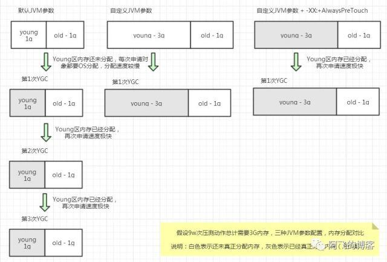
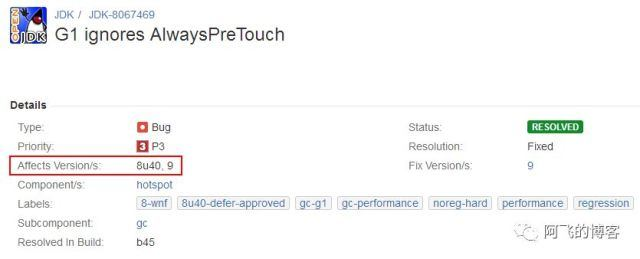
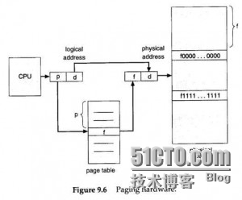
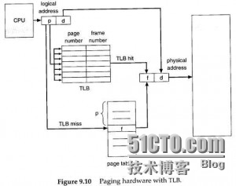

# JVM 常用调优参数


## 通用参数

### -Xmn

设置年轻代大小      

　　　　　　　

### -Xss

每个线程栈大小，JDK5.0以后每个线程堆栈大小为1M。


### -XX:MaxGCPauseMillis=200 

设置垃圾收集暂停时间最大值指标，默认值：4294967295 。这是一个软目标，Java虚拟机将尽最大努力实现它


###  -XX:SurvivorRatio=8　 

 Eden区与Survivor区的大小比值，设置为8,则两个Survivor区与一个Eden区的比值为2:8,一个Survivor区占整个年轻代的1/10 


###  -XX:MaxTenuringThreshold=14 

 提升年老代的最大临界值(tenuring threshold). 默认值为 15[每次GC，增加1岁，到15岁如果还要存活，放入Old区]   


### 设置 Matespace 内存大小

-XX:MetaspaceSize=256m 
-XX:MaxMetaspaceSize=512M  


###  -XX:+DisableExplicitGC 

 \# 禁止在启动期间显式调用System.gc() 


### -XX:MaxDirectMemorySize

设置最大 堆外内存


## G1 垃圾回收器参数

### -XX:InitiatingHeapOccupancyPercent

 指定整个堆的使用率达到多少时, 执行一次并发标记周期, 默认45， 过大会导致并发标记周期迟迟不能启动, 增加FullGC的可能, 过小会导致GC频繁, 会导致应用程序性能有所下降 

### -XX:G1ReservePercent

 使用g1收集器时，设置保留java堆大小，防止晋升失败。范围是0到50.默认设置是10%。下面的例子把这个值设置成20%。  


###  -XX:G1HeapRegionSize=size

 当使用G1收集器时，设置java堆被分割的大小。这个大小范围在1M到32M之间。下面的例子把这个值设置成了16M。 


### -XX:+G1PrintHeapRegions

 打印G1收集器收集的区域。默认这个选项是关闭的。 


## 打印GC 信息


### **verbose:gc**

表示，启动jvm的时候，输出jvm里面的gc信息。格式如下：

```text
[Full GC 178K->99K(1984K)， 0.0253877 secs]
```

> 解读 ：Full GC 就表示执行了一次Full GC的操作，178K 和99K 就表示执行GC前内存容量和执行GC后的内存容量。1984K就表示内存总容量。后面那个是执行本次GC所消耗的时间，单位是秒。


### **-XX:+PrintGC**

这个打印的GC信息跟上个一样，就不做介绍了


###  -XX:+PrintGCDetails   

打印GC的详细信息。格式如下：

```text
–Heap
– def new generation   total 13824K, used 11223K [0x27e80000, 0x28d80000, 0x28d80000)
–  eden space 12288K,  91% used [0x27e80000, 0x28975f20, 0x28a80000)
–  from space 1536K,   0% used [0x28a80000, 0x28a80000, 0x28c00000)
–  to   space 1536K,   0% used [0x28c00000, 0x28c00000, 0x28d80000)
– tenured generation   total 5120K, used 0K [0x28d80000, 0x29280000, 0x34680000)
–   the space 5120K,   0% used [0x28d80000, 0x28d80000, 0x28d80200, 0x29280000)
– compacting perm gen  total 12288K, used 142K [0x34680000, 0x35280000, 0x38680000)
–   the space 12288K,   1% used [0x34680000, 0x346a3a90, 0x346a3c00, 0x35280000)
–    ro space 10240K,  44% used [0x38680000, 0x38af73f0, 0x38af7400, 0x39080000)
–    rw space 12288K,  52% used [0x39080000, 0x396cdd28, 0x396cde00, 0x39c80000)
```

> 解读：new generation 就是堆内存里面的新生代。total的意思就是一共的，所以后面跟的就是新生代一共的内存大小。used也就是使用了多少内存大小。0x开头的那三个分别代表的是 底边界，当前边界，高边界。也就是新生代这片内存的起始点，当前使用到的地方和最大的内存地点。
> eden space 这个通常被翻译成伊甸园区，是在新生代里面的，一些创建的对象都会先被放进这里。后面那个12288K就表示伊甸园区一共的内存大小，91% used，很明显，表示已经使用了百分之多少。后面的那个0x跟上一行的解释一样。
> from space 和to space 是幸存者的两个区。也是属于新生代的。他两个区的大小必须是一样的。因为新生代的GC采用的是复制算法，每次只会用到一个幸存区，当一个幸存区满了的时候，把还是活的对象复制到另个幸存区，上个直接清空。这样做就不会产生内存碎片了。
> tenured generation 就表示老年代。
> compacting perm 表示永久代。由于这两个的格式跟前面我介绍的那个几乎一样，我就不必介绍了。


###  -XX:+PrintGCTimeStamps  

打印GC发生的时间戳。格式如下：

```text
289.556: [GC [PSYoungGen: 314113K->15937K(300928K)] 405513K->107901K(407680K), 0.0178568 secs] [Times: user=0.06 sys=0.00, real=0.01 secs]

293.271: [GC [PSYoungGen: 300865K->6577K(310720K)] 392829K->108873K(417472K), 0.0176464 secs] [Times: user=0.06 sys=0.00, real=0.01 secs]
```

> 解读：289.556表示从jvm启动到发生垃圾回收所经历的的时间。GC表示这是新生代GC（Minor GC）。PSYoungGen表示新生代使用的是多线程垃圾回收器Parallel Scavenge。314113K->15937K(300928K)]这个跟上面那个GC格式一样，只不过，这个是表示的是新生代，幸存者区。后面那个是整个堆的大小，GC前和GC后的情况。Times这个显而易见，代表GC的所消耗的时间，用户垃圾回收的时间和系统消耗的时间和最终真实的消耗时间。


###  -XX:+PrintHeapAtGC 

 每一次GC前和GC后，都打印堆信息 


### -XX:+TraceClassLoading   

监控类的加载。格式如下：

```text
•[Loaded java.lang.Object from shared objects file]
•[Loaded java.io.Serializable from shared objects file]
•[Loaded java.lang.Comparable from shared objects file]
•[Loaded java.lang.CharSequence from shared objects file]
•[Loaded java.lang.String from shared objects file]
•[Loaded java.lang.reflect.GenericDeclaration from shared objects file]
•[Loaded java.lang.reflect.Type from shared objects file]
```

使用这个参数就能很清楚的看到那些类被加载的情况了。

　　 

### -XX:+PrintClassHistogram  

跟踪参数。这个按下Ctrl+Break后，就会打印一下信息：

```text
num     #instances         #bytes  class name
  
----------------------------------------------
  
   1:        890617      470266000  [B
  
   2:        890643       21375432  java.util.HashMap$Node
  
   3:        890608       14249728  java.lang.Long
  
   4:            13        8389712  [Ljava.util.HashMap$Node;
  
   5:          2062         371680  [C
  
   6:           463          41904  java.lang.Class
```

–分别显示：序号、实例数量、总大小、类型。

这里面那个类型，B和C的其实就是byte和char类型。    　

　　 

### -XX:+PrintGCApplicationStoppedTime

 打印gc一共停顿了多长时间。 


## GC 日志 

###  -Xloggc:  gc.log 

 这个就表示，指定输出gc.log的文件位置。（我这里写的log/gc.log就表示在当前log的目录里，把GC日志写到叫gc.log的文件里。） 

###  -XX:+UseGCLogFileRotation 

### -XX:NumberOfGCLogFiles=5  

### -XX:GCLogFileSize=20M 


###  -XX:+HeapDumpOnOutOfMemoryError  

  当首次遭遇内存溢出时Dump出此时的堆内存 


###  -XX:HeapDumpPath=   ./java_pid.hprof 

 指定Dump堆内存时的路径 


###  -XX:OnOutOfMemoryError=";"

当首次遭遇内存溢出时执行自定义命令 


## 优化参数

### -XX:+UseTLAB

年轻代中使用本地线程收集块。


### -XX:TLABSize=size

设置本地线程收集缓冲区的初始化大小。


###  -XX:+ScavengeBeforeFullGC

 在进行fullGC时先进行YGC。 


###  -XX:+OmitStackTraceInFastThrow 

 当大量抛出同样的异常的后，后面的异常输出将不打印堆栈，打印堆栈的时候底层会调用到Throwable.getOurStackTrace()方法，而这个方法是synchronized的，对性能有比较明显对影响。所以这个参数是合理的 


**场景1：不打印NullPointerException异常堆栈](https://www.cnblogs.com/liushijie/p/5446347.html) **

查看线上日志，遇到一个诡异的问题，就是系统大量空指针的异常，但是没有打印堆栈，导致不方便定位问题。
经过一番代码调试，确定并非程序代码问题。没有线索之后，从Google找到了答案：是因为在server模式下运行的时候，有一个默认选项是-XX:+OmitStackTraceInFastThrow，这个玩意的意思就是当大量抛出同样的异常的后，后面的异常输出将不打印堆栈，打印堆栈的时候底层会调用到Throwable.getOurStackTrace()方法，而这个方法是synchronized的，对性能有比较明显对影响。所以这个参数是合理的。正常情况下，如果打印了几万条异常堆栈是很容易发现问题的。但是我们的系统正好赶上访问量高峰，一不留神就错过打印详细堆栈的阶段了。

复现测试代码：

```
public class NullPointExceptionTest {
    static final Logger logger = LoggerFactory.getLogger(NullPointExceptionTest.class);
    public static void main(String[] args) {
        String test = null;
        int i = 0;
        while (true) {
            try {
                test.length();
            } catch (Exception e) {
                System.out.println(i++ + " - " + e.getStackTrace().length);
                if (e.getStackTrace().length == 0) {
                    logger.error("e is", e);
                    break;
                }
            }
        }
    }
}
```

知道原因后，那我们的解决办法可以有：

1. 历史数据还在的话，下载历史数据查看；
2. 重新启动服务器，再观察日志；
3. 设置JVM参数，暂时禁止掉这个优化选项：-XX:-OmitStackTraceInFastThrow


###  **-XX:+AlwaysPreTouch** 

作用 服务启动的时候真实的分配物理内存给jvm，如果没有此参数，则jvm启动的时候，分配的只是虚拟内存，当真正使用的时候才会分配物理内存

如果没有此参数，则代码运行的时候，实时分配物理内存，导致代码运行速度变慢

如果有此参数，则jvm启动的时候速度会下降很多


**原因如下：**

JAVA进程启动的时候，虽然我们可以为[JVM](https://www.jikewenku.com/tag/jvm)指定合适的内存大小，但是这些内存操作系统并没有真正的分配给JVM,而是等JVM访问这些内存的时候,才真正分配,这样会造成以下问题:

1. 第1次YGC之前Eden区分配对象的速度较慢;
2. YGC的时候，Young区的对象要晋升到Old区的时候，这个时候需要操作系统真正分配内存，这样就会加大YGC的停顿时间;


1、**启动时间**

配置**-XX:+AlwaysPreTouch**参数可以优化这个问题，不过这个参数也有副作用，它会影响启动时间，那影响到底有多大呢？请接着往下看。

```shell
[root@node2 afei]# date; java -Xmx16G -Xms16G -XX:+AlwaysPreTouch Test; date

Tue Jan 15 14:31:59 CST 2019

Hello World!

Tue Jan 15 14:32:35 CST 2019

[root@node2 afei]# date; java -Xmx16G -Xms16G -XX:-AlwaysPreTouch Test; date

Tue Jan 15 14:33:55 CST 2019

Hello World!

Tue Jan 15 14:33:55 CST 2019

[root@node2 afei]# date; java -Xmx8G -Xms8G -XX:+AlwaysPreTouch Test; date

Tue Jan 15 14:32:53 CST 2019

Hello World!

Tue Jan 15 14:33:13 CST 2019

[root@node2 afei]# date; java -Xmx8G -Xms8G -XX:-AlwaysPreTouch Test; date

Tue Jan 15 14:36:48 CST 2019

Hello World!

Tue Jan 15 14:36:48 CST 2019
```

对比结果如下，差距还是蛮大的：

| ~    | -XX:+AlwaysPreTouch | XX:-AlwaysPreTouch(default) |
| ---- | ------------------- | --------------------------- |
| 16G  | 36s                 | <1s                         |
| 8G   | 20s                 | <1s                         |

**2、并行PreTouch**

配置这个参数后这么耗时其中一个原因是，这个特性在JDK8版本以前都不是并行处理的，到了JDK9才是并行。可以戳链接Parallelize Memory Pretouch: https://bugs.openjdk.java.net/browse/JDK-8157952


**3、根本原因**

配置-XX:+AlwaysPreTouch参数后，JVM进程启动时间慢了几个数量级的根本原因呢？

在没有配置-XX:+AlwaysPreTouch参数即默认情况下，JVM参数-Xms申明的堆只是在虚拟内存中分配，而不是在物理内存中分配：它被以一种内部数据结构的形式记录，从而避免被其他进程使用这些内存。这些内存页直到被访问时，才会在物理内存中分配。当JVM需要内存的时候，操作系统将根据需要分配内存页。

配置-XX:+AlwaysPreTouch参数后，JVM将-Xms指定的堆内存中每个字节都写入’0’，这样的话，除了在虚拟内存中以内部数据结构保留之外，还会在物理内存中分配。并且由于touch这个行为是单线程的，因此它将会让JVM进程启动变慢。所以，**要么选择减少接下来对每个缓存页的第一次访问时间，要么选择减少JVM进程启动时间，这是一种trade-off**。  

  

参数配置前后效果对比


**4、对G1无效**

G1前提下，即使配置了-XX:+AlwaysPreTouch参数，JVM也会忽略掉这个参数，即跟没有配置效果一样。8u60版本修复了这个问题，详情请戳链接：G1 ignores AlwaysPreTouch: https://bugs.openjdk.java.net/browse/JDK-8067469，如下图所示：

  

G1 ignores AlwaysPreTouch


### -XX:-UseBiasedLocking

是否开启偏向锁，如果开启偏向锁则存在 撤销偏向锁的开销，但是 可以提升性能


### -XX:-UseLargePages

提升 TLB 的缓冲区大小


**引文：**本文将从内存分页的原理，如何调整分页大小两节内容，向你阐述LargePage对JVM的性能有何提升作用，并在文末点明了大内分页的副作用。OK，让我们开始吧！


#### 内存分页大小对性能的提升原理

首先，我们需要回顾一小部分计算机组成原理，这对理解大内存分页至于JVM性能的提升是有好处的。


**1、什么是内存分页？**
我们知道，CPU是通过寻址来访问内存的。32位CPU的寻址宽度是0~0xFFFFFFFF，计算后得到的大小是4G，也就是说可支持的物理内存最大是4G。

但在实践过程中，碰到了这样的问题，程序需要使用4G内存，而可用物理内存小于4G，导致程序不得不降低内存占用。
为了解决此类问题，现代CPU引入了?[MMU](http://baike.baidu.com/view/969924.htm)（MemoryManagementUnit?内存管理单元）。

MMU的核心思想是利用虚拟地址替代物理地址，即CPU寻址时使用虚址，由MMU负责将虚址映射为物理地址。
MMU的引入，解决了对物理内存的限制，对程序来说，就像自己在使用4G内存一样。

内存分页(Paging)是在使用MMU的基础上，提出的一种内存管理机制。它将虚拟地址和物理地址按固定大小（4K）分割成页(page)和页帧(pageframe)，并保证页与页帧的大小相同。

这种机制，从数据结构上，保证了访问内存的高效，并使OS能支持非连续性的内存分配。
在程序内存不够用时，还可以将不常用的物理内存页转移到其他存储设备上，比如磁盘，这就是大家耳熟能详的虚拟内存。

在上文中提到，虚拟地址与物理地址需要通过映射，才能使CPU正常工作。
而映射就需要存储映射表。在现代CPU架构中，映射关系通常被存储在物理内存上一个被称之为页表(pagetable)的地方。
如下图：

[](https://s4.51cto.com/attachment/201311/190803615.jpg)

从这张图中，可以清晰地看到CPU与页表，物理内存之间的交互关系。

**进一步优化，引入TLB（Translationlookasidebuffer，页表寄存器缓冲）
**由上一节可知，页表是被存储在内存中的。我们知道CPU通过总线访问内存，肯定慢于直接访问寄存器的。
为了进一步优化性能，现代CPU架构引入了[TLB](http://baike.baidu.com/view/129737.html?fromTaglist)，用来缓存一部分经常访问的页表内容。
如下图：

[](https://s4.51cto.com/attachment/201311/190845519.jpg)

对比9.6那张图，在中间加入了TLB。


**为什么要支持大内存分页？**
TLB是有限的，这点毫无疑问。当超出TLB的存储极限时，就会发生TLBmiss，之后，OS就会命令CPU去访问内存上的页表。如果频繁的出现TLBmiss，程序的性能会下降地很快。

为了让TLB可以存储更多的页地址映射关系，我们的做法是调大内存分页大小。

如果一个页4M，对比一个页4K，前者可以让TLB多存储1000个页地址映射关系，性能的提升是比较可观的。


#### 调整OS和JVM内存分页

在Linux和windows下要启用大内存页，有一些限制和设置步骤。

**Linux：**
限制：需要2.6内核以上或2.4内核已打大内存页补丁。
确认是否支持，请在终端敲如下命令：

\#cat/proc/meminfo|grepHuge
HugePages_Total:0
HugePages_Free:0
Hugepagesize:2048kB

如果有HugePage字样的输出内容，说明你的OS是支持大内存分页的。Hugepagesize就是默认的大内存页size。
接下来，为了让JVM可以调整大内存页size，需要设置下OS共享内存段最大值和大内存页数量。

**共享内存段最大值**
建议这个值大于JavaHeapsize，这个例子里设置了4G内存。

\#echo4294967295>/proc/sys/kernel/shmmax

**大内存页数量**

\#echo154>/proc/sys/vm/nr_hugepages

这个值一般是Java进程占用最大内存/单个页的大小，比如java设置1.5G，单个页10M，那么数量为?1536/10=154。
注意：因为proc是内存FS，为了不让你的设置在重启后被冲掉，建议写个脚本放到init阶段(rc.local)。

**Windows:**
限制：仅支持windowsserver2003以上server版本
操作步骤:

1. ControlPanel->AdministrativeTools->LocalSecurityPolicy
2. LocalPolicies->UserRightsAssignment
3. 双击“Lockpagesinmemory”,添加用户和组
4. 重启电脑

注意:需要管理员操作。

**单个页大小调整**
JVM启用时加参数-XX:LargePageSizeInBytes=10m
如果JDK是在1.5update5以前的，还需要手动加-XX:+UseLargePages，作用是启用大内存页支持。


#### 大内存分页的副作用

因为每页size变大了，导致JVM在计算Heap内部分区（perm,new,old）内存占用比例时，会出现超出正常值的划分。最坏情况下是，某个区会多占用一个页的大小。不过后续jvm版本也在调整这个策略。

一般情况，不建议将页size调得太大，4-64M，是可以接受的（默认是4M）。为了合理设置这个值，你应该对你的系统做一下benchmark。
说实话，网上我见过调得最猛的，有调到256M，从benchmark报表上看，性能不是太坏。如果你有64位的大内存机器，不妨尝试一下。

另外，网上有很多GC调优的文章内容中都有提到LargePageSizeInBytes，但未提任何OS限制。在OS不支持的情况下，设置这个参数，这个参数将仅仅是个摆设。


###  -XX:TLABWasteTargetPercent  

 设置TLAB占eden区的百分比，默认值是1%  


###  -XX:+CollectGen0First  

 设置FullGC时是否先YGC，默认值是false。 


###  -XX:SoftRefLRUPolicyMSPerMB=0 

 软引用对象在最后一次被访问后能存活0毫秒（JVM默认为1000毫秒） 


###  -XX:+ScavengeBeforeFullGC 

年轻代GC优于Full GC执行 


## 并行收集器（吞吐量优先）

- -XX:+UseParallelGC：设置年轻代为并行收集器。（此时年老代仍然为串行）
- -XX:+UseParallelOldGC：配置年老代为并行收集。
- -XX:ParallelGCThreads=20：配置并行收集器的线程数。
- -XX:MaxGCPauseMillis=100：设置每次年轻代垃圾回收的最长时间（单位毫秒）。如果无法满足此时间，JVM会自动调整年轻代大小，以满足此时间。
- -XX:+UseAdaptiveSizePolicy：设置此选项后，并行收集器会自动调整年轻代Eden区大小和Survivor区大小的比例，以达成目标系统规定的最低响应时间或者收集频率等指标。此参数建议在使用并行收集器时，一直打开。
- 

## 并发收集器（响应时间优先）

- **-XX:+UseConcMarkSweepGC：**即CMS收集，设置年老代为并发收集。
- -XX:+UseParNewGC：设置年轻代为并发收集。JDK5.0以上JVM会自行设置，无需再设。
- -XX:CMSFullGCsBeforeCompaction=0：每次Full GC后立刻开始压缩和整理内存。
- -XX:+UseCMSCompactAtFullCollection：打开内存空间的压缩和整理，在Full GC后执行。
- -XX:+CMSIncrementalMode：设置为增量收集模式。一般适用于单CPU情况。
- -XX:CMSInitiatingOccupancyFraction=70：表示年老代内存空间使用到70%时就开始执行CMS收集，以确保年老代有足够的空间接纳来自年轻代的对象，避免Full GC的发生。