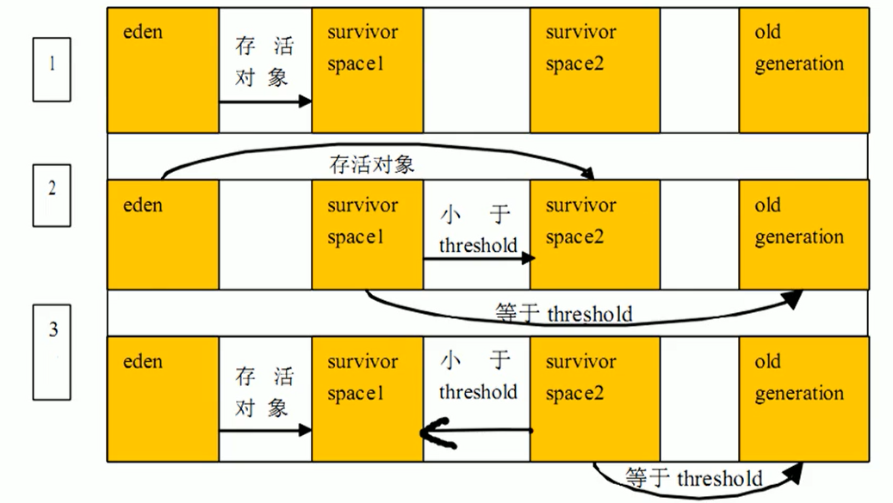

# jvm 垃圾回收

## GC 种类

针对Hotspot VM的实现，它里面的GC按照回收区域又分为两大种类型：一种是部分收集（Partial GC），一种是整堆收集（FullGC）

- 部分收集：不是完整收集整个Java堆的垃圾收集。其中又分为：

  - 新生代收集（Minor GC / Young GC）：只是新生代的垃圾收集

  - 老年代收集（Major GC / Old GC）：只是老年代的圾收集。

    - 目前，只有CMSGC会有单独收集老年代的行为。
    - 注意，很多时候Major GC会和Full GC混淆使用，需要具体分辨是老年代回收还是整堆回收。
  
  - 混合收集（MixedGC）：收集整个新生代以及部分老年代的垃圾收集。
    - 目前，只有G1 GC会有这种行为
  
- 整堆收集（Full GC）：收集整个java堆和方法区的垃圾收集

### 年轻代GC (Minor GC)

- 当年轻代空间不足时，就会触发MinorGC，这里的年轻代满指的是Eden代满，Survivor满不会引发GC。（每次Minor GC会清理年轻代的内存。）
- 因为Java对象大多都具备朝生夕灭的特性.，所以Minor GC非常频繁，一般回收速度也比较快。这一定义既清晰又易于理解。
- Minor GC会引发STW，暂停其它用户的线程，等垃圾回收结束，用户线程才恢复运行

  

### 老年代GC (MajorGC、FullGC)

- 指发生在老年代的GC，对象从老年代消失时，我们说 “Major GC” 或 “Full GC” 发生了

- 出现了Major Gc，经常会伴随至少一次的Minor GC（但非绝对的，在Paralle1 Scavenge收集器的收集策略里就有直接进行MajorGC的策略选择过程）

  - 也就是在老年代空间不足时，会先尝试触发Minor Gc。如果之后空间还不足，则触发Major GC

- Major GC的速度一般会比Minor GC慢10倍以上，STW的时间更长
- 如果Major GC后，内存还不足，就报OOM了

### FullGC 的触发机制

触发Full GC执行的情况有如下五种：

1. 调用System.gc()时，系统建议执行Full GC，但是不必然执行
2. 老年代空间不足
3. 方法区空间不足
4. 通过Minor GC后进入老年代的平均大小大于老年代的可用内存
5. 由Eden区、survivor space0（From Space）区向survivor space1（To Space）区复制时，对象大小大于To Space可用内存，则把该对象转存到老年代，且老年代的可用内存小于该对象大小

## 可达性分析

## 垃圾回收算法

jvm 默认的垃圾回收算法分为三种，分别是复制算法、标记-清除算法、标记整理算法

### 复制算法

### 标记-清除算法

### 标记-压缩算法

### 

