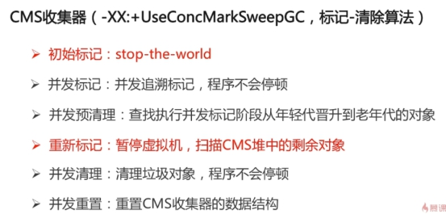

#### 什么情况下会发生栈内存溢出 ？

```
如果线程请求的栈深度大于虚拟机所允许的深度，将抛出StackOverflowError异常。 如果虚拟机在动态扩展栈时无法申请到足够的内存空间，则抛出OutOfMemoryError异常。
```


#### JVM的内存结构，Eden和Survivor比例。

```
Jvm 由 程序计数器，虚拟机栈，本地方法栈，MetaSpace以及 堆组成，eden 和 survivor 比例默认为8:1
java的虚拟机栈和本地方法栈 都是线程私有的
```


#### JVM内存为什么要分成新生代，老年代，持久代。新生代中为什么要分为Eden和Survivor。

```
因为是为了更好的对java内存进行管理，
新生代存储的对象往往是刚创建的对象，属于朝生夕死的类型，比如在方法中创建的对象，这些对象在使用完成以后就需要进行回收
而 老年代存储的往往是一些一直在使用的对象
metasapce存储的是类信息以及方法信息，变量信息，一般不需要进行回收
eden区 和 survivor 是 为了更好地方便管理需要一直在jvm内存中的对象来进行设定的
待续：
```

#### **jvm如何判定对象是否是为垃圾？**

1. 引用计数法

   引用计数为0的对象实例可以被当做垃圾回收（执行效率高）

   弊端：

   如过循环引用的话 则该实例永远无法回收

 

2. 可达性分析法

   通过判断对象的引用链是否可达来决定是否进行回收

 

​	标记清除算法，可以作为GC Root的对象

- 虚拟机栈中引用的对象（栈帧中的本地变量表）
-  方法区中的常量引用的对象
- 方法区中静态属性引用的对象
- 活跃线程的引用对象
- 

你知道哪几种垃圾收集器，各自的优缺点，重点讲下cms和G1，包括原理，流程，优缺点。

```
Stop-the-world:
    JVM由于要执行GC而停止了应用程序的执行
    任何一种GC算法中都会发生
    GC优化就是为了减少Stop-the-world的发生
    
SafePoint:
	分析过程中对象引用关系不会发生变化的边
	产生SafePoint的地方： 方法调用，循环跳转，异常跳转
	( 达到safePoint点之后所有线程都被冻结 )
	
java常用的 垃圾回收器分为年轻代垃圾回收器和 老年代垃圾回收器

年轻代：
	Serial ParNew Parallel Scavenage

老年代：
	Cms，Serial Old，Parallel Old

贯穿老年代和年轻代的垃圾回收器
G1
```


#### 年轻代垃圾处理器

Serial 收集器：

 

 

ParNew收集器：

 

 

 

 

Parallel Scavenge收集器

 

 

 

Serial Old处理器

  


Parallel Old收集器

 

 

 

CMS收集器

 

 

 

 

G1收集器（年轻代和老年代）

 


 

 

```
G1垃圾回收器默认分为多个Region，每个Region的大小默认为1-32M
如过 0.5region <= object < region 默认会直接存入old区中，并且将old区标记为H区
object >= region 则申请两个或者多个region来进行存储，并且标记为H区
每个Region都维护了一个RSet 作用是其他region中引用当前region中对象的记录
Cset 本次gc需要清理的region的集合


G1垃圾收集器 回收过程

初始标记：标记根，该阶段是stop-the-world式的；
root region scanning phase：该阶段标记Survivor Region中的指向老年代的引用，及其引用对象；
并发标记：
重新标记：
并发清理：
```


#### java对象引用的区别？

强引用，

软引用，

弱引用 

虚引用

 

 

 

 

 

 

 

 

 

 

 

 

 

 

 

  

 

当垃圾回收时先将当前对象进行回收，然后将当前对象所对应的Refrence对象放入到RefrenceQueue中随后进行回收

 

##### FinalReference

`FinalReference`访问权限为package，并且只有一个子类`Finalizer`，同时`Finalizer` 是final修饰的类，所以无法继承扩展。

 与`Finalizer`相关联的则是Object中的`finalize()`方法，在类加载的过程中，如果当前类有覆写`finalize()`方法，则其对象会被标记为finalizer类，这种类型的对象被回收前会先调用其`finalize()`。

 具体的实现机制是，在gc进行可达性分析的时候，如果当前对象是finalizer类型的对象，并且本身不可达（与GC Roots无相连接的引用），则会被加入到一个`ReferenceQueue`类型的队列(F-Queue)中。而系统在初始化的过程中，会启动一个`FinalizerThread`实例的**守护线程**(线程名Finalizer)，该线程会不断消费F-Queue中的对象，并执行其`finalize()`方法(runFinalizer)，并且runFinalizer方法会捕获Throwable级别的异常，也就是说`finalize()`方法的异常不会导致`FinalizerThread`运行中断退出。对象在执行`finalize()`方法后，只是断开了与`Finalizer`的关联，并不意味着会立即被回收，还是要等待下一次GC，**而每个对象的finalize()方法都只会执行一次，不会重复执行。**

>  `finalize()`方法是对象逃脱死亡命运的最后一次机会，如果在该方法中将对象本身(this关键字) 赋值给某个类变量或者对象的成员变量，那在第二次标记时它将被移出"即将回收的集合"。
>
> ——《深入理解java虚拟机》

**注意：**finalize()使用不当会导致内存泄漏和内存溢出，比如`SocksSocketImpl`之类的服务会在`finalize()`中加入`close()`操作用于释放资源，但是如果`FinalizerThread`一直没有执行的话就会导致资源一直无法释放，从而出现内存泄漏。还有如果某对象的`finalize()`方法执行时间太长或者陷入死循环，将导致`F-Queue`一直堆积，从而造成内存溢出(oom)。


##### Finalizer

- **FinalizerThread**

```
    //消费ReferenceQueue并执行对应元素对象的finalize()方法
    private static class FinalizerThread extends Thread {
        ......
        public void run() {
            ......
            final JavaLangAccess jla = SharedSecrets.getJavaLangAccess();
            running = true;
            for (;;) {
                try {
                    Finalizer f = (Finalizer)queue.remove();
                    f.runFinalizer(jla);
                } catch (InterruptedException x) {
                }
            }
        }
    }
```

```
    //初始化的时候启动FinalizerThread(守护线程)
    static {
        ThreadGroup tg = Thread.currentThread().getThreadGroup();
        for (ThreadGroup tgn = tg;
             tgn != null;
             tg = tgn, tgn = tg.getParent());
        Thread finalizer = new FinalizerThread(tg);
        finalizer.setPriority(Thread.MAX_PRIORITY - 2);
        finalizer.setDaemon(true);
        finalizer.start();
    }
```

- **add**

在jvm启动的时候就会启动一个守护线程去消费引用队列，并调用引用队列指向对象的finalize()方法。
jvm在注册finalize()方法被覆写的对象的时候会创建一个`Finalizer`对象，并且将该对象加入一个双向链表中：

```
    static void register(Object finalizee) {
        new Finalizer(finalizee);
    }
    private Finalizer(Object finalizee) {
        super(finalizee, queue);
        add();
    }
    private void add() { 
        synchronized (lock) { //头插法构建Finalizer对象的链表
            if (unfinalized != null) {
                this.next = unfinalized;
                unfinalized.prev = this;
            }
            unfinalized = this;
        }
    }
```

另外还有两个附加线程用于消费Finalizer链表以及队列:
`Runtime.runFinalization()`会调用`runFinalization()`用于消费Finalizer队列，而`java.lang.Shutdown`则会在jvm退出的时候(jvm关闭钩子)调用`runAllFinalizers()`用于消费Finalizer链表。 


 

 


#### 垃圾回收算法的实现原理 

```
垃圾回收算法分为三种 分别是 
	标记清除算法（会出现内存碎片）
		标记：从根集合进行扫描，对存活的对象进行标记
		清除：对堆内存从头到尾进行线性遍历，回收不可达对象
	标记整理算法
	好处：避免内存中不连续的行
		适用于存活率搞得场景
		标记：从根集合进行扫描，对存活的对象进行标记
		清除：移动所有存活的对象，按照内存堵住次序依次排列，将末端内存地址以后的内存全部回收
	复制算法
		分为对象面和空闲面
		对象在对象面上创建
		存错的对象从对象面复制到空闲面
		将对象面所有对象内存清除
		好处：
			解决碎片化问题，
			顺序分配内存，简单高效
			适用于对象存活率低的场景
	分代收集算法
		垃圾回收算法的组合
		安装对象生命周期的不同划分区域，采用不同的垃圾回收算法
GC 又分为两种 :
	Minor GC
	Full GC

	当eden区满的时候，触发MinorGC 将Eden区域的对象复制到S0 ，对象年龄 + 1，然后清空Eden区域，第二次eden区域满的时候，将 eden区存活的对象以及s0存活的对象移动到s1区域，对象的年龄 + 1，当年龄达到上限的时（默认15岁）候则放入 old区域

老年代区域
1.触发Full gc的条件
	老年代的空间不足
	永久代空间不足
	Minor gc 晋升到老年代的平均大小大于老年代的剩余空间
	System.gc 会触发full gc
	RMI 来进行管理
```


#### Eden区对象如何晋升到老年代 ?

```
对象优先在eden区分配
长期存活的对象进入老年代
Suvivor区中放不下的对象
新生成的大对象
```


#### 当出现了内存溢出，你怎么排错。

```
在jvm启动时设置 -XX:+HeapDumpOnOutOfMemoryError 当堆溢出时导出堆快照
然后使用 java自带的 可视化工具或者使用mat来进行分析
```


#### 简单说说你了解的类加载器，可以打破双亲委派么，怎么打破 

```
BootStrapClassLaoder
加载核心库java.*

ExtClassLoader
加载ext目录下的javax.*文件

AppClassLoader
加载当前程序所在目录下的文件

自定义Classloader
findClass（String name） 用于寻找类文件

defineClass（）方法 ，将读取的文件流进行解析然后返回Class文件
```


#### Class.forName 和 ClassLoader的区别?

```
ClassLoader是采用双亲委派机制来进行加载类的，当加载类是，自底向上检查类是否已经加载
如过没有加载该类的话，默认会自顶向下的尝试进行加载

Class.forName 默认打破了 双亲委派机制，直接调用当前的类加载器进行加载

ClassLoader加载的类默认不会对该类进行实例化操作，而Class.forName 会实例化类对象（参数可控制）


加载类文件时首先会用findLoadedClass 来 查找已经加载的类文件 是否存在，如过不存在则调用parent.loadClass来查看当前class文件 是否加载 ，最后当parent为null的时候则调用 最顶层的BootstarpClassloader来尝试加载，如过还是加载不到的话 最后自订而下的调用 findClass来尝试加载如过加载到则尝试返回如过加载不到则 使用child来加载
```

```
原理：
使用Class.forName() 来加载 class文件 ：

Class.forName 和 classLoader.loadClass的区别
public static Class<?> forName(String name, boolean initialize,
                               ClassLoader loader)

如何initialize 为True的话 则表示当前的class对象需要初始化，而loadClass则表示当前的类对象不需要初始化，（如过一个类中有 static方法的话）
默认一个java对象初始化，首先需要初始化类对象，然后再初始化对象实例，
在对象头中会放入当前类实例的指针。
如过当前类有继承类的话默认会先初始化父类的class实例，然后初始化子类的class实例，然后初始化父类的构造方法，然后初始化子类的构造方法

类的加载方式分为三种：
隐式加载： new 关键字（先初class对象实例，然后初始化static变量，然后初始化static静态代码块，然后初始化本地变量表，然后初始化构造器，如过当前类没有继承任何其他类的话，默认会调用Object的构造方法来进行初始化）
显式加载：loadClass 以及 Class.forName方法
```


#### 你们线上应用的JVM参数有哪些。

```
-server
-Xmx 设置最大堆内存
-XX:NewSize
-XX:MaxNewSize
-Xss 设置为每个虚拟机栈分配的内存
-XX:MaxTenuringThreshold ： 设置 对象晋升到老年代的年龄大小 
-XX: SurvivorRatio ：设置Eden和Survivor的比值，默认为8:1
-XX: NewRatio：老年代和年轻代内存的大小比例 默认为 1:2
-XX:+HeapDumpOnOutOfMemoryError当堆溢出时导出堆快照
-XX:HeapDumpPath=./ 堆快照导出路径 
-XX:MetaspaceSize
-XX:MetatspaceMaxSize:
-XX:PretenureSizeThreshold  设置进入老年代的对象年龄大小
XX:PrintTnuringDistribution：当执行Minor GC时，打印下存活对象的年龄的情况
-XX:TargetSurvivorRatio 设置survior区域的比例，当存活对象超过该比例之后，计算所有对象的平均年龄，将超过平均年龄的放入老年代
XX:MaxGCPauseMillis：停顿时间，垃圾收集器做垃圾回收终端永盈的执行时间
-XX:GCTimeRatio = <n> 吞吐量设置，默认为 当前垃圾收集器时间/(垃圾收集器时间 + 用户停顿时间)
-XX:+DisableExplicitGC 禁止使用System.gc()
-Xnoclassgc 是否对类进行回收,JVM提供了-Xnoclassgc参数进行控制

-XX: ParallGCThreads 指定 parall gc的线程数量

Cms回收器相关的参数
-XX:ConcGCThreads：并发的GC线程数量
-XX:+UseCMSConpactAtFullCollection 在FullGC之后进行内存压缩
-XX:CMSFullGCsBeforeCompaction：多少次FullGC之后压缩一次
-XX:CMSInitiatingOccupancyFraction：触发Full gc的当老年代存活对象达到多少比例的时候才会触发Full GC
-XX:UseCMSInitiatingOccupancyOnly ： 是否需要动态调整
-XX: CMSScavengeBeforeRemark 在Full GC之前执行 MinorGC

-XX:SoftRefLRUPolicyMSPerMB=0 (**)


####和日志相关的参数

JVM的GC日志的主要参数包括如下几个：

-XX:+PrintGC 输出GC日志

-XX:+PrintGCDetails 输出GC的详细日志

-XX:+PrintGCTimeStamps 输出GC的时间戳（以基准时间的形式）

-XX:+PrintGCDateStamps 输出GC的时间戳（以日期的形式，如 2017-09-04T21:53:59.234+0800）

-XX:+PrintHeapAtGC 在进行GC的前后打印出堆的信息

-Xloggc:../logs/gc.log 日志文件的输出路径
```


#### 怎么打出线程栈信息 

```
使用jstack 可以打印出 线程的栈信息，或者使用ManagerFactory 来获取ThreadMXBean来进行查看
```


#### 请解释如下jvm参数的含义：

```
-server 
指定使用server模式来运行jvm，client模式是启动快，运行慢，server是启动慢，运行快
-Xms512m 
设置最小堆内存
-Xmx512m 
设置最大堆内存
-Xss1024K
-Xss 设置为每个虚拟机栈分配的内存
-XX:PermSize=256m -XX:MaxPermSize=512m -

XX:MaxTenuringThreshold=20
设置当前对象晋升到老年代的岁数
XX:CMSInitiatingOccupancyFraction=80 
指设定CMS在对内存占用率达到70%的时候开始GC(因为CMS会有浮动垃圾,所以一般都较早启动GC);
XX:+UseCMSInitiatingOccupancyOnly。
只是用设定的回收阈值(上面指定的70%),如果不指定,JVM仅在第一次使用设定值,后续则自动调整.

```


#### PermGen 和 Metaspace 的区别 

```
PermGen以前是放在 jvm堆中的，在jdk1.8以后移除了PermGen，

在java7的时候将字符串常量池则移到java heap

java8的时候去除PermGen，将其中的方法区移到non-heap中的Metaspace

如果没有使用-XX:MaxMetaspaceSize来设置类的元数据的大小，其最大可利用空间是整个系统内存的可用空间。JVM也可以增加本地内存空间来满足类元数据信息的存储。
但是如果没有设置最大值，则可能存在bug导致Metaspace的空间在不停的扩展，会导致机器的内存不足；进而可能出现swap内存被耗尽；最终导致进程直接被系统直接kill掉。

Metaspace与PermGen之间最大的区别在于：Metaspace并不在虚拟机中，而是使用本地内存。

如果类元数据的空间占用达到MaxMetaspaceSize设置的值，将会触发对象和类加载器的垃圾回收。


-XX:MetaspaceSize，初始空间大小，达到该值就会触发垃圾收集进行类型卸载，同时GC会对该值进行调整：如果释放了大量的空间，就适当降低该值；如果释放了很少的空间，那么在不超过MaxMetaspaceSize时，适当提高该值。
-XX:MaxMetaspaceSize，最大空间，默认是没有限制的。
-XX:MinMetaspaceFreeRatio，在GC之后，最小的Metaspace剩余空间容量的百分比，减少为分配空间所导致的垃圾收集
-XX:MaxMetaspaceFreeRatio，在GC之后，最大的Metaspace剩余空间容量的百分比，减少为释放空间所导致的垃圾收集


将常量池从PermGen剥离到heap中，将元数据从PermGen剥离到元数据区，去除PermGen的好处如下：

将字符串常量池从PermGen分离出来，与类元数据分开，提升类元数据的独立性
将元数据从PermGen剥离出来到Metaspace，可以提升对元数据的管理同时提升GC效率。
```


#### Cms垃圾收集器和 G1垃圾收集器


##### CMS垃圾收集器

- 初始标记（initial mark）**Stop The World**

  

  本阶段需要stop the world，一是标记老年代中所有的GC Roots所指的**直接对象**；

  二是标记被年轻代中存活对象引用的**直接对象**。（因为仅标记少量节点，所以很快就能完成）

- 并发标记（concurrent mark）

  

  在初始标记的基础上继续往下遍历其他的对象引用并进行标记，，该过程会和用户线程**并发**地执行，不会发生停顿。这个阶段会从initial mark阶段中所标记的节点往下检索，标记出所有老年代中存活的对象。注意此时会有部分对象的引用被改变，如上图中的current obj原本所引用的节点已经失去了关联。

- 并发预清理（concurrent preclean）

  

  前一个阶段在并行运行的时候，一些对象的引用已经发生了变化，当这些引用发生变化的时候，JVM会标记堆的这个区域为Dirty Card，这就是 Card Marking。

  

  在本阶段，那些能够从dirty card对象到达的对象也会被标记，这个标记做完之后，dirty card标记就会被清除了，如上图所示。

  总的来说，本阶段会**并发地**更新并发标记阶段的引用变化和查找在并发标记阶段新进入老年代的对象，如刚晋升的对象和直接被分配在老年代的对象。通过重新扫描，以减少下一阶段的工作。

  

- 重新标记 / 最终标记（final remark）**Stop The World**

  本阶段需要stop the world，通常来说此次暂时都会比较长，因为并发预清理是并发执行的，对象的引用可能会发生进一步的改变，需要确保在清理之前保持一个正确的对象引用视图，那么就需要stop the world来处理复杂的情况。

  该阶段并发执行，在之前的并行阶段（GC线程和应用线程同时执行，好比你妈在打扫房间，你还在扔纸屑），可能产生新的引用关系如下：

  1. 老年代的新对象被GC Roots引用
  2. 老年代的未标记对象被新生代对象引用
  3. 老年代已标记的对象增加新引用指向老年代其它对象
  4. 新生代对象指向老年代引用被删除
  5. 也许还有其它情况..

  

- 并发清理（concurrent sweep）

  

  使用标记-清除法回收**老年代**的垃圾对象，与用户线程并发执行。

- 并发标记重置（concurrent reset）

  清空现场，为下一次GC做准备。


###### Concurrent Mode Failed

如果对象分配率高于CMS回收的效率，将导致在CMS完成之前老年代就被填满，这种状况成为“并发模式失败”，同样也会引起full GC。可以调节-XX:CMSInitiatingOccupancyFraction和新生代的堆大小。


```
-XX:+UseConcMarkSweepGC - 启用CMS，同时-XX:+UseParNewGC会被自动打开。

-XX:CMSInitiatingOccupancyFraction - 设置第一次启动CMS的阈值，默认是68%。

-XX:+UseCMSInitiatingOccupancyOnly - 只是用设定的回收阈值，如果不指定，JVM仅在第一次使用设定值，后续则自动调整。

-XX:+CMSPermGenSweepingEnabled - 回收perm区。

-XX:+CMSClassUnloadingEnabled - 相对于并行收集器，CMS收集器默认不会对永久代进行垃圾回收（在1.7中是默认关闭，但是在1.8中是默认打开的）。如果希望对永久代进行垃圾回收，则可以打开此标志，同时打开-XX:+CMSPermGenSweepingEnabled。

-XX:+CMSConcurrentMTEnabled - 并发的CMS阶段将会启动多个GC线程和其他线程并发工作，默认为true。

-XX:+UseCMSCompactAtFullCollection - 在full GC的时候进行整理(mark sweep compact)，默认为true。

-XX:+CMSFullGCsBeforeCompaction - 在上一次CMS并发GC执行过后，到底还要再执行多少次**full GC**（注意不是CMS GC）才会做压缩，默认是0。如果增大这个参数，会使full GC更少做压缩，但也就更容易使CMS的老年代受碎片化问题的困扰。 本来这个参数就是用来配置降低full GC压缩的频率，以期减少某些full GC的暂停时间。CMS回退到full GC时用的算法是mark-sweep-compact，但compaction是可选的，不做的话碎片化会严重些但这次full GC的暂停时间会短些，这是个取舍。

-XX:+CMSParallelRemarkEnabled - 并行remark，以减少remark的等待时间。默认为true。

-XX:+CMSScavengeBeforeRemark - 强制remark之前开始一次minor GC，可以减少remark的等待时间，因为老生代的对象有的会依赖于新生代的对象，当增加了这个命令时会在remark之前执行一次minor GC的操作，从而可以减少老生代到新生代的可到达对象数。默认为false。
```


##### G1垃圾回收器

G1收集器（或者垃圾优先收集器）的设计初衷是为了尽量缩短处理超大堆时产生的停顿。在回收的时候将对象从一个小堆区复制到另一个小堆区，这意味着G1在回收垃圾的时候同时完成了堆的部分内存压缩，相对于CMS的优势而言就是内存碎片的产生率大大降低。


heap被划分为一系列大小相等的“小堆区”，也称为region。每个小堆区（region）的大小为1~32MB，整个堆**大致**要划分出2048个小堆区。

与上一代的垃圾收集器一样在逻辑上被划分Eden、Survivor和老年代，但是各种角色的region个数都不是固定的。**上图**的绿色代表Eden小堆区、黄色为Survivor小堆区、蓝色则为老年代小堆区、而灰色则会未被使用的区域。


#### G1垃圾收集器

##### 1 内存结构

G1首先在内存结构上采用了region化的方法，将堆内存划分成2000块左右的小块，每块大小1-32M（2的幂次），每块region都可以作为E、S、O任意一种，分配灵活，但是存在大对象问题。解决方法是：

- 小于一半region size的可以正常存入E区
- 一半到一个region size的直接存入O区一个region中，这个region又叫Humongous region，我们也可以把它叫做H区（他本质还是O区的）
- 比一个region size还要大的对象，需要存入连续的多个region中，这多个region都是H区。

[](https://camo.githubusercontent.com/2400fa973d54da921011614eb3a01630e6bd6116/68747470733a2f2f626f6c672e6f62732e636e2d6e6f7274682d312e6d79687561776569636c6f75642e636f6d2f313930392f67312d302e706e67)

##### 2 两个概念

- RememberSets，又叫Rsets是每个region中都有的一份存储空间，用于存储本region的对象被其他region对象的引用记录。
- CollectionSets，又叫Csets是一次GC中需要被清理的regions集合，注意G1每次GC不是全部region都参与的，可能只清理少数几个，这几个就被叫做Csets。

[](https://camo.githubusercontent.com/ea9499a99969c6021a483571c9245b6623665f72/68747470733a2f2f626f6c672e6f62732e636e2d6e6f7274682d312e6d79687561776569636c6f75642e636f6d2f313930392f67312d372e706e67)


##### 3 YGC

年轻代的GC，StopTheWorld，复制算法。将E和S(from)区复制到S(to)，注意S(to)一开始是没有标识的，就是个free region。`下图中没有标出YGC进入老年代的对象，有可能有一部分会进入O区!!`。

 [](https://camo.githubusercontent.com/60598923569873562ba78d20840706cff09660b2/68747470733a2f2f626f6c672e6f62732e636e2d6e6f7274682d312e6d79687561776569636c6f75642e636f6d2f313930392f67312d322e706e67)


##### 4 MixGC

G1对于老年代的GC比较特殊，本质上不是只针对老年代，也有部分年轻代，所以又叫MixGC。

- 初次标记，也是标记GCroot直接引的对象和所在Region，但是与CMS不同的是，这里不止标记O区。注意初次标记一般和YGC同时发生，利用YGC的STW时间，顺带把这事给干了。日志格式如下

```
[GC pause (G1 Evacuation Pause) (young) (initial-mark), 0.0062656 secs]
```

- RootRegion扫描，扫描GCroot所在的region到Old区的引用。日志格式

```
1.362: [GC concurrent-root-region-scan-start]
1.364: [GC concurrent-root-region-scan-end, 0.0028513 secs]
```

- 并发标记，类似CMS，但是标记的是整个堆，而不是只有O区。这期间如果发现某个region所有对象都是'垃圾'则标记为X。日志格式

```
1.364: [GC concurrent-mark-start]
1.645: [GC concurrent-mark-end, 0.2803470 secs]
```

[](https://camo.githubusercontent.com/b82b9c89a64ca55223fc5af95f197ceeb72efb0f/68747470733a2f2f626f6c672e6f62732e636e2d6e6f7274682d312e6d79687561776569636c6f75642e636f6d2f313930392f67312d332e706e67)

- 重新标记，类似CMS，但也是整个堆，并且上一步中的X区被删除。另外采用了初始标记阶段的SATB，重新标记的速度变快。日志格式

```
1.645: [GC remark 1.645: [Finalize Marking, 0.0009461 secs] 1.646: [GC ref-proc, 0.0000417 secs] 1.646: [Unloading, 0.0011301 secs], 0.0074056 secs]
[Times: user=0.01 sys=0.00, real=0.01 secs]
```

[](https://camo.githubusercontent.com/ac84e6d2a5016c3cd6c7a3a1cc2b7d03da7a3ae8/68747470733a2f2f626f6c672e6f62732e636e2d6e6f7274682d312e6d79687561776569636c6f75642e636f6d2f313930392f67312d342e706e67)

- 复制/清理，选择所有Y区reigons和'对象存活率较低'的O区regions组成Csets，进行复制清理。日志格式：

```
1.652: [GC cleanup 1213M->1213M(1885M), 0.0030492 secs]
[Times: user=0.01 sys=0.00, real=0.00 secs]
```

[](https://camo.githubusercontent.com/c8895618389a5ea84e4b832bb02b51d8d45eedf0/68747470733a2f2f626f6c672e6f62732e636e2d6e6f7274682d312e6d79687561776569636c6f75642e636f6d2f313930392f67312d352e706e67) 

[](https://camo.githubusercontent.com/5b8ee16d70fcfbdcc53ab78b68a81433dadfec0b/68747470733a2f2f626f6c672e6f62732e636e2d6e6f7274682d312e6d79687561776569636c6f75642e636f6d2f313930392f67312d362e706e67)

##### 问题列表

RootRegionScan这个阶段是干嘛的？

> 标记出RootRegion指向O区的region，标记这些region是为了降低并发标记的扫描范围，因为并发标记需要扫描GCROOT引用或间接的所有对象，而这些对象一定是在RootRegion出发指向的Region中的。MIXGC中Y区本来就要全扫，所以这里再按照O区过滤下，这样就缩小了扫描范围。该阶段的操作为遍历O区region查询Rset是否有来自RootRegion的，（RootRegion是初始标记得到的）。

Rset作用有哪些？

> 上题中的作用是一个，还有个作用是YGC时，O区不GC因而认为O区全为‘GCroot’，需扫描全部O区。有了Rset只需要查看所有Y区region的Rset就知道被哪些O区region跨带引用了，避免了扫描整个O区。

G1提高效率的点有哪些？

> 1 重新标记时X区域直接删除。
> 2 Rset降低了扫描的范围，上题中两点。
> 3 重新标记阶段使用SATB速度比CMS快。
> 4 清理过程为选取部分存活率低的Region进行清理，不是全部，提高了清理的效率。

对比CMS，有哪些不同？

> 1 region化的内存结构，采用复制清理的方式，避免了内存碎片。但是这种清理也造成了STW。
> 2 SATB速度更快。
> 3 初始标记，并发标记，重新标记，清理垃圾四个阶段很像，但是G1中有很多标记region的操作，并借助Rset进行了范围的缩小，提高了并发标记的速度。小结下就是初始标记和YGC的STW一起了，提高了效率；并发标记因为rset的设计，扫描范围缩小了，提高了效率；重新标记因为使用了SATB提高了效率；清理虽然造成了STW，但是复制使内存紧凑，避免了内存碎片。同时只清理垃圾较多的region，最大限度的降低了STW时间。

````
-XX:+UseG1GC 启用G1垃圾收集器

-XX:MaxGCPauseMillis=n 指定期望的最大停顿时间，有大概率保证在该范围内，但并非一定能实现。

-XX:G1HeapRegionSize=n 设置的 G1 区域的大小。值是 2 的幂，范围是 1 MB 到 32 MB 之间。目标是根据最小的 Java 堆大小划分出约 2048 个区域。

-XX:ParallelGCThreads=n 设置 STW 工作线程数的值。将 n 的值设置为逻辑处理器的数量。n 的值与逻辑处理器的数量相同，最多为 8。如果逻辑处理器不止八个，则将 n 的值设置为逻辑处理器数的 5/8 左右。这适用于大多数情况，除非是较大的 SPARC 系统，其中 n 的值可以是逻辑处理器数的 5/16 左右。

-XX:ConcGCThreads=n 设置并行标记的线程数。将 n 设置为并行垃圾回收线程数 (ParallelGCThreads) 的 1/4 左右。

-XX:InitiatingHeapOccupancyPercent=45 设置触发标记周期的 Java 堆占用率阈值。默认占用率是整个 Java 堆的 45%。

-XX:G1ReservePercent=n 设置堆内存保留为假天花板的总量，以降低提升失败的可能性，默认值是 10。

-XX:G1NewSizePercent	新生代最小值，默认值5%
-XX:G1MaxNewSizePercent	新生代最大值，默认值60%
````


