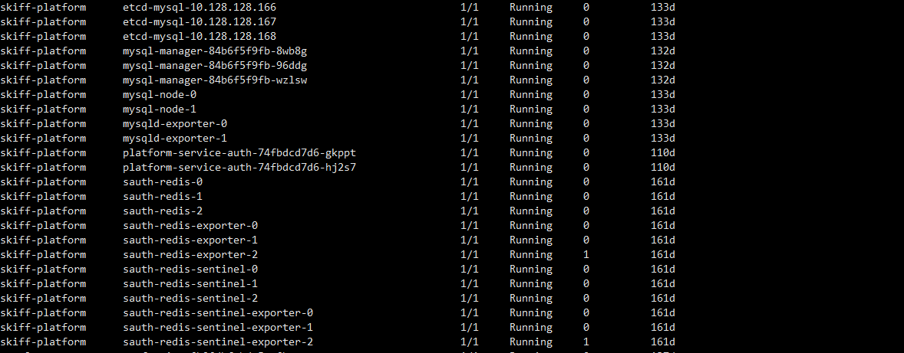

# 业务员集群核心

业务集群主要负责运行相关的业务Pod以及业务资源

## kube-system

### rbd-provisioner

提供rbc类型的动态存储

### node-problem-detector

node问题收集器

### nfs-client-provisioner（问问网易）

提供 nfs 的动态PV 创建

### metrics-server

### kube-state-metrics

### localstorage-webhook

用于 对 localstorage 类型的资源文件做相应配置

### custom-metrics-apiserver

## olm

operator 管理

 catalog-operator-6556bb79d9-d8tpr                     
olm-operator-74446b6bff-gknkz                         
operatorhubio-catalog-7nqtv                           
packageserver-9d8d7895d-jlzkn                          
packageserver-9d8d7895d-zq7sq                         
 prometheus-paas-0                                     
 prometheus-paas-1            

## skiff-eventer

event时间信息收集

## skiff-logagent

日志信息收集，与监控logconfig 资源配置

## skiff-nsf

### apollo 配置中心

- nsf-config-admin

- nsf-config-portal

- nsf-config-service

### nsf-registry：注册中心

### nsf-turbine：监控信息收集

### nsf-tunnel-server：做nsf 诊断使用

Prometheus-nsf 

### nfs-server

## skiff-platform

找轻舟云技术人员了解

## Gateway-Systsem

apigw-api-plane

负责生成CRD配置以及插件schema管理

rate-limit

负责实现限流

istio-pilot （模拟pilot 故障）

负责将CRD配置通过xds协议下发给gateway-proxy

istio-galley （模拟galley 故障）

负责对接其它类型的注册中心

ingress-nginx

用来提供网关路由

apigw-keepalived-ingress

提供网关理由地址高可用

