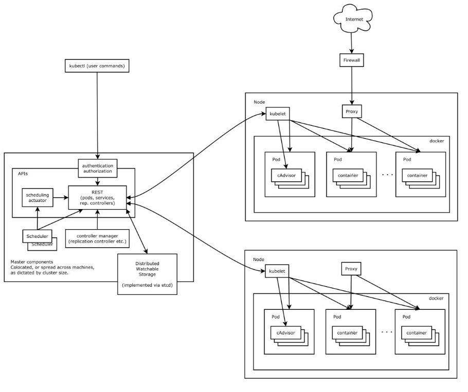

## 1.1. kubernetes介绍

kubernetes是一种开源的容器编排工具，通过调度系统维持用户预期数量和状态的容器正常运行。kubernetes提供的功能：

- 服务发现和负载均衡：Kubernetes 可以使用 DNS 名称或自己的 IP 地址公开容器，如果到容器的流量很大，Kubernetes 可以负载均衡并分配网络流量，从而使部署稳定。

- 存储编排

  Kubernetes 允许自动挂载您选择的存储系统，例如本地存储、公共云提供商等

- 自动部署和回滚

  您可以使用 Kubernetes 描述已部署容器的所需状态，它可以以受控的速率将实际状态更改为所需状态。例如，您可以自动化 Kubernetes 来为您的部署创建新容器，删除现有容器并将它们的所有资源用于新容器。

- 自我修复

  Kubernetes 重新启动失败的容器、替换容器、杀死不响应用户定义的运行状况检查的容器，并且在准备好服务之前不将其通告给客户端。

- 密钥与配置管理

  Kubernetes 允许您存储和管理敏感信息，例如密码、OAuth 令牌和 ssh 密钥。您可以在不重建容器镜像的情况下部署和更新密钥和应用程序配置，也无需在堆栈配置中暴露密钥。


Kubernates 架构图如下：

  


kubernates 由 master 节点 与 node 节点组成，其中master 支持集群部署来支持高可用，结构图如下：

 

Master节点 由 etcd、apiserver、controller manager、scheduler 组成

Node 节点 由kubelet、kube-proxy组成，其中kubelet 负责容器的创建，kube-proxy 负责 pod **( 待补充)**


 


## Master 组件 (控制平面):

master和node是两个逻辑上节点，当服务器资源充足时，可以将其分开在不同的机器上部署，当服务器资源不足时，也可以放到同一台机器上部署。master节点在部署的时候必须要考虑高可用方案，至少部署两个master。 

### etcd

 etcd 是兼具一致性和高可用性的键值数据库，可以作为保存 Kubernetes 所有集群数据的后台数据库。在二进制部署etcd集群的时候，必须要考虑到高可用方案，一般部署三个或者三个以上的奇数个节点，因为当master宕机时，是通过选举制度来选择master的 


### apiserver：

 Api Server 负责提供 Kubernetes API 服务的组件；它是 Kubernetes 控制面的前端。是整个集群中资源操作的唯一入口，并提供认证、授权、访问控制、API注册和发现等机制。

apiserver提供了集群管理的restful api接口(鉴权、数据校验、集群变更等)，负责和其它模块之间进行数据交互，承担了通信枢纽功能。


### Controller manager

controller manager 译为“控制器管理器”，k8s内部有很多资源控制器，比如：Node Controller、Replication Controller、Deployment Controller、Job Controller、Endpoints Controller等等，为了降低复杂度，将这些控制切都编译成了一个可执行文件，并且在同一个进程中运行。

controller manager 负责维护集群的状态，比如故障检测、自动扩展、滚动更新等。


### Scheduler

调度器组件监视那些新创建的未指定运行节点的 Pod，并选择节点让 Pod 在上面运行。调度决策考虑的因素包括单个 Pod 和 Pod 集合的资源需求、硬件/软件/策略约束、亲和性和反亲和性规范、数据位置、工作负载间的干扰和最后时限。

当前各个node节点资源会通过kubelet汇总到etcd中，当用户提交创建pod请求时，apiserver将请求交给controller manager处理，controller manager通知scheduler进行筛选合适的node。此时scheduler通过etcd中存储的node信息进行预选(predict)，将符合要求的node选出来。再根据优选(priorities)策略，选择最合适的node用于创建pod。


## Node 组件

### kubelet

一个在集群中每个节点上运行的代理，kubelet 接收一组通过各类机制提供给它的 PodSpecs，确保这些 PodSpecs 中描述的容器处于运行状态且健康。kubelet 不会管理不是由 Kubernetes 创建的容器。

简单来说主要是三个功能：

- 接收pod的期望状态(副本数、镜像、网络等)，并调用容器运行环境(container runtime)来实现预期状态，目前container runtime基本都是docker ce。需要注意的是，**pod网络是由kubelet管理的，而不是kube-proxy**。
- 定时汇报节点的状态给 apiserver，作为scheduler调度的基础
- 对镜像和容器的清理工作，避免不必要的文件资源占用磁盘空间


###  kube-porxy 

 kube-proxy 是集群中每个节点上运行的网络代理，是实现service资源功能组件之一。kube-proxy 建立了pod网络和集群网络之间的关系，即 cluster ip 和 pod ip 中间的关系。不同node上的service流量转发规则会通过kube-proxy进行更新，其实是调用apiserver访问etcd进行规则更新。 

service流量调度方式有三种方式: userspace(废弃，性能很差)、iptables(性能差，复杂)、ipvs(性能好，转发方式清晰)。

  


#### container runtime

 即容器运行环境，Kubernetes 支持多个容器运行环境: Docker、 containerd、cri-o、 rktlet 以及任何实现 Kubernetes CRI (容器运行环境接口)。常用的是Docker CE。 


## 规范

### 2.4.1. CNI网络插件

Kubernetes设计了网络模型，但是却将具体实现方式交给了网络插件来实现，CNI网络插件实现的是pod之间跨宿主机进行通信。默认情况下安装好node节点后，无法跨node进行宿主机通信。可以参考: https://www.yuque.com/duduniao/ww8pmw/tr3hch#GtBRc

CNI网络插件有很多，比如：Flannel、Calico、Canal、Contiv、OpenContrail等，其中最常用的是Flannel和Calico两种。Flannel在node节点比较少，不夸网段时性能比较好，也是市场占有率最高的网络插件。

2.4.1.1. Flannel 通信原理

在已安装完毕flannel的node节点上，查看路由表会发现，其实flannel就是添加了一个路由信息，将跨宿主机访问pod的路由方式写到了系统路由表中。

```sh
[root@hdss7-21 ~]# route -n
Kernel IP routing table
Destination     Gateway         Genmask         Flags Metric Ref    Use Iface
0.0.0.0         10.4.7.254      0.0.0.0         UG    100    0        0 ens32
10.4.7.0        0.0.0.0         255.255.255.0   U     100    0        0 ens32
172.7.21.0      0.0.0.0         255.255.255.0   U     0      0        0 docker0
172.7.22.0      10.4.7.22       255.255.255.0   UG    0      0        0 ens32

[root@hdss7-22 ~]# route -n 
Kernel IP routing table
Destination     Gateway         Genmask         Flags Metric Ref    Use Iface
0.0.0.0         10.4.7.254      0.0.0.0         UG    100    0        0 ens32
10.4.7.0        0.0.0.0         255.255.255.0   U     100    0        0 ens32
172.7.21.0      10.4.7.21       255.255.255.0   UG    0      0        0 ens32
172.7.22.0      0.0.0.0         255.255.255.0   U     0      0        0 docker0
```

2.4.1.2. Flannel三种工作模式

- Host-Gateway 模式：

只是在主机上添加前往其它主机的pod网段的路由表而已，这种模式在同一个网段内部效率非常高。


- VXLan模式：

VXLan(Virtual Extensible LAN 虚拟可扩容局域网)，是Linux本身就支持的模式，vxlan模型中的VTEP(VXLAN Tunnel End Point 虚拟隧道端点) 就是各个node上的flannel.1设备。

当使用vxlan模式工作时，会将数据包经过docker0转给flannel.1设备，该设备会查询到目标pod宿主机的flannel.1设备的mac地址，在数据包基础上加封一个vxlan头部，这里面有一个VNI标志，flannel默认为1，flannel.1将封装好的数据包交给宿主机网卡ens32处理。ens32再添加目标pod的宿主机ip和mac。

目标pod的flannel.1的mac地址和宿主机的IP地址都是由flannel进程通过etcd维护的。


2.4.1.3. flannel的模式选择和查看

在生产中，一般会将所有的node规划到同一个局域网下，200多台的高配置的node基本够用了。对于环境隔离要求很高的业务，也不会放到同一个k8s集群，因此跨网段进行node管理的场景不多。host-gw模式下性能损失很小，vxlan模式下性能损失较大，如果存在跨网段可以考虑flannel的混合模式，或者采用其它的CNI网络插件。

```
# 查看
[root@hdss7-21 ~]# /opt/apps/etcd/etcdctl get /coreos.com/network/config
{"Network": "172.7.0.0/16", "Backend": {"Type": "host-gw"}}
```

2.4.1.4. flannel 部署和nat优化

https://www.yuque.com/duduniao/ww8pmw/tr3hch#boFnZ


### 扩展组件

### DNS

在k8s集群中pod的IP地址会发生变化，k8s通过标签选择器筛选出一组pod，这组pod共同指关联到抽象资源service，这个service拥有固定的IP地址，即cluster ip。此时无论后端的pod如何变化，都可以请求都可以通过service到达后端的pod上。

每个service有着自己的名称和cluster IP地址，可以通过IP地址直接访问到service后端对应的pod资源，也可以使用DNS将cluster ip 和 service 名称关联，实现通过service的名称访问后端pod。kubernetes的dns插件有kube-dns和coredns两种，在kubernetes 1.11 开始使用coredns较多，在此之前使用kube-dns比较多。

使用dns解析时，如果在pod外，需要使用全域名解析如：nginx-web.default.svc.cluster.local，pod内部则可以使用短域名。

```
[root@hdss7-21 ~]# kubectl exec nginx-ds-jdp7q -- /bin/bash -c "cat /etc/resolv.conf" # 重点关注主机域
nameserver 192.168.0.2
search default.svc.cluster.local svc.cluster.local cluster.local host.com
options ndots:5
#######
# 全路径访问(常用在集群外访问情况):
[root@hdss7-21 ~]# dig -t A kubernetes.default.svc.cluster.local @192.168.0.2 +short
192.168.0.1

# 短域名访问(常用在同一个名称空间内pod之间访问)
[root@hdss7-21 ~]# kubectl exec nginx-ds-jdp7q -- /bin/bash -c "host kubernetes"
kubernetes.default.svc.cluster.local has address 192.168.0.1

# 带名称空间的短域名(常用在跨名称空间pod之间访问)
[root@hdss7-21 ~]# kubectl exec nginx-ds-jdp7q -- /bin/bash -c "host coredns.kube-system"
coredns.kube-system.svc.cluster.local has address 192.168.0.2
```


### Dashboard

Dashboard是管理Kubernetes集群一个WEB GUI插件，可以再浏览器中实现资源配置和查看。可参考：https://www.yuque.com/duduniao/ww8pmw/myrwhq#aZGMp


### Ingress Controller

Ingress Controller主要负责为服务提供外网入口，我们直到Service是将一组pod管理起来，提供了一个cluster ip和service name的统一访问入口，屏蔽了pod的ip变化。而Ingress Controller 则是屏蔽了 Service 复杂路由

ingress 是一种基于七层的流量转发策略，即将符合条件的域名或者location流量转发到特定的service上，而ingress仅仅是一种规则，k8s内部并没有自带代理程序完成这种规则转发。ingress-controller 是一个代理服务器，将ingress的规则能真正实现的方式，常用的有 ingress-nginx, ingress-traefik,ingress- haproxy。但是在k8s集群中，建议使用traefik，性能比haroxy强大，更新配置不需要重载服务，是首选的ingress-controller。


#### Mertrics Server

 提供资源监控 


#### 日志收集

Fluentd-elasticsearch提供集群日志采集、存储与查询

 


## 扩展

### 二层转发

当数据流量不经过路由器 ，可以直接通过交换机直达时，可被称为二层转发


### 三层路由

当数据流量无法经过交换机直达，需要经过路由转发时间被称为三层路由