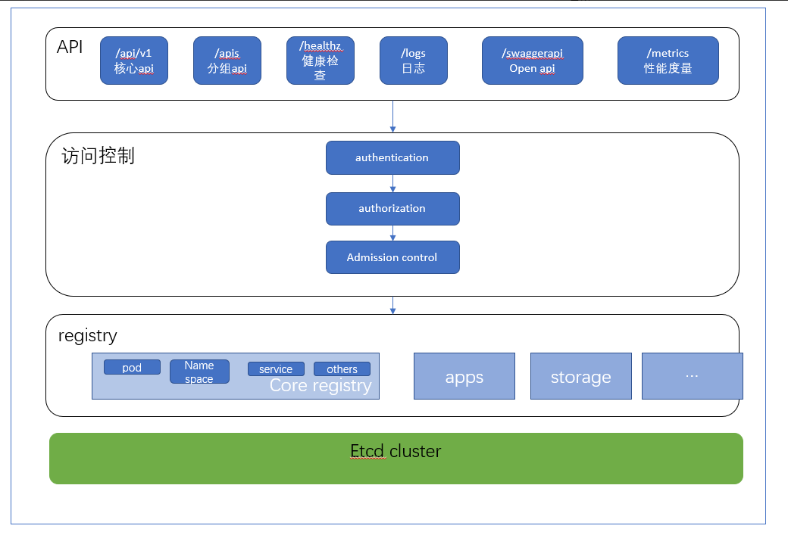
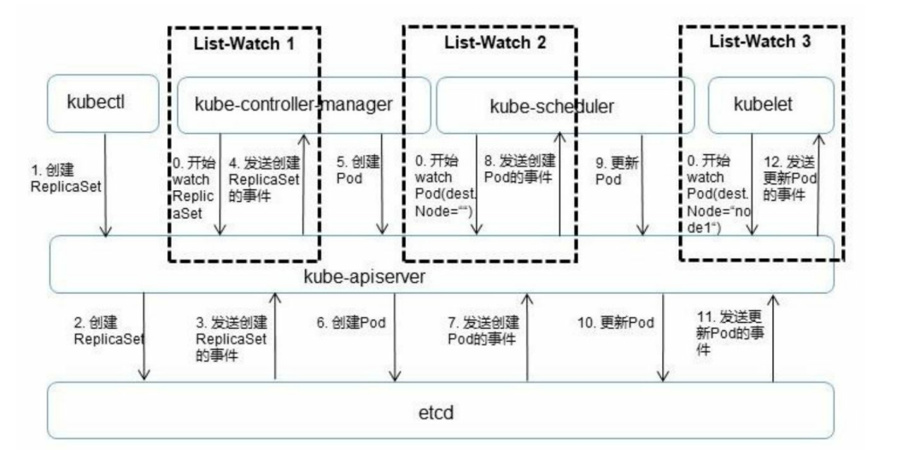
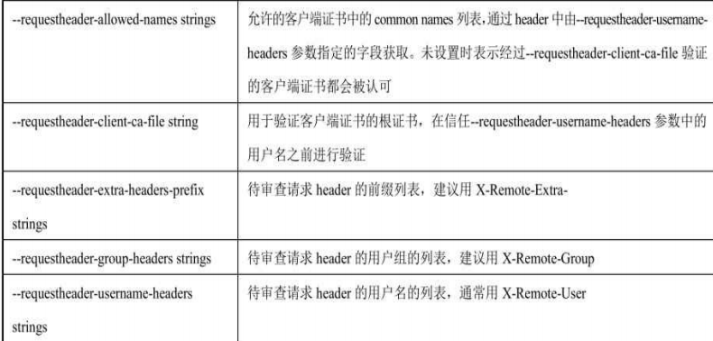

## ApiServer

Kubernetes API Server的核心功能是提供Kubernetes各类 资源对象（如Pod、RC、Service等）的增、删、改、查及Watch等HTTP Rest接口，成为集群内各个功能模块之间数据交互和通信的中心枢纽， 是整个系统的数据总线和数据中心。除此之外，它还有以下一些功能特 性：

- 是集群管理的API入口。 
- 是资源配额控制的入口。 
- 提供了完备的集群安全机制。

 Api server 是通过kube-apiserver 进程来提供服务的. 默认情况下在本机8080端口提供 rest 服务(--insecure-port), 也可以启用HTTPS 安全端口 (--secure-port=6443) 


### ApiServer 的 整体架构图如下：

 


（1）API层：主要以REST方式提供各种API接口，除了有 Kubernetes资源对象的CRUD和Watch等主要API，还有健康检查、UI、 日志、性能指标等运维监控相关的API。Kubernetes从1.11版本开始废弃 Heapster监控组件，转而使用Metrics Server提供Metrics API接口，进一 步完善了自身的监控能力。 

（2）访问控制层：当客户端访问API接口时，访问控制层负责对用户进行认证、授权，核准用户对Kubernetes资源对象的访问权 限，然后根据配置的各种资源访问的准入控制（Admission Control），判断是否允许访问。 

（3）注册表层：Kubernetes把所有资源对象都保存在注册表 （Registry）中，  registry 中的各种资源对象 都定义对象类型, 如何创建资源对象, 如何转换不同版本, 以及如何将资源编码和解码为json 或protobuf 格式进行存储. 

（4）etcd据库（K、V键值存储）：用于持久化存储Kubernetes资源对象。etcd的watch API接口对于API Server来说至关重要，因为通过这个 接口，API Server 创新性地设计了List-Watch这种高性能的资源对象实 时同步机制。


### ApiServer List-Watch机制

解读 API Server中资源对象的List-Watch机制。图5.3以一个完整的Pod调度过程为 例，对API Server的List-Watch机制进行说明。



这里先说明一下 所谓的List-Watch机制，就比如说你在程序中添加了一个监听事件 ，当事件发生的时候，程序会回调执行你的事件代码，从而达到你的需求

0、通过 api-server的list-watch机制监听对应的资源事件

- 当 controller-manager 启动后，会通过 api-server的list-watch 机制监听 rs、rc、等对应资源的创建
- 当 scheduler启动后，会通过api-server的list-watch机制监听 


1、 户通过kubectl命名发起请求创建一个 Replicaset对象 

2、apiserver 收到创建请求后，通过对应的kubeconfig进行验证，验证通过后将yaml 格式的资源文件解析为 json或者是protobuf 存储到 etcd中，

3、api-server 通过watch api监听到 etcd中replicaset的创建资源事件，通过内部的事件队列派发 replicaset创建事件

4、 controller通过list-watch机制,监测发现新的replicaset,将该资源加入到内部工作队列,

5、 controller-manager 发现该资源没有关联的pod, 启用replicaset controller 调用api-server 创建 相关pod资源。

6、api-server接收到 请求，将pod资源更新存储到 etcd

7、api-server 通过watch api监听到 etcd中pod的创建资源事件，通过内部的事件队列派发 pod 创建事件

8、 scheduler通过list-watch机制,监测发现新的pod, 经过预选与优选策略来为 node 节点 进行打分,  将pod绑定(binding)到合适的主机 

10、scheduler 内部决策完成后，将调度结果发送给apiverser，apiServer 更新 对应的pod资源

11、api-server 通过watch api监听到 etcd中的pod 调度完成事件，


### api-server 常用参数


#### 通用参数

- advertise-address-ip ：

  用于广播自己IP地址给集群的所有成员，在不指定该地址时使用--bind-address 定义的IP地址

- default-not-ready-toleration-seconds

  等待notReady：Execute 的toleraction 秒数，默认值为300，默认会给所有未设置toleration 的Pod 添加该设置

- default-unreachable-toleration-seconds

  等待unreachable:NoExecute 的 toleraction秒数，默认值为300，默认回 给所有未设置的toleration的Pod添加该设置

- feature-gates mapStringBool

  用于实验性质的特性开关组，每个开关以key=value的形式表示，可用开关包括（太多了，去官网查看）

- max-mutating-request-inflight

  设置同时处理的最大突变请求数量，默认值为200，超过该值将被拒绝，设置0表示无限制

- min-request-timeouut

- request-timeout

- target-ram-mb

  int 类型，API Server 的内存限制，单位为MB，常用于设置缓存大小


#### etcd 参数

- etcd-cafile

  设置连接etcd 用于校验的根证书

- etcd-certfile

  设置连接etcd的客户端证书

- etcd-keyfile

  设置连接etcd 的私钥

- etcd-servers

  设置 etcd server端的url列表，etcd 服务以 http://ip:port 格式表示

- storage-backend 

  string类型，设置持久化存储的类型，etcd2，etcd3，默认为etcd3

- storage-media-type

  设置持久化存储后端的介质类型，可以为protobuf 、json等等，默认为：application/vnd.kubernetes.protobuf

- watch-cache

  设置为true表示缓存watch，默认值为true

- watch-cache-szie 

  设置各资源对象watch缓存大小的列表，以逗号分隔，镍铬资源对象的设置格式为resource#size，当watch-cach被设置为true 生效


#### 安全服务相关参数

- bind-address

  kubernetes apiserver 在本地址的6443端口开启安全的HTTTPS服务，默认值为0.0.0.0

- cert-dir

  tls证书所在目录，一般通过 tls-private-key-file 和 tls-cert-file 来设置

- secure-port

  设置apiserver 使用的HTTPS 安全模式端口号，设置为0表示不启用HTTPS，默认值为6443

- tls-cert-file

  设置 apiserver 端证书文件路径，用于 client-> apiserver 的双向认证

- tls-private-key-file

  设置apiserver 端对应的私钥文件路径

- 


#### 授权相关参数

- authorization-mode

  设置到API Server 的安全访问的认证模式列表，以逗号分割，可选值包括：AlwaysDeny、AlwaysAllow、ADBC、WebHook，RBCA，，默认值为AlwaysAllow


#### 不安全相关参数

- port

  设置绑定的不安全的端口号

- insecure-port

  提供非安全认证访问的监听端口，默认值为8080


#### 准入控制参数

- disable-admission-plugins

  关闭的admission 准入插件

- enable-admission-plugins

  开启的admission 准入插件

- admission-control-config-file 

  控制规则的配置文件


#### 认证相关参数

- anonymous-auth 

  设置为true表示APIServer的安全端口可以接受匿名请求，不会被任何authentication 拒绝的请求将被标记为匿名请求，匿名请求的用户名为 system:anonymous，用户组为system:unauthenticationted

- client-ca-file

  指定用于认证客户端的CA根证书

- enable-bootstrap-token-auth

  设置在 TLS 认证引导时是否允许使用kube-system namespace 中类型为 bootstarp.kubernetes.io/token 的 secret




#### 日志参数

  "--logtostderr=false",

  "--log-dir=/var/log/kubernetes",

  "-v 4"


#### 其他参数

- allow-privileged

  设置为true时，kubernetes 将允许pod中运行拥有系统特权的容器应用，与docker run --privileged效果相同

- event-ttl

  kubernetes事件保存的时间，默认为1h0m0s

- kubelet-client-certificate

  用于TLS的客户端证书路径

- kubelet-client-key

  用于TLS的客户端key文件路径

- kubelet-preferred-address-types

  连接kubelet时，使用的节点地址类型（NoAddressTypes），默认值列表为[Hostname,InternalDNS,InternalIP,ExternalDNS,ExternalIP,LeagcyHostIP] 表示其中任一地址类型

- kubelet-timeout

  kubelet 执行操作的超时时间，默认值为5s

- proxy-client-cert-file

  用于在请求期间验证aaergator或者kube-apiserver 身份的客户端证书为念路径，将请求代理到用户api--server并调用webhook准入控制插件时，要求此证书在--request-client-ca-file 指定的文件中包含来自CA的签名，该CA发布在kube-system命名空间中名为extension-apiserver-authentication 的ConfigMap中

- proxy-client-key-file

  用与请求期间验证aggregator 或 kube-apiserver 身份的客户端私钥文件路径

- service-cluster-ip-range

  Service 的 ClusterIP(虚拟IP)池，例如 192.163.0.0， 这个IP 池不能与物理机所在的网络重合

- service-node-port-range

  Service 的NodePort 能使用的主机端口号范围，默认值为30000-32767，包括30000和 32767


#### API 相关参数

- runtime-config

  mapStringString，一组key=value 用于运行时的配置信息，apis/<groupVersion>/<resource> 可用于打开或关闭对某个API版本的支持，api/all 或者 api/legacy 特别用于支持所有版本的API 或支持旧版本的API

  


#### 审计相关参数

- audit--*

  具体查阅官方文档


#### 其他特性

- profiling

  设置为true表示打开性能分析功能，可以通过<host>:<port>/debug/pprof 地址查看程序栈、线程等系统信息，默认为true


#### 生产示例参数

```
"--authorization-mode=Node,RBAC",
  "--advertise-address=10.128.130.77",
  "--allow-privileged=true",
  "--client-ca-file=/etc/kubernetes/pki/ca.crt",
  "--disable-admission-plugins=PersistentVolumeLabel,LimitPodHardAntiAffinityTopology",
  "--event-ttl=24h0m0s",
  "--enable-admission-plugins=NodeRestriction",
  "--enable-bootstrap-token-auth=true",
  "--etcd-cafile=/etc/kubernetes/pki/etcd/ca.crt",
  "--etcd-certfile=/etc/kubernetes/pki/apiserver-etcd-client.crt",
  "--etcd-keyfile=/etc/kubernetes/pki/apiserver-etcd-client.key",
  "--etcd-servers=https://10.128.130.77:2379,https://10.128.130.78:2379,https://10.128.130.79:2379",
  "--feature-gates=PodPriority=false",
  "--kubelet-client-certificate=/etc/kubernetes/pki/apiserver-kubelet-client.crt",
  "--kubelet-client-key=/etc/kubernetes/pki/apiserver-kubelet-client.key",
  "--kubelet-preferred-address-types=InternalIP,ExternalIP,Hostname",
  "--logtostderr=false",
  "--log-dir=/var/log/kubernetes",
  "--proxy-client-cert-file=/etc/kubernetes/pki/front-proxy-client.crt",
  "--proxy-client-key-file=/etc/kubernetes/pki/front-proxy-client.key",
  "--port=0",
  "--requestheader-allowed-names=front-proxy-client",
  "--requestheader-client-ca-file=/etc/kubernetes/pki/front-proxy-ca.crt",
  "--requestheader-extra-headers-prefix=X-Remote-Extra-",
  "--requestheader-group-headers=X-Remote-Group",
  "--requestheader-username-headers=X-Remote-User",
  "--secure-port=6443",
  "--service-account-key-file=/etc/kubernetes/pki/sa.pub",
  "--service-cluster-ip-range=10.178.64.0/19",
  "--tls-cert-file=/etc/kubernetes/pki/apiserver.crt",
  "--tls-private-key-file=/etc/kubernetes/pki/apiserver.key",
  "-v=4
```

