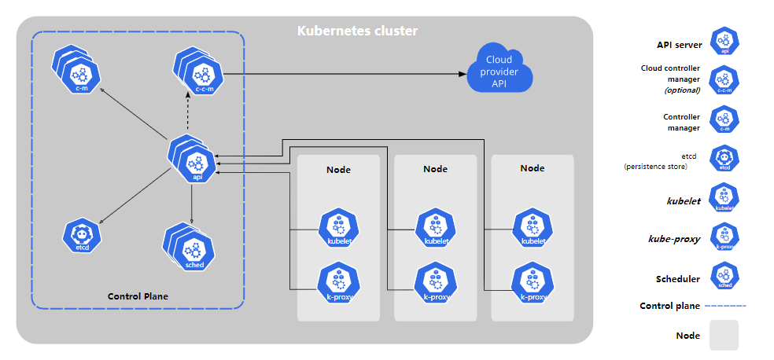

## Kubernetes 组件

一个 Kubernetes 集群由多个master 和 多个slave 节点组成， 我们在节点上运行 Kubernetes 所管理的容器化应用 ，kubernetes 集群至少有一个工作节点（并不是必须的，下面解释）

kuberntes节点分为控制平面 和工作节点，控制平面主要负责管理集群中的工作节点和Pod，为集群提供故障转移和高可用性。

 下图是 kubernetes 集群的整体概览：

 

### 控制平面的组件 

控制平面负责控制并使得整个集群正常运转。 回顾一下， 控制平面包含如下组 件： 

#### Etcd

etcd 是兼具一致性和高可用性的键值数据库，可以作为保存 Kubernetes 所有集群数据的后台数据库。 


#### API Server


#### Scheduler

控制平面组件，负责监视新创建的、未指定运行[节点（node）](https://kubernetes.io/zh/docs/concepts/architecture/nodes/)的 [Pods](https://kubernetes.io/docs/concepts/workloads/pods/pod-overview/)，选择节点让 Pod 在上面运行。

调度决策考虑的因素包括单个 Pod 和 Pod 集合的资源需求、硬件/软件/策略约束、亲和性和反亲和性规范、数据位置、工作负载间的干扰和最后时限


#### Controller Manager

在主节点上运行 [控制器](https://kubernetes.io/zh/docs/concepts/architecture/controller/) 的组件。

从逻辑上讲，每个[控制器](https://kubernetes.io/zh/docs/concepts/architecture/controller/)都是一个单独的进程， 但是为了降低复杂性，它们都被编译到同一个可执行文件，并在一个进程中运行。

这些控制器包括:

- 节点控制器（Node Controller）: 负责在节点出现故障时进行通知和响应
- 副本控制器（Replication Controller）: 负责为系统中的每个副本控制器对象维护正确数量的 Pod
- 端点控制器（Endpoints Controller）: 填充端点(Endpoints)对象(即加入 Service 与 Pod)
- 服务帐户和令牌控制器（Service Account & Token Controllers）: 为新的命名空间创建默认帐户和 API 访问令牌


#### Cloud Controller Manager

 云控制器管理器是指嵌入特定云的控制逻辑的 [控制平面](https://kubernetes.io/zh/docs/reference/glossary/?all=true#term-control-plane)组件。 云控制器管理器允许您链接聚合到云提供商的应用编程接口中， 并分离出相互作用的组件与您的集群交互的组件 


### Node 节点组件

#### Kubelet 

一个在集群中每个[节点（node）](https://kubernetes.io/zh/docs/concepts/architecture/nodes/)上运行的代理。 它保证[容器（containers）](https://kubernetes.io/zh/docs/concepts/overview/what-is-kubernetes/#why-containers)都 运行在 [Pod](https://kubernetes.io/docs/concepts/workloads/pods/pod-overview/) 中。

kubelet 接收一组通过各类机制提供给它的 PodSpecs，确保这些 PodSpecs 中描述的容器处于运行状态且健康。 kubelet 不会管理不是由 Kubernetes 创建的容器

####  Kubelet服务代理( kube-proxy) 

[kube-proxy](https://kubernetes.io/zh/docs/reference/command-line-tools-reference/kube-proxy/) 是集群中每个节点上运行的网络代理， 实现 Kubernetes [服务（Service）](https://kubernetes.io/zh/docs/concepts/services-networking/service/) 概念的一部分。

kube-proxy 维护节点上的网络规则。这些网络规则允许从集群内部或外部的网络会话与 Pod 进行网络通信。

如果操作系统提供了数据包过滤层并可用的话，kube-proxy 会通过它来实现网络规则。否则， kube-proxy 仅转发流量本身。

#### 容器运行时(Docker、rkt或者其他） 

容器运行环境是负责运行容器的软件。

Kubernetes 支持多个容器运行环境: [Docker](https://kubernetes.io/zh/docs/reference/kubectl/docker-cli-to-kubectl/)、 [containerd](https://containerd.io/docs/)、[CRI-O](https://cri-o.io/#what-is-cri-o) 以及任何实现 [Kubernetes CRI (容器运行环境接口)](https://github.com/kubernetes/community/blob/master/contributors/devel/sig-node/container-runtime-interface.md)。

## 

### 常用插件

#### DNS

尽管其他插件都并非严格意义上的必需组件，但几乎所有 Kubernetes 集群都应该 有[集群 DNS](https://kubernetes.io/zh/docs/concepts/services-networking/dns-pod-service/)， 因为很多示例都需要 DNS 服务。

集群 DNS 是一个 DNS 服务器，和环境中的其他 DNS 服务器一起工作，它为 Kubernetes 服务提供 DNS 记录。

Kubernetes 启动的容器自动将此 DNS 服务器包含在其 DNS 搜索列表中

#### Dashbord

 是Kubernetes 集群的通用的、基于 Web 的用户界面。 它使用户可以管理集群中运行的应用程序以及集群本身并进行故障排除 

#### Mertrics Server

 将关于容器的一些常见的时间序列度量值保存到一个集中的数据库中，并提供用于浏览这些数据的界面 

#### Clustor log

 机制负责将容器的日志数据 保存到一个集中的日志存储中，该存储能够提供搜索和浏览接口。 


kuberntes 控制平台也就是所谓的master 节点  主要由，etcd、api-server、controller-manager、sheduler 组成。

kubernetes 工作节点主要由 kubelet 与 kube-proxy组成。其实不管在 控制平面 或者是 工作节点，只要是kubernetes所管控的宿主机节点，都有 kubelet 与 kubeproxy 。

下面从 kubernetes一主三从的 集群节点上  查看下 kubeproxy 的运行状态：

```sh
[root@k8s-master ~]# kubectl get ds
NAME              DESIRED   CURRENT   READY   UP-TO-DATE   AVAILABLE   NODE SELECTOR            AGE
kube-flannel-ds   4         4         4       4            4           <none>                   93d
kube-proxy        4         4         4       4            4           kubernetes.io/os=linux   93d
```

```sh
[root@k8s-master ~]# kubectl get po -l k8s-app=kube-proxy -owide
NAME               READY   STATUS    RESTARTS   AGE     IP              NODE         NOMINATED NODE   READINESS GATES
kube-proxy-hzxfs   1/1     Running   0          93d     192.168.1.116   k8s-master   <none>           <none>
kube-proxy-t4v8v   1/1     Running   0          93d     192.168.1.197   k8s-slave2   <none>           <none>
kube-proxy-xl99r   1/1     Running   0          93d     192.168.1.196   k8s-slave1   <none>           <none>
kube-proxy-z2spn   1/1     Running   0          5d22h   192.168.1.127   k8s-slave3   <none>           <none>
```

