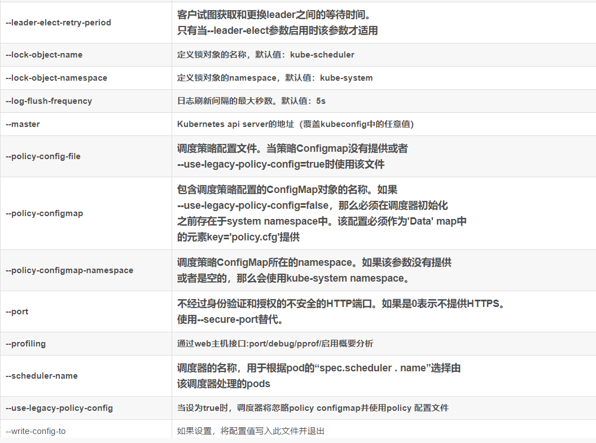

# kube-scheduler

scheduler 主要负责当pod 创建完成后，根据优选、预选策略调度至某一个节点

## Scheduler配置 参数

### 通用参数

下面是Kube-scheduler version 1.12.0的所有配置，其中黄底的为不建议配置的Flag，高亮加粗的是我认为需要注意的Flag。

### scheduler 生产配置

- --feature-gates=PodPriority=false: 将PodPriority 预选策略设置为false
- --policy-configmap：设置相关的调度策略
- --kubeconfig：接入kubernetes集群的配置文件
- --leader-elect=true
- --log-dir=/var/log/kubernetes：配置日志路径
- --secure-port=10259
- --port=0 ：关闭不安全的http端口
- --secure-port=10259 设置连接kube-scheduler 的安全端口
- -v ：设置日志等级

## scheduler 调度过程

## 调度策略

### 优选策略

### 预选策略

