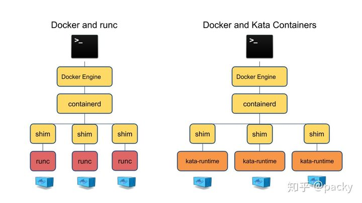
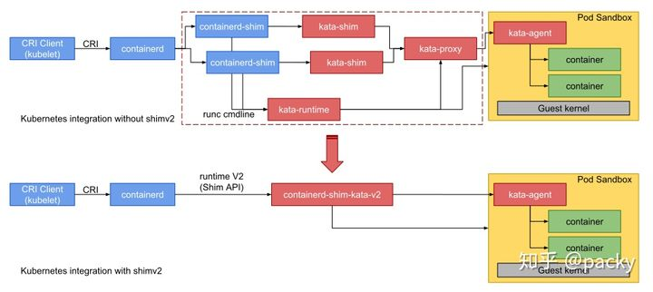

# K8s-katacontainer 实践

转自：https://zhuanlan.zhihu.com/p/109256949

最近有个项目需要考虑安全容器，因此先调研下 kata contaienr，尝尝鲜

## Kata container 简介

Kata Container 是两个现有的开源项目合并：Intel Clear Containers和Hyper runV。

Intel Clear Container项目的目标是通过英特尔®虚拟化技术（VT）解决容器内部的安全问题，并且能够将容器作为轻量级虚拟机（VM）启动，提供了一个可选的运行时间，专注于性能（<100ms启动时间），可与Kubernetes 和Docker 等常用容器环境互操作。英特尔®Clear Container表明，安全性和性能不必是一个折衷，将硬件隔离的安全性与容器的性能可以兼得。

hyper runV优先于技术无关支持许多不同的CPU架构和管理程序。

### 容器安全

使用Docker轻量级的容器时，最大的问题就是会碰到安全性的问题，其中几个不同的容器可以互相的进行攻击，如果把这个内核给攻掉了，其他所有容器都会崩溃。如果使用KVM等虚拟化技术，会完美解决安全性的问题，但响应的性能会受到一定的影响。

单单就Docker来说，安全性可以概括为两点： - 不会对主机造成影响 - 不会对其他容器造成影响

所以安全性问题90%以上可以归结为隔离性问题。而Docker的安全问题本质上就是容器技术的安全性问题，这包括共用内核问题以及Namespace还不够完善的限制： 1. /proc、/sys等未完全隔离 2. Top, free, iostat等命令展示的信息未隔离 3. Root用户未隔离 4. /dev设备未隔离 5. 内核模块未隔离 6. SELinux、time、syslog等所有现有Namespace之外的信息都未隔离 当然，镜像本身不安全也会导致安全性问题。

### kata 隔离技术

我们都知道 Docker 等一类的容器使用 Cgroup 进行资源限制，使用 linux 的 namespace 机制对容器进行隔离，但在实际运行中，仍是由宿主机向容器直接提供网络、存储、计算等资源，虽然性能损失很小，但存在一定的安全问题。

Kata Containers是一个开放源代码社区，致力于通过轻量级虚拟机来构建安全的容器运行时，这些虚拟机的感觉和性能类似于容器，但是使用硬件虚拟化技术作为第二防御层，可以提供更强的工作负载隔离。

kata 底层实现了Intel Clear Containers的最佳部分与Hyper.sh RunV合并，并进行了扩展，以包括对主要架构的支持，包括x86_64之外的AMD64，ARM，IBM p系列和IBM z系列。

Kata Containers还支持多个虚拟机管理程序，包括QEMU，NEMU和Firecracker，并与其他容器化项目集成。

> QEMU 一种虚拟机，与KVM相似，但KVM 是硬件辅助的虚拟化技术，主要负责 比较繁琐的 CPU 和内存虚拟化，而 Qemu 则负责 I/O 虚拟化

kata github: https://github.com/kata-containers/kata-containers/releases

kata install: https://github.com/kata-containers/kata-containers/blob/main/docs/install/container-manager/containerd/containerd-install.md

## 架构原理

kata 实际上是通过创建轻量级虚拟机实现容器之间的资源隔离，再在虚拟机中运行容器运行时，这样就使容器在专用内核中运行，提供网络，I / O和内存的隔离，并可以通过虚拟化VT扩展利用硬件强制隔离。提供安全性的同时，其仍然由很高的性能。

kata 包含的主要组件有两部分： - container runtime： 负责为每个 container 或 pod 创建QEMU*/KVM虚拟机，支持 [OCI 运行时规范](https://link.zhihu.com/?target=https%3A//github.com/opencontainers/runtime-spec)，可以以插件形式嵌入到 Docker 中作为底层的容器运行时；也**支持 K8s 的 CRI 接口**，可以与 CRI-O 和 containerd 集成 - agent ：在宿主机中用于管理容器和在这些容器中运行的进程。

### kata 与 kata-shim

在 Docker 引擎中，Docker 调用 containerd，containerd 通过 shim 调用 runc创建底层的容器，（之前在 深入理解container 篇中详细描述过此过程），若将kata 集成到 Docker 中时，containerd 则调用 kata 提供的 `kata-shim` 去创建 kata 容器运行时。



值得提的一点是，kata 现在正在努力推行 shimv2 接口，shimv2 主要影响了 K8s 调用 CRI 创建 pod 和容器。



借助shimv2，Kubernetes可以使用每个Pod一个shimv2 而不是2N + 1 个shim（每个容器和Pod沙箱本身的容器shim和kata shim）

### agent

容器进程由 agent 生成，agent 在虚拟机内部作为守护进程运行。

kata-agent使用 VIRTIO 串行或 VSOCK 接口在宿主机中运行gRPC服务器，QEMU在宿主机中通过暴露 socket 文件向外部提供链接。kata-runtime 使用 gRPC 协议与 agent 进行通信。该协议允许运行时将容器管理命令发送到 agent。该协议还用于在容器和管理引擎（例如Docker Engine）之间传输I/O流（stdout，stderr，stdin）。也就是说在容器中，包括 init 进程在内，所有与容器交互的命令以及 IO 均会通过 VIRTIO 或 VSOCK。

## K8s 集成 kata-container

### 准备过程

1. 硬件支持 首先节点需要支持以下四种任意一种cpu虚拟化技术
2. Intel VT-x technology
3. ARM Hyp mode
4. IBM Power Systems
5. IBM Z manframes

> 如果部署在VMware虚拟机中，需要在宿主机开启**嵌套虚拟化**的功能，开启步骤见链接 [https://blog.51cto.com/11434894/2389180?source=dra](https://link.zhihu.com/?target=https%3A//blog.51cto.com/11434894/2389180%3Fsource%3Ddra)

1. 软件依赖
2. 正常运行的 K8s 环境
3. containerd

### 安装 kata-container

执行以下脚本安装

```bash
source /etc/os-release
sudo yum -y install yum-utils
ARCH=$(arch)
BRANCH="${BRANCH:-master}"
sudo -E yum-config-manager --add-repo "http://download.opensuse.org/repositories/home:/katacontainers:/releases:/${ARCH}:/${BRANCH}/CentOS_${VERSION_ID}/home:katacontainers:releases:${ARCH}:${BRANCH}.repo"
sudo -E yum -y install kata-runtime kata-proxy kata-shim
```

> 注意：我在安装时，kata 刚刚发布了 1.11 alpha0 版本，此版本中依赖的 qume-vanilla 版本为 `4.1.1+git.99c5874a9b`，但是 repo 源中只有 `4.1.0+git.9e06029aea-6.1.x86_64`，因此在执行脚本之前，需要设置 BRANCH 环境变量: `export BRANCH='stable-1.10'`

安装完成之后，执行命令 `kata-runtime kata-check` 检查系统是否支持运行 kata runtime

```text
WARN[0000] modprobe insert module failed: modprobe: FATAL: Module vhost_vsock not found.
  arch=amd64 error="exit status 1" module=vhost_vsock name=kata-runtime pid=21060 source=runtime
ERRO[0000] kernel property not found                     arch=amd64 description="Host Support for Linux VM Sockets" name=vhost_vsock pid=21060 source=runtime type=module
System is capable of running Kata Containers
System can currently create Kata Containers
```

这里的error 有可能是我使用了VMware 嵌套虚拟化导致的，暂且放置。

### K8s 对接运行时更改为 containerd

1. 首先启用 containerd `bash systemctl enable containerd`

修改 containerd 的配置文件，`/etc/containerd/config.toml`，官网默认配置见链接：[https://github](https://link.zhihu.com/?target=https%3A//github). com/containerd/cri/blob/master/docs/config.md

需要注意的是：

- [plugins.cri] 条目下，可以配置 K8s sandbox 使用的镜像， 默认为`k8s.io/pause-amd64:3.2`
- containerd 1.3.2 版本以前，不支持非安全的 registry，也就是说拉镜像时使用的必须是 https 协议，自 己搭私有仓库的同学，可以升级到 1.3.3，并且增加条目 `toml [plugins."io.containerd.grpc.v1.cri".registry.mirrors."your registry".tls] insecure_skip_verify = true`

\2. 修改 kubelet 启动参数

```text
$ sudo mkdir -p  /etc/systemd/system/kubelet.service.d/ 
$ cat << EOF | sudo tee  /etc/systemd/system/kubelet.service.d/0-containerd.conf [Service]                                                  
Environment="KUBELET_EXTRA_ARGS=--container-runtime=remote --runtime-request-timeout=15m    --container-runtime-endpoint=unix:///run/containerd/containerd.sock" 
EOF 
```

\3. 重启 containerd 和 kubelet

```text
systemctl daemon-reload 
systemctl start containerd 
systemctl restart kubelet
```

### K8s 配置使用Kata

K8s 使用 Kata 有两种方式： - 使用 K8s untrusted_workload_runtime - 使用 K8s 的 RuntimeClass，这个在 1.12 版本作为alpha特性使用

### 使用 untrusted_workload_runtime

首先在 containerd 的配置文件中，增加条目

```yaml
# "plugins.cri.containerd.untrusted_workload_runtime" is a runtime to run untrusted workloads on it.
    [plugins.cri.containerd.untrusted_workload_runtime]
      # runtime_type is the runtime type to use in containerd e.g. io.containerd.runtime.v1.linux
      runtime_type = "io.containerd.kata.v2"
```

若使用的 kata 版本较低，不支持 shimV2，则使用条目

```yaml
[plugins.cri.containerd.untrusted_workload_runtime]
      # runtime_type is the runtime type to use in containerd e.g. io.containerd.runtime.v1.linux
      runtime_type = "io.containerd.runtime.v1.linux"

      # runtime_engine is the name of the runtime engine used by containerd.
      runtime_engine = "/usr/bin/kata-runtime"
```

然后重启 containerd `systemctl daemon-reload & systemctl restart containerd`

K8s 资源需要增加 annotation

```yaml
annotations:
   io.kubernetes.cri.untrusted-workload: "true"
```

例如：

```yaml
apiVersion: v1
kind: Pod
metadata:
  name: nginx-untrusted
  annotations:
    io.kubernetes.cri.untrusted-workload: "true"
spec:
  nodeName: k8s3
  containers:
  - name: nginx
    image: nginx
```

### 使用 RuntimeClass

这种模式下，相关软件版本需求如下： - Kata Container >= 1.5.0 - containerd >= 1.2.0 - K8s >= 1.12.0

在 Containerd 配置文件中配置相关条目

```yaml
[plugins.cri.containerd]
      no_pivot = false
    [plugins.cri.containerd.runtimes]
      [plugins.cri.containerd.runtimes.runc]
         runtime_type = "io.containerd.runc.v1"
         [plugins.cri.containerd.runtimes.runc.options]
           NoPivotRoot = false
           NoNewKeyring = false
           ShimCgroup = ""
           IoUid = 0
           IoGid = 0
           BinaryName = "runc"
           Root = ""
           CriuPath = ""
           SystemdCgroup = false
      [plugins.cri.containerd.runtimes.kata]
         runtime_type = "io.containerd.kata.v2"
      [plugins.cri.containerd.runtimes.katacli]
         runtime_type = "io.containerd.runc.v1"
         [plugins.cri.containerd.runtimes.katacli.options]
           NoPivotRoot = false
           NoNewKeyring = false
           ShimCgroup = ""
           IoUid = 0
           IoGid = 0
           BinaryName = "/usr/bin/kata-runtime"
           Root = ""
           CriuPath = ""
           SystemdCgroup = false
```

在 K8s 中创建 RuntimeClass

```yaml
apiVersion: node.k8s.io/v1beta1  # RuntimeClass is defined in the node.k8s.io API group
kind: RuntimeClass
metadata:
  name: kata  
handler: kata  # 这里与containerd配置文件中的 [plugins.cri.containerd.runtimes.{handler}] 匹配
```

创建pod

```yaml
apiVersion: v1
kind: Pod
metadata:
  name: kata-nginx
spec:
  runtimeClassName: kata
  containers:
    - name: nginx
      image: nginx
      ports:
      - containerPort: 80
```

通过`kata-runtime list` 可以查看创建出来的 container

```au
ID                                                                 PID         STATUS      BUNDLE                                                                                                                  CREATED                          OWNER
5a512bfa19cd166c6cc6411dd7e1d20cc41490d0f2df064adab7871c9656a058   -1          running     /run/containerd/io.containerd.runtime.v2.task/k8s.io/5a512bfa19cd166c6cc6411dd7e1d20cc41490d0f2df064adab7871c9656a058   2020-02-26T09:49:43.743162591Z   #0
432628537c5d5606707e225869846542c68cb7406992dcf55a4b48a494f333b8   -1          running     /run/containerd/io.containerd.runtime.v2.task/k8s.io/432628537c5d5606707e225869846542c68cb7406992dcf55a4b48a494f333b8   2020-02-26T09:49:47.928499707Z   #0
```

