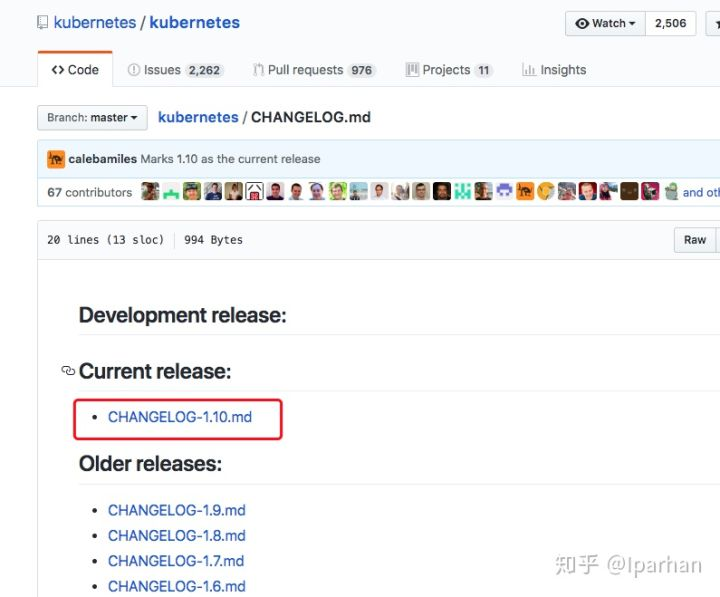
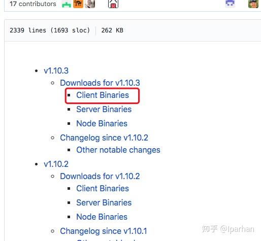
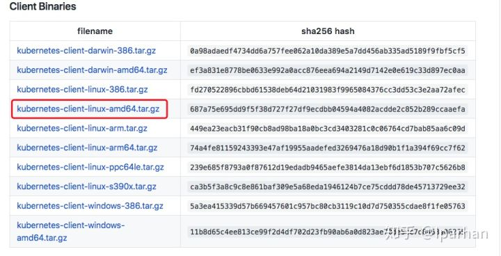
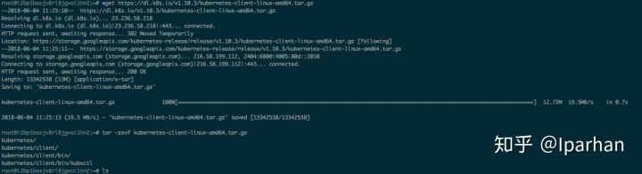
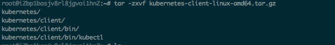
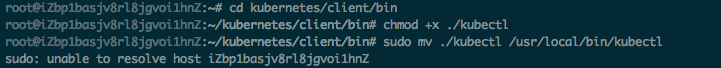
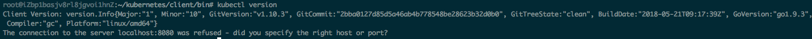

## 安装kubectl 客户端


备注：由于kubernets里面的kubectl提供的下载地址是google下面的所以国内显然不能下载，那我们可以找到国内的地址便利下载。

这里不会详细介绍什么是Kubectl 请自行百度。
步骤：
1.进去这个地址然后选择一个版本(推荐最新版本)
https://github.com/kubernetes/kubernetes/tree/master/CHANGELOG


2.选择一个最新版本




3.选择 Client Binaries 也就是所谓的kubectl




4.选择点进去下载也行或者复制下载链接在终端下载也行。(我选择的事在终端下载)




5.根据上一步骤复制的下载链接下载完了然后解压




6.解压




7.给权限




8.如果能看到这个就说明安装成功。




9、复制k8s的kubeconfig文件内容到：

~/.kube/config 文件

执行命令，查看是否安装成功

kubectl version

```shell
Client Version: version.Info{
    Major:"1",
    Minor:"18", 
    GitVersion:"v1.18.0",
    GitCommit:"9e991415386e4cf155a24b1da15becaa390438d8", 
    GitTreeState:"clean", 
    BuildDate:"2020-03-25T14:58:59Z", 
    GoVersion:"go1.13.8", 
    Compiler:"gc", 
    Platform:"linux/amd64"
}
Server Version: version.Info{
    Major:"1", 
    Minor:"13+", 
    GitVersion:"v1.13.13-beta.0.18+d47579bec53f66", 
    GitCommit:"d47579bec53f6642be3078179a0f413802d8b9ab", 
    GitTreeState:"clean", 
    BuildDate:"2020-04-14T08:34:15Z", 
    GoVersion:"go1.11.13", 
    Compiler:"gc", 
    Platform:"linux/amd64"
}
```

