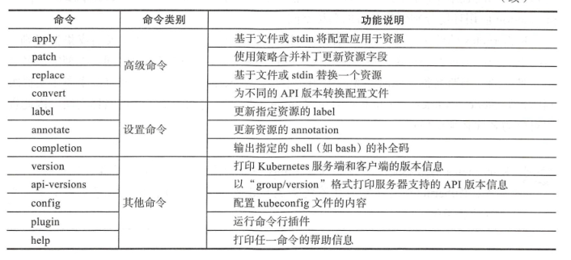

## K8s 常用命令

### kubeadm 常用命令

　kubeadm config upload from-file：由配置文件上传到集群中生
成ConfigMap。

- kubeadm  config  upload  from-flags：由配置参数生成
  ConfigMap。
- kubeadm config view：查看当前集群中的配置值。
- kubeadm config print init-defaults：输出kubeadm init默认参数文
  件的内容。
- 　kubeadm config print join-defaults：输出kubeadm join默认参数
  文件的内容。
- 　kubeadm config migrate：在新旧版本之间进行配置转换。
- 　kubeadm config images list：列出所需的镜像列表。
- 　kubeadm config images pull：拉取镜像到本地


### K8s 核心服务配置


### Kubectl 命令

kubectl命令行的语法如下：

```shell
kubectl [command] [TYPE] [NAME] [flags]
```

- command：子命令，用于操作Kubernetes集群资源对象的命令，例如create、delete、describe、get、apply等。

- TYPE：资源对象的类型，区分大小写，能以单数、复数或者简写形式表示。例如以下3种TYPE是等价的。

  ```sh
  kubectl get pod pod1
  kubectl get pods pod1
  kubectl get po pod1
  ```

  

- NAME：资源对象的名称，区分大小写。如果不指定名称，系统则将返回属于TYPE的全部对象的列表，例如$ kubectl get pods将返回所有Pod的列表（详细见资源配置i清单）

- flags：kubectl子命令的可选参数，例如使用“-s”指定APIServer的URL地址而不用默认值


### Kubectl 子命令





### Kubectl 参数列表

kubectl命令行的公共启动参数如表2.11所示。


--sort-by=<json_path> 按照特定的json资源排序

--export 将 对象以资源文件的形式导出

每个子命令（如create、delete、get等）还有特定的flags参数，可以
通过$ kubectl[command] --help命令进行查看。

示例如下：

以特定的排序格式显示Pod的信息：

```sh
[root@k8s-master ~]# kubectl get pod -o custom-columns=NAME:.metadata.name,RSRC:metadata.labels --sort-by=.metadata.name
NAME            RSRC
test-rc-9mchb   map[app:myweb]
test-rc-fv7fq   map[app:myweb]
test-rc-g2vjk   map[app:myweb]
test-rc-p797l   map[app:myweb]
test-rc-t4flv   map[app:myweb]
```


### Kubectl 参数格式

kubectl命令可以用多种格式对结果进行显示，输出的格式通过-o参数指定：

```sh
kubectl [command] [TYPE] [name] -o=<output_format>
```

| 输出格式            | 格式说明                            |
| ------------------- | ----------------------------------- |
| -o wide             | 显示资源额外信息                    |
| -o name             | 仅打印资源名称                      |
| -o yaml             | YAML 格式化输出                     |
| -o json             | json 格式输出API 对象信息           |
| -o go-template      | 以自定义的go 模板格式话输出模板信息 |
| -o custom-templates | 自定义输出字段信息                  |

示例如下：

以自定义列名显示Pod的信息：

```sh
[root@k8s-master ~]# kubectl get pod -o custom-columns=NAME:.metadata.name,RSRC:metadata.labels
NAME            RSRC
test-rc-9mchb   map[app:myweb]
test-rc-fv7fq   map[app:myweb]
test-rc-g2vjk   map[app:myweb]
test-rc-p797l   map[app:myweb]
test-rc-t4flv   map[app:myweb]
```

