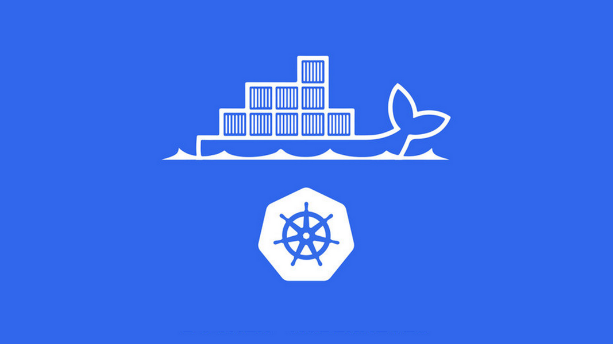
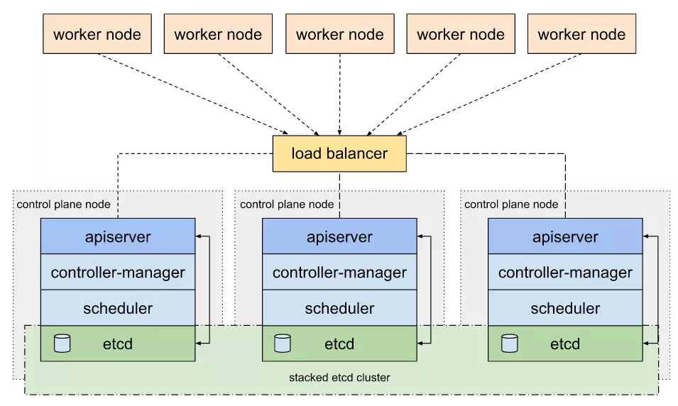
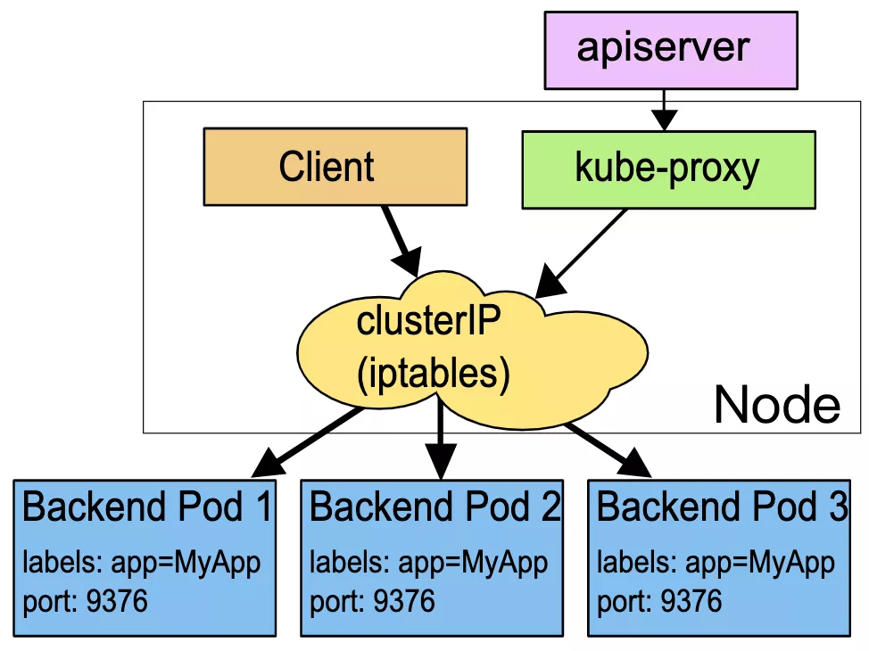
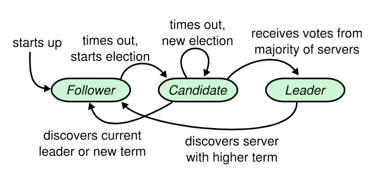
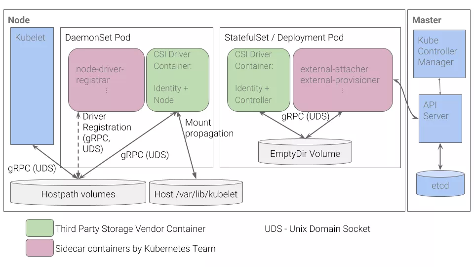
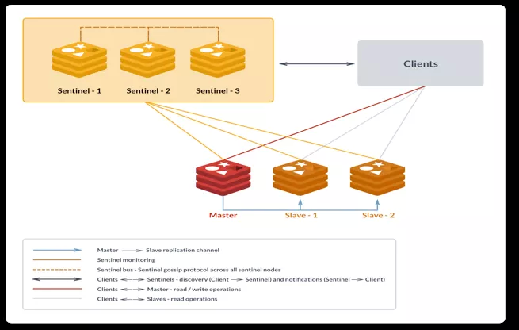
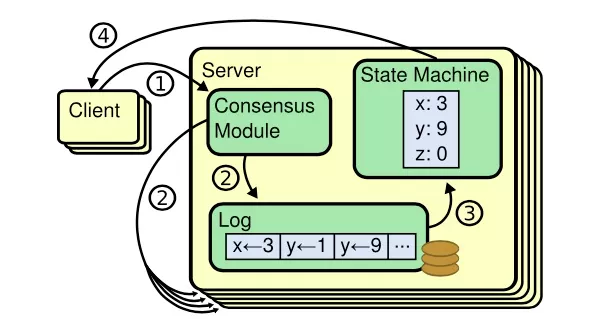

## 节点宕机

当节点发生宕机时，kubernetes 会自动为节点添加 一下污点，以及容忍时间 5min

```
node.kubernetes.io/unreachable:NoExecute
node.kubernetes.io/unreachable:NoSchedule
```

在五分种后将该节点的所有Pod 重新调度，但是在该节点的Pod 信息将不会被处理，会一直处于 Termicated 状态

# 宕机处理：Kubernetes 集群高可用实战总结


- 云加社区


**2020 年 8 月 28 日

**[架构](https://www.infoq.cn/topic/architecture)[测试](https://www.infoq.cn/topic/Testing)[容器](https://www.infoq.cn/topic/container)[最佳实践](https://www.infoq.cn/topic/best-practices)




> **导语** | 在企业生产环境，Kubernetes 高可用是一个必不可少的特性，其中最通用的场景就是如何在 Kubernetes 集群宕机一个节点的情况下保障服务依旧可用。本文对在该场景下实现集群和应用高可用过程中遇到的各种问题进行了梳理和总结，希望与大家一同交流。文章作者，腾讯云架构服务研发工程师。


## 一、整体架构

### 1. control plane node

管理节点采用 kubeadm 搭建的 3 节点标准高可用方案：Stacked etcd topology [1].





该方案中，所有管理节点都部署 kube-apiserver，kube-controller-manager，kube-scheduler，以及 etcd 等组件。


kube-apiserver 均与本地的 etcd 进行通信，etcd 在三个节点间同步数据。而 kube-controller-manager 和 kube-scheduler 也只与本地的 kube-apiserver 进行通信(或者通过 LB 访问)。


kube-apiserver 前面顶一个 LB；work 节点 kubelet 以及 kube-proxy 组件对接 LB 访问 apiserver 。


在这种架构中，如果其中任意一个 master 节点宕机了，由于 kube-controller-manager 以及 kube-scheduler 基于 **Leader Election Mechanism [2]**实现了高可用，可以认为管理集群不受影响，相关组件依旧正常运行(在分布式锁释放后)。


### 2. work node

工作节点上部署应用，应用按照反亲和[3]部署多个副本，使副本调度在不同的 work node 上，这样如果其中一个副本所在的母机宕机了，理论上通过 Kubernetes service 可以把请求切换到另外副本上，使服务依旧可用。


## 二、网络

针对上述架构，我们来分析一下实际环境中节点宕机对网络层面带来的影响。


### 1. service backend 剔除

正如上文所述，工作节点上应用会按照反亲和部署。这里我们讨论最简单的情况：例如一个 nginx 服务，部署了两个副本，分别落在 work node1 和 work node2 上。


集群中还部署了依赖 nginx 服务的应用 A，如果某个时刻 work node1 宕机了，此时应用 A 访问 nginx service 会有问题吗？


这里的答案是：会有问题。因为 service 不会马上剔除掉宕机上对应的 nginx pod，同时由于 service 常用的 **iptables 代理模式[4]** 没有实现 **retry with another backend [5]** 特性，所以在一段时间内访问会出现间歇性问题(如果请求轮询到挂掉的 nginx pod 上)，也就是说会存在一个访问失败间隔期（ipvs 模式具备健康检查能力，能够自动从 ipvs 规则中及时剔除故障的 pod，具备更高的可用性）。





这个间隔期取决于 service 对应的 endpoint 什么时候踢掉宕机的 pod。


之后，kube-proxy 会 watch 到 endpoint 变化，更新对应的 iptables 规则，使 service 访问后端列表恢复正常，也就是踢掉该 pod 。


要理解这个间隔，我们首先需要弄清楚 Kubernetes 节点心跳的概念：


每个 node 在 kube-node-lease namespace 下会对应一个 Lease object，kubelet 每隔 node-status-update-frequency 时间(默认 10s)会更新对应 node 的 Lease object 。


node-controller 会每隔 node-monitor-period 时间(默认 5s )检查 Lease object 是否更新，如果超过 node-monitor-grace-period 时间(默认 40s)没有发生过更新，则认为这个 node 不健康，会更新 NodeStatus (ConditionUnknown)。


如果这样的状态在这之后持续了一段时间(默认 5 mins)，则会驱逐(evict)该 node 上的 pod 。


对于母机宕机的场景，node controller 在 node-monitor-grace-period 时间段没有观察到心跳的情况下，会更新 NodeStatus (ConditionUnknown)，之后 endpoint controller 会从 endpoint backend 中踢掉该母机上的所有 pod，最终服务访问正常，请求不会落在挂掉的 pod 上。


也就是说在母机宕机后，在 node-monitor-grace-period 间隔内访问 service 会有间歇性问题，我们可以通过调整相关参数来缩小这个窗口期，如下：


```
(kubelet)node-status-update-frequency：default 10s(kube-controller-manager)node-monitor-period：default 5s(kube-controller-manager)node-monitor-grace-period：default 40s- Amount of time which we allow running Node to be unresponsive before marking it unhealthy. Must be N times more than kubelet's nodeStatusUpdateFrequency, where N means number of retries allowed for kubelet to post node status.- Currently nodeStatusUpdateRetry is constantly set to 5 in kubelet.go
```

复制代码


### 2. 连接复用

对于使用长连接访问的应用来说(默认使用都是 tcp 长连接，无论 HTTP/2 还是 HTTP/1 )，在没有设置合适请求 timeout 参数的情况下可能会出现 15mins 的超时问题，详情见 **Kubernetes Controller 高可用诡异的 15mins 超时[6]**。


通过对上述链接内容的分析，我们可以知道是 TCP 的 ARQ 机制导致了 Controller 在母机宕机后 15mins 内一直超时重试，超时重试失败后，tcp socket 关闭，应用重新创建连接。


这个问题本质上不是 Kubernetes 的问题，而是应用在复用 tcp socket (长连接)时没有考虑设置超时，导致了母机宕机后，tcp socket 没有及时关闭，服务依旧使用失效连接导致异常。


要解决这个问题，可以从两方面考虑：


第一，应用层使用超时设置或者健康检查机制，从上层保障连接的健康状态，作用于该应用。


第二，底层调整 TCP ARQ 设置(/proc/sys/net/ipv4/tcp_retries2)，缩小超时重试周期，作用于整个集群。


由于应用层的超时或者健康检查机制无法使用统一的方案，这里只介绍如何采用系统配置的方式规避无效连接，如下：


```
# 0.2+0.4+0.8+1.6+3.2+6.4+12.8+25.6+51.2+102.4 = 222.6s$ echo 9 > /proc/sys/net/ipv4/tcp_retries2
```

复制代码


另外对于推送类的服务，比如 Watch，在母机宕机后，可以通过 tcp keepalive 机制来关闭无效连接。这也是上面测试 cluster-coredns-controller 时其中一个连接 5 分钟(30+30*9=300s)断开的原因：


```
# 30 + 30*5 = 180s$ echo 30 >  /proc/sys/net/ipv4/tcp_keepalive_time$ echo 30 > /proc/sys/net/ipv4/tcp_keepalive_intvl$ echo 5 > /proc/sys/net/ipv4/tcp_keepalive_probes
```

复制代码


注意：在 Kubernetes 环境中，容器不会直接继承母机 tcp keepalive 的配置(可以直接继承母机 tcp 超时重试的配置)，因此必须通过一定方式进行适配。这里介绍其中一种方式，添加 initContainers 使配置生效：


```
- name: init-sysctl    image: busybox    command:  - /bin/sh    - -c    - |    sysctl -w net.ipv4.tcp_keepalive_time=30    sysctl -w net.ipv4.tcp_keepalive_intvl=30    sysctl -w net.ipv4.tcp_keepalive_probes=5  securityContext:    privileged: true
```

复制代码


通过上述的 TCP keepalive 以及 TCP ARQ 配置，我们可以将无效连接断开时间缩短到 4 分钟以内，一定程度上解决了母机宕机导致的连接异常问题。不过最好的解决方案是在应用层设置超时或者健康检查机制及时关闭底层无效连接。


## 三、节点驱逐

对节点驱逐需要分应用和存储两方面进行分析：


### 1. 应用相关

pod 驱逐可以使服务自动恢复副本数量。如上所述，node controller 会在节点心跳超时之后一段时间(默认 5 mins)驱逐该节点上的 pod，这个时间由如下参数决定：


```
(kube-apiserver)default-not-ready-toleration-seconds：default 300(kube-apiserver)default-unreachable-toleration-seconds：default 300
```

复制代码


> Kubernetes automatically adds a toleration for
>
> node.kubernetes.io/not-ready and node.kuber-
>
> netes.io/unreachable with toleration-
>
> Seconds=300,These automatically-added
>
> tolerations mean that Pods remain bound
>
> to Nodes for 5 minutes after one of these
>
> problems is detected.
>
> 摘自 Kubernetes 官方文献


引用中涉及到两个 **tolerations [7]** ：


- node.kubernetes.io/not-ready: Node is not ready. This corresponds to the NodeCondition Ready being “False”;
- node.kubernetes.io/unreachable: Node is unreachable from the node controller. This corresponds to the NodeCondition Ready being “Unknown”.


```
tolerations:  - effect: NoExecute    key: node.kubernetes.io/not-ready    operator: Exists    tolerationSeconds: 300  - effect: NoExecute    key: node.kubernetes.io/unreachable    operator: Exists    tolerationSeconds: 300
```

复制代码


当节点心跳超时( ConditionUnknown )之后，node controller 会给该 node 添加如下 taints ：


```
spec:  ...  taints:  - effect: NoSchedule    key: node.kubernetes.io/unreachable    timeAdded: "2020-07-02T03:50:47Z"  - effect: NoExecute    key: node.kubernetes.io/unreachable    timeAdded: "2020-07-02T03:50:53Z"
```

复制代码


由于 pod 对 node.kubernetes.io/unreach-able:NoExecute taint 容忍时间为 300s，因此 node controller 会在 5 mins 之后驱逐该节点上的 pod 。


这里面有比较特殊的情况，例如：statefulset，daemonset 以及 static pod。我们逐一说明：


**（1）statefulset**


pod 删除存在两个阶段，第一个阶段是 controller-manager 设置 pod 的 spec.deletionTimestamp 字段为非 nil 值。


第二个阶段是 kubelet 完成实际的 pod 删除操作( volume detach，container 删除等)。


当 node 宕机后，显然 kubelet 无法完成第二阶段的操作，因此 controller-manager 认为 pod 并没有被删除掉，在这种情况下 statefulset 工作负载形式的 pod 不会产生新的替换 pod，**并一直处于 “Terminating” 状态[8]**。


> Like a Deployment, a StatefulSet manages Pods
>
> that are based on an identical container
>
> spec. Unlike a Deployment, a StatefulSet main-
>
> tains a sticky identity for each of their Pods.
>
> These pods are created from the same spec,
>
> but are not interchangeable: each has a
>
> persistent identifier…
>
> 摘自 Kubernetes 官方文献


原因是 statefulset 为了保障 **at most one semantics [9]**，需要满足对于指定 identity 同时只有一个 pod 存在。


在 node shoudown 后，虽然 pod 被驱逐了( “Terminating” )，但是由于 controller 无法判断这个 statefulset pod 是否还在运行(因为并没有彻底删除)，故不会产生替换容器，一定是要等到这个 pod 被完全删除干净( **by kubelet [10]** )，才会产生替换容器。


deployment 不需要满足这个条件，所以在驱逐 pod 时，controller 会马上产生替换 pod，而不需要等待 kubelet 删除 pod 。


**（2）daemonset**


daemonset 则更加特殊，默认情况下 daemonset pod 会被设置多个 tolerations，使其可以容忍节点几乎所有异常的状态，所以不会出现驱逐的情况。


这也很好理解，因为 daemonset 本来就是一个 node 部署一个 pod，如下：


```
tolerations:  - effect: NoSchedule    key: dns    operator: Equal    value: "false"  - effect: NoExecute    key: node.kubernetes.io/not-ready    operator: Exists  - effect: NoExecute    key: node.kubernetes.io/unreachable    operator: Exists  - effect: NoSchedule    key: node.kubernetes.io/disk-pressure    operator: Exists  - effect: NoSchedule    key: node.kubernetes.io/memory-pressure    operator: Exists  - effect: NoSchedule    key: node.kubernetes.io/pid-pressure    operator: Exists  - effect: NoSchedule    key: node.kubernetes.io/unschedulable    operator: Exists
```

复制代码


**（3）static pod**


static pod 类型类似 daemonset 会设置 tolerations 容忍节点异常状态，如下：


```
tolerations:  - effect: NoExecute    operator: Exists
```

复制代码


因此在节点宕机后，static pod 也不会发生驱逐。


### 2. 存储相关

当 pod 使用的 volume 只支持 RWO 读写模式时，如果 pod 所在母机宕机了，并且随后在其它母机上产生了替换副本，则该替换副本的创建会阻塞，如下所示：


```
$ kubectl get pods -o widenginx-7b4d5d9fd-bmc8g       0/1     ContainerCreating   0          0s    <none>         10.0.0.1   <none>           <none>nginx-7b4d5d9fd-nqgfz       1/1     Terminating         0          19m   192.28.1.165   10.0.0.2   <none>           <none>$ kubectl describe pods/nginx-7b4d5d9fd-bmc8g[...truncate...]Events:  Type     Reason              Age   From                     Message  ----     ------              ----  ----                     -------  Normal   Scheduled           3m5s  default-scheduler        Successfully assigned default/nginx-7b4d5d9fd-bmc8g to 10.0.0.1  Warning  FailedAttachVolume  3m5s  attachdetach-controller  Multi-Attach error for volume "pvc-7f68c087-9e56-11ea-a2ef-5254002f7cc9" Volume is already used by pod(s) nginx-7b4d5d9fd-nqgfz  Warning  FailedMount         62s   kubelet, 10.0.0.1        Unable to mount volumes for pod "nginx-7b4d5d9fd-bmc8g_default(bb5501ca-9fea-11ea-9730-5254002f7cc9)": timeout expired waiting for volumes to attach or mount for pod "default"/"nginx-7b4d5d9fd-nqgfz". list of unmounted volumes=[nginx-data]. list of unattached volumes=[root-certificate default-token-q2vft nginx-data]
```

复制代码


这是因为只支持 RWO ( ReadWriteOnce – the volume can be mounted as read-write by a single node ) 的 volume 正常情况下在 Kubernetes 集群中只能被一个母机 attach，由于宕机母机无法执行 volume detach 操作，其它母机上的 pod 如果使用相同的 volume 会被挂住，最终导致容器创建一直阻塞并报错：


```
Multi-Attach error for volume "pvc-7f68c087-9e56-11ea-a2ef-5254002f7cc9" Volume is already used by pod(s) nginx-7b4d5d9fd-nqgfz
```

复制代码


解决办法是采用支持 RWX ( ReadWriteMany – the volume can be mounted as read-write by many nodes ) 读写模式的 volume。


另外如果必须采用只支持 RWO 模式的 volume，则可以执行如下命令强制删除 pod，如下：


```
$ kubectl delete pods/nginx-7b4d5d9fd-nqgfz --force --grace-period=0
```

复制代码


之后，对于新创建的 pod，attachDetachController 会在 6 mins(代码写死)后强制 detach volume，并正常 attach，如下：


```
W0811 04:01:25.024422       1 reconciler.go:328] Multi-Attach error for volume "pvc-e97c6ce6-d8a6-11ea-b832-7a866c097df1" (UniqueName: "kubernetes.io/rbd/k8s:kubernetes-dynamic-pvc-f35fc6fa-d8a6-11ea-bd98-aeb6842de1e3") from node "10.0.0.3" Volume is already exclusively attached to node 10.0.0.2 and can't be attached to anotherI0811 04:01:25.024480       1 event.go:209] Event(v1.ObjectReference{Kind:"Pod", Namespace:"default", Name:"default-nginx-6584f7ddb7-jx9s2", UID:"5322240f-db87-11ea-b832-7a866c097df1", APIVersion:"v1", ResourceVersion:"28275287", FieldPath:""}): type: 'Warning' reason: 'FailedAttachVolume' Multi-Attach error for volume "pvc-e97c6ce6-d8a6-11ea-b832-7a866c097df1" Volume is already exclusively attached to one node and can't be attached to anotherW0811 04:07:25.047767       1 reconciler.go:232] attacherDetacher.DetachVolume started for volume "pvc-e97c6ce6-d8a6-11ea-b832-7a866c097df1" (UniqueName: "kubernetes.io/rbd/k8s:kubernetes-dynamic-pvc-f35fc6fa-d8a6-11ea-bd98-aeb6842de1e3") on node "10.0.0.2" This volume is not safe to detach, but maxWaitForUnmountDuration 6m0s expired, force detachingI0811 04:07:25.047860       1 operation_generator.go:500] DetachVolume.Detach succeeded for volume "pvc-e97c6ce6-d8a6-11ea-b832-7a866c097df1" (UniqueName: "kubernetes.io/rbd/k8s:kubernetes-dynamic-pvc-f35fc6fa-d8a6-11ea-bd98-aeb6842de1e3") on node "10.0.0.2"I0811 04:07:25.148094       1 reconciler.go:288] attacherDetacher.AttachVolume started for volume "pvc-e97c6ce6-d8a6-11ea-b832-7a866c097df1" (UniqueName: "kubernetes.io/rbd/k8s:kubernetes-dynamic-pvc-f35fc6fa-d8a6-11ea-bd98-aeb6842de1e3") from node "10.0.0.3"I0811 04:07:25.148180       1 operation_generator.go:377] AttachVolume.Attach succeeded for volume "pvc-e97c6ce6-d8a6-11ea-b832-7a866c097df1" (UniqueName: "kubernetes.io/rbd/k8s:kubernetes-dynamic-pvc-f35fc6fa-d8a6-11ea-bd98-aeb6842de1e3") from node "10.0.0.3"I0811 04:07:25.148266       1 event.go:209] Event(v1.ObjectReference{Kind:"Pod", Namespace:"default", Name:"default-nginx-6584f7ddb7-jx9s2", UID:"5322240f-db87-11ea-b832-7a866c097df1", APIVersion:"v1", ResourceVersion:"28275287", FieldPath:""}): type: 'Normal' reason: 'SuccessfulAttachVolume' AttachVolume.Attach succeeded for volume "pvc-e97c6ce6-d8a6-11ea-b832-7a866c097df1"
```

复制代码


而默认的 6 mins 对于生产环境来说太长了，而且 Kubernetes 并没有提供参数进行配置，因此我向官方提了一个 **PR [11]** 用于解决这个问题，如下：


```
--attach-detach-reconcile-max-wait-unmount-duration duration   maximum amount of time the attach detach controller will wait for a volume to be safely unmounted from its node. Once this time has expired, the controller will assume the node or kubelet are unresponsive and will detach the volume anyway. (default 6m0s)
```

复制代码


通过配置 attach-detach-reconcile-max-wait-unmount-duration，可以缩短替换 pod 成功运行的时间。


另外，注意 force detaching 逻辑只会在 pod 被 force delete 的时候触发，正常 delete 不会触发该逻辑。


## 四、存储

对于存储，可以分为 Kubernetes 系统存储和应用存储，系统存储专指 etcd；而应用存储一般来说只考虑 persistent volume 。


### 1. 系统存储 - etcd

etcd 使用 **Raft 一致性算法[12]** ( leader selection + log replication + safety ) 中的 leader selection 来实现节点宕机下的高可用问题，如下所示：





### 2. 应用存储 - persistent volume

这里考虑存储是部署在集群外的情况(通常情况)。如果一个母机宕机了，由于没有对外部存储集群产生破坏，因此不会影响其它母机上应用访问 pv 存储。


而对于 Kubernetes 存储本身组件功能 ( in-tree, flexVolume, external-storage 以及 csi ) 的影响实际上可以归纳为对存储插件应用的影响，这里以 csi 为例子进行说明：





通过实现对上述 StatefulSet/Deployment 工作负载类型应用 ( CSI Driver+Identity Controller 以及 external-attacher+external-provisioner ) 的高可用即可。


## 五、应用

### 1. Stateless Application

对于无状态的服务(通常部署为 deployment 工作负载)，我们可以直接通过设置反亲和+多副本来实现高可用，例如 nginx 服务：


```
apiVersion: apps/v1kind: Deploymentmetadata:name: web-serverspec:selector:  matchLabels:    app: web-storereplicas: 3template:  metadata:    labels:      app: web-store  spec:    affinity:      podAntiAffinity:        requiredDuringSchedulingIgnoredDuringExecution:        - labelSelector:            matchExpressions:            - key: app              operator: In              values:              - web-store          topologyKey: "kubernetes.io/hostname"    containers:    - name: web-app      image: nginx:1.16-alpine
```

复制代码


如果其中一个 pod 所在母机宕机了，则在 endpoint controller 踢掉该 pod backend 后，服务访问正常。


这类服务通常依赖于其它有状态服务，例如：WebServer，APIServer 等。


### 2. Stateful Application

对于有状态的服务，可以按照高可用的实现类型分类如下：


**（1）RWX Type**


对于本身基于多副本实现高可用的应用来说，我们可以直接利用反亲和+多副本进行部署(一般部署为 deployment 类型)，后接同一个存储(支持 ReadWriteMany，例如：Cephfs or Ceph RGW )，实现类似无状态服务的高可用模式。


其中，docker distribution，helm chartmuseum 以及 harbor jobservice 等都属于这种类型。


**（2）Special Type**


对于特殊类型的应用，例如 database，它们一般有自己定制的高可用方案，例如常用的主从模式。


这类应用通常以 statefulset 的形式进行部署，每个副本对接一个 pv，在母机宕机的情况下，由应用本身实现高可用(例如：master 选举-主备切换)。


其中，redis，postgres，以及各类 db 都基本是这种模式，如下是 redis 一主两从三哨兵高可用方案





还有更加复杂的高可用方案，例如 etcd 的 Raft 一致性算法：





**（3）Distributed Lock Type**


Kubernetes Controller 就是利用分布式锁实现高可用。


这里归纳了一些常用应用实现高可用的方案。当然了，各个应用可以定制适合自身的高可用方案，不可能完全一样。


## 结语

本文先介绍了 Kubernetes 集群高可用的整体架构，之后基于该架构从网络，存储，以及应用层面分析了当节点宕机时可能会出现的问题以及对应的解决方案，希望对 Kubernetes 高可用实践有所助益。实际生产环境需要综合上述因素全面考虑，将整体服务的恢复时间控制在一个可以接受的范围内。