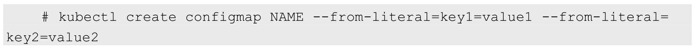

# ConfigMap 、Secret

ConfigMap 和 Secret 是 Kubernates 系统上两种特殊类型的存储卷

- ConfigMap 对象用于为容器中的应用提供配置数据以定制程序的行为
- Securet 对象用来配置敏感的配置信息，例如密匙、证书等


## ConfigMap

ConfigMap供容器使用的典型用法如下: 
（1）生成为容器内的环境变量。
（2）设置容器启动命令的启动参数（需设置为环境变量）。
（3）以Volume的形式挂载为容器内部的文件或目录

ConfigMap以一个或多个key:value的形式保存在Kubernetes系统中供应用使用，既可以用于表示一个变量的值（例如apploglevel=info），也可以用于表示一个完整配置文件的内容（例如server.xml=<?xml...>...）可以通过YAML配置文件或者直接使用kubectl create configmap命令行的方式来创建ConfigMap.


### ConfigMap 配置解析

```yaml
apiVersion: v1
kind: ConfigMap

# 元数据信息
metadata:
  name: example-map

# 需要挂载的键值数据
data:
  app: test
  name: test-map
  
  #当挂载数据为多行数据时，需要使用 | 来代表多行的开始
  conf: | 
    one line
    2 line
    3 line
    4 line
    5 line
    6 line

#挂载二进制数据，一般不常用
binaryData:
  sqad: 111
```


### 创建ConfigMap 资源

#### 1、资源文件创建

根据定义资源配置文件的方式来创建ConfigMap

#### 2、命令创建

使用命令创建configmap，通过使用 `kubectl create configmap` 命令，用户可以根据目录、文件或直接创建ConfigMap 对象，语法如下：

```sh
kubectl create configmap <map-name> <data-source>
```

其中，<map-name>  是configmap 对象的名称，<data-source> 是数据源，它可以直接通过key-value、文件或目录读取。其中Key 由用户在命令行给出或者是文件数据源的文件名称，它仅能由字母、数字、连接号、点号组成，而Value 则是直接值或文件数据源的内容

1、利用直接值创建

使用--from-literal时会从文本中进行创建，直接将指定的key#=value#创建为ConfigMap的内容，语法为：



```sh
[root@k8s-master ~]# kubectl create cm cm-1 --from-literal=app=test-map
configmap/cm-1 created
[root@k8s-master ~]# kubectl get configmaps 
NAME   DATA   AGE
cm-1   1      7s
[root@k8s-master ~]# kubectl get configmaps cm-1
NAME   DATA   AGE
cm-1   1      10s
[root@k8s-master ~]# kubectl describe configmaps cm-1
Name:         cm-1
Namespace:    default
Labels:       <none>
Annotations:  <none>

Data
====
app:
----
test-map
Events:  <none>
```


2、通过--from-file参数从目录中进行创建，该目录下的每个配置文件名都被设置为key，文件的内容被设置为value，语法为：


3、为 `kubectl create configmap` 命令使用 " --from-file" 选项 即可基于文件内容来创建环境变量类型的ConfigMap，可以重复多次使用

```sh
kubectl create configmap <cofigmap_name> --from-env-file=<file_name>
```

文件内容如下： a. conf

```
app=pod
label=123
```


创建过程如下：

 ```sh
[root@k8s-master cm]# kubectl create cm cm-2 --from-env-file=a.conf
configmap/cm-2 created

[root@k8s-master cm]# kubectl describe cm cm-2
Name:         cm-2
Namespace:    default
Labels:       <none>
Annotations:  <none>

Data
====
app:
----
name
test:
----
123
Events:  <none>

[root@k8s-master cm]# kubectl describe cm cm-1
Name:         cm-1
Namespace:    default
Labels:       <none>
Annotations:  <none>

Data
====
app:
----
test-map
Events:  <none>
 ```


4、基于目录创建

如果配置文件数量较多且存储与有限的目录中时，kubectl 还提供了基于目录直接将多个文件分别收纳为键值数据的ConfigMap 资源创建方式，过程如下：

```sh
kubectl create configmap <config_map> --from-file=<path-to-dir>
```


### 在Pod 中使用ConfigMap

在Pod的环境变量中引用ConfigMap的值是比较常用的方式。这一点在env 字典中 为valueFrom 内嵌configMap 对象即可实现

```yaml

```


### 与 Pod 中的volume 搭配


### ConfigMap 注意事项


## Secret


