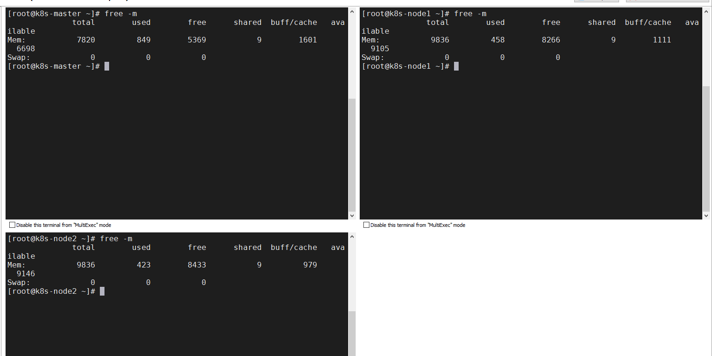

## 搭建教程

之前撸谷粒商城的时候部署17.3脚本在本地存着，尚硅谷新出了k8s视频，感觉没有雷神讲的好，主要是后面的二进制尝试部署一下，简单的记录，后面有机会用ansible来部署一下试试

kubeadm是官方社区推出的一个用于快速部署kubernetes集群的工具。

这个工具能通过两条指令完成一个kubernetes集群的部署：


```
# 创建一个 Master 节点
$ kubeadm init

# 将一个 Node 节点加入到当前集群中
$ kubeadm join <Master节点的IP和端口 >
```

***1\***|***0\*****1. 安装要求**

[](https://typora-oss.oss-cn-beijing.aliyuncs.com/image-20200922221952671.png)

在开始之前，部署Kubernetes集群机器需要满足以下几个条件：

- 一台或多台机器，操作系统 CentOS7.x-86_x64
- 硬件配置：2GB或更多RAM，2个CPU或更多CPU，硬盘30GB或更多
- 可以访问外网，需要拉取镜像，如果服务器不能上网，需要提前下载镜像并导入节点
- 禁止swap分区

***2\***|***0\*****2. 准备环境**

| 角色   | IP            |
| :----- | :------------ |
| master | 192.168.1.123 |
| node1  | 192.168.1.129 |
| node2  | 192.168.1.130 |


```
# 关闭防火墙
systemctl stop firewalld
systemctl disable firewalld

# 关闭selinux
sed -i 's/enforcing/disabled/' /etc/selinux/config  # 永久
setenforce 0  # 临时

# 关闭swap
swapoff -a  # 临时
sed -ri 's/.*swap.*/#&/' /etc/fstab    # 永久

# 根据规划设置主机名
hostnamectl set-hostname <hostname>

# 在master添加hosts
cat >> /etc/hosts << EOF
192.168.1.123 k8s-master
192.168.1.129 k8s-node1
192.168.1.130 k8s-node2
EOF

# 将桥接的IPv4流量传递到iptables的链
cat > /etc/sysctl.d/k8s.conf << EOF
net.bridge.bridge-nf-call-ip6tables = 1
net.bridge.bridge-nf-call-iptables = 1
EOF
sysctl --system  # 生效

# 时间同步
yum install ntpdate -y
ntpdate time.windows.com
```

***3\***|***0\*****3. 所有节点安装Docker/kubeadm/kubelet**

Kubernetes默认CRI（容器运行时）为Docker，因此先安装Docker。

***3\***|***1\*****3.1 安装Docker**


```
$ wget https://mirrors.aliyun.com/docker-ce/linux/centos/docker-ce.repo -O /etc/yum.repos.d/docker-ce.repo
$ yum -y install docker-ce-18.06.1.ce-3.el7
$ systemctl enable docker && systemctl start docker
$ docker --version
Docker version 18.06.1-ce, build e68fc7a
```


```
$ cat > /etc/docker/daemon.json << EOF
{
  "registry-mirrors": ["https://b9pmyelo.mirror.aliyuncs.com"]
}
EOF
```

***3\***|***2\*****3.2 添加阿里云YUM软件源**


```
$ cat > /etc/yum.repos.d/kubernetes.repo << EOF
[kubernetes]
name=Kubernetes
baseurl=https://mirrors.aliyun.com/kubernetes/yum/repos/kubernetes-el7-x86_64
enabled=1
gpgcheck=0
repo_gpgcheck=0
gpgkey=https://mirrors.aliyun.com/kubernetes/yum/doc/yum-key.gpg https://mirrors.aliyun.com/kubernetes/yum/doc/rpm-package-key.gpg
EOF
```

***3\***|***3\*****3.3 安装kubeadm，kubelet和kubectl**

由于版本更新频繁，这里指定版本号部署：


```
$ yum install -y kubelet-1.18.0 kubeadm-1.18.0 kubectl-1.18.0
$ systemctl enable kubelet
```

***4\***|***0\*****4. 部署Kubernetes Master**

在192.168.31.61（Master）执行。


```
$ kubeadm init \
  --apiserver-advertise-address=192.168.1.123 \
  --image-repository registry.aliyuncs.com/google_containers \
  --kubernetes-version v1.18.0 \
  --service-cidr=10.96.0.0/12 \
  --pod-network-cidr=10.244.0.0/16
```

由于默认拉取镜像地址k8s.gcr.io国内无法访问，这里指定阿里云镜像仓库地址。

使用kubectl工具：


```
mkdir -p $HOME/.kube
sudo cp -i /etc/kubernetes/admin.conf $HOME/.kube/config
sudo chown $(id -u):$(id -g) $HOME/.kube/config
$ kubectl get nodes
```

***5\***|***0\*****5. 加入Kubernetes Node**

在192.168.1.12/13（Node）执行。

向集群添加新节点，执行在kubeadm init输出的kubeadm join命令：


```
$ kubeadm join 192.168.1.123:6443 --token esce21.q6hetwm8si29qxwn \
    --discovery-token-ca-cert-hash sha256:00603a05805807501d7181c3d60b478788408cfe6cedefedb1f97569708be9c5
```

默认token有效期为24小时，当过期之后，该token就不可用了。这时就需要重新创建token，操作如下：


```
kubeadm token create --print-join-command
```

***6\***|***0\*****6. 部署CNI网络插件**


```
wget https://raw.githubusercontent.com/coreos/flannel/master/Documentation/kube-flannel.yml
```

默认镜像地址无法访问，sed命令修改为docker hub镜像仓库。


```
kubectl apply -f https://raw.githubusercontent.com/coreos/flannel/master/Documentation/kube-flannel.yml

kubectl get pods -n kube-system
NAME                          READY   STATUS    RESTARTS   AGE
kube-flannel-ds-amd64-2pc95   1/1     Running   0          72s
```

[](https://typora-oss.oss-cn-beijing.aliyuncs.com/image-20200922222103937.png)

***7\***|***0\*****7. 测试kubernetes集群**

在Kubernetes集群中创建一个pod，验证是否正常运行：


```
$ kubectl create deployment nginx --image=nginx
$ kubectl expose deployment nginx --port=80 --type=NodePort
$ kubectl get pod,svc
```

访问地址：[http://NodeIP](http://nodeip/):Port

[](https://typora-oss.oss-cn-beijing.aliyuncs.com/image-20200922222131213.png)


__EOF__