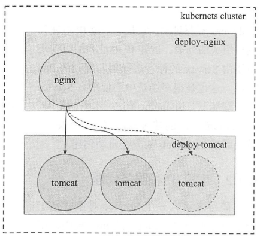
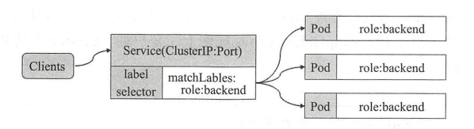
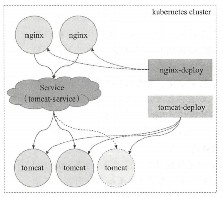
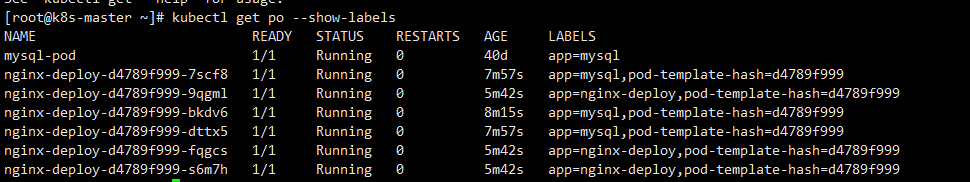

## Service

### Service 概览

Service 资源基础标签选择器将一组Pod 定义成一个逻辑组合，并通过自己的IP地址和端口调度代理请求至组内的Pod对象之上

由Deployment 等控制器管理的Pod对象中断后会由新建的资源对象所取代，而扩缩容后的应用则会带来Pod对象群体的变动，随之变化的还有Pod的IP地址与端口等，，当我们需要访问一组Pod 容器时，总是需要 提供一个代理入口来代理这组Pod容器，如下图：



当Pod IP地址改变或者应用规模的扩缩容都会导致客户端访问错误

Service 资源基于标签选择器，将一组Pod定义成一个逻辑组合，并通过自己的IP地址和端口调度代理到组内的Pod 节点之上，如下图：



这样使得客户端的请求看上去就是由Service 直接处理并进行响应的一样

Service 对象的IP 地址称为 Cluster IP，是一种虚拟的IP地址，它在Service对象创建后保持不变，Service 端口用于接受客户端请求并且将请求路由转发至下游实际的Pod节点之上，**这种代理机制被称为端口代理，或者是四层代理机制，他是工作与TCP/IP 协议栈的传输层**。

通过其标签选择器匹配到的后端Pod资源不止一个时，Service 资源能够以负载均衡的方式进行流量调度，实现了请求流量的分发机制，Service 与 Pod 对象之间的关联关系通过标签选择器以松耦合的方式建立。

如下图所示：



Service 资源会通过API Server 持续监视着（watch）标签选择器匹配到的后端Pod对象，并实时跟踪个对象的变动，例如：IP 地址变动、对象增加或减少等不过需要特别说明的是，Service 并不直接连接至 Pod对象，它们之间还有一个中间层----Endpoints 资源对象，它是一个由IP 地址和端口组成的列表，这些IP地址和端口则来自于Service 的标签选择器匹配到的Pod资源，创建Service 资源对象时，其关联的Endpoints对象也自动创建

### KubeProxy

KubeProxy 负责监听当前Node 节点的网络信息，当pod 发起

当Service 通过 labelSelector 选择后端的Pod节点不止一个时，就要保证节点路由的负载均衡机制，在1.11版本之后默认使用的是ipvs 来负载后端的Pod节点


### Endpoint

Service 到 Pod 之间是存在一层Endpoint端点，所谓Endpoint 就是 ClusterIP -> Pod IP + port 

如下图：

Service 信息：

```shell
[root@k8s-master ~]# kubectl describe svc mysql-svc 
Name:                     mysql-svc
Namespace:                stateful
Labels:                   app=mysql-service
Annotations:              Selector:  app=mysql
Type:                     NodePort
IP:                       10.104.129.241
Port:                     mysql-port  3306/TCP
TargetPort:               3306/TCP
NodePort:                 mysql-port  13306/TCP
Endpoints:                10.244.1.40:3306,10.244.2.32:3306,10.244.2.33:3306 + 1 more...
Session Affinity:         None
External Traffic Policy:  Local
Events:                   <none>

```

Endpoints 信息：

```shell
[root@k8s-master ~]# kubectl describe endpoints
Name:         mysql-svc
Namespace:    stateful
Labels:       app=mysql-service
Annotations:  endpoints.kubernetes.io/last-change-trigger-time: 2021-03-10T06:45:08Z
Subsets:
  Addresses:          10.244.1.40,10.244.2.32,10.244.2.33,10.244.2.34
  NotReadyAddresses:  <none>
  Ports:
    Name        Port  Protocol
    ----        ----  --------
    mysql-port  3306  TCP

Events:  <none>
```

Pod 信息：




### Service 三种模式

#### 用户空间模式（已废弃）

#### iptables 模式

#### ipvs 模式


### Service 资源的基础应用

#### 创建Service 资源

创建Service 资源的常用方法有两种，

- 使用kubectl expose 
- 使用service资源配置文件


### Serivce 的类型

NodePort、ClusterIP、LoadBanlencer、ExternelName


### Service 配置文件解析

Service资源示例：

```yam
apiVersion: v1
kind: Service

metadata:
  name: myapp-svc

spec:
  selector:
    app: myapp
  ports:
    - port: 80
      targetPort: 80
      protocol: TCP

  type: ClusterIP
  publishNotReadyAddresses: false
```

Service资源 myapp-svc 通过标签选择器关连至标签为 “my-app” 的Pod 对象，


### 

