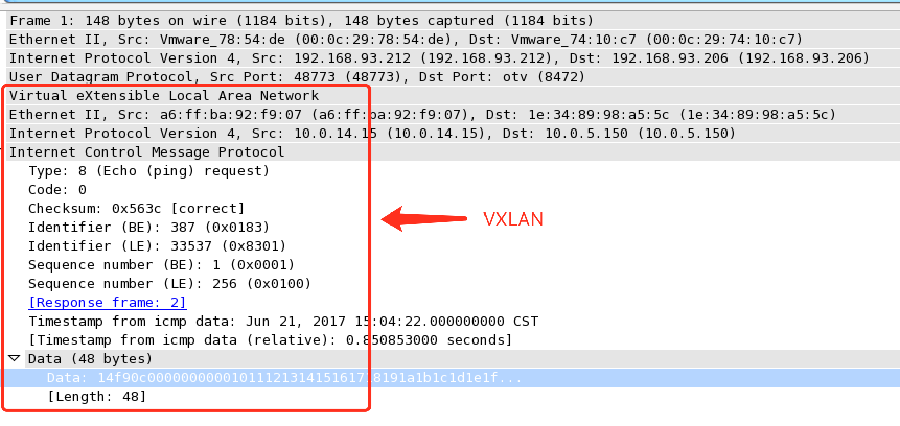

## Flannel 网络原理

我们这里假设[flannel](https://www.centos.bz/tag/flannel/)使用VXLAN协议。每台主机都安装有flannel。k8s定义的flannel网络为10.0.0.0/16，各主机的flannel从这个网络申请一个子网。pod1所在的主机的flannel子网为10.0.14.1/24，pod2所在主机的flannel子网为10.0.5.1/24。每台主机有cni0和flannel.1虚拟网卡。cni0为在同一主机pod共用的网桥，当kubelet创建容器时，将为此容器创建虚拟网卡vethxxx，并桥接到cni0网桥。flannel.1是一个tun虚拟网卡，接收不在同一主机的POD的数据，然后将收到的数据转发给flanneld进程。原理图：
[](https://www.centos.bz/wp-content/uploads/2017/06/flannel-01.png)

## pod1到pod2的网络

pod1路由表：

```
default via 10.0.14.1 dev eth0 
10.0.0.0/16 via 10.0.14.1 dev eth0 
10.0.14.0/24 dev eth0  proto kernel  scope link  src 10.0.14.15 
```

host1路由表：

```
default via 192.168.93.254 dev eno16777984  proto static  metric 100 
10.0.0.0/16 dev flannel.1 
10.0.14.0/24 dev cni0  proto kernel  scope link  src 10.0.14.1 
172.17.0.0/16 dev docker0  proto kernel  scope link  src 172.17.0.1 
192.168.93.0/24 dev eno16777984  proto kernel  scope link  src 192.168.93.212  metric 100 
```

pod1 IP地址:10.0.14.15
pod2 IP地址:10.0.5.150

### pod1与pod2不在同一台主机

下面是从pod1 ping pod2的数据包流向
\1. pod1(10.0.14.15)向pod2(10.0.5.150)发送ping，查找pod1路由表，把数据包发送到cni0(10.0.14.1)
\2. cni0查找host1路由，把数据包转发到flannel.1
\3. flannel.1虚拟网卡再把数据包转发到它的驱动程序flannel
\4. flannel程序使用VXLAN协议封装这个数据包，向api-[server](https://www.centos.bz/tag/server/)查询目的IP所在的主机IP,称为host2(不清楚什么时候查询)
\5. flannel向查找到的host2 IP的UDP端口8472传输数据包
\6. host2的flannel收到数据包后，解包，然后转发给flannel.1虚拟网卡
\7. flannel.1虚拟网卡查找host2路由表，把数据包转发给cni0网桥，cni0网桥再把数据包转发给pod2
\8. pod2响应给pod1的数据包与1-7步类似
下面是这次ping数据包的[wireshark](https://www.centos.bz/tag/wireshark/)解析出的协议数据:
pod1 ping请求:
[](https://www.centos.bz/wp-content/uploads/2017/06/ping-request.png)
pod2响应:
[](https://www.centos.bz/wp-content/uploads/2017/06/ping-reply.png)

### pod1与pod2在同一台主机

pod1和pod2在同一台主机的话，由cni0网桥直接转发请求到pod2，不需要经过flannel。

## pod到service的网络

创建一个[service](https://www.centos.bz/tag/service/)时，相应会创建一个指向这个service的域名，域名规则为{服务名}.{[namespace](https://www.centos.bz/tag/namespace/)}.svc.{集群名称}。之前service ip的转发由[iptables](https://www.centos.bz/tag/iptables/)和kube-[proxy](https://www.centos.bz/tag/proxy/)负责，目前基于性能考虑，全部为iptables维护和转发。iptables则由kubelet维护。service仅支持udp和tcp协议，所以像ping的icmp协议是用不了的，所以无法ping通service ip。
现在我们尝试看看在pod1向kube-dns的service ip 10.16.0.10:53发送udp请求是如何转发的。
我们先找出与此IP相关的iptables规则：

```
【PREROUTING链】
-m comment --comment "kubernetes service portals" -j KUBE-SERVICES

【KUBE-SERVICES链】
-d 10.16.0.10/32 -p udp -m comment --comment "kube-system/kube-dns:dns cluster IP" -m udp --dport 53 -j KUBE-SVC-TCOU7JCQXEZGVUNU

【KUBE-SVC-TCOU7JCQXEZGVUNU链】
-m comment --comment "kube-system/kube-dns:dns" -j KUBE-SEP-L5MHPWJPDKD7XIFG

【KUBE-SEP-L5MHPWJPDKD7XIFG链】
-p udp -m comment --comment "kube-system/kube-dns:dns" -m udp -j DNAT --to-destination 10.0.0.46:53
```

1. pod1向service ip 10.16.0.10:53发送udp请求，查找路由表，把数据包转发给网桥cni0(10.0.14.1)
2. 在数据包进入cnio网桥时，数据包经过PREROUTING链，然后跳至KUBE-SERVICES链
3. KUBE-SERVICES链中一条匹配此数据包的规则，跳至KUBE-SVC-TCOU7JCQXEZGVUNU链
4. KUBE-SVC-TCOU7JCQXEZGVUNU不做任何操作，跳至KUBE-SEP-L5MHPWJPDKD7XIFG链
5. KUBE-SEP-L5MHPWJPDKD7XIFG里对此数据包作了DNAT到10.0.0.46:53，其中10.0.0.46即为kube-dns的pod ip
6. 查找与10.0.0.46匹配的路由，转发数据包到flannel.1
7. 之后的数据包流向就与上面的**pod1到pod2的网络**一样了

## pod到外网

1. pod向qq.com发送请求
2. 查找路由表,转发数据包到宿主的网卡
3. 宿主网卡完成qq.com路由选择后，iptables执行MASQUERADE，把源IP更改为宿主网卡的IP
4. 向qq.com服务器发送请求