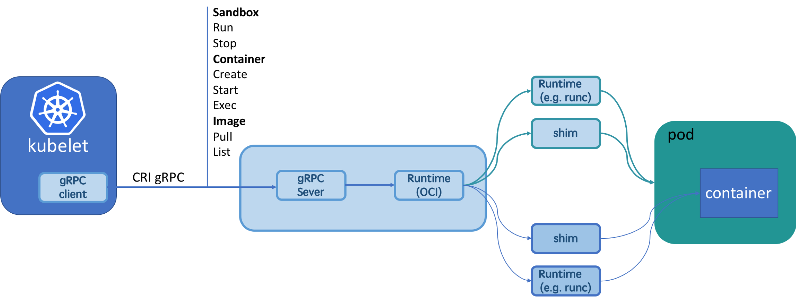

## Kuberntes 与 CRI + Kata

## Kata

[Kata](https://katacontainers.io/)源自希腊文Καταπίστευμα(ka-ta-PI-stev-ma)，原意是值得信任的人，kata container正是解容器安全的问题而诞生的。传统的容器是基于namespace和cgroup进行隔离，在带来轻量简洁的同时，也带来了安全的隐患。事实上容器虽然提供一个与系统中的其它进程资源相隔离的执行环境，但是与宿主机系统是共享内核的，一旦容器里的应用逃逸到内核，后果不堪设想，尤其是在多租户的场景下。Kata就是在这样的背景下应运而生，kata很好的权衡了传统虚拟机的隔离性、安全性与容器的简洁、轻量。这一点和firecracker很相似，都是轻量的虚拟机。但是他们的本质的区别在于：kata虽然是基于虚机，但是其表现的却跟容器是一样的，可以像使用容器一样使用kata；而firecracker虽然具备容器的轻量、极简性，但是其依然是虚机，一种比QEMU更轻量的VMM，暂时不能兼容容器生态。
Kata的基本原理是，为每一个容器单独开一个虚机（如果是k8s下作为runtime，则是一个pod对应一个虚机而不是容器），具有独立的内核，这样交付的容器就具备了虚机级别的隔离和安全性。kata的原理图如下所示：


Kata container作为[OCI](https://www.opencontainers.org/)标准的成员之一，其kata-runtime也是兼容OCI标准，和runc处在同一个层级，对安全和隔离性要求高的场景，可以从Docker或者k8s默认的runtime(比如runc)切到kata-runtime。

## CRI

### CRI基本原理

早期的k8s使用docker作为默认的runtime，后来又加入rkt，每加入一种新运行时，k8s都要修改接口来关联新的容器运行时。随着越来越多的容器运行时想加入k8s运行时，而且不同的容器的实现和功能差异很大，比如docker已经再不是一个单纯的容器运行时，这时候亟需一套标准来定义k8s支持的运行时。这套标准就是[CRI](https://github.com/kubernetes/community/blob/master/contributors/devel/sig-node/container-runtime-interface.md)（Container RunTime Interface）。k8s（甚至k8s用户）不再关心底层的容器运行时，kubelet只感知到CRI server，而CRI server只需遵循CRI标准实现对应的runtime的标准化的接口。

CRI接口具体的定义细节在k8s的kubelet/apis/cri/runtime/v1alpha2/api.proto中：

```
service RuntimeService {
    // Version returns the runtime name, runtime version, and runtime API version.
    rpc Version(VersionRequest) returns (VersionResponse) {}
    // RunPodSandbox creates and starts a pod-level sandbox. Runtimes must ensure
    // the sandbox is in the ready state on success.
    rpc RunPodSandbox(RunPodSandboxRequest) returns (RunPodSandboxResponse) {}
    // CreateContainer creates a new container in specified PodSandbox
    rpc CreateContainer(CreateContainerRequest) returns (CreateContainerResponse) {}
    // Exec prepares a streaming endpoint to execute a command in the container.
    rpc Exec(ExecRequest) returns (ExecResponse) {}
    // ContainerStats returns stats of the container. If the container does not
    // exist, the call returns an error.
    rpc ContainerStats(ContainerStatsRequest) returns (ContainerStatsResponse) {}
    // ListContainerStats returns stats of all running containers
    // Status returns the status of the runtime.
    rpc Status(StatusRequest) returns (StatusResponse) {}
    ...
}

// ImageService defines the public APIs for managing images.
service ImageService {
    // ListImages lists existing images.
    rpc ListImages(ListImagesRequest) returns (ListImagesResponse) {}
    // ImageStatus returns the status of the image. If the image is not
    // present, returns a response with ImageStatusResponse.Image set to
    // nil.
    rpc ImageStatus(ImageStatusRequest) returns (ImageStatusResponse) {}
    // PullImage pulls an image with authentication config.
    rpc PullImage(PullImageRequest) returns (PullImageResponse) {}
    // RemoveImage removes the image.
    // This call is idempotent, and must not return an error if the image has
    // already been removed.
    rpc RemoveImage(RemoveImageRequest) returns (RemoveImageResponse) {}
    // ImageFSInfo returns information of the filesystem that is used to store images.
    rpc ImageFsInfo(ImageFsInfoRequest) returns (ImageFsInfoResponse) {}
}
```

可以看到CRI server包括 RuntimeService 和 ImageService 两个服务，均为gRPC server。ImageService负责镜像的管理，比如查询、拉取、删除镜像等；RuntimeService负责四大块：PodSandbox（Pause容器或者一台虚拟机，取决于具体的runtime实现），Container，Streaming API（exec），状态查询接口等。

下面分别以k8s create pod和stream API exec来分析CRI工作的流程：


### CRI分类

CRI的第一个实现就是k8s自己提供的针对Docker运行时的dockerShim，也是目前k8s使用docker的标准方式，已经集成在k8s的源码中。如今CRI的众多实现中除了dockershim外，比较具有代表性的还有有[CRI-containerd](https://github.com/containerd/cri), [CRI-O](https://github.com/kubernetes-sigs/cri-o)以及[frakti](https://github.com/kubernetes/frakti)。[rkt](https://coreos.com/rkt/)作为k8s最早支持的运行时之一，现在也开始转向标准的CRI实现[rktlet](https://github.com/kubernetes-incubator/rktlet)，这是k8s未来使用rkt的标准方式。该项目的目标就是像现在的dockerShim一样，而社区貌似并不活跃。目前主流的几种CRI实现的生产容器的流程图如下所示：

其中dockershim、CRI-containerd、CRI-O属于基于OCI的CRI，dockershim目前不支持kata runtime，其他的两种CRI-containerd、CRI-O均支持runc和kata runtime。frakti是一种特殊的CRI实现，它不依赖于任何runtime，而是可以直接使用kata提供的硬件虚拟化API库来实现CRI的标准接口，即直接开VM然后runv启动pod和容器。frakti虽然相比于其他的CRI实现复杂、接口偏重，但是实现的灵活性更强。

### Dockershim

k8s开始支持CRI之后，k8s便不再以之前的方式依赖docker，而是采用标准的CRI的方式来使用docker运行时。Dockershim便是k8s对CRI的一个标准实现，已经集成在了k8s的源码中，这里重点看下k8s中dockershim的实现。


#### RuntimeService client实现：

首先，dockershim的gRPC client的实现是在kubelet/remote/remote_runtime.go中：

```
// RemoteRuntimeService is a gRPC implementation of internalapi.RuntimeService.
type RemoteRuntimeService struct {
    timeout       time.Duration
    runtimeClient runtimeapi.RuntimeServiceClient
    // Cache last per-container error message to reduce log spam
    lastError map[string]string
    // Time last per-container error message was printed
    errorPrinted map[string]time.Time
    errorMapLock sync.Mutex
}
```

runtimeapi.RuntimeServiceClient是一个连接到了gRPC server的client端，主要接收来自kubelet的请求。RuntimeServiceClient的所有调用都是gRPC的方式。以RunPodSandbox为例：

```
func (c *runtimeServiceClient) RunPodSandbox(ctx context.Context, in *RunPodSandboxRequest, opts ...grpc.CallOption) (*RunPodSandboxResponse, error) {
    out := new(RunPodSandboxResponse)
    err := grpc.Invoke(ctx, "/runtime.v1alpha2.RuntimeService/RunPodSandbox", in, out, c.cc, opts...)
    if err != nil {
        return nil, err
    }
    return out, nil
}
```

#### RuntimeService server实现：

服务端实现的核心部分在kubelet/dockershim/docker_service.go中

```
// CRIService includes all methods necessary for a CRI server.
type CRIService interface {
    runtimeapi.RuntimeServiceServer
    runtimeapi.ImageServiceServer
    Start() error
}

// DockerService is an interface that embeds the new RuntimeService and
// ImageService interfaces.
type DockerService interface {
    CRIService
    // For serving streaming calls.
    http.Handler
    // For supporting legacy features.
    DockerLegacyService
}
```

可以看到DockerService接口包装了RuntimeServiceServer和ImageServiceServer两个必须的接口。DockerService的实现类是dockerService（go duck type）:

```
type dockerService struct {
    client           libdocker.Interface
    os               kubecontainer.OSInterface
    podSandboxImage  string
    streamingRuntime *streamingRuntime
    streamingServer  streaming.Server

    network *network.PluginManager
    // Map of podSandboxID :: network-is-ready
    networkReady     map[string]bool
    networkReadyLock sync.Mutex

    containerManager cm.ContainerManager
    // cgroup driver used by Docker runtime.
    cgroupDriver      string
    checkpointManager checkpointmanager.CheckpointManager
    // caches the version of the runtime.
    versionCache *cache.ObjectCache
    // startLocalStreamingServer indicates whether dockershim should start a
    // streaming server on localhost.
    startLocalStreamingServer bool
}
```

其中最核心的就是client，它包含了dockerService必须要实现的所有方法，其本质上是一个docker client，即DockerService接口的所有方法的实现最终都是通过直接调用docker client实现的。其中dockerEndpoint值为kubelet初始化时通过--docker-endpoint传入。

```
// ConnectToDockerOrDie creates docker client connecting to docker daemon.
func ConnectToDockerOrDie(dockerEndpoint string, requestTimeout, imagePullProgressDeadline time.Duration,
    withTraceDisabled bool, enableSleep bool) Interface {
    if dockerEndpoint == FakeDockerEndpoint {
        fakeClient := NewFakeDockerClient()
        if withTraceDisabled {
            fakeClient = fakeClient.WithTraceDisabled()
        }

        if enableSleep {
            fakeClient.EnableSleep = true
        }
        return fakeClient
    }
    //最核心的一行代码，创建docker client
    client, err := getDockerClient(dockerEndpoint)
    if err != nil {
        klog.Fatalf("Couldn't connect to docker: %v", err)
    }
    klog.Infof("Start docker client with request timeout=%v", requestTimeout)
    return newKubeDockerClient(client, requestTimeout, imagePullProgressDeadline)
}
```

dockerService只是完成了标准接口的实现，还不能对外提供服务，需要注册到gRPC中，即DockerServer：

```
// DockerServer is the grpc server of dockershim.
type DockerServer struct {
    // endpoint is the endpoint to serve on.
    endpoint string
    // service is the docker service which implements runtime and image services.
    service dockershim.CRIService
    // server is the grpc server.
    server *grpc.Server
}
runtimeapi.RegisterRuntimeServiceServer(s.server, s.service)
runtimeapi.RegisterImageServiceServer(s.server, s.service)
```

虽然RuntimeService和ImageService均为gRPC服务，但是实现上可以共用一个gRPC也可以分别启用一个gRPC，dockerShim采用的是第一种方式。

再回到最上层，在kubelet初始化的时候，会判断container runtime的类型，如果是docker，就会进入dockershim的初始化，即完成以上的流程：dockershim.NewDockerService()—>dockerremote.NewDockerServer()，并启动gRPC server：

```
  case kubetypes.DockerContainerRuntime:
        // Create and start the CRI shim running as a grpc server.
        streamingConfig := getStreamingConfig(kubeCfg, kubeDeps, crOptions)
        ds, err := dockershim.NewDockerService(kubeDeps.DockerClientConfig, crOptions.PodSandboxImage, streamingConfig,
            &pluginSettings, runtimeCgroups, kubeCfg.CgroupDriver, crOptions.DockershimRootDirectory, !crOptions.RedirectContainerStreaming)
        if err != nil {
            return nil, err
        }
        if crOptions.RedirectContainerStreaming {
            klet.criHandler = ds
        }

        // The unix socket for kubelet <-> dockershim communication.
        klog.V(5).Infof("RemoteRuntimeEndpoint: %q, RemoteImageEndpoint: %q",
            remoteRuntimeEndpoint,
            remoteImageEndpoint)
        klog.V(2).Infof("Starting the GRPC server for the docker CRI shim.")
        server := dockerremote.NewDockerServer(remoteRuntimeEndpoint, ds)
        if err := server.Start(); err != nil {
            return nil, err
        }

        // Create dockerLegacyService when the logging driver is not supported.
        supported, err := ds.IsCRISupportedLogDriver()
        if err != nil {
            return nil, err
        }
        if !supported {
            klet.dockerLegacyService = ds
            legacyLogProvider = ds
        }
  case kubetypes.RemoteContainerRuntime:
        // No-op.
        break
  default:
        return nil, fmt.Errorf("unsupported CRI runtime: %q", containerRuntime)
```

这是dockerShim的流程，[rktlet](https://github.com/kubernetes-incubator/rktlet)和dockerShim的实现非常类似。由于是集成在k8s中，所以kubelet需要负责CRI server的这些初始化工作，如果是其他的CRI实现，就需要在节点上启动runtimeService和imageService，kubelet只用关心runtimeService和imageService的endpoint，即启动kubelet时通过设置参数--container-runtime-endpoint、image-service-endpoint（imageService的endpoint缺省值默认使用runtimeService的endpoint的值）来告诉kubelet CRI gRPC server的endpoint。Anyway，即便把dockerShim独立出来，这个流程依然是一样的，在kubelet看来依然是一个接口一样的gRPC server。

### CRI-O

本节重点分析[CRI-O](https://cri-o.io/)的实现。如果说dockerShim只是针对docker runtime的标准实现，那CRI-O就是真正的兼容OCI标准的实现：CRI-O全名即为CRI-OCI。CRI-O默认会使用runc，但是能够识别k8s pod的注解annotations:io.kubernetes.cri-o.TrustedSandbox，用户可以使用这个注解来通过CRI-O选择合适的runtime。比如，对安全级别要求较高，可以将注解的值设置为false，CRI-O就会使用kata-runtime，即每个pod对应一个虚机（这和docker使用kata-runtime稍有区别，docker中默认每个kata container对应一个虚机隔离，而在k8s pod中的一组容器往往是业务上相互协作的应用，他们之间的安全隔离性不需要很高，所以pod内的一组容器和runc的类似，只是在pod层需要达到虚机级别的隔离）。还需要说明的是，CRI-O支持一个节点上同时运行两种不同类型runtime的pod。



## Kata + Firecracker


在没有firecracker之前，CRI-O就可以通过k8s注解或者配置文件的方式将默认的runtime替换为kata runtime，进而为容器（pod）开独立的虚机。firecracker本质上是虚拟化技术，和qemu在一个层面，只是它更加轻量、精简。所以很自然的会想到，kata能否直接开出firecracker虚机，在虚机里运行容器？答案是肯定的。

在最新发布的[kata1.5](https://github.com/kata-containers/runtime/releases)中，已经开始支持firecracker。通过k8s pod的runtimeClass字段来设定pod内容器的运行时。runtimeClass也是k8s的新增的字段，属于beta版。目前支持的最小粒度为pod，即一个node上可以运行多种runtime的pod，但是每个pod内部的容器的运行时必须相同。因为在一个pod内，容器和虚机的数据共享和网络通信是非常的麻烦，超出了k8s目前的能力。但是抽象到pod层以上，在k8s看来，虚机和pod就没有差异了。


但是，限于firecracker本身功能过于简单，因为其设计之初就是追求最少的设备、最简洁的功能，firecracker目前很多k8s的功能还不支持，比如volume、secret、configmap等[1]。如果应用比较复杂，对运行环境的要求比较高，就只能使用qemu vm。

更多关于kata对firecracker hypervisor的支持实现方面的细节可以参考：

1、Firecracker hypervisor接口的实现：[firecracker: VMM API support](https://github.com/kata-containers/runtime/commit/c1d3f1a98b0f8be6a2353cf288cf94b6f27cc57c)

2、添加firecracker作为qemu之后的新的一种hypervisor选项：[virtcontainers: Add firecracker as a supported hypervisor](https://github.com/kata-containers/runtime/commit/e65bafa79371704090b81e89e145807b35dfd648)

3、目前kata+fc的限制：[Firecracker limitations](https://github.com/kata-containers/documentation/issues/351)

3、[官方Demo演示](https://asciinema.org/a/219790)

## 总结

从firecracker去年开始问世至今，将firecracker融入如今的容器生态一直是AWS和开源社区在致力推进。从最开始初见雏形的containerd+firecracker到如今已经接近成熟的kata+firecracker，未来firecracker在容器生态中将处于什么样的地位，是通过containerd和kata成为qemu一样的runtime选项，还是作为serverless容器底层沙箱的的标准(类似如今AWS的Lambda和 Fargat)，现在还不能有定论。但是serverless领域对极简极快的追求和firecracker这种极简的VMM设计是完全契合的。qemu是没有做到最精简，依然有很多不必要的模块。用firecracker替换qemu（或者借鉴firecracker的思路构建自己的面向severless的轻量级容器底层沙箱）是未来可以尝试的方向