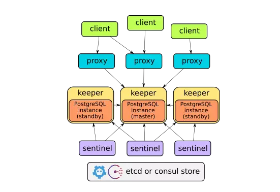

1、mikly 负责网络分配

2、stolon 负责 postgreSQL 的g

Stolon是一个cloud native的PostgreSQL高可用管理工具。它之所以是cloud native的是因为它可以在为容器内部的PostgreSQL提供高可用（Kubernetes 集成），而且还支持其他种类的基础设施（比如：cloud IaaS，旧风格的基础设施等）

### Stolon 架构图

、

Stolon 是由3个部分组成的：

- keeper：他负责管理PostgreSQL的实例汇聚到由sentinel(s)提供的clusterview。
- sentinel：it负责发现并且监控keeper，并且计算最理想的clusterview。
- proxy：客户端的接入点。它强制连接到右边PostgreSQL的master并且强制关闭连接到由非选举产生的master。

Stolon 用etcd或者Consul作为主要的集群状态存储。