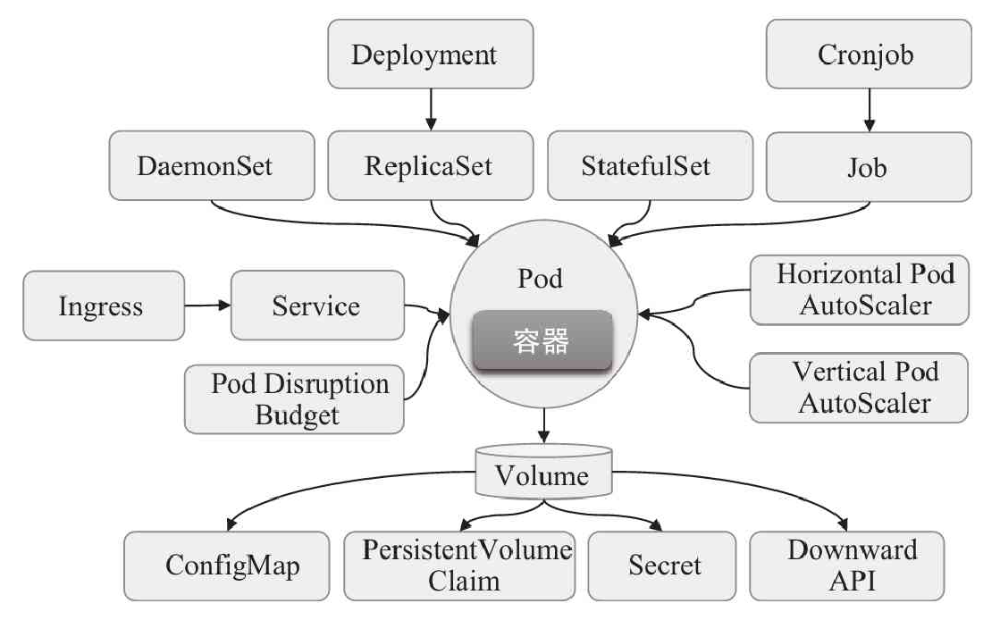

# K8S 技术分享

## 云原生

 Pivotal公司的Matt Stine于2013年首次提出云原生（CloudNative）的概念；2015年，云原生刚推广时，Matt Stine在《迁移到云原生架构》一书中定义了符合云原生架构的几个特征：12因素、微服务、自敏捷架构、基于API协作、扛脆弱性；到了2017年，Matt Stine在接受InfoQ采访时又改了口风，将云原生架构归纳为模块化、可观察、可部署、可测试、可替换、可处理6特质；而Pivotal最新官网对云原生概括为4个要点：**DevOps+持续交付+微服务+容器**。 

  


### 云元素的四要素

**微服务**：几乎每个云原生的定义都包含微服务，跟微服务相对的是单体应用，微服务有理论基础，那就是康威定律，指导服务怎么切分，很玄乎，凡是能称为理论定律的都简单明白不了，不然就忒没b格，大概意思是组织架构决定产品形态，不知道跟马克思的生产关系影响生产力有无关系。

微服务架构的好处就是按function切了之后，服务解耦，内聚更强，变更更易；另一个划分服务的技巧据说是依据DDD来搞。

**容器化**：Docker是应用最为广泛的容器引擎，在思科谷歌等公司的基础设施中大量使用，是基于LXC技术搞的，容器化为微服务提供实施保障，起到应用隔离作用，K8S是容器编排系统，用于容器管理，容器间的负载均衡，谷歌搞的，Docker和K8S都采用Go编写，都是好东西。

**DevOps**：这是个组合词，Dev+Ops，就是开发和运维合体，不像开发和产品，经常刀刃相见，实际上DevOps应该还包括测试，DevOps是一个敏捷思维，是一个沟通文化，也是组织形式，为云原生提供持续交付能力。

**持续交付**：持续交付是不误时开发，不停机更新，小步快跑，反传统瀑布式开发模型，这要求开发版本和稳定版本并存，其实需要很多流程和工具支撑。


## 为什么会出现Kubernetes

### Kubernetes 简介

Kubernetes是一个开源的，用于管理云平台中多个主机上的容器化的应用，Kubernetes的目标是让部署容器化的应用简单并且高效（powerful）,Kubernetes提供了应用部署，规划，更新，维护的一种机制。

Kubernetes一个核心的特点就是能够自主的管理容器来保证云平台中的容器按照用户的期望状态运行着（比如用户想让apache一直运行，用户不需要关心怎么去做，Kubernetes会自动去监控，然后去重启，新建，总之，让apache一直提供服务），管理员可以加载一个微型服务，让规划器来找到合适的位置，同时，Kubernetes也系统提升工具以及人性化方面，让用户能够方便的部署自己的应用（就像canary deployments）。

现在Kubernetes着重于不间断的服务状态（比如web服务器或者缓存服务器）和原生云平台应用（Nosql）,在不久的将来会支持各种生产云平台中的各种服务，例如，分批，工作流，以及传统数据库。


###  为什么要使用Kubernetes

------

1. 轻量：与使用VM虚拟机相比，容器镜像创建的简便性和效率更高。
2. 敏捷：持续集成和部署，通过快速的升级或回滚，提供可靠且频繁的容器映像构建和部署。
3. 分离：在构建时创建镜像，不依赖发布环境，将运行环境及基础架构分离。
4. 一致：开发环境、测试环境、生产环境的运行环境一致性。
5. 移植：不依赖基础架构，可在不同的平台上快速应用。
6. 隔离：通过NameSpace实现不同环境中、不同租户的资源隔离。
7. 解耦：应用程序被分解成较小的独立部分，而不是整体在一台单机上运行。
8. 伸缩：可将应用基于资源利用率等进行快速的动态伸缩。
9. 效率：高密度及高效率的资源利用率


## kubernetes介绍

kubernetes是一种开源的容器编排工具，通过调度系统维持用户预期数量和状态的容器正常运行。kubernetes提供的功能：

- 服务发现和负载均衡：Kubernetes 可以使用 DNS 名称或自己的 IP 地址公开容器，如果到容器的流量很大，Kubernetes 可以负载均衡并分配网络流量，从而使部署稳定。

- 存储编排

  Kubernetes 允许自动挂载您选择的存储系统，例如本地存储、公共云提供商等

- 自动部署和回滚

  您可以使用 Kubernetes 描述已部署容器的所需状态，它可以以受控的速率将实际状态更改为所需状态。例如，您可以自动化 Kubernetes 来为您的部署创建新容器，删除现有容器并将它们的所有资源用于新容器。

- 自我修复

  Kubernetes 重新启动失败的容器、替换容器、杀死不响应用户定义的运行状况检查的容器，并且在准备好服务之前不将其通告给客户端。

- 密钥与配置管理

  Kubernetes 允许您存储和管理敏感信息，例如密码、OAuth 令牌和 ssh 密钥。您可以在不重建容器镜像的情况下部署和更新密钥和应用程序配置，也无需在堆栈配置中暴露密钥。


### kubernetes 架构介绍

Kubernates 架构图如下：

 


kubernates 由 master 节点 与 node 节点组成，其中master 支持集群部署来支持高可用，结构图如下：

 


Master节点 由 etcd、apiserver、controller manager、scheduler 组成

Node 节点 由kubelet、kube-proxy组成，其中kubelet 会通过list-watcher机制来监听apiserver 负责对调度完成的Pod分配网络、存储以及调用容器运行时创建容器，kube-proxy 负责 pod 与 Service 之间的网络通信 **( 待补充)**

 


Kubernetes属于典型的Server-Client形式的二层架构，在程序级别，Master主要由API Server（kube-apiserver）、Controller-Manager（kube-controller-manager）和Scheduler（kube-scheduler）这3个组件，以及一个用于集群状态存储的etcd存储服务组成，它们构成整个集群的控制平面；而每个Node节点则主要包含kubelet、kube-proxy及容器运行时（Docker是最为常用的实现）3个组件，它们承载运行各类应用容器。各组件如图1-8中的粗体部分组件所示。


### Master 组件 (控制平面):

master和node是两个逻辑上节点，当服务器资源充足时，可以将其分开在不同的机器上部署，当服务器资源不足时，也可以放到同一台机器上部署。master节点在部署的时候必须要考虑高可用方案，至少部署两个master。 


#### etcd

 etcd 是兼具一致性和高可用性的键值数据库，可以作为保存 Kubernetes 所有集群数据的后台数据库。在二进制部署etcd集群的时候，必须要考虑到高可用方案，一般部署三个或者三个以上的奇数个节点，因为当master宕机时，是通过选举制度来选择master的 

etcd还为其存储的数据提供了监听（watch）机制，用于监视和推送变更。API Server是Kubernetes集群中唯一能够与etcd通信的组件，它封装了这种监听机制，并借此同其他各组件高效协同。


#### apiserver

API Server是Kubernetes控制平面的前端，支持不同类型应用的生命周期编排，包括部署、缩放和滚动更新等。它还是整个集群的网关接口，由kube-apiserver守护程序运行为服务，通过HTTP/HTTPS协议将RESTful API公开给用户，是发往集群的所有REST操作命令的接入点，用于接收、校验以及响应所有的REST请求，并将结果状态持久存储于集群状态存储系统（etcd）中。

 Api Server 负责提供 Kubernetes API 服务的组件；它是 Kubernetes 控制面的前端。是整个集群中资源操作的唯一入口，并提供认证、授权、访问控制、API注册和发现等机制。

apiserver提供了集群管理的restful api接口(鉴权、数据校验、集群变更等)，负责和其它模块之间进行数据交互，承担了通信枢纽功能。


#### Controller manager

controller manager 译为“控制器管理器”，k8s内部有很多资源控制器，比如：Node Controller、Replication Controller、Deployment Controller、Job Controller、Endpoints Controller等等，为了降低复杂度，将这些控制切都编译成了一个可执行文件，并且在同一个进程中运行。

controller manager 负责维护集群的状态，比如故障检测、自动扩展、滚动更新等。


#### Scheduler

调度器组件监视那些新创建的未指定运行节点的 Pod，并选择节点让 Pod 在上面运行。调度决策考虑的因素包括单个 Pod 和 Pod 集合的资源需求、硬件/软件/策略约束、亲和性和反亲和性规范、数据位置、工作负载间的干扰和最后时限。

当前各个node节点资源会通过kubelet汇总到etcd中，当用户提交创建pod请求时，apiserver将请求交给controller manager处理，controller manager通知scheduler进行筛选合适的node。此时scheduler通过etcd中存储的node信息进行预选(predict)，将符合要求的node选出来。再根据优选(priorities)策略，选择最合适的node用于创建pod。


### Node 组件

#### kubelet

一个在集群中每个节点上运行的代理，kubelet 接收一组通过各类机制提供给它的 PodSpecs，确保这些 PodSpecs 中描述的容器处于运行状态且健康。kubelet 不会管理不是由 Kubernetes 创建的容器。

简单来说主要是三个功能：

- 接收pod的期望状态(副本数、镜像、网络等)，并调用容器运行环境(container runtime)来实现预期状态，目前container runtime基本都是docker ce。需要注意的是，**pod网络是由kubelet管理的，而不是kube-proxy**。
- 定时汇报节点的状态给 apiserver，作为scheduler调度的基础
- 对镜像和容器的清理工作，避免不必要的文件资源占用磁盘空间

kubelet是Kubernetes中最重要的组件之一，是运行于每个Node之上的“节点代理”服务，负责接收并执行Master发来的指令，以及管理当前Node上Pod对象的容器等任务。它支持从API Server以配置清单形式接收Pod资源定义，或者从指定的本地目录中加载静态Pod配置清单，并通过容器运行时创建、启动和监视容器。
kubelet会持续监视当前节点上各Pod的健康状态，包括基于用户自定义的探针进行存活状态探测，并在任何Pod出现问题时将其重建为新实例。它还内置了一个HTTP服务器，监听TCP协议的10248和10250端口：10248端口通过/healthz响应对kubelet程序自身的健康状态进行检测；10250端口用于暴露kubelet API，以验证、接收并响应API Server的通信请求


#### kube-porxy 

 kube-proxy 是集群中每个节点上运行的网络代理，是实现service资源功能组件之一。kube-proxy 建立了pod网络和集群网络之间的关系，即 cluster ip 和 pod ip 中间的关系。不同node上的service流量转发规则会通过kube-proxy进行更新，其实是调用apiserver访问etcd进行规则更新。 

service流量调度方式有三种方式: userspace(废弃，性能很差)、iptables(性能差，复杂)、ipvs(性能好，转发方式清晰)。

 


#### container runtime

Pod是一组容器组成的集合并包含这些容器的管理机制，它并未额外定义进程的边界或其他更多抽象，因此真正负责运行容器的依然是底层的容器运行时。kubelet通过CRI（容器运行时接口）可支持多种类型的OCI容器运行时，例如docker、containerd、CRI-O、runC、fraki和Kata Containers等。


### 规范

#### CNI网络插件

Kubernetes设计了网络模型，但是却将具体实现方式交给了网络插件来实现，CNI网络插件实现的是pod之间跨宿主机进行通信。默认情况下安装好node节点后，无法跨node进行宿主机通信。可以参考: https://www.yuque.com/duduniao/ww8pmw/tr3hch#GtBRc

CNI网络插件有很多，比如：Flannel、Calico、Canal、Contiv、OpenContrail等，其中最常用的是Flannel和Calico两种。Flannel在node节点比较少，不夸网段时性能比较好，也是市场占有率最高的网络插件。

2.4.1.1. Flannel 通信原理

在已安装完毕flannel的node节点上，查看路由表会发现，其实flannel就是添加了一个路由信息，将跨宿主机访问pod的路由方式写到了系统路由表中。

```sh
[root@hdss7-21 ~]# route -n
Kernel IP routing table
Destination     Gateway         Genmask         Flags Metric Ref    Use Iface
0.0.0.0         10.4.7.254      0.0.0.0         UG    100    0        0 ens32
10.4.7.0        0.0.0.0         255.255.255.0   U     100    0        0 ens32
172.7.21.0      0.0.0.0         255.255.255.0   U     0      0        0 docker0
172.7.22.0      10.4.7.22       255.255.255.0   UG    0      0        0 ens32

[root@hdss7-22 ~]# route -n 
Kernel IP routing table
Destination     Gateway         Genmask         Flags Metric Ref    Use Iface
0.0.0.0         10.4.7.254      0.0.0.0         UG    100    0        0 ens32
10.4.7.0        0.0.0.0         255.255.255.0   U     100    0        0 ens32
172.7.21.0      10.4.7.21       255.255.255.0   UG    0      0        0 ens32
172.7.22.0      0.0.0.0         255.255.255.0   U     0      0        0 docker0
```

2.4.1.2. Flannel三种工作模式

- Host-Gateway 模式：

只是在主机上添加前往其它主机的pod网段的路由表而已，这种模式在同一个网段内部效率非常高。


- VXLan模式：

VXLan(Virtual Extensible LAN 虚拟可扩容局域网)，是Linux本身就支持的模式，vxlan模型中的VTEP(VXLAN Tunnel End Point 虚拟隧道端点) 就是各个node上的flannel.1设备。

当使用vxlan模式工作时，会将数据包经过docker0转给flannel.1设备，该设备会查询到目标pod宿主机的flannel.1设备的mac地址，在数据包基础上加封一个vxlan头部，这里面有一个VNI标志，flannel默认为1，flannel.1将封装好的数据包交给宿主机网卡ens32处理。ens32再添加目标pod的宿主机ip和mac。

目标pod的flannel.1的mac地址和宿主机的IP地址都是由flannel进程通过etcd维护的。


2.4.1.3. flannel的模式选择和查看

在生产中，一般会将所有的node规划到同一个局域网下，200多台的高配置的node基本够用了。对于环境隔离要求很高的业务，也不会放到同一个k8s集群，因此跨网段进行node管理的场景不多。host-gw模式下性能损失很小，vxlan模式下性能损失较大，如果存在跨网段可以考虑flannel的混合模式，或者采用其它的CNI网络插件。

```
# 查看
[root@hdss7-21 ~]# /opt/apps/etcd/etcdctl get /coreos.com/network/config
{"Network": "172.7.0.0/16", "Backend": {"Type": "host-gw"}}
```

2.4.1.4. flannel 部署和nat优化

https://www.yuque.com/duduniao/ww8pmw/tr3hch#boFnZ


### 扩展组件

#### DNS

在k8s集群中pod的IP地址会发生变化，k8s通过标签选择器筛选出一组pod，这组pod共同指关联到抽象资源service，这个service拥有固定的IP地址，即cluster ip。此时无论后端的pod如何变化，都可以请求都可以通过service到达后端的pod上。

每个service有着自己的名称和cluster IP地址，可以通过IP地址直接访问到service后端对应的pod资源，也可以使用DNS将cluster ip 和 service 名称关联，实现通过service的名称访问后端pod。kubernetes的dns插件有kube-dns和coredns两种，在kubernetes 1.11 开始使用coredns较多，在此之前使用kube-dns比较多。

使用dns解析时，如果在pod外，需要使用全域名解析如：nginx-web.default.svc.cluster.local，pod内部则可以使用短域名。

```
[root@hdss7-21 ~]# kubectl exec nginx-ds-jdp7q -- /bin/bash -c "cat /etc/resolv.conf" # 重点关注主机域
nameserver 192.168.0.2
search default.svc.cluster.local svc.cluster.local cluster.local host.com
options ndots:5
#######
# 全路径访问(常用在集群外访问情况):
[root@hdss7-21 ~]# dig -t A kubernetes.default.svc.cluster.local @192.168.0.2 +short
192.168.0.1

# 短域名访问(常用在同一个名称空间内pod之间访问)
[root@hdss7-21 ~]# kubectl exec nginx-ds-jdp7q -- /bin/bash -c "host kubernetes"
kubernetes.default.svc.cluster.local has address 192.168.0.1

# 带名称空间的短域名(常用在跨名称空间pod之间访问)
[root@hdss7-21 ~]# kubectl exec nginx-ds-jdp7q -- /bin/bash -c "host coredns.kube-system"
coredns.kube-system.svc.cluster.local has address 192.168.0.2
```


#### Dashboard

Dashboard是管理Kubernetes集群一个WEB GUI插件，可以再浏览器中实现资源配置和查看。可参考：https://www.yuque.com/duduniao/ww8pmw/myrwhq#aZGMp


#### Ingress Controller

Ingress Controller主要负责为服务提供外网入口，我们直到Service是将一组pod管理起来，提供了一个cluster ip和service name的统一访问入口，屏蔽了pod的ip变化。而Ingress Controller 则是屏蔽了 Service 复杂路由

ingress 是一种基于七层的流量转发策略，即将符合条件的域名或者location流量转发到特定的service上，而ingress仅仅是一种规则，k8s内部并没有自带代理程序完成这种规则转发。ingress-controller 是一个代理服务器，将ingress的规则能真正实现的方式，常用的有 ingress-nginx, ingress-traefik,ingress- haproxy。但是在k8s集群中，建议使用traefik，性能比haroxy强大，更新配置不需要重载服务，是首选的ingress-controller。


#### Mertrics Server

 收集每个Node节点以及Pod 的 资源占用信息，提供资源监控 


#### 日志收集

Fluentd-elasticsearch提供集群日志采集、存储与查询


##  核心资源

Kubernetes系统的API Server基于HTTP/HTTPS协议接收并响应客户端的操作请求，它提供了一种“基于资源”的RESTful风格的编程接口，把集群各种组件都抽象成标准的RESTful资源，并支持通过标准的HTTP方法、以JSON为数据序列化方案进行资源管理操作

以资源的主要功能作为分类标准，Kubernetes的API对象大体可分为工作负载、发现与负载均衡、配置与存储、集群和元数据几个类别。它们基本都是围绕一个核心目的而设计：如何更好地运行和丰富Pod资源，从而为容器化应用提供更灵活和更完善的操作与管理组件，如图3-2所示。



工作负载型资源用于确保Pod资源对象更好地运行容器化应用。具有同一种负载的各Pod对象需要以负载均衡的方式服务于各请求，而各种容器化应用需要彼此发现以完成工作协同。Pod资源具有生命周期，存储型资源能够为重构的Pod对象提供持久化数据存储机制，配置型资源能够让共享同一配置的Pod资源从中统一获取配置改动信息。这些资源作为“配置中心”为管理容器化应用的配置文件提供了极为便捷的管理机制。集群型资源为管理集群本身的工作特性提供了配置接口，而元数据型资源用于配置集群内部其他资源的行为


###  工作负载型资源

​	Pod用于承载容器化应用，代表着Kubernetes之上工作负载的表现形式。它负责运行容器，并为容器解决环境性的依赖，例如向容器注入临时或持久化的存储空间、配置信息或密钥数据等。而诸如滚动更新、扩容和缩容一类的编排任务则由“控制器”对象负责，专用于Pod编排任务的控制器也可统称为Pod控制器。

​	应用程序分为无状态和有状态两种类型，无状态应用中的每个Pod实例均可被其他同类实例所取代，但有状态应用的每个Pod实例均有其独特性，必须单独标识和管理，因而它们分别由两种不同类型的Pod控制器进行管理。例如，ReplicationController、ReplicaSet和Deployment负责管理无状态应用，StatefulSet则用于管控有状态类应用。还有些应用较为独特，有些需要在集群中的每个节点上运行单个Pod资源，负责收集日志或运行系统服务等任务，该类编排操作由DaemonSet控制器对象进行，而需要在正常完成后退出故无须始终处于运行状态任务的编排工作则隶属Job控制器对象。CronJob控制器对象还能为Job型的任务提供定期执行机制。

- ReplicationController：用于确保每个Pod副本在任一时刻均能满足目标数量，即它用于保证每个容器或容器组总是运行并可访问；它是上一代的无状态Pod应用控制器，建议读者使用新型控制器Deployment和ReplicaSet来取代它。
- ReplicaSet：新一代ReplicationController，它与ReplicationController唯一不同之处在于支持的标签选择器不同，
- ReplicationController只支持“等值选择器”，而ReplicaSet还支持基于集合的选择器。
- Deployment：用于管理无状态的持久化应用，例如HTTP服务等；它用于为Pod和ReplicaSet提供声明式更新，是构建在ReplicaSet之上的、更为高级的控制器。
- StatefulSet：用于管理有状态的持久化应用，例如数据库服务程序；与Deployment的不同之处在于，StatefulSet会为每个Pod创建一个独有的持久性标识符，并会确保各Pod间的顺序性。
- DaemonSet：用于确保每个节点都运行了某Pod的一个副本，包括后来新增的节点；而节点移除将导致Pod回收；DaemonSet常用于运行各类系统级守护进程，例如kube-proxy和Flannel网络插件，以及日志收集和临近系统的Agent应用，例如fluentd、Logstash、Prometheus的Node Exporter等。
- Job：用于管理运行完成后即可终止的应用，例如批处理作业任务；Job创建一个或多个Pod，并确保其符合目标数量，直到应用完成而终止。


### 发现与负载均衡

​	Service是Kubernetes标准的资源类型之一，用于为工作负载实例提供固定的访问入口及负载均衡服务，它把每个可用后端实例定义为Endpoint资源对象，通过IP地址和端口等属性映射至Pod实例或相应的服务端点。Ingress资源则为工作负载提供7层（HTTP/HTTPS）代理及负载均衡功能


### 配置与存储

​	Docker容器分层联合挂载的方式决定了其系统文件无法在容器内部存储持久化数据，因而容器引擎引入外部存储卷的方式来解决此类问题，相应地，Kubernetes支持在Pod级别附加Volume资源对象为容器添加可用的外部存储。Kubernetes支持众多类型的存储设备或存储系统，例如GlusterFS、Ceph RBD和Flocker等，还可通过FlexVolume及CSI（Container Storage Interface）存储接口扩展支持更多类型的存储系统。


### 集群类型资源

Kubernetes还存在一些用于定义集群自身配置信息的资源类型，它们不属于任何名称空间且仅应该由集群管理员操作。常用的集群型资源有如下几种。

- Namespace：名称空间，为资源对象的名称提供了限定条件或作用范围，它为使用同一集群的多个团队或项目提供了逻辑上的隔离机制，降低或消除了资源对象名称冲突的可能性。
- Node：Kubernetes并不能直接管理其工作节点，但它会把由管理员添加进来的任何形式（物理机或虚拟机等）的工作节点映射为一个Node资源对象，因而节点名称（标识符）在集群中必须唯一。
- Role：角色，隶属于名称空间，代表名称空间级别由规则组成的权限集合，可被RoleBinding引用。
- ClusterRole：集群角色，隶属于集群而非名称空间，代表集群级别的、由规则组成的权限集合，可被RoleBinding和ClusterRoleBinding引用。
- RoleBinding：用于将Role中的许可权限绑定在一个或一组用户之上，从而完成用户授权，它隶属于且仅能作用于名称空间级别。
- ClusterRoleBinding：将ClusterRole中定义的许可权限绑定在一个或一组用户之上，通过引用全局名称空间中的ClusterRole将集群级别的权限授予指定用户。


### 元数据资源

此类资源对象用于为集群内部的其他资源对象配置其行为或特性，例如HPA资源对象可用于控制自动伸缩工作负载类型资源对象的规模，Pod模板提供了创建Pod对象的预制模板，而LimitRange可为名称空间内的Pod应用设置其CPU和内存等系统级资源的数量限制等。


我们通常定义一个应用需要多个资源的支撑，，例如用Deployment资源编排应用实例（Pod）、用ConfigMap和Secret资源保存应用配置、用Service或Ingress资源暴露服务、用Volume资源提供持久化存储等。


### 资源对象

每一个资源对象都有以下通用的三部分，表示当前资源的元数据信息、期望状态、标签信息等等，其中上层控制器后者是上层网关负载器都是通过选择器 label selector 去选择对应的pod

#### 对象元数据信息

metadata字段内嵌多个字段以定义对象的元数据，这些字段大体可分为必要字段和可选字段两类。名称空间级别的资源的必选字段如下。

- namespace：当前对象隶属的名称空间，默认值为default。
- name：当前对象的名称标识，同一名称空间下同一类型的对象名称必须唯一。
- uid：当前对象的唯一标识符，其唯一性仅发生在特定的时间段和名称空间中，主要用于区别拥有同样名字的“已删除”和“重新创建”的同一个名称的对象。
  可选字段通常是指那些或由Kubernetes系统自行维护和设置，或存在默认值，或本身允许使用空值等一类的字段。常用的可选字段有如下几个。
- labels：该资源对象的标签，键值型数据，常被用作标签选择器的挑选条件。
- annotations：非标识目的的元数据，键值格式，但不可作为标签选择器的挑选条件，其意义或解释方式一般由客户端自行定义。
- resourceVersion：对象的内部版本标识符，用于让客户端确定对象变动与否。
- generation：用于标识当前对象目标状态的代别。
- creationTimestamp：当前对象创建时的时间戳。
- deletionTimestamp：当前对象删除时的时间戳


#### 期望状态

​	Kubernetes API中定义的大部分资源都有spec和status两个字段：前一个是声明式API风格的期望状态，由用户负责定义而由系统读取；后一个是系统写入的实际观测到的状态，可被用户读取，以了解API对象的实际状况。控制器是Kubernetes的核心组件之一，负责将用户通过spec字段声明的API对象状态“真实”反映到集群之上，尤其是创建和更新操作，并持续确保系统观测到并写入status的实际状态符合用户期望的状态。

​	例如，Deployment是负责编排无状态应用的声明式控制器，当创建一个具体的Deployment对象时，需要在其spec字段中指定期望运行的Pod副本数量、匹配Pod对象的标签选择器以及创建Pod的模板等。Deployment控制器读取该对象的spec字段中的定义，过滤出符合标签选择器的所有Pod对象，并对比该类Pod对象的总数与用户期望的副本数量，进行“多退少补”操作，多出的Pod会被删除，少的将根据Pod模板进行创建，而后将结果保存于Deployment对象的status字段中。随后，Deployment控制器在其控制循环中持续监控status字段与spec的差异，任何不同都将由控制器启动相应操作进行对齐


##  命令

> 建议使用 minikube 来搭建单机的kubbernetes集群，用于进行测试
>
> kubernetes 集群搭建：https://minikube.sigs.k8s.io/docs/start/
>
> ​									 https://kubernetes.io/zh/docs/tutorials/hello-minikube/


kubectl特性丰富且功能强大，是Kubernetes管理员最常用的集群管理工具。其最基本的语法格式为 kubectl [command] [TYPE] [NAME] [flags]，其中各部分的简要说明如下。

- command：对资源执行相应操作的子命令，例如get、create、delete、run等；常用的核心子命令如表2-3所示。
- TYPE：要操作的资源类型，例如pods、services等；类型名称大小写敏感，但支持使用单数、复数或简写格式。
- NAME：要操作的资源对象名称，大小写敏感；省略时，则表示指定TYPE的所有资源对象；同一类型的资源名称可于TYPE后同时给出多个，也可以直接使用TYPE/NAME的格式来为每个资源对象分别指定类型。
- flags：命令行选项，例如-s或--server等；另外，get等命令在输出时还有一个常用的标志-o <format>用于指定输出格式，如表2-3表示。


同时，kubectl get命令能够支持多种不同的输出格式，一些高级命令的格式甚至为用户提供了非常灵活的自定义输出机制，例如jsonpath、go-tempate和custom-columns等，如下图：


此外，kubectl还有许多通用选项，这个可以使用kubectl options命令获取。其中比较常用的选项如下所示。

- -s或--server：指定API Server的地址和端口。
- --kubeconfig：使用的kubeconfig配置文件路径，默认为~/.kube/config。
- -n或--namespace：命令执行的目标名称空间


### 创建资源对象

Kubernetes系统的大部分资源都隶属于名称空间级别，默认的名称空间为default，若需要获取指定Namespace对象中的资源对象的信息，则需要使用-n或--namespace指明其名称。直接通过kubectl命令及相关的选项创建资源对象的方式即直接命令式操作。例如，在下面的命令中，第一条命令创建了名为dev的Namespace对象，后两条命令在dev名称空间中分别创建了名为demoapp的Deployment控制器资源对象和名为demoapp的Service资源对象。

```sh
~$ kubectl create namespace dev
~$ kubectl create deployment demoapp --image="ikubernetes/demoapp:v1.0" -n dev
~$ kubectl create service clusterip demoapp --tcp=80 -n dev
```


若要直接运行一个自主式Pod对象，也可使用kubectl run命令实现。例如下面第一条命令创建了一个名为demoapp的Pod对象，内部容器由指定的镜像运行，而第二条命令创建的Pod对象则在前台改为运行由用户指定的命令，且退出后将被自动删除

```sh
~$ kubectl run demoapp --image="ikubernetes/dmeoapp:v1.0"
~$ kubectl run demoapp-$RANDOM --image="ikubernetes/demoapp:v1.0" --rm -it \
--command -- /bin/sh
```


### 查看资源对象

列出系统上所有的Namespace资源对象

```sh
~$ kubectl get namespaces
```

以一次查看多个资源类别下的资源对象，例如，列出默认名称空间内的所有Pod和Service对象，并输出额外信息。可以使用如下形式的kubectl get命令实现

```sh
~$ kubectl get pods,services -o wide
```


使用类似如下命令列出kube-namespace名称空间中拥有k8s-app标签名称的所有Pod对象。

```sh
~$ kubectl get pods -l k8s-app -n kube-system
```


kubectl get命令支持多种不同的输出格式，例如wide、yaml、json、custom-columns、jsonpath和go-template等，每一种格式都以不同的输出格式打印资源对象的信息。例如，下面的命令能够取出kube-system名称空间中带有k8s-app=kube-dns标签的Pod对象的资源名称

```sh
~$ kubectl get pods -l  k8s-app=kube-dns -n kube-system -o jsonpath="{.items[0].metadata.name}"
```


###  打印资源对象的详细信息

​	每个资源对象都有用户期望的状态（Spec）和现有的实际状态（Status）两种状态信息，kubectl get -o {yaml|josn}可分别以YAML或JSON格式打印资源对象的规范，而kubectl describe命令则能够打印出指定资源对象的详细描述信息。

例如，查看kube-system名称空间中API Server相关Pod对象的资源配置清单（期望的状态）及当前的状态信息，并输出为YAML格式：

```sh
~$ kubectl get pods kube-apiserver-k8s-master01.ilinux.io -o yaml -n kube-system
```

​	而kubectl describe命令还能显示当前对象相关的其他资源对象，如Event或Controller等。例如，查看kube-system名称空间中拥有标签component=kube-apiserver的Pod对象的详细描述信息，可以使用下面的命令：

```sh
~$ kubectl describe pods -l component=kube-apiserver -n kube-system
```


## 扩展

我们再通过下图来看一下Kubernetes 的全貌


### 基本结构

​	Kubernetes属于典型的Server-Client形式的二层架构，在程序级别，Master主要由API Server（kube-apiserver）、Controller-Manager（kube-controller-manager）和Scheduler（kube-scheduler）这3个组件，以及一个用于集群状态存储的etcd存储服务组成，它们构成整个集群的控制平面；而每个Node节点则主要包含kubelet、kube-proxy及容器运行时（Docker是最为常用的实现）3个组件，它们承载运行各类应用容器。各组件如图


### 网络

Kubernetes的网络中存在4种主要类型的通信：同一Pod内的容器间通信、各Pod彼此间通信、Pod与Service间的通信以及集群外部的流量与Service间的通信。Kubernetes对Pod和Service资源对象分别使用了专用网络，Service的网络则由Kubernetes集群自行管理，但集群自身并未实现任何形式的Pod网络，仍要借助于兼容CNI（容器网络接口）规范网络插件配置实现，如图1-14所示。这些插件必须满足以下需求：

- 所有Pod间均可不经NAT机制而直接通信；
- 所有节点均可不经NAT机制直接与所有容器通信；
- 所有Pod对象都位于同一平面网络中，而且可以使用Pod自身的地址直接通信。


​	Pod网络及其IP由Kubernetes的网络插件负责配置和管理，具体使用的网络地址可在管理配置网络插件时指定，例如Flannel网络插件默认使用10.244.0.0/16网络，而Calico默认使用192.168.0.0/16网络。对比来说，Service的地址却是一个虚拟IP地址，它不会被添加在任何网络接口设备上，而是由kube-proxy配置在每个工作节点上的iptables或ipvs规则中以进行流量分发，这些规则的作用域也仅限于当前节点自身，因此每个节点上的kube-proxy都会为每个Service创建相应的规则。

​	Service IP也称为Cluster IP，专用于集群内通信，一般使用不同于Pod网络的专用地址段，例如10.96.0.0/12网络，各Service对象的IP地址在此范围内由系统创建Service对象时动态分配。集群内的Pod对象可直接用Cluster IP作为目标服务的地址，就像Pod对象直接提供了某种服务。如图1-15中，Client Pod提供相应Service的访问等，但集群网络属于私有网络地址，仅能服务集群内部的流量。

概括来说，Kubernetes集群上会存在3个分别用于节点、Pod和Service的不同网络，3种网络在工作节点之上实现交汇，由节点内核中的路由组件以及iptables/netfilter和ipvs等完成网络间的报文转发，例如Pod与Service，Node与Service之间等的流量，如图1-14所示。

- 节点网络：各主机（Master和Node）自身所属的网络，相关IP地址配置在节点的网络接口，用于各主机之间的通信，例如Master与各Node间的通信。此地址配置在Kubernetes集群构建之前，它并不能由Kubernetes管理，需要管理员在集群构建之前就自行确定其地址配置及管理方式。
- Pod网络：Pod对象所属的网络，相关地址配置在Pod网络接口，用于各Pod间的通信。Pod网络是一种虚拟网络，需要通过传统的kubenet网络插件或新式的CNI网络插件实现，常见的实现机制有Overlay和Underlay两种。常见的解决方案有十多种，相关插件可以以系统守护进程方式运行于Kubernetes集群之外，也可以托管在Kubernetes之上的DaemonSet控制器，需在构建Kubernetes集群时由管理员选择和部署。
- Service网络：一个虚拟网络，相关地址不会配置在任何主机或Pod的网络接口之上，而是通过Node上的kube-proxy配置为节点的iptables或ipvs规则，进而将发往此地址的所有流量调度至Service后端的各Pod对象之上；Service网络在Kubernetes集群创建时予以指定，而各Service的地址则在用户创建Service时予以动态配置。


​	而Kubernetes集群上的服务大致可分为两种：API Server和服务类应用，它们的客户端要么来自集群内的其他Pod，要么来自集群外部的用户或应用程序。前一种通信通常发生在Pod网络和Service网络之上的东西向流量；而后一种通信，尤其是访问运行于Pod中的服务类应用的南北向流量，则需要先经由集群边界进入集群内部的网络中，即由节点网络到达Service网络和Pod网络。Kubernetes上NodePort和LoadBalancer类型的Service，以及Ingress都可为集群引入外部流量。

​	访问API Server时，人类用户一般借助命令行工具kubectl或图形UI（例如Kubernetes Dashboard）实现，也可通过编程接口实现，包括RESTful API。访问Pod中的应用时，具体访问方式取决于Pod中的应用程序，例如，对于运行Nginx容器的Pod来说，最常用的工具自然是HTTP协议客户端或客户端库，如图1-15所示。


​	Pod本质上是共享Network、IPC和UTS名称空间以及存储资源的容器集合，如图1-9所示。我们可以把每个Pod对象想象成一个逻辑主机，它类似于现实世界中的物理主机或虚拟机，而运行于同一个Pod对象中多个进程则类似于物理机或虚拟机上独立运行的进程，不同的是，Pod中各进程运行于彼此隔离的容器中，并于各容器间共享网络和存储两种关键资源


​	同一Pod内部的各容器具有“超亲密”关系，它们共享网络协议栈、网络设备、路由、IP地址和端口等网络资源，可以基于本地回环接口lo互相通信。每个Pod上还可附加一组“存储卷”（volume）资源，它们同样可由内部所有容器使用而实现数据共享。持久类型的存储卷还能够确保在容器终止后被重启，甚至容器被删除后数据也不会丢失。

​	同时，这些以Pod形式运行于Kubernetes之上的应用通常以服务类程序居多，其客户端可能来自集群之外，例如现实中的用户，也可能是当前集群中其他Pod中的应用，如图1-10所示。Kubernetes集群的网络模型要求其各Pod对象的IP地址位于同一网络平面内（同一IP网段），各Pod间可使用真实IP地址直接进行通信而无须NAT功能介入，无论它们运行于集群内的哪个工作节点之上，这些Pod对象就像是运行于同一局域网中的多个主机上


​	Service是由基于匹配规则在集群中挑选出的一组Pod对象的集合、访问这组Pod集合的固定IP地址，以及对请求进行调度的方法等功能所构成的一种API资源类型，是Pod资源的代理和负载均衡器。Service匹配Pod对象的规则可用“标签选择器”进行体现，并根据标签来过滤符合条件的资源对象，如图1-11所示。标签是附加在Kubernetes API资源对象之上的具有辨识性的分类标识符，使用键值型数据表达，通常仅对用户具有特定意义。一个对象可以拥有多个标签，一个标签也可以附加于多个对象（通常是同一类对象）之上。


每个节点上运行的kube-proxy组件负责管理各Pod与Service之间的网络连接，它并非Kubernetes内置的代理服务器，而是一个基于出站流量的负载均衡器组件。针对每个Service，kube-proxy都会在当前节点上转换并添加相应iptables DNAT规则或ipvs规则，从而将目标地址为某Service对象的ClusterIP的流量调度至该Service根据标签选择器匹配出的Pod对象之上。


一个Service对象对应于工作节点内核之中的一组iptables或/和ipvs规则，这些规则能够将到达Service对象的ClusterIP的流量调度转发至相应Endpoint对象指向的IP地址和端口之上。内核中的iptables或ipvs规则的作用域仅为其所在工作节点的一个主机，因而生效于集群范围内的Service对象就需要在每个工作节点上都生成相关规则，从而确保任一节点上发往该Service对象请求的流量都能被正确转发。

每个工作节点的kube-proxy组件通过API Server持续监控着各Service及其关联的Pod对象，并将Service对象的创建或变动实时反映至当前工作节点上相应的iptables或ipvs规则上。客户端、Service及Pod对象的关系如图7-3所示。


> Netfilter是Linux内核中用于管理网络报文的框架，它具有网络地址转换（NAT）、报文改动和报文过滤等防火墙功能，用户可借助用户空间的iptables等工具按需自由定制规则使用其各项功能。ipvs是借助于Netfilter实现的网络请求报文调度框架，支持rr、wrr、lc、wlc、sh、sed和nq等10余种调度算法，用户空间的命令行工具是ipvsadm，用于管理工作于ipvs之上的调度规则


kube-proxy 主要分为下面三种模型

#### userspace 代理模型

此处的userspace是指Linux操作系统的用户空间。在这种模型中，kube-proxy负责跟踪API Server上Service和Endpoints对象的变动（创建或移除），并据此调整Service资源的定义。对于每个Service对象，它会随机打开一个本地端口（运行于用户空间的kube-proxy进程负责监听），任何到达此代理端口的连接请求都将被代理至当前Service资源后端的各Pod对象，至于哪个Pod对象会被选中则取决于当前Service资源的调度方式，默认调度算法是轮询（round-robin）。userspace代理模型工作逻辑如图7-4所示。另外，此类Service对象还会创建iptables规则以捕获任何到达ClusterIP和端口的流量。在Kubernetes 1.1版本之前，userspace是默认的代理模型


在这种代理模型中，请求流量到达内核空间后经由套接字送往用户空间中的kube-proxy进程，而后由该进程送回内核空间，发往调度分配的目标后端Pod对象。因请求报文在内核空间和用户空间来回转发，所以必然导致模型效率不高


#### iptables代理模型

​	创建Service对象的操作会触发集群中的每个kube-proxy并将其转换为定义在所属节点上的iptables规则，用于转发工作接口接收到的、与此Service资源ClusterIP和端口相关的流量。客户端发来请求将直接由相关的iptables规则进行目标地址转换（DNAT）后根据算法调度并转发至集群内的Pod对象之上，而无须再经由kube-proxy进程进行处理，因而称为iptables代理模型，如图7-5所示。对于每个Endpoints对象，Service资源会为其创建iptables规则并指向其iptables地址和端口，而流量转发到多个Endpoint对象之上的默认调度机制是随机算法。iptables代理模型由Kubernetes v1.1版本引入，并于v1.2版本成为默认的类型。


在iptables代理模型中，Service的服务发现和负载均衡功能都使用iptables规则实现，而无须将流量在用户空间和内核空间来回切换，因此更为高效和可靠，但是性能一般，而且受规模影响较大，仅适用于少量Service规模的集群


####  ipvs代理模型

​	 Kubernetes自v1.9版本起引入ipvs代理模型，且自v1.11版本起成为默认设置。在此种模型中，kube-proxy跟踪API Server上Service和Endpoints对象的变动，并据此来调用netlink接口创建或变更ipvs（NAT）规则，如图7-6所示。它与iptables规则的不同之处仅在于客户端请求流量的调度功能由ipvs实现，余下的其他功能仍由iptables完成


ipvs代理模型中Service的服务发现和负载均衡功能均基于内核中的ipvs规则实现。类似于iptables，ipvs也构建于内核中的netfilter之上，但它使用hash表作为底层数据结构且工作于内核空间，因此具有流量转发速度快、规则同步性能好的特性，适用于存在大量Service资源且对性能要求较高的场景。ipvs代理模型支持rr、lc、dh、sh、sed和nq等多种调度算法。


### Pod 控制器

​	Pod有着生命周期，且非正常终止的Pod对象本身不具有“自愈”功能，若kubelet在Pod监视周期中发现故障，将重启或创建新的Pod实例来取代故障的实例以完成Pod实例恢复。但因kubelet程序或工作节点故障时导致的Pod实例故障却无从恢复。另外，因资源耗尽或节点故障导致的回收操作也会删除相关的Pod实例。因而，我们需要借助专用于管控Pod对象的控制器资源来构建能够跨越工作节点生命周期的Pod实例，例如Deployment或StatefulSet等控制器。

​	控制器是支撑Kubernetes声明式API的关键组件，它持续监视对API Server上的API对象的添加、更新和删除等更改操作，并在发生此类事件时执行目标对象相应的业务逻辑，从而将客户端的管理指令转为对象管理所需要的真正的操作过程。简单来说，一个具体的控制器对象是一个控制循环程序，它在单个API对象上创建一个控制循环以确保该对象的状态符合预期。不同类型的Pod控制器在不同维度完成符合应用需求的管理模式，例如Deployment控制器资源可基于“Pod模板”创建Pod实例，并确保实例数目精确反映期望的数量；另外，控制器还支持应用规模中Pod实例的自动扩容、缩容、滚动更新和回滚，以及创建工作节点故障时的重建等运维管理操作。图1-12中的Deployment就是这类控制器的代表实现，是目前最常用的用于管理无状态应用的Pod控制器。


Deployment控制器的定义通常由期望的副本数量、Pod模板和标签选择器组成，它会根据标签选择器对Pod对象的标签进行匹配检查，所有满足选择条件的Pod对象都将受控于当前控制器并计入其副本总数，以确保此数目能精确反映期望的副本数

然而，在接收到的请求流量负载显著低于或接近已有Pod副本的整体承载能力时，用户需要手动修改Deployment控制器中的期望副本数量以实现应用规模的扩容或缩容。不过，当集群中部署了Metrics Server或Prometheus一类的资源指标监控附件时，用户还可以使用Horizontal Pod Autoscaler（HPA）根据Pod对象的CPU等资源占用率计算出合适的Pod副本数量，并自动修改Pod控制器中期望的副本数以实现应用规模的动态伸缩，提高集群资源利用率，如图所示。


另外，StatefulSet控制器专用于管理有状态应用的Pod实例，其他常用的Pod控制器还有ReplicaSet、DaemonSet、Job和CronJob等，分别用于不同控制模型的工作负载。


用到某应用程序时，用户只需要向API Server请求创建一个Pod控制器对象，由控制器根据配置的Pod模板向API Server请求创建出一定数量的Pod实例，每个实例由Master之上的调度器指派给选定的工作节点，并由目标工作节点上的kubelet调用本地容器运行时创建并运行容器化应用。同时，用户还需要额外创建一个具体的Service对象以便为这些Pod对象建立一个固定的访问入口，从而使得其客户端能通过ClusterIP进行访问，或借助CoreDNS提供的服务发现及名称解析功能，通过Service的DNS格式的名称进行访问。应用程序简单的部署示例示意图如图1-16所示。


集群外部客户端需要等边界路由器先将访问流量引入集群内部后，才能进行内部的服务请求和响应，NodePort或LoadBalancer类型的Service以及Ingress资源都是常见的解决方案。不同的是，Service在协议栈的TCP层完成调度，而Ingress则是基于HTTP/HTTPS协议的边缘路由


### 存储

Pod本身有生命周期，其应用容器及生成的数据自身均无法独立于该生命周期之外持久存在，并且同一Pod中的容器可共享PID、Network、IPC和UTS名称空间，但Mount和USER名称空间却各自独立，因而跨容器的进程彼此间默认无法基于共享的存储空间交换文件或数据。因而，借助特定的存储机制甚至是独立于Pod生命周期的存储设备完成数据持久化也是必然之需

简单来说，存储卷是定义在Pod资源之上可被其内部的所有容器挂载的共享目录，该目录关联至宿主机或某外部的存储设备之上的存储空间，可由Pod内的多个容器同时挂载使用。Pod存储卷独立于容器自身的文件系统，因而也独立于容器的生命周期，它存储的数据可于容器重启或重建后继续使用。图5-1展示了Pod容器与存储卷之间的关系。


​	每个工作节点基于本地内存或目录向Pod提供存储空间，也能够使用借助驱动程序挂载的网络文件系统或附加的块设备，例如使用挂载至本地某路径上的NFS文件系统等。Kubernetes系统具体支持的存储卷类型要取决于存储卷插件的内置定义，如图5-2所示，不过Kubernetes也支持管理员基于扩展接口配置使用第三方存储。另外，Kubernetes甚至还支持一些有着特殊功用的存储卷，例如将外部信息投射至Pod之中的ConfigMap、Secret和Downward API等。


​	存储卷并非Kubernetes上一种独立的API资源类型，它隶属于Pod资源，且与所属的特定Pod对象有着相同的生命周期，因而通过API Server管理声明了存储卷资源的Pod对象时也会相应触发存储卷的管理操作。在具体的执行过程中，首选由调度器将该Pod对象绑到一个工作节点之上，若该Pod定义存储卷尚未被挂载，Controller Manager中的AD控制器（Attach/Detach Controller）会先借助相应的存储卷插件把远程的存储设备附加到该目标节点，而由内置在kubelet中的Pod管理器（Pod Manager）触发本地的存储卷操作实现，它借助存储卷管理器（Volume Manager）调用存储卷插件进行关联并驱动相应存储服务，并完成设备的挂载、格式化和卸载等操作。存储卷独立于Pod对象中容器的生命周期，从而使得容器重启或更新之后数据依然可用，但删除Pod对象时也必将删除其存储卷

​	Kubernetes系统内置了多种类型的存储卷插件，因而能够直接支持多种类型存储系统（即存储服务方），例如CephFS、NFS、RBD、iscsi和vSphereVolume等。定义Pod资源时，用户可在其spec.volumes字段中嵌套配置选定的存储卷插件，并结合相应的存储服务来使用特定类型的存储卷，甚至使用CS或flexVolume存储卷插件来扩展支持更多的存储服务系统

- 临时存储卷：emptyDir。

- 本地存储卷：hostPath和local。

- 网络存储卷：

  - 云存储——awsElasticBlockStore、gcePersistentDisk、azureDisk和azureFile。
  - 网络文件系统——NFS、GlusterFS、CephFS和Cinder。
  - 网络块设备——iscsi、FC、RBD和vSphereVolume。
  - 网络存储平台——Quobyte、PortworxVolume、StorageOS和ScaleIO。

- 特殊存储卷：Secret、ConfigMap、DownwardAPI和Projected。
- 扩展支持第三方存储的存储接口（Out-of-Tree卷插件）：CSI和FlexVolume。


### 配置

容器化后的配置一般通过以下几种方式进行注入，比如针对我们常用的一些配置文件、环境变量等等

- 通过容器启动时配置命令行参数
- 将配置文件嵌入到镜像文件
- 通过环境变量向容器注入配置信息
- 通过存储卷向容器注入配置信息

kubernetes 为我们提供了两种配置，分别为ConfigMap 与 Secret，其中ConfigMap 主要针对一些明文配置，而Secret 则是针对一些需要加密的配置。举个例子：

比如我们需要启动一个nginx 类型的Pod，那么我们并不想使用内部的配置文件，这个时候我们就需要将我们外部定义好的配置文件挂载到容器中，如果多个Pod 对同一个文件挂载的话，当文件被删除、移动的时候我们需要修改所有的Pod配置信息。

ConfigMap除了一些定义一些KV类型的键值对，我们还可以通过kubectl 将外部的env 文件或者其他配置文件挂载为一个ConfigMap 资源，这样的话 如果我们对文件有修改的话 我们只需要修改ConfigMap 即可。

Secret 主要是针对一些敏感数据，比如密码、密钥等等， 当用户查看这些信息时我们并不像用户看到这些敏感信息，所以对于这种类型的文件或者KV键值 我们都一般声明为Secret 资源用于加载。


