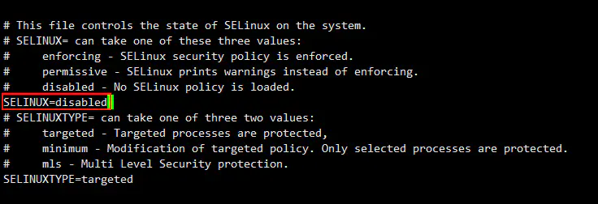

## K8s 集群加入节点

当现有k8s集群已经没有资源可分配或者已经无法满足当前的需求情况时，我们可以向现有的k8s 集群添加 node节点来满足我们的需求

### 准备

yum 相关的操作手册，在另一篇文章中，如果了解yum相关操作可直接忽略，否则先看一下yum的文章有个 大概的认识。

我们需要安装的软件包如下：

- `kubeadm`：用来初始化集群的指令。
- `kubelet`：在集群中的每个节点上用来启动 pod 和容器等。
- `kubectl`：用来与集群通信的命令行工具。


1、安装yum-utils

yum-config-manager是用来管理 yum 的仓库地址的，使用 config-manager可以开启或者关闭某个 repo仓库地址


2、配置  docker 数据源

在yum.repo.d 目录下添加 docker 镜像地址

**docker-ce.repo**

```
[docker-ce-stable]
name=Docker CE Stable - $basearch
baseurl=https://mirrors.aliyun.com/docker-ce/linux/centos/7/$basearch/stable
enabled=1
gpgcheck=1
gpgkey=https://mirrors.aliyun.com/docker-ce/linux/centos/gpg

[docker-ce-stable-debuginfo]
name=Docker CE Stable - Debuginfo $basearch
baseurl=https://mirrors.aliyun.com/docker-ce/linux/centos/7/debug-$basearch/stable
enabled=0
gpgcheck=1
gpgkey=https://mirrors.aliyun.com/docker-ce/linux/centos/gpg

[docker-ce-stable-source]
name=Docker CE Stable - Sources
baseurl=https://mirrors.aliyun.com/docker-ce/linux/centos/7/source/stable
enabled=0
gpgcheck=1
gpgkey=https://mirrors.aliyun.com/docker-ce/linux/centos/gpg

[docker-ce-edge]
name=Docker CE Edge - $basearch
baseurl=https://mirrors.aliyun.com/docker-ce/linux/centos/7/$basearch/edge
enabled=0
gpgcheck=1
gpgkey=https://mirrors.aliyun.com/docker-ce/linux/centos/gpg

[docker-ce-edge-debuginfo]
name=Docker CE Edge - Debuginfo $basearch
baseurl=https://mirrors.aliyun.com/docker-ce/linux/centos/7/debug-$basearch/edge
enabled=0
gpgcheck=1
gpgkey=https://mirrors.aliyun.com/docker-ce/linux/centos/gpg

[docker-ce-edge-source]
name=Docker CE Edge - Sources
baseurl=https://mirrors.aliyun.com/docker-ce/linux/centos/7/source/edge
enabled=0
gpgcheck=1
gpgkey=https://mirrors.aliyun.com/docker-ce/linux/centos/gpg

[docker-ce-test]
name=Docker CE Test - $basearch
baseurl=https://mirrors.aliyun.com/docker-ce/linux/centos/7/$basearch/test
enabled=0
gpgcheck=1
gpgkey=https://mirrors.aliyun.com/docker-ce/linux/centos/gpg

[docker-ce-test-debuginfo]
name=Docker CE Test - Debuginfo $basearch
baseurl=https://mirrors.aliyun.com/docker-ce/linux/centos/7/debug-$basearch/test
enabled=0
gpgcheck=1
gpgkey=https://mirrors.aliyun.com/docker-ce/linux/centos/gpg

[docker-ce-test-source]
name=Docker CE Test - Sources
baseurl=https://mirrors.aliyun.com/docker-ce/linux/centos/7/source/test
enabled=0
gpgcheck=1
gpgkey=https://mirrors.aliyun.com/docker-ce/linux/centos/gpg

[docker-ce-nightly]
name=Docker CE Nightly - $basearch
baseurl=https://mirrors.aliyun.com/docker-ce/linux/centos/7/$basearch/nightly
enabled=0
gpgcheck=1
gpgkey=https://mirrors.aliyun.com/docker-ce/linux/centos/gpg

[docker-ce-nightly-debuginfo]
name=Docker CE Nightly - Debuginfo $basearch
baseurl=https://mirrors.aliyun.com/docker-ce/linux/centos/7/debug-$basearch/nightly
enabled=0
gpgcheck=1
gpgkey=https://mirrors.aliyun.com/docker-ce/linux/centos/gpg

[docker-ce-nightly-source]
name=Docker CE Nightly - Sources
baseurl=https://mirrors.aliyun.com/docker-ce/linux/centos/7/source/nightly
enabled=0
gpgcheck=1
gpgkey=https://mirrors.aliyun.com/docker-ce/linux/centos/gpg			
```

```sh
# 开启docker-ce 的仓库
yum-config-manager --enablerepo=docker
```


3、添加kubernetes 的 阿里云仓库

**kubernetes.repo**

```
[kubernetes]
name=Kubernetes
baseurl=https://mirrors.aliyun.com/kubernetes/yum/repos/kubernetes-el7-x86_64
enabled=1
gpgcheck=0
repo_gpgcheck=0
gpgkey=https://mirrors.aliyun.com/kubernetes/yum/doc/yum-key.gpg
https://mirrors.aliyun.com/kubernetes/yum/doc/rpm-package-key.gpg
```

开启kubernetes 的仓库

```sh
[root@k8s-slave3 yum.repos.d]# yum-config-manager --enablerepo=kubernetes
```


4、更新 yum源，并且生成缓存

```sh
yum clean all && yum updaye && yum makecache
```


5、安装 docker-ce

因为我们需要安装特定的版本，所以我需要找到我当前需要的版本进行安装

7、安装 kubeadm

kubeadm的作用是 来为我们生成与master api-server 交互的tls 证书与 jwt token，并且告知master 有新的节点加入，具体细节将在下面介绍

```sh
# 安装kubeadm
[root@k8s-slave3 yum.repos.d]# yum install kubeadm-1.18.1-0.x86_64
```


8、安装kubectl

kubectl是与 api-server进行交互的 客户端工具，一般在master节点使用

```sh
# 安装kubeadm
[root@k8s-slave3 yum.repos.d]# yum install kubectl-1.18.1-0.x86_64
```


到这里我们已经把需要的软件都安装完成了，接下来我们需要对系统进行一些设置，才可以运行kubelet


### 系统设置

1、关闭 swap 分区

 如果开启了 swap 分区，kubelet 可能会启动失败，故需要在每台机器上关闭 swap 分区： 

```bash
sudo swapoff -a
```

为了防止开机自动挂载 swap 分区，可以注释 `/etc/fstab` 中相应的条目：

```bash
sudo sed -i '/ swap / s/^\(.*\)$/#\1/g' /etc/fstab
```


2、 关闭selinux，使容器能够访问到宿主机文件系统 

- 永久关闭 selinux，selinux的配置文件在 /etc/selinux/config 文件中

  将【SELINUX】设置为【disabled】 

  

  

- 临时关闭selinux

  ```bash
  setenforce 0
  ```

  

3、 配置系统路由参数，防止kubeadm报路由警告 

 在【/etc/sysctl.d/】目录下新建一个Kubernetes的配置文件【kubernetes.conf】，并写入如下内容： 

```
net.bridge.bridge-nf-call-ip6tables = 1
net.bridge.bridge-nf-call-iptables = 1
```

运行如下命令使配置生效

```bash
sysctl --system
```


### 配置启动参数

1、配置kubelet 启动参数

（1）kubelet 使用的cgroup driver 需要与 docker 使用的一致

  docker info 查看 docker使用的cgroup驱动

```bash
[root@k8s-slave3 yum.repos.d]# docker info
Client:
 Context:    default
 Debug Mode: false
 Plugins:
  app: Docker App (Docker Inc., v0.9.1-beta3)
  buildx: Build with BuildKit (Docker Inc., v0.5.1-docker)

 ...忽略
 Cgroup Driver: cgroupfs
 Cgroup Version: 1
 ...忽略
```


（2）设置 kubelet 启动配置文件，文件位置在 /lib/systemd/system/kubelet.service.d/目录下，文件名称为：10-kubeadm.conf

```bash
[Service]
Environment="KUBELET_KUBECONFIG_ARGS=--bootstrap-kubeconfig=/etc/kubernetes/bootstrap-kubelet.conf --kubeconfig=/etc/kubernetes/kubelet.conf"
Environment="KUBELET_CONFIG_ARGS=--config=/var/lib/kubelet/config.yaml"

# 将kubelet的【cgroup-driver】也修改为【cgroupfs】
Environment="KUBELET_CGROUP_ARGS=--cgroup-driver=systemd"
# This is a file that "kubeadm init" and "kubeadm join" generates at runtime, populating the KUBELET_KUBEADM_ARGS variable dynamically
EnvironmentFile=-/var/lib/kubelet/kubeadm-flags.env
# This is a file that the user can use for overrides of the kubelet args as a last resort. Preferably, the user should use
# the .NodeRegistration.KubeletExtraArgs object in the configuration files instead. KUBELET_EXTRA_ARGS should be sourced from this file.
EnvironmentFile=-/etc/sysconfig/kubelet
ExecStart=
ExecStart=/usr/bin/kubelet $KUBELET_KUBECONFIG_ARGS $KUBELET_CONFIG_ARGS $KUBELET_CGROUP_ARGS  $KUBELET_KUBEADM_ARGS $KUBELET_EXTRA_ARGS

```


(3) 重载kubelet配置文件

```bash
systemctl daemon-reload
```


(4)  设置kubelet开机启动 

```bash
systemctl enable kubelet
```


### 将当前节点加入集群


#### 查看master节点的token

```bash
kubectl token list

TOKEN                    TTL  EXPIRES              USAGES           DESCRIPTION            EXTRA GROUPS
8ewj1p.9r9hcjoqgajrj4gi  23h  2018-06-12T02:51:28Z authentication,  The default bootstrap  system:
                                                   signing          token generated by     bootstrappers:
                                                                    'kubeadm init'.        kubeadm:
                                                                                           default-node-token

```

 默认情况下，令牌会在24小时后过期。如果要在当前令牌过期后将节点加入集群，则可以通过在控制节点上运行以下命令来创建新token： 

```bash
kubeadm token create
```

输出类似于以下内容：

```console
5didvk.d09sbcov8ph2amjw
```

如果你没有 `--discovery-token-ca-cert-hash` 的值，则可以通过在控制节点上执行以下命令链来获取它：

```bash
openssl x509 -pubkey -in /etc/kubernetes/pki/ca.crt | openssl rsa -pubin -outform der 2>/dev/null | \ openssl dgst -sha256 -hex | sed 's/^.* //'
```

输出类似于以下内容：

```console
8cb2de97839780a412b93877f8507ad6c94f73add17d5d7058e91741c9d5ec78
```


#### 将现有节点加入到 k8s 集群

在当前节点执行

```bash
kubeadm join --token <token> <control-plane-host>:<control-plane-port> --discovery-token-ca-cert-hash sha256:<hash>
```

这里特别说明一下，token 与 所需要的 sha256串已经 通过上面的步骤生成了

control-pllain-host 、plan-port： 值得是master节点 api-server监听的地址与端口

<br/>

然后在 master节点执行 kubectl get node 查看当前节点是否被加入到进群中去

```bash
[root@k8s-master ~]# kubectl get no
NAME         STATUS   ROLES    AGE   VERSION
k8s-master   Ready    master   88d   v1.18.0
k8s-slave1   Ready    <none>   88d   v1.18.0
k8s-slave2   Ready    <none>   88d   v1.18.0
k8s-slave3   Ready    <none>   91m   v1.18.0
```


<br/>

如果执行 join 操作时，出现以下错误信息：

```
network: failed to set bridge addr: "cni0" already has an IP address different from xx.xx.xx.xx/24
```

那么执行以下操作步骤即可：

```bash
#在node节点上进行操作
kubeadm reset
iptables -F && iptables -t nat -F && iptables -t mangle -F && iptables -X
docker container prune
systemctl stop kubelet
systemctl stop docker
##cni 容器网络接口
rm -rf /var/lib/cni/
rm -rf /var/lib/kubelet/*
rm -rf /etc/cni/
ifconfig cni0 down
ifconfig flannel.1 down
ifconfig docker0 down
ip link delete cni0
ip link delete flannel.1
##重启kubelet
systemctl restart kubelet
##重启docker
systemctl restart docker
```