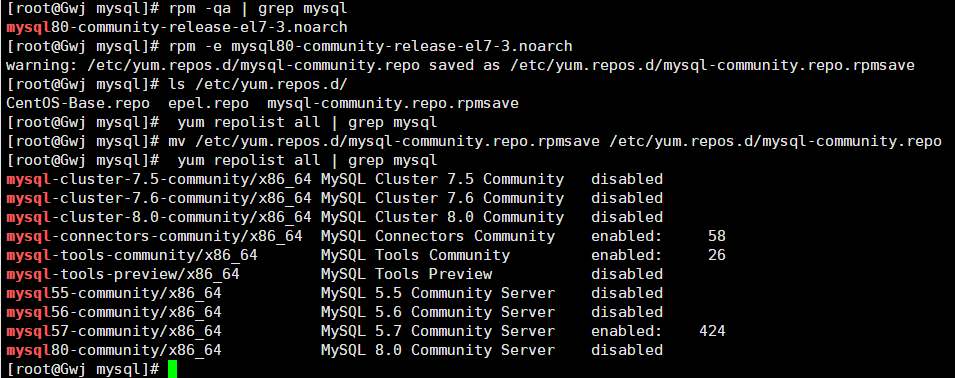

## yum仓库管理 yum-config-manager

 

### 简介

```
# yum 主要功能是更方便的添加/删除/更新RPM 包，自动解决包的倚赖性问题，便于管理大量系统的更新问题。
# yum 可以同时配置多个资源库(Repository)，简洁的配置文件（/etc/yum.conf），自动解决增加或删除
```

在安装mysql的时候自己错误地为centos7安装了linux8版的mysql rpm包，导致查看已有关于mysql的资源库时有一些不需要的库，这时候我们就需要通过yum-config-manager命令对资源库进行管理。

 

yum-config-manager命令的本质是对`/etc/yum.repos.d/`（库数据的储存位置）文件夹下文件的增删查改，推荐使用yum-config-manager命令进行改动

 

### 查询仓库内容

```
yum repolist all # 显示所有资源库
yum repolist enabled # 显示所有已启动的资源库
yum repolist disabled # 显示所有被禁用的资源库
```

可以搭配grep使用,例如

```
yum repolist all | grep mysql
```

 

### 添加repository

```
yum-config-manager --add-repo repository_url
```

 

### 切换库中资源---禁用+启用

```
yum-config-manager --disable itemName
yum-config-manager --enable itemName
```

或者直接编辑`/etc/yum.repos.d/`下的对应资源库文件

```
enabled=0 #禁用
enabled=1 #禁用
```

**如果同时启用了多个版本，安装时会自动选择新版本**

 

### 删除仓库

在`/etc/yum.repos.d/`下手动删除对应repo文件即可，但请注意，这会使得该库中所有信息被删除

例如：经查询，该库中有许多配置项



可能大多数程序员有点“整理资料强迫症”，但是如果我们仅仅要除去8.0的配置项是没有必要的，因为库中的内容其实就相当于参数，只是一条数据，知道disable了不使用的项，其实留着也没关系