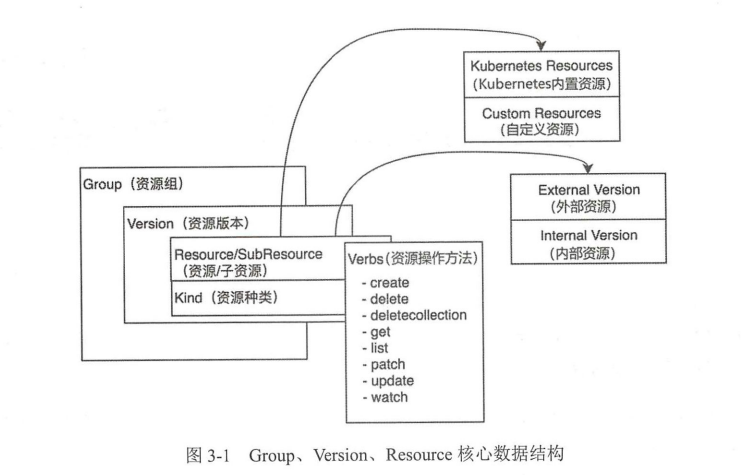

## Group、Version、Resource

在Kuberntes 体系架构中，资源是kuberntes最重要的概念，kuberntes 虽然有相当复杂和众多的功能，但本之还是一个资源控制系统-- 注册、管理、调度资源并维护资源的状态

kubernetes 将资源这个概念进行拆分后得到以下几种数据机构：

- Group：被称为资源组，在kubernetes API Server 中可以称为 APIGroup
- Version：被称为资源版本，在kubernetes API Server 中可称为APIVersions
- Resource：被称为资源，在Kubernetes API Server 中可称其为 APIResource
- Kind： 资源种类，描述Resource 的种类，与Resource 为统一级别

kuberntes 支持多种Group，每个Group支持多个Verion，每个Version 支持多个Resource，其中部分资源同时会拥有自己的子资源，比如  Pod 拥有 pod/logs 子资源，deployment 拥有  status 子资源

资源组、资源版本、资源、子资源的完整表现形式为

> <group>/<version>/<resource>/ subresource 

以常用的 Deployment 资源为例，其完整表 现形式为 apps/vl/ deployments/status 

资源对象 (Resource Object ）在本书中也是一个常用概念，由“资源组＋ 资源版本＋资源种类”组成，并在实例化后表达一个资源对象，例如 Deployment 源实例化后拥有资源组、资源版本及资源种类，其表现形式为＜group>/<version>, Kind <kind＞，例如 apps/v1, Kind= Deployment

每一个资源都拥有一定数量的资源操作方法，（Verbs），资源操作方法用于ETCD 存储集群中对资源的增、删、改、查操作，目前kubernetes 支持8中针对资源的操作方法，包括

- create
- delete
- deletecollection
- get
- list
- patch
- update
- watch

### 资源版本

每一种资源都至少对应两个版本，分别为外部版本（Externel Version）、内部版本（Internel Version），外部版本用于对暴露给用户请求的接口所使用的资源对象，内部版本不对外暴露，仅在kubernetes api server 内部使用

kubernetes 资源也可以分为两种，分别是Kubernetes Resource（kubernetes 内部资源）和 Custom Resource （自定义资源），我们可以用过自定义 CRD 来实现自定义资源，它允许用户将自己自定义的资源添加的系统中，并且

### ResourceList

Kubernetes Group、Version、Resource 等核心数据结构放在vender/k8s.io/apimachinery/pkg/apis/meta/v1 目录中，它包含了kuberneyes 使用的核心数据结构，比如

