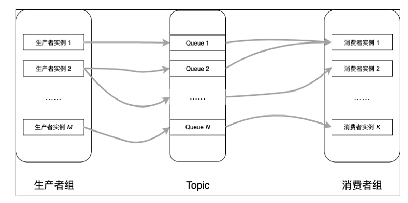
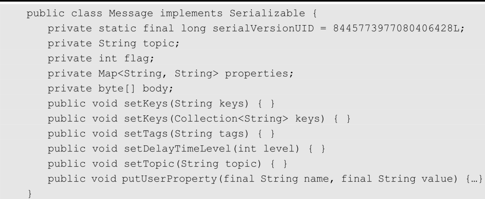

## RocketMQ 概览

RocketMQ 支持3中消息，普通消息（并发消息）、顺序消息、事务消息

RocketMQ 支持3种发送方式：同步发送、异步发送、单向发送

RocketMQ 生产者最佳实践和总结



**生产者组：** 一个逻辑概念，在使用生产者实例的时候需要指定一个组名。一个生产者组可以生产多个Topic的消息。

**生产者实例：** 一个生产者组部署了多个进程，每个进程都可以称为一个生产者实例。

**Topic：** 主题名字，一个Topic由若干Queue组成。

RocketMQ 客户端中的生产者有两个独立实现类：

- DefaultMQProducer和 
- TransactionMQProducer。
- 前者用于生产普通消息、顺序消息、单向消息、批量消息、延迟消息，后者主要用于生产事务消息。


Message 消息体的构成如下：



```
Topic：主题名字，可以通过RocketMQ Console创建。

Flag：目前没用。

Properties：消息扩展信息，Tag、keys、延迟级别都保存在这里。

Body：消息体，字节数组。需要注意生产者使用什么编码，消费者也必须使用相同编码解码，否则会产生乱码。

setKeys（）：设置消息的key，多个key可以用MessageConst.KEY_SEPARATOR（空格）分隔或者直接用另一个重载方法。如果 Broker 中 messageIndexEnable=true 则会根据 key创建消息的Hash索引，帮助用户进行快速查询。

setTags（）：消息过滤的标记，用户可以订阅某个Topic的某些Tag，这样Broker只会把订阅了topic-tag的消息发送给消费者。

setDelayTimeLevel（）：设置延迟级别，延迟多久消费者可以消费。

putUserProperty（）：如果还有其他扩展信息，可以存放在这里。内部是一个Map，重复调用会覆盖旧值。
```


RcoketMQ 支持普通消息、分区有序消息、全局有序消息、延迟消息、事务消息

普通消息：普通消息也称为并发消息，和传统的队列相比，并发消息没有顺序，但是生产消费都是并行进行的，单机性能可达十万级别的TPS。

分区有序消息：与Kafka中的分区类似，把一个Topic消息分为多个分区“保存”和消费，在一个分区内的消息就是传统的队列，遵循FIFO（先进先出）原则。

全局有序消息：如果把一个 Topic 的分区数设置为 1，那么该 Topic 中的消息就是单分区，所有消息都遵循FIFO（先进先出）的原则。

延迟消息：消息发送后，消费者要在一定时间后，或者指定某个时间点才可以消费。在没有延迟消息时，基本的做法是基于定时计划任务调度，定时发送消息。在 RocketMQ中只需要在发送消息时设置延迟级别即可实现。

事务消息：主要涉及分布式事务，即需要保证在多个操作同时成功或者同时失败时，消费者才能消费消息。RocketMQ通过发送Half消息、处理本地事务、提交（Commit）消息或者回滚（Rollback）消息优雅地实现分布式事务。