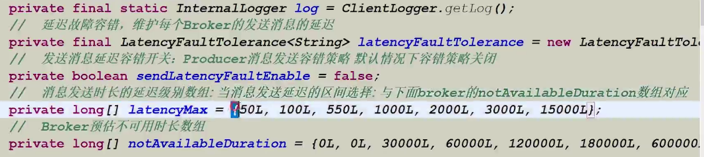

## Producer

Producer 默认有两个实现，分别为 DefaultMQProducer 与 TransactionMQProducer 分别对应 普通的MQ消息生产者与 事务消息生产者，两者都继承于ClientConfig 类

### 核心参数

producerGroup: 组名称

createTopicKey：需要创建的topic名称

defaultTopicQueueNumbers：默认的topic 队列数量

sendMsgTimeout：发送消息的超时时间

compressMsgBodyOverHowmush：消息是默认压缩的，消息超过4096时，自动压缩

retryTimesWhenSendFailed：消息发送失败时，默认的重试次数

retryAnotherBrokerWHENotStoreOk：没有存储成功时，是否对其他broker进行存储，默认为false

maxMessageSize：最大的消息限制，默认128K

heartbeatBrokerInterval：发送心跳的间隔机制

instanceName： 设置实例的名称，一个NameServer 一个实例

persistanceConsumerOffsetInterval：

clientConfig：发送端的配置信息

- 这是发送端的IP：clientIP
- 设置发送端的实例名称
- 设置发送端回调的线程数

accessModel：设置访问的方式，分别为CLOUD 与 LOCAL，如果mq依托于 云平台，则设置为CLOUD

> 不建议设置一些和消息性质相关的参数，比如maxMesageSize


### 消息补偿

当发送消息时，可以实现SendCallback接口，进行发送信息完成后的处理，判断是否成功或者失败，代码示例：

```java
producer.send(message, new SendCallback() {
                @Override
                public void onSuccess(SendResult sendResult) {

                    MessageQueue messageQueue = sendResult.getMessageQueue();
                    String msgId = sendResult.getMsgId();
                    SendStatus sendStatus = sendResult.getSendStatus();

                    System.out.println(messageQueue);
                    System.out.println(msgId);
                    System.out.println(sendStatus);

                }

                @Override
                public void onException(Throwable e) {

                    if (e != null){
                        System.err.println(e);
                    }

                }
            });
```


### 自定义发送队列

我们可以通过实现MessageQueueSelector 来选择需要发送到Topic的 哪一个队列中，其中MessageQueueSelector 的实现如下：

```java
 Object arg = null;

producer.send(null, new MessageQueueSelector() {
     @Override
     public MessageQueue select(List<MessageQueue> mqs, Message msg, Object arg) {
         return null;
     }
}, arg);
```

我们可以传入自定的参数arg，我们传入的arg 参数与 select 方法中的 arg 参数是一致的


### MQ容错策略

MQ 所谓的容错策略是指当 producer client 向broker 发送消息时，如果消息发送的时间比较长，可能由于网络慢或者由于Broker 端处理慢导致的发送时间延长，producer client 会根据实际的发送时长来判断broker 是否可用，举个例子：

假如 producer client 发送消息的是肠胃 550ms - 1000ms之间，那么producer client 就会认为 发送的目标broker 可能存在问题，就会在30000ms 内，不再向有问题的broker 发送信息，如果为 1000ms-2000ms，那么client 端预估 broker 在 60000ms 之内是不可用的，在下次发送时，就会选择其他的broker 进行发送

Broker 的容错策略如下：



- sendLatecyFaultEnable 代表容错策略是否开启
- latencyMax ： client 发送消息到broker 的 延时时长，既根据发送到broker的具体时长来判断broker 到底多长时间内不可用
- notAvailabelDuration：根据发送的延时时长依照latencyMax 来判断当前broker 是否可用，或者多长时间内不可用


### 发送消息的返回状态

- SEND_OK 发送成功
- FLUSH_DISK_TIMEOUT: 消息发送成功，服务器刷盘的时候失败了
- FLUSH_SLAVE_TIMEOUT:  主从同步时，同步到slave 刷盘失败
- SLAVE_NOT_AVALIBALE: 消息发送成功了，但是slave 不可用。只有主节点宕机消息就会丢失
- 除了第一种，后边第三种都不能保证消息百分之百的投递成功，消息自己自定义的重新投递


## 消息分类


### 延迟消息

延迟消息 表示说当我们发送消息时，consumer 不能立刻消费，而是在延迟时间过去之后才可以进行消费

延迟消息主要有一下两个特点：

- 延迟消息并不是在client 端延迟发送，而是消息发送到broker 后，要特定的时间才会被consumer 消费
- 延迟消息目前只支持固定精度的定时消息


延迟消息通过 设置 Message 类的 delayTimeLevel 来设置消息的延迟级别，目前rocketmq支持的延迟级别如下：

```java
String messageDelayLevel = "1s 5s 10s 30s 1m 2m 3m 4m 5m 6m 7m 8m 9m 10m 20m 30m 1h 2h"
```

这里设置级别并不是说设置具体的时间，而是依据messageDelayLevel 字符串 中的每一个时间的位置进行设置，比如 1s 就是 level 为1，5s 就是level 为2


**MessageStoreConfig配置类 & ScheduleMessageService 任务类**

MessageStoreConfig ：用来保存Message 的策略配置信息，可以设置设置固定精度的延迟时间级别

ScheduleMessageService ：定时推动消息给Consumer 的 定时任务类


需要在Messgae 上设置 DelayTimeLevel 来进行延长的时间，但是只支持固定的延迟时间，

MessageStoreConfig： 设置固定精度的延迟时间级别


ScheduleMessageService


### Message

topic：主题名称

tags：标签，消息规律

keys：用户自定义的Key

body：消息内容

、

### send

msg：消息对象

selector：

arg：

sendCallback： 一步发送

timeout：消息发送超市


### sendResult

status：发送状态


### 注意

默认topic下有四个队列


### 消息类型

消息类型默认包含以下几种：

- 单向消息
- 同步消息
- 异步消息
- 事务消息
- 顺序消息
- 延迟消息