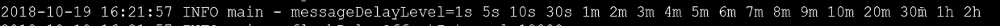

## Consumer


Cosumer 一般用于消费消息，有两种实现，分别为DefaultPushConsumer 与 DefaultPullConsumer，前者不需要我们手动存储 offset ，后者需要自定义存储offset的方式


###  参数

nameServ：查询broker 的nameSer地址

consumerFronWhere：从哪里开始进行消费

- first：从开头进行消费
- last：从结尾进行消费
- timestamp：自定义时间点进行消费


### Tag 过滤

tag过滤表达式主要有一下几种，


### 顺序消费与并发消费

RocketMQ 默认支持顺序消费与并发消费，所谓并发消费就是普通的消费方式，顺序消费又分为全局顺序消费与局部顺序消费。

消费的回调接口分别对应MessageListenerConcurrenly 与 MessageListenerOrderly 两种。默认都是返回Concurrent'lyStatus代表消息是否消费成功，如果没有消费成功，MQ 则会根据 延迟策略再次重新延迟推送消息给 consumer 端。

MessageListenerOrderly 是为每一个topic 中的queue 设置一个thread 进行监听，保证了单个queue的有序性

代码示例：

```java
consumer.registerMessageListener(new MessageListenerConcurrently() {
            @Override
            public ConsumeConcurrentlyStatus consumeMessage(List<MessageExt> msgs, ConsumeConcurrentlyContext context) {
                context.setAckIndex(1);
                return ConsumeConcurrentlyStatus.CONSUME_SUCCESS;
            }
        });
```


### 消费方式（广播、集群）


### 消费成功或者失败

当消费失败后，MQ 则会根据某些延迟策略进行失败重试，重试策略如下：

messageDelayLevel = 1s 5s 10s 30s 1m 2m 3m 4m 5m 6m 7m 8m 9m 10m 20m 30m 1h 2h

我们也可以通过设置最大的重试时间，既当延迟


### 参数

DefaultMQPushConsumer

ConsumerFromWhehre：从哪里开始消费消息，First、Last


subsric：订阅 （可以设置tag 来决定订阅哪一种类型）

registerMessageListener: 监听发送的消息，并发读取，顺序读取


### 概念

Tag 用于过滤消息

subscribe（"topicName","tagName"） 订阅主题，过滤消息


### 注意

消息消费失败，broker自动重试




reconsumeTimes：重试的次数，如果重试到达指定次数，可以告诉broker 不在重试


MessageTxt 保存了 broker 端 失败重试的次数


