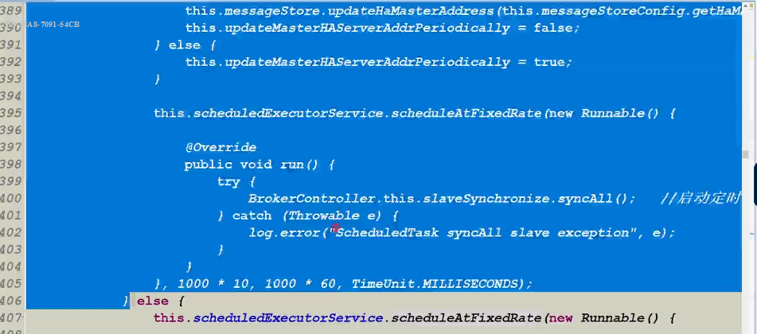
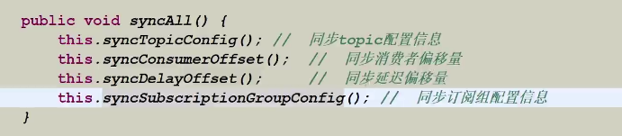
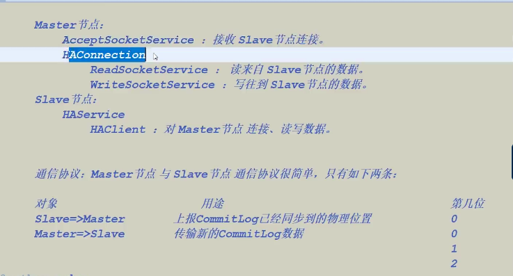
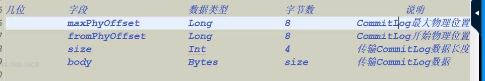
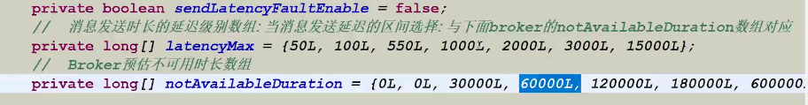
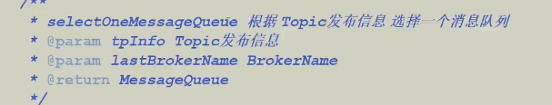
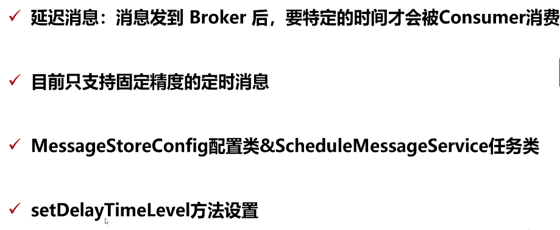
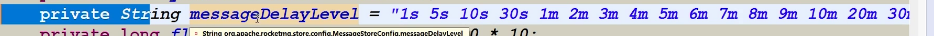
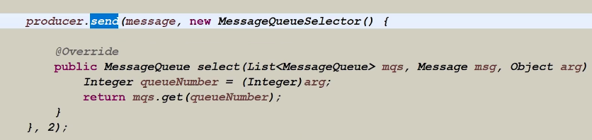

## 集群

### 四种集群模式

- 单点模式
- 主从模式
- 双主
- 双主双从、多主多从模式


### 主从同步

Master-Slave 主从同步的主要内容包括 ：

- 数据内容（commit log，消息存储的实际信息）
- 元数据信息（配置信息）

元数据信息主要保存了一些配置项，Broker 启动时会首先识别自己的角色，如果为Slave 则启动同步任务，主动从master 进行同步，元数据信息是采用定时任务机制进行同步的，元数据同步是采用Netty 实现的

元数据信息主要包括以下内容：

- 同步topic配置信息
- 同步消费者偏移量
- 同步延迟偏移量
- 订阅配置信息

数据消内容则是指commit log，commit log 是实时同步的，既 master 存储到磁盘后，就会找到相应的 slave 进行数据落盘，Commit log 是用原生socket 实现同步的，因为原生socket 性能是最好的

Master 与 Slave 对 CommitLog 进行不断的对比，同步的过程

> 元数据信息丢失，是可以恢复的，但是commit log 的数据信息丢失，是无法恢复的


消息同步的代码实现：HAService，HAConnection、WaitNotifyObject，这三个类主要就是针对 commit 类进行同步


代码实现：

BrokerController



每隔一分钟就进行元数据的同步，同步的内容有：








slave-> master 上报 slave同步的 commit log 位置

master-> slave 传输新的commit log 数据，传输commit log 数据


### TopicConfig

topic 的配置信息类

```
  private static final String SEPARATOR = " ";
    public static int defaultReadQueueNums = 16;
    public static int defaultWriteQueueNums = 16;
    private String topicName;
    private int readQueueNums = defaultReadQueueNums;
    private int writeQueueNums = defaultWriteQueueNums;
    private int perm = PermName.PERM_READ | PermName.PERM_WRITE;
    private TopicFilterType topicFilterType = TopicFilterType.SINGLE_TAG;
    private int topicSysFlag = 0;
    private boolean order = false;
```


### 消息同步发送

同步发送消息:

producer.send(msg)


异步发送消息：

producer.send(msg, new SendCallback(){

​		//some method impletion

})

以上两种发送消息都是通过 DefaultMQProducerImpl 实现的


消息发送的时长



当发送消息需要50ms 时，那么该brolker 是正常的额，如果是 100ms 也是正常的，当消息发送时长为550ms 时间，rocketmq 就会认为该broker 在 30s 之内是不可用的，依据上表，以此类推 ，针对这些broker 做了容错策略，优先选择其他正常的broker 来进行传输


同步发送消息与异步发送消息的区别：


### 选择topic 中的队列



通过 MessageQueueSelector 实现


消息


### netty 通信状态

### 消息发送的返回状态

SEND_OK 发送成功

FLUSH_DISK_TIMEOUT: 消息发送成功，服务器刷盘的时候失败了

FLUSH_SLAVE_TIMEOUT:  主从同步时，同步到slave 刷盘失败

SLAVE_NOT_AVALIBALE: 消息发送成功了，但是slave 不可用。只有主节点宕机消息就会丢失

除了第一种，后边第三种都不能保证消息百分之百的投递成功，消息自己自定义的重新投递


### 消息的延迟投递




需要在Messgae 上设置 DelayTimeLevel 来进行延长的时间，但是只支持固定的延迟时间，

MessageStoreConfig： 设置固定精度的延迟时间级别



ScheduleMessageService：


### 自定义消息分发送规则

如何将消息发送到自定义的MessaeQueue

通过MessageQueueSelector 来进行选择发送到指定的消息队列

producer.send(msg,selector,obj)：obj 代表依赖选择queue策略的参数

