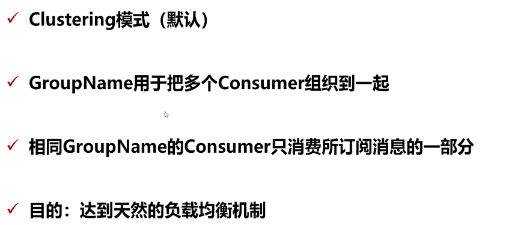
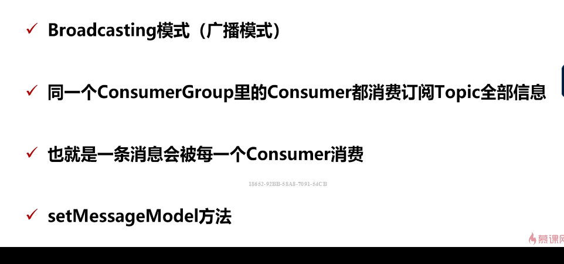

## 消费者核心详解

### PushConsumer 核心参数详解

consumeFromWhere 从哪里开始进行消费

- LastOffset
- FirtOffset
- ConsumerOffset：自己指定时间点

allocateMessageQueueStrategy：消费分配的策略，默认为AVG ，平均分配给每一个Consmer

举例如下：

1个topic ，3个queue，2个consumer ，既就是消费者如何消费队列中的数据，默认采用轮训的方式

subscription： 订阅的topic 地址以及设置tag 过滤

offsetStore：offset 的存储，分为LocalOffsetStore 与 remoteOffsetStore 既本地和远程两种策略，分别对应PushConsumer 与 PullConsumer（LocalStore）

consumeThreadMin/consumeThreadMax ：设置consumer 的并行度，如果设置为20，则代表有20个线程监听拉取数据

consumeConcurrentlyMaxSpan、pullThesholdForQueue：

pullinterval、pullBatchSize：主要进行消息拉取，第一个是消息拉取的时间间隔，第二个一次拉取多少数据，一般在PulConsumer 的时候需要制定

cosumeMessageBatchMaxSize：1，一次消息最多可以拉取多少条数据

subscribe（topicName，MessageSelector）：进行消息订阅，过滤消息

注册消息消费监听事，可以注册并发类型的监听者与顺序性的监听者，分比为MessageListenerConcurrently 与 MessageListenerOrderly（用于实现顺序消息）

consumeTimeout（设置消费的超时时间

maxReconsumeTimes：设置最大重试消费的次数，如果达到该次数则放入死信队列

messageModel：消费者模式

### PushConsumer 消费模式

PushConsumer的消费模式分为集群模式与 广播模式，也就是我们常说的 单点与订阅模式

集群模式天然的支持负载均衡

广播模式：

如果需要过去不同的tag对应的数据，那么只有广播模式可以，集群模式是不可以的，broker 会根据一定的负载策略将消息推动到consumer 但是消息是不全面的

### 偏移量 Offset

#### 消息存储核心-偏移量Offset

- offset 是消息消费进度的核心

- offset 指的时某个topic下的一条消息在某个message queue 的 位置，因为 每一个 topic 实际都对应一个commit log文件，而 topic 中的messgae queue 都对应一个逻辑队列既index文件用来存储实际内容 的 offset 地址

  

- 通过offset 可以进行定位到这条消息，通过 message queue 中存储的索引位置获取

- offset 的 存储分为远程文件类型与本地文件类型，既 对应 DefaultPushConsumer 与 DefaultPullConsumer

  

·

#### 集群模式-RemoteBrokerOffsetStoe 解析

- 默认集群模式 clustering 采用远程文件存储 offset
- 本质上是由于因为多消费模式，每个consumer 消费所订阅主题的一部分，所以将offset 维护在了 broker 上，当consumer group 中的consumer 需要读取消息时间，我们需要直到当前具体消费到的 offset 位置，因为是集群模式，topic 中的消息时大家来一起消费的，所以没有办法存在本地，既存在broker 端进行共享，offset 的存储也是有broker 来进行维护的
- 需要broker 控制 offset 的值，使用RemoteBrokerOffsetStore

#### 广播模式-LocalFileOffsetStore 解析

- 广播模式下，由于每个Consumer 都会受到消息并且消费
- 各个consumer 之间没有任何干扰，独立线程消费
- 所以使用LocalfileOffsetStore，也就是把offset 存储到本地

#### Pull 模式

pull 模式需要自己维护 offset

### 消费者的长轮询模式

DefaultPushConsumer 是使用长轮询模式来实现的，实际上是由consumer 自动进行消息拉取的

主流的消息获取方式

- push ：消息推送模式
- pull： 消息拉取模式

push 机制是 broker 主动将消息推动给 consumer 端进行消费，缺点如下：

- 加大broker 端的工作量
- consumer 处理能力不同，有的可能处理能力好，有的处理能力可能不好，那么当broker 推送消息给consumer 端的时间，消费端就无法控制推送的速率

pull 机制 是 consumer 主动从broker 进行消息拉取，这样的话 可以根据当前机器的处理能力来角色拉取的速率，缺点如下：

- 当broker 一个小时才收到一条消息时间，consumer 端就要不断询问 broker 端是否有消息产生，加大broker 端的压力，浪费性能，可以根据实际的业务量做取舍，到底多长时间进行一次拉取
- 需要自己记录offset 的偏移量，当下一次拉取的时候需要根据上次记录的offset值 再次进行拉取，避免重复消费

DefaultPushConsumer 是采用长轮询机制实现的，既主动方也是在client端，client 主动的将拉取请求发送给broker，而不是broker 推送给consumer 端

consumer 发送一个请求到broker 进行获取消息，broker 如果有消息会立即返回，如果没有消息时，会阻塞15s，如果还没有消息那么就给consumer 端一个响应，既不存在消息，否则返回具体的消息，阻塞的时候会每过5s进行一次check，如果存在消息那么返回，否则循环三次也就是15s再返回响应

> 长轮询机制解析？

### 主动拉取消息

rocket mq还提供了一种方式 用于获取消息，既 DefaultMQPullConsumer

Pull 方式主要做了三件事情：

- 需要获取message queue 并且遍历是否存在新的消息
- 维护 offset store （pull的方式需要自己维护）
- 根据不同的消息状态做不同的处理

