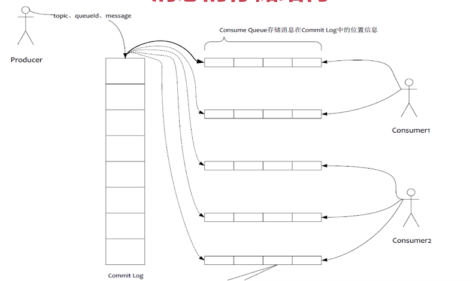

## RocketMQ 消息持久化

### 消息的存储结构

commit log 是进行实际的消息存储的

在rokectmq 中  Broker单个实例下所有的队列共用一个日志数据文件（即为CommitLog）来存储 ，broker 中对应的所有topic下的 message queue 数据都是存储在 与 broker 对应的commit log中的， 

rocket mq的存储是由commit log 与 consume queue 相互配合实现的，commit log 中存储的是实际的数据，consume queue 存储的则是指向 commit log 数据的索引，既该消息实际在commit log 中的什么位置，consume queue 则是逻辑队列

每一个topic 下的每一个message queue 都对应一个 cosume queue 文件，既索引文件，存储指向 commit log 的索引

rocket mq 是 顺序写，随机读的机制，消费端采用的是zero copy 机制，既 通过index从commit 中查找到具体的数据然后拷贝到 socket buffer 中

### 消息结构图

 消息存储架构图中主要有下面三个跟消息存储相关的文件构成。 

(1) CommitLog：消息主体以及元数据的存储主体，存储Producer端写入的消息主体内容,消息内容不是定长的。单个文件大小默认1G ，文件名长度为20位，左边补零，剩余为起始偏移量，比如00000000000000000000代表了第一个文件，起始偏移量为0，文件大小为1G=1073741824；当第一个文件写满了，第二个文件为00000000001073741824，起始偏移量为1073741824，以此类推。消息主要是顺序写入日志文件，当文件满了，写入下一个文件；

(2) ConsumeQueue：消息消费队列，引入的目的主要是提高消息消费的性能，由于RocketMQ是基于主题topic的订阅模式，消息消费是针对主题进行的，如果要遍历commitlog文件中根据topic检索消息是非常低效的。Consumer即可根据ConsumeQueue来查找待消费的消息。其中，ConsumeQueue（逻辑消费队列）作为消费消息的索引，保存了指定Topic下的队列消息在CommitLog中的起始物理偏移量offset，消息大小size和消息Tag的HashCode值。consumequeue文件可以看成是基于topic的commitlog索引文件，故consumequeue文件夹的组织方式如下：topic/queue/file三层组织结构，具体存储路径为：$HOME/store/consumequeue/{topic}/{queueId}/{fileName}。同样consumequeue文件采取定长设计，每一个条目共20个字节，分别为8字节的commitlog物理偏移量、4字节的消息长度、8字节tag hashcode，单个文件由30W个条目组成，可以像数组一样随机访问每一个条目，每个ConsumeQueue文件大小约5.72M；

(3) IndexFile：IndexFile（索引文件）提供了一种可以通过key或时间区间来查询消息的方法。Index文件的存储位置是：$HOME \store\index${fileName}，文件名fileName是以创建时的时间戳命名的，固定的单个IndexFile文件大小约为400M，一个IndexFile可以保存 2000W个索引，IndexFile的底层存储设计为在文件系统中实现HashMap结构，故rocketmq的索引文件其底层实现为hash索引

### PageCache

 页缓存（PageCache)是OS对文件的缓存，用于加速对文件的读写。一般来说，程序对文件进行顺序读写的速度几乎接近于内存的读写速度，主要原因就是由于OS使用PageCache机制对读写访问操作进行了性能优化，将一部分的内存用作PageCache。对于数据的写入，OS会先写入至Cache内，随后通过异步的方式由pdflush内核线程将Cache内的数据刷盘至物理磁盘上。对于数据的读取，如果一次读取文件时出现未命中PageCache的情况，OS从物理磁盘上访问读取文件的同时，会顺序对其他相邻块的数据文件进行预读取。 

在RocketMQ中，ConsumeQueue逻辑消费队列存储的数据较少，并且是顺序读取，在page cache机制的预读取作用下，Consume Queue文件的读性能几乎接近读内存，即使在有消息堆积情况下也不会影响性能。而对于CommitLog消息存储的日志数据文件来说，读取消息内容时候会产生较多的随机访问读取，严重影响性能。如果选择合适的系统IO调度算法，比如设置调度算法为“Deadline”（此时块存储采用SSD的话），随机读的性能也会有所提升。

另外，RocketMQ主要通过MappedByteBuffer对文件进行读写操作。其中，利用了NIO中的FileChannel模型将磁盘上的物理文件直接映射到用户态的内存地址中（这种Mmap的方式减少了传统IO将磁盘文件数据在操作系统内核地址空间的缓冲区和用户应用程序地址空间的缓冲区之间来回进行拷贝的性能开销），将对文件的操作转化为直接对内存地址进行操作，从而极大地提高了文件的读写效率（正因为需要使用内存映射机制，故RocketMQ的文件存储都使用定长结构来存储，方便一次将整个文件映射至内存）。

### 消息的同步刷盘

 (1) 同步刷盘：如上图所示，只有在消息真正持久化至磁盘后RocketMQ的Broker端才会真正返回给Producer端一个成功的ACK响应。同步刷盘对MQ消息可靠性来说是一种不错的保障，但是性能上会有较大影响，一般适用于金融业务应用该模式较多。 

### 消息的异步刷盘

 (2) 异步刷盘：能够充分利用OS的PageCache的优势，只要消息写入PageCache即可将成功的ACK返回给Producer端。消息刷盘采用后台异步线程提交的方式进行，降低了读写延迟，提高了MQ的性能和吞吐量。 

### 同步复制

同一组broker 有 master - slave 角色，当刷盘完成后将数据同步至 slave节点，等到slave 节点也存储成功则告诉producer 写入成功

### 异步复制

当master 写入成功后立即返回，告诉producer 数据发送成功，然后启动异步任务 将数据发送至slave

### 注意：

同步双写：异步刷盘的机制，既保证了高可用，又利用了 操作系统的page cache 缓存顺序写入

### 高可用机制

Master-Slave 高可用。区分master 与 slave的关键在于 配置文件中的brokerId 配置，brokerId为0表示 Master，否则表示为 Slave

Master 提供了读写的功能，Slave 提供了只读的功能

当Master 繁忙或者不可用时，可以自动切换到Slave 读取消息

当我们创建 message qeueu 时，我们可以将 messageQueue 创建在不同的broker 上，避免单点故障问题

自定义脚本实时监控 master 当 master 不可用时，可以将slave 节点的 brokerId设置为1，并且重启

### NameServer 协调

