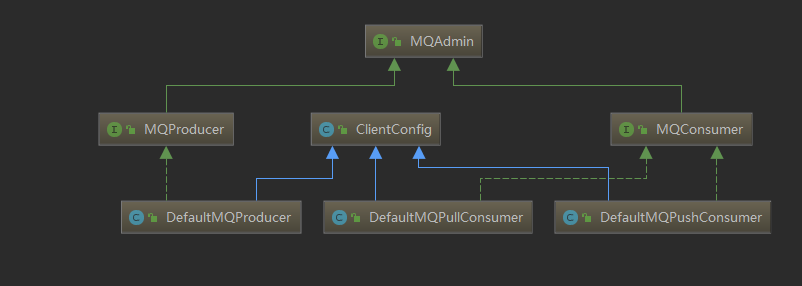
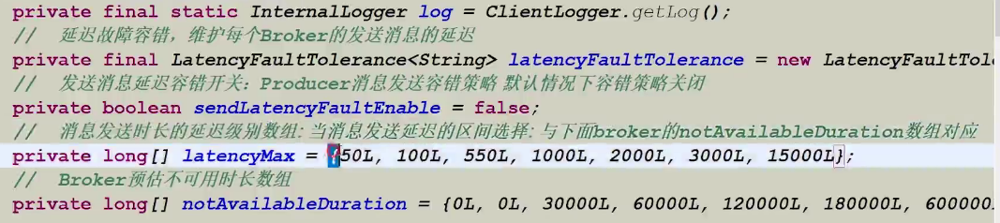
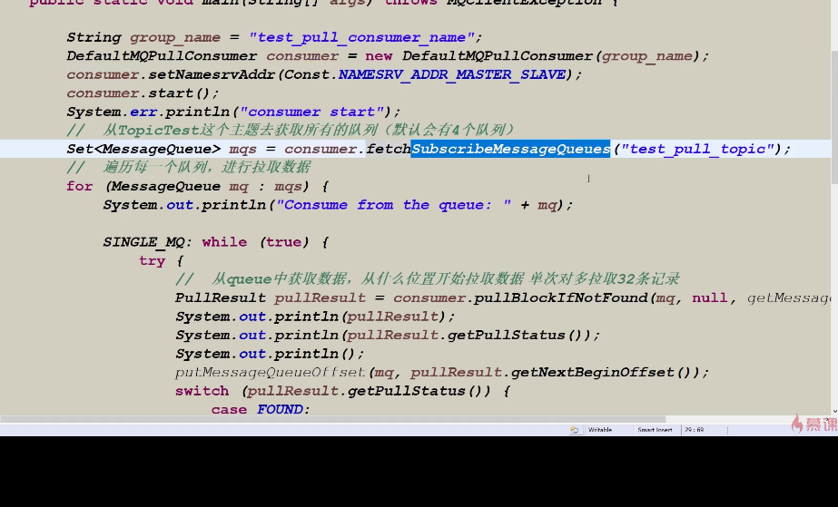

# MQ Client

MQClient 主要分为 MQ Producer 与 MQ Consumer ，一个是消息生产者，一个是消息消费者，两个都继承了共同的类 为 ClientConfig ，其基本结构类图如下：




- 其中MQAdmin 包装了对 MQ 集群的一些常用操作，比如 创建 topic 设置 topicKey 等等
- MQProducer 是 消息生产者
- MQConsumer 是 消息消费者
- ClientConfig 则是封装了针对客户端的一些通用配置项


## 客户端配置

 DefaultMQProducer、TransactionMQProducer、DefaultMQPushConsumer、DefaultMQPullConsumer都继承于ClientConfig类，ClientConfig为客户端的公共配置类。客户端的配置都是get、set形式，每个参数都可以用spring来配置，也可以在代码中配置，例如namesrvAddr这个参数可以这样配置，producer.setNamesrvAddr("192.168.0.1:9876")，其他参数同理。 

#### 客户端的公共配置

| 参数名                        | 默认值  | 说明                                                         |
| ----------------------------- | ------- | ------------------------------------------------------------ |
| namesrvAddr                   |         | Name Server地址列表，多个NameServer地址用分号隔开            |
| clientIP                      | 本机IP  | 客户端本机IP地址，某些机器会发生无法识别客户端IP地址情况，需要应用在代码中强制指定 |
| instanceName                  | DEFAULT | 客户端实例名称，客户端创建的多个Producer、Consumer实际是共用一个内部实例（这个实例包含网络连接、线程资源等） |
| clientCallbackExecutorThreads | 4       | 通信层异步回调线程数                                         |
| pollNameServerInteval         | 30000   | 轮询Name Server间隔时间，单位毫秒                            |
| heartbeatBrokerInterval       | 30000   | 向Broker发送心跳间隔时间，单位毫秒                           |
| persistConsumerOffsetInterval | 5000    | 持久化Consumer消费进度间隔时间，单位毫秒                     |


## Message 数据结构

RocketMQ 发送消息 都是通过将发送的内容包装为Message 对象进行发送，Message 配置项如下：

| Topic          | null | 必填，消息所属topic的名称                                    |
| -------------- | ---- | ------------------------------------------------------------ |
| Body           | null | 必填，消息体                                                 |
| Tags           | null | 选填，消息标签，方便服务器过滤使用。目前只支持每个消息设置一个tag |
| Keys           | null | 选填，代表这条消息的业务关键词，服务器会根据keys创建哈希索引，设置后，可以在Console系统根据Topic、Keys来查询消息，由于是哈希索引，请尽可能保证key唯一，例如订单号，商品Id等。 |
| Flag           | 0    | 选填，完全由应用来设置，RocketMQ不做干预                     |
| DelayTimeLevel | 0    | 选填，消息延时级别，0表示不延时，大于0会延时特定的时间才会被消费 |
| WaitStoreMsgOK | TRUE | 选填，表示消息是否在服务器落盘后才返回应答。                 |


## 消息发送的返回状态

当我们发送消息到RocketMQ后，RocketMQ 会返回一个 SendStatus 给我们，我们可以根据SendStatus 的状态，做一些补偿或者其他的处理操作

- **SEND_OK**

消息发送成功。要注意的是消息发送成功也不意味着它是可靠的。要确保不会丢失任何消息，还应启用同步Master服务器或同步刷盘，即SYNC_MASTER或SYNC_FLUSH。

- **FLUSH_DISK_TIMEOUT**

消息发送成功但是服务器刷盘超时。此时消息已经进入服务器队列（内存），只有服务器宕机，消息才会丢失。消息存储配置参数中可以设置刷盘方式和同步刷盘时间长度，如果Broker服务器设置了刷盘方式为同步刷盘，即FlushDiskType=SYNC_FLUSH（默认为异步刷盘方式），当Broker服务器未在同步刷盘时间内（默认为5s）完成刷盘，则将返回该状态——刷盘超时。

- **FLUSH_SLAVE_TIMEOUT**

消息发送成功，但是服务器同步到Slave时超时。此时消息已经进入服务器队列，只有服务器宕机，消息才会丢失。如果Broker服务器的角色是同步Master，即SYNC_MASTER（默认是异步Master即ASYNC_MASTER），并且从Broker服务器未在同步刷盘时间（默认为5秒）内完成与主服务器的同步，则将返回该状态——数据同步到Slave服务器超时。

- **SLAVE_NOT_AVAILABLE**

消息发送成功，但是此时Slave不可用。如果Broker服务器的角色是同步Master，即SYNC_MASTER（默认是异步Master服务器即ASYNC_MASTER），但没有配置slave Broker服务器，则将返回该状态——无Slave服务器可用。


## Producer

### 配置项

| producerGroup                    | DEFAULT_PRODUCER | Producer组名，多个Producer如果属于一个应用，发送同样的消息，则应该将它们归为同一组 |
| -------------------------------- | ---------------- | ------------------------------------------------------------ |
| createTopicKey                   | TBW102           | 在发送消息时，自动创建服务器不存在的topic，需要指定Key，该Key可用于配置发送消息所在topic的默认路由。 |
| defaultTopicQueueNums            | 4                | 在发送消息，自动创建服务器不存在的topic时，默认创建的队列数  |
| sendMsgTimeout                   | 10000            | 发送消息超时时间，单位毫秒                                   |
| compressMsgBodyOverHowmuch       | 4096             | 消息Body超过多大开始压缩（Consumer收到消息会自动解压缩），单位字节 |
| retryAnotherBrokerWhenNotStoreOK | FALSE            | 如果发送消息返回sendResult，但是sendStatus!=SEND_OK，是否重试发送 |
| retryTimesWhenSendFailed         | 2                | 如果消息发送失败，最大重试次数，该参数只对同步发送模式起作用 |
| maxMessageSize                   | 4MB              | 客户端限制的消息大小，超过报错，同时服务端也会限制，所以需要跟服务端配合使用。 |
| transactionCheckListener         |                  | 事务消息回查监听器，如果发送事务消息，必须设置               |
| checkThreadPoolMinSize           | 1                | Broker回查Producer事务状态时，线程池最小线程数               |
| checkThreadPoolMaxSize           | 1                | Broker回查Producer事务状态时，线程池最大线程数               |
| checkRequestHoldMax              | 2000             | Broker回查Producer事务状态时，Producer本地缓冲请求队列大小   |


### 消息类型

常见的消息类型一般分为以下几种，分别为：

- 同步消息
- 异步消息
- 延迟消息
- 顺序消息
- 事务消息

下面我们针对上面这几种消息类型做一下讲解

#### 同步消息


#### 异步消息


#### 延迟消息

延迟消息 表示说当我们发送消息时，consumer 不能立刻消费，而是在延迟时间过去之后才可以进行消费

延迟消息主要有一下两个特点：

- 延迟消息并不是在client 端延迟发送，而是消息发送到broker 后，要特定的时间才会被consumer 消费
- 延迟消息目前只支持固定精度的定时消息


延迟消息通过 设置 Message 类的 delayTimeLevel 来设置消息的延迟级别，目前rocketmq支持的延迟级别如下：

```java
String messageDelayLevel = "1s 5s 10s 30s 1m 2m 3m 4m 5m 6m 7m 8m 9m 10m 20m 30m 1h 2h"
```

这里设置级别并不是说设置具体的时间，而是依据messageDelayLevel 字符串 中的每一个时间的位置进行设置，比如 1s 就是 level 为1，5s 就是level 为2

定时消息（延迟队列）是指消息发送到broker后，不会立即被消费，等待特定时间投递给真正的topic。 broker有配置项messageDelayLevel，默认值为“1s 5s 10s 30s 1m 2m 3m 4m 5m 6m 7m 8m 9m 10m 20m 30m 1h 2h”，18个level。可以配置自定义messageDelayLevel。注意，messageDelayLevel是broker的属性，不属于某个topic。发消息时，设置delayLevel等级即可：msg.setDelayLevel(level)。level有以下三种情况：

- level == 0，消息为非延迟消息
- 1<=level<=maxLevel，消息延迟特定时间，例如level==1，延迟1s
- level > maxLevel，则level== maxLevel，例如level==20，延迟2h

定时消息会暂存在名为SCHEDULE_TOPIC_XXXX的topic中，并根据delayTimeLevel存入特定的queue，queueId = delayTimeLevel – 1，即一个queue只存相同延迟的消息，保证具有相同发送延迟的消息能够顺序消费。broker会调度地消费SCHEDULE_TOPIC_XXXX，将消息写入真实的topic。

需要注意的是，定时消息会在第一次写入和调度写入真实topic时都会计数，因此发送数量、tps都会变高。


#### 顺序消息

消息有序指的是一类消息消费时，能按照发送的顺序来消费。例如：一个订单产生了三条消息分别是订单创建、订单付款、订单完成。消费时要按照这个顺序消费才能有意义，但是同时订单之间是可以并行消费的。RocketMQ可以严格的保证消息有序。

顺序消息分为全局顺序消息与分区顺序消息，全局顺序是指某个Topic下的所有消息都要保证顺序；部分顺序消息只要保证每一组消息被顺序消费即可。

- 全局顺序 对于指定的一个 Topic，所有消息按照严格的先入先出（FIFO）的顺序进行发布和消费。 适用场景：性能要求不高，所有的消息严格按照 FIFO 原则进行消息发布和消费的场景
- 分区顺序 对于指定的一个 Topic，所有消息根据 sharding key 进行区块分区。 同一个分区内的消息按照严格的 FIFO 顺序进行发布和消费。 Sharding key 是顺序消息中用来区分不同分区的关键字段，和普通消息的 Key 是完全不同的概念。 适用场景：性能要求高，以 sharding key 作为分区字段，在同一个区块中严格的按照 FIFO 原则进行消息发布和消费的场景。


#### 事务消息

 RocketMQ事务消息（Transactional Message）是指应用本地事务和发送消息操作可以被定义到全局事务中，要么同时成功，要么同时失败。RocketMQ的事务消息提供类似 X/Open XA 的分布事务功能，通过事务消息能达到分布式事务的最终一致。 


### 消息补偿

当发送消息时，可以实现SendCallback接口，进行发送信息完成后的处理，判断是否成功或者失败，代码示例：

```java
producer.send(message, new SendCallback() {
                @Override
                public void onSuccess(SendResult sendResult) {

                    MessageQueue messageQueue = sendResult.getMessageQueue();
                    String msgId = sendResult.getMsgId();
                    SendStatus sendStatus = sendResult.getSendStatus();

                    System.out.println(messageQueue);
                    System.out.println(msgId);
                    System.out.println(sendStatus);

                }

                @Override
                public void onException(Throwable e) {

                    if (e != null){
                        System.err.println(e);
                    }

                }
            });
```


### 自定义发送队列

我们可以通过实现MessageQueueSelector 来选择需要发送到Topic的 哪一个队列中，其中MessageQueueSelector 的实现如下：

```java
 Object arg = null;

producer.send(null, new MessageQueueSelector() {
     @Override
     public MessageQueue select(List<MessageQueue> mqs, Message msg, Object arg) {
         return null;
     }
}, arg);
```

我们可以传入自定的参数arg，我们传入的arg 参数与 select 方法中的 arg 参数是一致的


### MQ容错策略

MQ 所谓的容错策略是指当 producer client 向broker 发送消息时，如果消息发送的时间比较长，可能由于网络慢或者由于Broker 端处理慢导致的发送时间延长，producer client 会根据实际的发送时长来判断broker 是否可用，举个例子：

假如 producer client 发送消息的是肠胃 550ms - 1000ms之间，那么producer client 就会认为 发送的目标broker 可能存在问题，就会在30000ms 内，不再向有问题的broker 发送信息，如果为 1000ms-2000ms，那么client 端预估 broker 在 60000ms 之内是不可用的，在下次发送时，就会选择其他的broker 进行发送

Broker 的容错策略如下：



- sendLatecyFaultEnable 代表容错策略是否开启
- latencyMax ： client 发送消息到broker 的 延时时长，既根据发送到broker的具体时长来判断broker 到底多长时间内不可用
- notAvailabelDuration：根据发送的延时时长依照latencyMax 来判断当前broker 是否可用，或者多长时间内不可用


### 发送消息的返回状态

- SEND_OK 发送成功
- FLUSH_DISK_TIMEOUT: 消息发送成功，服务器刷盘的时候失败了
- FLUSH_SLAVE_TIMEOUT:  主从同步时，同步到slave 刷盘失败
- SLAVE_NOT_AVALIBALE: 消息发送成功了，但是slave 不可用。只有主节点宕机消息就会丢失
- 除了第一种，后边第三种都不能保证消息百分之百的投递成功，消息自己自定义的重新投递


### 消息重投

生产者在发送消息时，同步消息失败会重投，异步消息有重试，oneway没有任何保证。消息重投保证消息尽可能发送成功、不丢失，但可能会造成消息重复，消息重复在RocketMQ中是无法避免的问题。消息重复在一般情况下不会发生，当出现消息量大、网络抖动，消息重复就会是大概率事件。另外，生产者主动重发、consumer负载变化也会导致重复消息。如下方法可以设置消息重试策略：

- retryTimesWhenSendFailed:同步发送失败重投次数，默认为2，因此生产者会最多尝试发送retryTimesWhenSendFailed + 1次。不会选择上次失败的broker，尝试向其他broker发送，最大程度保证消息不丢。超过重投次数，抛出异常，由客户端保证消息不丢。当出现RemotingException、MQClientException和部分MQBrokerException时会重投。
- retryTimesWhenSendAsyncFailed:异步发送失败重试次数，异步重试不会选择其他broker，仅在同一个broker上做重试，不保证消息不丢。
- retryAnotherBrokerWhenNotStoreOK:消息刷盘（主或备）超时或slave不可用（返回状态非SEND_OK），是否尝试发送到其他broker，默认false。十分重要消息可以开启。


## PushConsumer

### 配置项

| consumerGroup                | DEFAULT_CONSUMER              | Consumer组名，多个Consumer如果属于一个应用，订阅同样的消息，且消费逻辑一致，则应该将它们归为同一组 |
| ---------------------------- | ----------------------------- | ------------------------------------------------------------ |
| messageModel                 | CLUSTERING                    | 消费模型支持集群消费和广播消费两种                           |
| consumeFromWhere             | CONSUME_FROM_LAST_OFFSET      | Consumer启动后，默认从上次消费的位置开始消费，这包含两种情况：一种是上次消费的位置未过期，则消费从上次中止的位置进行；一种是上次消费位置已经过期，则从当前队列第一条消息开始消费 |
| consumeTimestamp             | 半个小时前                    | 只有当consumeFromWhere值为CONSUME_FROM_TIMESTAMP时才起作用。 |
| allocateMessageQueueStrategy | AllocateMessageQueueAveragely | Rebalance算法实现策略                                        |
| subscription                 |                               | 订阅关系                                                     |
| messageListener              |                               | 消息监听器                                                   |
| offsetStore                  |                               | 消费进度存储                                                 |
| consumeThreadMin             | 10                            | 消费线程池最小线程数                                         |
| consumeThreadMax             | 20                            | 消费线程池最大线程数                                         |
| consumeConcurrentlyMaxSpan   | 2000                          | 单队列并行消费允许的最大跨度                                 |
| pullThresholdForQueue        | 1000                          | 拉消息本地队列缓存消息最大数                                 |
| pullInterval                 | 0                             | 拉消息间隔，由于是长轮询，所以为0，但是如果应用为了流控，也可以设置大于0的值，单位毫秒 |
| consumeMessageBatchMaxSize   | 1                             | 批量消费，一次消费多少条消息                                 |
| pullBatchSize                | 32                            | 批量拉消息，一次最多拉多少条                                 |


### PushConsumer 消费模式

PushConsumer的消费模式分为集群模式与 广播模式，也就是我们常说的 单点与订阅模式

- GroupName 用于把多个Consumer 组织在一起
- 相同Groupname 的Consumer 只消费所订阅消息的一部分
- 集群模式天然的支持负载均衡


广播模式：

如果需要过去不同的tag对应的数据，那么只有广播模式可以，集群模式是不可以的，broker 会根据一定的负载策略将消息推动到consumer 但是消息是不全面的

- 同一个ConsumerGroup 中的Consumer 都消费订阅Topic 全部信息
- MessageQueue中的每一条消息可以被 ConsumerGroup 中的每个Consumer 所消费
- 我们可以通过 设置 setMessageModel 方法来设置 消费的模式


### 偏移量 Offset

#### 消息存储核心-偏移量Offset

- offset 是消息消费进度的核心

- offset 指的时某个topic下的一条消息在某个message queue 的 位置，因为 每一个 topic 实际都对应一个commit log文件，而 topic 中的messgae queue 都对应一个逻辑队列既index文件用来存储实际内容 的 offset 地址

- 通过offset 可以进行定位到这条消息，通过 message queue 中存储的索引位置获取

- offset 的 存储分为远程文件类型与本地文件类型，既 对应 DefaultPushConsumer 与 DefaultPullConsumer

  

#### 集群模式-RemoteBrokerOffsetStoe 解析

- 默认集群模式 clustering 采用远程文件存储 offset
- 本质上是由于因为多消费模式，每个consumer 消费所订阅主题的一部分，所以将offset 维护在了 broker 上，当consumer group 中的consumer 需要读取消息时间，我们需要直到当前具体消费到的 offset 位置，因为是集群模式，topic 中的消息时大家来一起消费的，所以没有办法存在本地，既存在broker 端进行共享，offset 的存储也是有broker 来进行维护的
- 需要broker 控制 offset 的值，使用RemoteBrokerOffsetStore


#### 广播模式-LocalFileOffsetStore 解析

- 广播模式下，由于每个Consumer 都会受到消息并且消费
- 各个consumer 之间没有任何干扰，独立线程消费
- 所以使用LocalfileOffsetStore，也就是把offset 存储到本地


#### Pull 模式

pull 模式需要自己维护 offset


### 消费者的长轮询模式

DefaultPushConsumer 是使用长轮询模式来实现的，实际上是由consumer 自动进行消息拉取的


主流的消息获取方式

- push ：消息推送模式
- pull： 消息拉取模式

push 机制是 broker 主动将消息推动给 consumer 端进行消费，缺点如下：

- 加大broker 端的工作量
- consumer 处理能力不同，有的可能处理能力好，有的处理能力可能不好，那么当broker 推送消息给consumer 端的时间，消费端就无法控制推送的速率


pull 机制 是 consumer 主动从broker 进行消息拉取，这样的话 可以根据当前机器的处理能力来角色拉取的速率，缺点如下：

- 当broker 一个小时才收到一条消息时间，consumer 端就要不断询问 broker 端是否有消息产生，加大broker 端的压力，浪费性能，可以根据实际的业务量做取舍，到底多长时间进行一次拉取
- 需要自己记录offset 的偏移量，当下一次拉取的时候需要根据上次记录的offset值 再次进行拉取，避免重复消费


DefaultPushConsumer 是采用长轮询机制实现的，既主动方也是在client端，client 主动的将拉取请求发送给broker，而不是broker 推送给consumer 端

consumer 发送一个请求到broker 进行获取消息，broker 如果有消息会立即返回，如果没有消息时，会阻塞15s，如果还没有消息那么就给consumer 端一个响应，既不存在消息，否则返回具体的消息，阻塞的时候会每过5s进行一次check，如果存在消息那么返回，否则循环三次也就是15s再返回响应


> 长轮询机制解析？


### 消息重试

Consumer消费消息失败后，要提供一种重试机制，令消息再消费一次。Consumer消费消息失败通常可以认为有以下几种情况：

- 由于消息本身的原因，例如反序列化失败，消息数据本身无法处理（例如话费充值，当前消息的手机号被注销，无法充值）等。这种错误通常需要跳过这条消息，再消费其它消息，而这条失败的消息即使立刻重试消费，99%也不成功，所以最好提供一种定时重试机制，即过10秒后再重试。
- 由于依赖的下游应用服务不可用，例如db连接不可用，外系统网络不可达等。遇到这种错误，即使跳过当前失败的消息，消费其他消息同样也会报错。这种情况建议应用sleep 30s，再消费下一条消息，这样可以减轻Broker重试消息的压力。

RocketMQ会为每个消费组都设置一个Topic名称为“%RETRY%+consumerGroup”的重试队列（这里需要注意的是，这个Topic的重试队列是针对消费组，而不是针对每个Topic设置的），用于暂时保存因为各种异常而导致Consumer端无法消费的消息。考虑到异常恢复起来需要一些时间，会为重试队列设置多个重试级别，每个重试级别都有与之对应的重新投递延时，重试次数越多投递延时就越大。RocketMQ对于重试消息的处理是先保存至Topic名称为“SCHEDULE_TOPIC_XXXX”的延迟队列中，后台定时任务按照对应的时间进行Delay后重新保存至“%RETRY%+consumerGroup”的重试队列中。


### 主动拉取消息

rocket mq还提供了一种方式 用于获取消息，既 DefaultMQPullConsumer

Pull 方式主要做了三件事情：

- 需要获取message queue 并且遍历是否存在新的消息
- 维护 offset store （pull的方式需要自己维护）
- 根据不同的消息状态做不同的处理




## PullConsumer

### 配置项

| 参数名                           | 默认值                        | 说明                                                         |
| -------------------------------- | ----------------------------- | ------------------------------------------------------------ |
| consumerGroup                    | DEFAULT_CONSUMER              | Consumer组名，多个Consumer如果属于一个应用，订阅同样的消息，且消费逻辑一致，则应该将它们归为同一组 |
| brokerSuspendMaxTimeMillis       | 20000                         | 长轮询，Consumer拉消息请求在Broker挂起最长时间，单位毫秒     |
| consumerTimeoutMillisWhenSuspend | 30000                         | 长轮询，Consumer拉消息请求在Broker挂起超过指定时间，客户端认为超时，单位毫秒 |
| consumerPullTimeoutMillis        | 10000                         | 非长轮询，拉消息超时时间，单位毫秒                           |
| messageModel                     | BROADCASTING                  | 消息支持两种模式：集群消费和广播消费                         |
| messageQueueListener             |                               | 监听队列变化                                                 |
| offsetStore                      |                               | 消费进度存储                                                 |
| registerTopics                   |                               | 注册的topic集合                                              |
| allocateMessageQueueStrategy     | AllocateMessageQueueAveragely | Rebalance算法实现策略                                        |


## 扩展


### 流量控制

生产者流控，因为broker处理能力达到瓶颈；消费者流控，因为消费能力达到瓶颈。

生产者流控：

- commitLog文件被锁时间超过osPageCacheBusyTimeOutMills时，参数默认为1000ms，返回流控。
- 如果开启transientStorePoolEnable == true，且broker为异步刷盘的主机，且transientStorePool中资源不足，拒绝当前send请求，返回流控。
- broker每隔10ms检查send请求队列头部请求的等待时间，如果超过waitTimeMillsInSendQueue，默认200ms，拒绝当前send请求，返回流控。
- broker通过拒绝send 请求方式实现流量控制。

注意，生产者流控，不会尝试消息重投。

消费者流控：

- 消费者本地缓存消息数超过pullThresholdForQueue时，默认1000。
- 消费者本地缓存消息大小超过pullThresholdSizeForQueue时，默认100MB。
- 消费者本地缓存消息跨度超过consumeConcurrentlyMaxSpan时，默认2000。

消费者流控的结果是降低拉取频率。


### 死信队列

死信队列用于处理无法被正常消费的消息。当一条消息初次消费失败，消息队列会自动进行消息重试；达到最大重试次数后，若消费依然失败，则表明消费者在正常情况下无法正确地消费该消息，此时，消息队列 不会立刻将消息丢弃，而是将其发送到该消费者对应的特殊队列中。

RocketMQ将这种正常情况下无法被消费的消息称为死信消息（Dead-Letter Message），将存储死信消息的特殊队列称为死信队列（Dead-Letter Queue）。在RocketMQ中，可以通过使用console控制台对死信队列中的消息进行重发来使得消费者实例再次进行消费。


### 回溯消息

 回溯消费是指Consumer已经消费成功的消息，由于业务上需求需要重新消费，要支持此功能，Broker在向Consumer投递成功消息后，消息仍然需要保留。并且重新消费一般是按照时间维度，例如由于Consumer系统故障，恢复后需要重新消费1小时前的数据，那么Broker要提供一种机制，可以按照时间维度来回退消费进度。RocketMQ支持按照时间回溯消费，时间维度精确到毫秒。 


### 消息可靠性

RocketMQ支持消息的高可靠，影响消息可靠性的几种情况：

1. Broker非正常关闭
2. Broker异常Crash
3. OS Crash
4. 机器掉电，但是能立即恢复供电情况
5. 机器无法开机（可能是cpu、主板、内存等关键设备损坏）
6. 磁盘设备损坏

1)、2)、3)、4) 四种情况都属于硬件资源可立即恢复情况，RocketMQ在这四种情况下能保证消息不丢，或者丢失少量数据（依赖刷盘方式是同步还是异步）。

5)、6)属于单点故障，且无法恢复，一旦发生，在此单点上的消息全部丢失。RocketMQ在这两种情况下，通过异步复制，可保证99%的消息不丢，但是仍然会有极少量的消息可能丢失。通过同步双写技术可以完全避免单点，同步双写势必会影响性能，适合对消息可靠性要求极高的场合，例如与Money相关的应用。注：RocketMQ从3.0版本开始支持同步双写。


### 消息过滤

 RocketMQ的消费者可以根据Tag进行消息过滤，也支持自定义属性过滤。消息过滤目前是在Broker端实现的，优点是减少了对于Consumer无用消息的网络传输，缺点是增加了Broker的负担、而且实现相对复杂。 