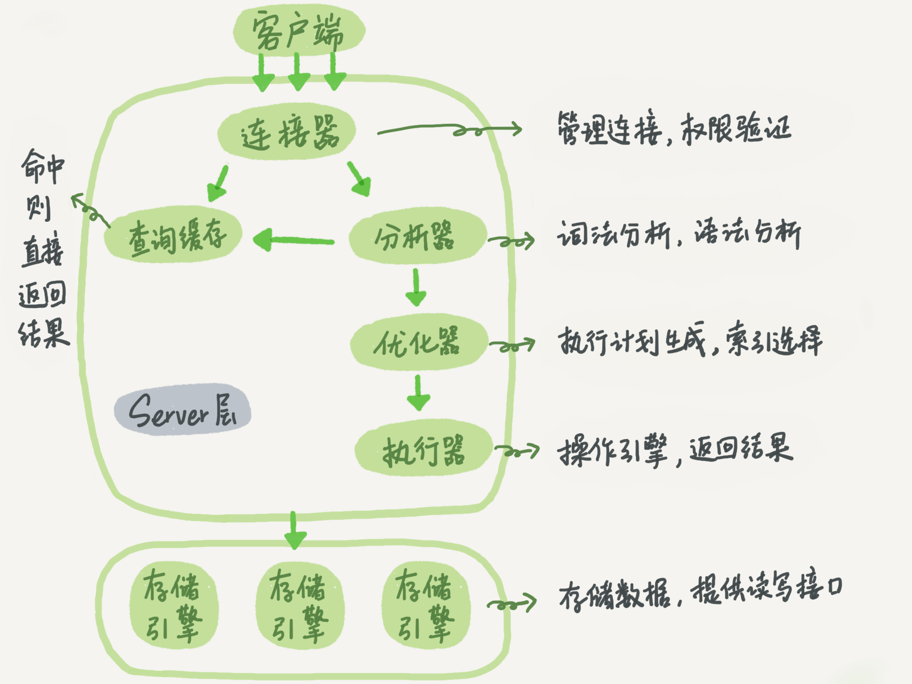
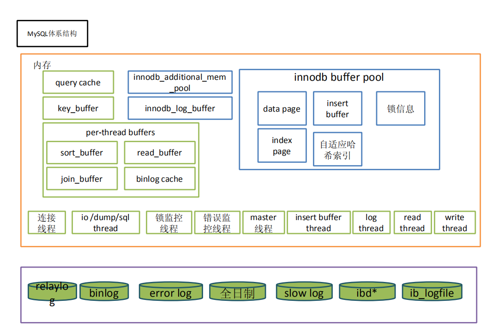
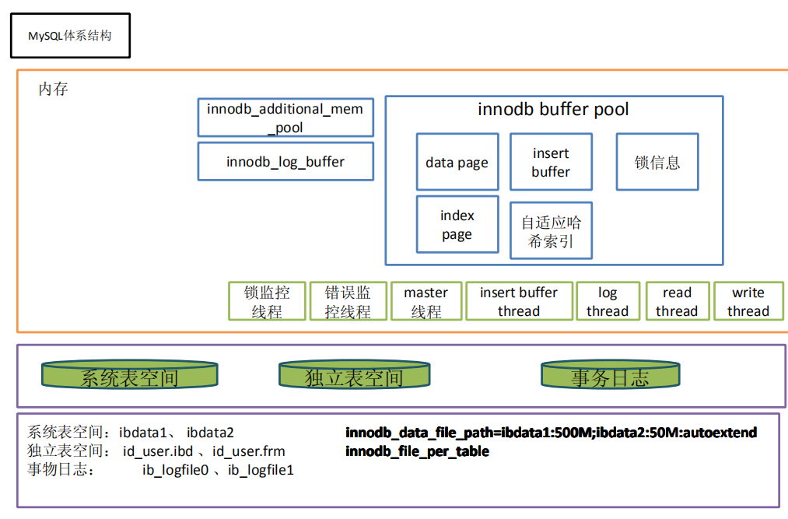

## Mysql 基础架构

下图是 MySQL 的一个简要架构图，从下图你可以很清晰的看到用户的 SQL 语句在 MySQL 内部是如何执行的。
先简单介绍一下下图涉及的一些组件的基本作用帮助大家理解这幅图。

- 连接器： 身份认证和权限相关 (登录 MySQL 的时候)。
- 查询缓存：执行查询语句的时候，会先查询缓存（MySQL 8.0 版本后移除，因为这个功能不太实用）。
- 分析器：没有命中缓存的话，SQL 语句就会经过分析器，分析器说白了就是要先看你的 SQL 语句要干嘛，再检查你的 SQL 语句语法是否正确。
- 优化器： 按照 MySQL 认为最优的方案去执行。
- 执行器：执行语句，然后从存储引擎返回数据。

简单来说 MySQL 主要分为 Server 层和存储引擎层：

- Server 层：主要包括连接器、查询缓存、分析器、优化器、执行器等，所有跨存储引擎的功能都在这一层实现，比如存储过程、触发器、视图，函数等，还有一个通用的日志模块 binlog 日志模块。
- 存储引擎： 主要负责数据的存储和读取，采用可以替换的插件式架构，支持 InnoDB、MyISAM、Memory 等多个存储引擎，其中 InnoDB 引擎有自有的日志模块 redolog 模块。现在最常用的存储引擎是 InnoDB，它从 MySQL 5.5.5 版本开始就被当做默认存储引擎了。

### 基本组件

#### 连接器

连接器主要和身份认证和权限相关的功能相关，就好比一个级别很高的门卫一样。

主要负责用户登录数据库，进行用户的身份认证，包括校验账户密码，权限等操作，如果用户账户密码已通过，连接器会到权限表中查询该用户的所有权限，之后在这个连接里的权限逻辑判断都是会依赖此时读取到的权限数据，也就是说，后续只要这个连接不断开，即时管理员修改了该用户的权限，该用户也是不受影响的。

#### 查询缓存

查询缓存主要用来缓存我们所执行的 SELECT 语句以及该语句的结果集。

连接建立后，执行查询语句的时候，会先查询缓存，MySQL 会先校验这个 sql 是否执行过，以 Key-Value 的形式缓存在内存中，Key 是查询预计，Value 是结果集。如果缓存 key 被命中，就会直接返回给客户端，如果没有命中，就会执行后续的操作，完成后也会把结果缓存起来，方便下一次调用。当然在真正执行缓存查询的时候还是会校验用户的权限，是否有该表的查询条件。

MySQL 查询不建议使用缓存，因为查询缓存失效在实际业务场景中可能会非常频繁，假如你对一个表更新的话，这个表上的所有的查询缓存都会被清空。对于不经常更新的数据来说，使用缓存还是可以的。

所以，一般在大多数情况下我们都是不推荐去使用查询缓存的。

MySQL 8.0 版本后删除了缓存的功能，官方也是认为该功能在实际的应用场景比较少，所以干脆直接删掉了。

#### 分析器

MySQL 没有命中缓存，那么就会进入分析器，分析器主要是用来分析 SQL 语句是来干嘛的，分析器也会分为几步：

1. 第一步，词法分析，一条 SQL 语句有多个字符串组成，首先要提取关键字，比如 select，提出查询的表，提出字段名，提出查询条件等等。做完这些操作后，就会进入第二步。
2. 第二步，语法分析，主要就是判断你输入的 sql 是否正确，是否符合 MySQL 的语法。

完成这 2 步之后，MySQL 就准备开始执行了，但是如何执行，怎么执行是最好的结果呢？这个时候就需要优化器上场了。

#### 优化器

优化器的作用就是它认为的最优的执行方案去执行（有时候可能也不是最优），比如多个索引的时候该如何选择索引，多表查询的时候如何选择关联顺序等。

可以说，经过了优化器之后可以说这个语句具体该如何执行就已经定下来。

#### 执行器

当选择了执行方案后，MySQL 就准备开始执行了，首先执行前会校验该用户有没有权限，如果没有权限，就会返回错误信息，如果有权限，就会去调用引擎的接口，返回接口执行的结果。

#### 存储引擎

存储引擎就是真正保存数据，索引数据的容器。在 MySQL 中有两个主流的存储引擎，MyISAM 和 InnoDB。

#### 区别

MyISAM 是 MySQL 的默认数据库引擎（5.5 版之前）。虽然性能极佳，而且提供了大量的特性，包括全文索引、压缩、空间函数等，但 MyISAM 不支持事务和行级锁，而且最大的缺陷就是崩溃后无法安全恢复。不过，5.5 版本之后，MySQL 引入了 InnoDB（事务型数据库引擎），MySQL 5.5 版本后默认的存储引擎为 InnoDB。

大多数时候我们使用的都是 InnoDB 存储引擎，但是在某些情况下使用 MyISAM 也是合适的比如读密集的情况下。（如果你不介意 MyISAM 崩溃回复问题的话）。

**是否支持行级锁** : MyISAM 只有表级锁 (table-level locking)，而 InnoDB 支持行级锁 (row-level locking) 和表级锁，默认为行级锁。
**是否支持事务和崩溃后的安全恢复**： MyISAM 强调的是性能，每次查询具有原子性，其执行速度比 InnoDB 类型更快，但是不提供事务支持。但是 InnoDB 提供事务支持事务，外部键等高级数据库功能。 具有事务 (commit)、回滚 (rollback) 和崩溃修复能力 (crash recovery capabilities) 的事务安全 (transaction-safe (ACID compliant)) 型表。
**是否支持外键**： MyISAM 不支持，而 InnoDB 支持。
**是否支持 MVCC** ：仅 InnoDB 支持。应对高并发事务，MVCC 比单纯的加锁更高效；MVCC 只在 READ COMMITTED 和 REPEATABLE READ 两个隔离级别下工作；MVCC 可以使用 乐观 (optimistic) 锁 和 悲观 (pessimistic) 锁来实现；各数据库中 MVCC 实现并不统一。

一般情况下我们选择 InnoDB 都是没有问题的，但是某些情况下你并不在乎可扩展能力和并发能力，也不需要事务支持，也不在乎崩溃后的安全恢复问题的话，选择 MyISAM 也是一个不错的选择。但是一般情况下，我们都是需要考虑到这些问题的。

### Mysql 结构图

### Mysql 内存结构

