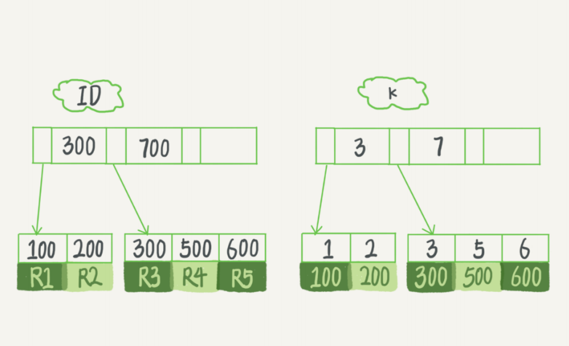

## Mysql 索引

### 索引分类概览

mysql 索引类型大致分为两类，分别为BTree 索引与 Hash索引，BTree索引就是我们常说的B+树索引。

而在Innodb引擎中 BTree 索引在一张表中大致又分为两种类型

- 聚簇索引
- 二级索引
- 空间索引
- 唯一索引

针对MyISAM 与 InnoDB两种引擎 ，索引的 叶子节点上存放数据也有不同

- MyISAM: B+Tree 叶节点的 data 域存放的是数据记录的地址。在索引检索的时候，首先按照 B+Tree 搜索算法搜索索引，如果指定的 Key 存在，则取出其 data 域的值，然后以 data 域的值为地址读取相应的数据记录。这被称为 “非聚簇索引”。
- InnoDB: 其数据文件本身就是索引文件。相比 MyISAM，索引文件和数据文件是分离的，其表数据文件本身就是按 B+Tree 组织的一个索引结构，树的叶节点 data 域保存了完整的数据记录。这个索引的 key 是数据表的主键，因此 InnoDB 表数据文件本身就是主索引。这被称为 “聚簇索引（或聚集索引）”。而其余的索引都作为辅助索引，辅助索引的 data 域存储相应记录主键的值而不是地址，这也是和 MyISAM 不同的地方。在根据主索引搜索时，直接找到 key 所在的节点即可取出数据；在根据辅助索引查找时，则需要先取出主键的值，再走一遍主索引。 因此，在设计表的时候，不建议使用过长的字段作为主键，也不建议使用非单调的字段作为主键，这样会造成主索引频繁分裂。


二级索引也支持很多种方式，如下：

- 前缀索引
- 联合索引（联合索引的使用有一些注意点与限制）


### MyISAM 索引 与 InndoDB 的区别

1、存储结构

MyISAM 存储的表分为三个文件frm(表结构)、MYD（表数据）， MYI（表索引） 

Innodb 存储的表分为两个 一个是frm（表结构）、ibd（数据文件和索引文件放在了一起）

2、事务支持

myisam不支持事务，innodb支持事务

3、锁

myisam只支持表级锁

innodb支持行级锁， 具有比较好的并发性能，但是行级锁只有在where子句是对索引筛选才生效，非索引where会锁全表 

**Note**

```
1、INNODB表是索引组织的表，主键是聚集索引，非主键索引都包含主键信息。
2、INNODB默认是行锁。
3、INNODB行锁是通过给索引项加锁来实现的，即只有通过索引条件检索数据，InnoDB才使用行级锁，否则将使用表锁。 
```


### 索引的优点

1、索引大大较少了服务器需要扫描的数据量

2、索引可以帮助服务器避免排序和临时表

3、索引可以将随机I/O 变为 顺序I/O


### 聚簇索引

聚簇索引 又常被称之为主键索引，mysql的表数据都是根据主键顺序以索引的形式存放的，这种存储方式的表称为索引组织 表，聚簇索引的叶子节点存放的是行数据，并不是和MyIsam 一样存放的数据指针，而 二级索引叶子节点存放的则是主键的值，当我们根据二级索引查找某一行数据时，根据索引树定位到某个索引子节点时，取出来索引子节点存放的主键值，再根据主键值从新查找 主键索引树的子节点，然后将子节点的值返回给mysql server，这个过程称之为回表

Mysql不允许指定某一列作为聚簇索引，只有当为表设定主键的时候才会生成聚簇索引，如果没有定义主键，InndoDB 将会选择唯一的非空索引替代，如果没有这样的索引，Innodb 会隐式定义一个主键作为聚簇索引


### 二级索引


### InndoDB 的索引模型

在 InnoDB 中，表都是根据主键顺序以索引的形式存放的，这种存储方式的表称为索引组织 表。又因为前面我们提到的，InnoDB 使用了 B+ 树索引模型，所以数据都是存储在 B+ 树中 的。 

每一个索引在 InnoDB 里面对应一棵 B+ 树。


B+ 树为了维护索引有序性，在插入新值的时候需要做必要的维护。以上面这个图为例，如果插入新的行 ID 值为 700，则只需要在 R5 的记录后面插入一个新记录。如果新插入的 ID 值为 400，就相对麻烦了，需要逻辑上挪动后面的数据，空出位置。 

而更糟的情况是，如果 R5 所在的数据页已经满了，根据 B+ 树的算法，这时候需要申请一个新 的数据页，然后挪动部分数据过去。这个过程称为页分裂。在这种情况下，性能自然会受影响。

除了性能外，页分裂操作还影响数据页的利用率。原本放在一个页的数据，现在分到两个页中， 整体空间利用率降低大约 50%。 

当然有分裂就有合并。当相邻两个页由于删除了数据，利用率很低之后，会将数据页做合并。合并的过程，可以认为是分裂过程的逆过程。


### 索引优化

建表语句

```
mysql> create table T (
ID int primary key,
k int NOT NULL DEFAULT 0, 
s varchar(16) NOT NULL DEFAULT '',
index k(k))
engine=InnoDB;

insert into T values(100,1, 'aa'),(200,2,'bb'),(300,3,'cc'),(500,5,'ee'),(600,6,'ff'),(700,7,'gg
```




全值匹配


匹配最左前缀


匹配列前缀


匹配范围性


覆盖索引


二级索引优化

因为每个二级索引叶子节点都是存放的主键的值，**主键长度越小，普通索引的叶子节点就越小，普通索引占用的空间也就越小。**，反之，占用的空间就会越大，mysql存储的最小单位是 数据页，每个叶如果没有特殊设置默认为16K，当我们需要对某一表的数据进行范围查询时，mysql会将该表的数据按数据页为单位缓存在内存中，当一页存放的数据越多，那就代表读取磁盘的IO次数越少，反之越多


### 聚簇索引与二级索引


### 索引的重建


### 普通索引与唯一索引


### Explain 分析


### B树 与 B+树的区别

#### 使用B树或者B+树存储索引的原因