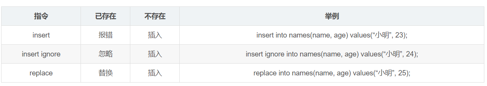

### Mysql Insert 语句

创建表

CREATE TABLE names(
    id INT(10) PRIMARY KEY AUTO_INCREMENT,
    name VARCHAR(255) UNIQUE,
    age INT(10)
)

插入数据

mysql> insert into names(name, age) values("小明", 24);
mysql> insert into names(name, age) values("大红", 24);
mysql> insert into names(name, age) values("大壮", 24);
mysql> insert into names(name, age) values("秀英", 24);

mysql> select * from names;
+----+--------+------+
| id | name   | age  |
+----+--------+------+
|  1 | 小明   |   24 |
|  2 | 大红   |   24 |
|  3 | 大壮   |   24 |
|  4 | 秀英   |   24 |
+----+--------+------+

insert
插入已存在, id会自增，但是插入不成功，会报错

mysql> insert into names(name, age) values("小明", 23);

ERROR 1062 (23000): Duplicate entry '小明' for key 'name'

replace
已存在替换，删除原来的记录，添加新的记录

mysql> replace into names(name, age) values("小明", 23);
Query OK, 2 rows affected (0.00 sec)

mysql> select * from names;
+----+--------+------+
| id | name   | age  |
+----+--------+------+
|  2 | 大红   |   24 |
|  3 | 大壮   |   24 |
|  4 | 秀英   |   24 |
|  6 | 小明   |   23 |
+----+--------+------+

不存在替换，添加新的记录

mysql> replace into names(name, age) values("大名", 23);
Query OK, 1 row affected (0.00 sec)

mysql> select * from names;
+----+--------+------+
| id | name   | age  |
+----+--------+------+
|  2 | 大红   |   24 |
|  3 | 大壮   |   24 |
|  4 | 秀英   |   24 |
|  6 | 小明   |   23 |
|  7 | 大名   |   23 |
+----+--------+------+

insert ignore
插入已存在，忽略新插入的记录，id会自增，不会报错

mysql> insert ignore into names(name, age) values("大壮", 25);
Query OK, 0 rows affected, 1 warning (0.00 sec)

插入不存在，添加新的记录

mysql> insert ignore into names(name, age) values("壮壮", 25);
Query OK, 1 row affected (0.01 sec)

mysql> select * from  names;
+----+--------+------+
| id | name   | age  |
+----+--------+------+
|  2 | 大红   |   24 |
|  3 | 大壮   |   24 |
|  4 | 秀英   |   24 |
|  6 | 小明   |   23 |
|  7 | 大名   |   23 |
| 10 | 壮壮   |   25 |
+----+--------+------+
