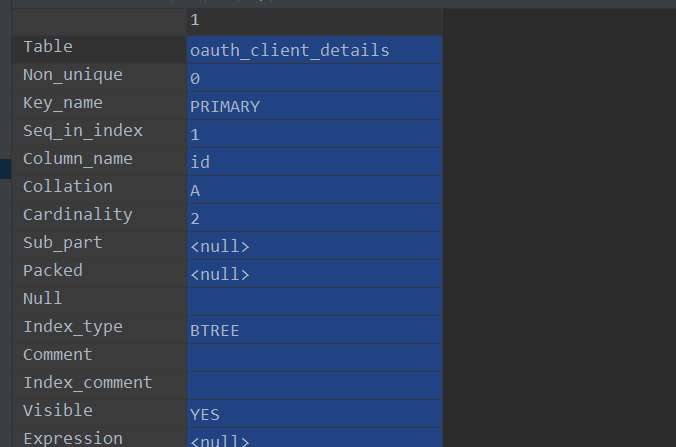

#### 用户操作

```
create user 'user_name'@ip_addr identifield by 'password';

#######创建了一个名为：test 密码为：1234 的用户
 create user 'test'@'localhost' identified by '1234';
 
 
######查询用户
select user,host from mysql.user;


######删除用户“test”
drop user test@localhost ;

--若创建的用户允许任何电脑登陆，删除用户如下
drop user test@'%';


########更改密码
--方法1，密码实时更新；修改用户“test”的密码为“1122”
set password for test =password('1122');
--方法2，需要刷新；修改用户“test”的密码为“1234”
update  mysql.user set  password=password('1234')  where user='test'
--刷新
flush privileges;
```


#### 授权语句

```
grant select,reload,lockt_tables,some_grant on *.* to 'user_name' identifield by 'passwd'

-----授予用户test通过外网IP对数据库“testdb”的全部权限
grant all privileges on 'testdb'.* to 'test'@'%' identified by '1234';  

-----刷新权限
flush privileges; 

------授予用户“test”通过外网IP对于该数据库“testdb”中表的创建、修改、删除权限,以及表数据的增删查改权限
grant create,alter,drop,select,insert,update,delete on testdb.* to test@'%';  


-------查看用户权限
--查看用户“test”
show grants for test;

收回用户权限；
revoke delete on db.db from user@ip;
```


#### mysql支持的权限列表

```
show privileges;
```


#### mysql 客户端执行sql

```
mysql -uroot -p -e'create database db_name'
```


#### 查看数据库下的所有表

```、
SHOW [FULL] TABLES [FROM db_name] [like_or_where]
```


#### 查看表的状态

```
show table status like 'table_name';

字段信息
	Name : 表名
	Engine：表的存储引擎类型
	Row_format：行的格式，对于MyISAM表，可选的值为
	rows ： 表中的行数，对于InnoDB来说该值是估算值
	avg_row_length：平均每行包含的字节数
	data_length：表数据的大小
	max_data_length：表数据的最大容量，该值和存储引擎有关
	index_length：索引的大小（以字节为单位）
	data_free：对于MyISAM表，表示已分配，单目前没有使用的空间，这部分空间包括了之前删除的行以及后续可以被INSERT利用的空间
	auto_increment：下一个auto_increment的值
	create_time：表的创建时间
	update_time：表数据的最后修改时间
	check_time：使用check table 命令或者myisamchk工具最后一次检查表的时间
	collation：表的默认字符集和字符列排序规则
	checksum：如果启动保存的是整个表的实时校验和
	comment ： 包含了一些其他的额外信息，对于myisam表 保存的是表在创建时带的注释，如果是一个视图，则该列包含 view的文本字样
```


#### 查看创建表的sql

```
show create table table_name;
```


#### 查看当前打开的表

```
SHOW OPEN TABLES [FROM db_name] [like_or_where]：列出当前在表缓存中所打开的non-TEMPORARY表
```


#### 查看错误日志

```
select @@log_error；

select @@log_error_verbosity;
```


#### 查看二进制日志；

```
SHOW {BINARY | MASTER} LOGS：在服务器上列出二进制日志文件。
```


#### 刷新二进制日志文件

```
flush logs
```


#### 查看 某个表的index

```
show index from tb_name;
```


#### 删除某个时间点之前的二进制日志文件

```
purge binary logs to 'mysql-bin.010'

将 mysql-bin.010 之前的二进制日志文件全部删除掉

purge binary logs before '2001-04-02 06:40:00' 将指定日期之前的二进制文件全部删除掉
```


#### 查看主库或者从库的状态

```
show slave status；

show master status；
```


#### 查看当前mysql的变量

```
show variables like '';

show variables where varaiable_name like '' or varaiable_name like ''
```


#### 查看当前mysql的状态

```
show global status like '';

show global status where varaiable_name like in ('Queries','uptime'); 第二次取样
```


#### kill掉某个线程

```
kill thread_id;
```


#### 校验主从数据表是否一致

```校验主从数据表是否一致
checksum table table_name
```


#### 查看某个账号的授权

```
show grants for usr_name;
```


#### 查看创建数据库的语句

```
SHOW CREATE DATABASE db_name：显示了创建指定数据库的CREATE DATABASE语句。
```


#### 查看某个表的列信息

```
SHOW [FULL] COLUMNS FROM tbl_name [FROM db_name] [like_or_where]
```


#### 查看数据正在运行的线程

```
SHOW [FULL] PROCESSLIST：SHOW PROCESSLIST显示你正在运行的线程。
```


#### 查看已经执行的sql以及sql各个阶段消耗的时间

```
SHOW PROFILES

SHOW PROFILE [types] [FOR QUERY n] [OFFSET n] [LIMIT n]
```


#### reset 重置状态

```
MASTER
删除索引文件列出的所有的二进制日志，把二进制日志索引文件置空，创建一个新的二进制日志文件。

QUERY CACHE
移除查询缓存中所有查询结果。

SLAVE
让从服务器忘记它在主服务器二进制日志中的复制位置。通过删除任何已经存在的中继日志文件(relay log)重设中继日志，并开启一个新的中继日志。
```


#### 开启事物

```
begin 开启事物

start trasaction aruments
	aruments
		READ WRITE 和READ ONLY修饰符决定了事务的访问模式
		WITH CONSISTENT SNAPSHOT修饰符会对支持该特性的存储引擎开启一致性读
		例子
			START TRANSACTION READ WRITE
```


### 查看某一列索引

```sql
show index from oauth_client_details where Column_name = 'id' 
```

