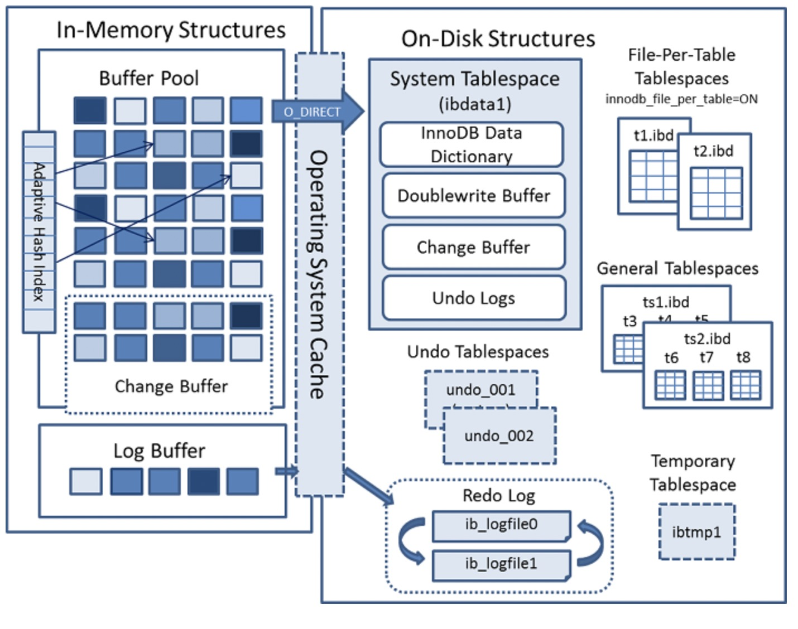

# Innodb引擎详解

## 概览

Innodb引擎架构图如下：

  

InnoDB 使用日志先行策略， 数据修改先在内存中完成，并且将事务记录成重做日志(Redo Log)，转换为顺序IO高效的提交事务。这里日志先行，说的是日志记录到数据库以后，对应的事务就可以返回给用户，表示事务完成。但是实际上，这个数据可能还只在内存中修改完，并没有刷到磁盘上去。内存是易失的，如果在数据落地前，机器挂了，那么这部分数据就丢失了。
InnoDB 通过 redo 日志来保证数据的一致性。如果保存所有的重做日志，显然可以在系统崩溃时根据日志重建数据。当然记录所有的重做日志不太现实，所以 InnoDB 引入了检查点机制。即定期检查，保证检查点之前的日志都已经写到磁盘，则下次恢复只需要从检查点开始。 

**Innodb的架构 可以分为两大块，分别为内存中的结构与磁盘上的结构, InnoDB 使用日志先行策略，将数据修改先在内存中完成，并且将事务记录成重做日志(Redo Log)，转换为顺序IO高效的提交事务 **

## 内存结构

Innodb 的内存机构包括四大组件分别为：

- `Buffer Pool`：缓冲池：是主内存中的一个区域，在InnoDB访问表和索引数据时会在其中进行高速缓存，大量减少磁盘IO操作，提升效率。
- `Change Buffer`：写缓冲区：避免每次增删改都进行IO操作，提升性能。
- `Adaptive Hash Index`：自适应哈希索引：使用索引关键字的前缀构建哈希索引，提升查询速度。
- `Log Buffer`：日志缓冲区：保存要写入磁盘上的日志文件的数据，缓冲区的内容定期刷新到磁盘

如果从内存上看 Change Buffer 与 Adaptive Hash Index 占用的内存都属于Buffer Pool，Log Buffer占用的内存与 Buffer Pool独立。 

### Buffer Pool

 缓冲池缓存的数据包括Page Cache、Change Buffer、Data Dictionary Cache等，通常 MySQL 服务器的 80% 的物理内存会分配给 Buffer Pool。 通常我们最需要关注的就是 ChangeBuffer

Innodb种的数据管理最小单位为页，每一页 大小为 16KB， 每页包含若干行数据 

Innodb 的缓存池通过页链表来实现，通过LRU 淘汰算法，将最少访问的页从内存中淘汰出去

### ChangeBuffer

InnoDB辅助索引不同于聚集索引的顺序插入，如果每次修改二级索引都直接写入磁盘，则会有大量频繁的随机IO。Change buffer 的主要目的是将对 **非唯一** 辅助索引页的操作缓存下来，以此减少辅助索引的随机IO，并达到操作合并的效果。它会占用部分Buffer Pool 的内存空间。

### Adaptive Hash Index

自适应哈希索引(AHI)查询非常快，一般时间复杂度为 O(1)，相比 B+ 树通常要查询 3~4次，效率会有很大提升。innodb 通过观察索引页上的查询次数，如果发现建立哈希索引可以提升查询效率，则会自动建立哈希索引，称之为自适应哈希索引

### Log Buffer

Log Buffer是 重做日志在内存中的缓冲区，大小由 `innodb_log_buffer_size` 定义，默认是 16M。一个大的 Log Buffer可以让大事务在提交前不必将日志中途刷到磁盘，可以提高效率。如果你的系统有很多修改很多行记录的大事务，可以增大该值。

配置项 `innodb_flush_log_at_trx_commit` 用于控制 Log Buffer 如何写入和刷到磁盘。注意，除了 MySQL 的缓冲区，操作系统本身也有内核缓冲区。

- 默认为1，表示每次事务提交都会将 Log Buffer 写入操作系统缓存，并调用配置的 "flush" 方法将数据写到磁盘。设置为 1 因为频繁刷磁盘效率会偏低，但是安全性高，最多丢失 1个 事务数据。而设置为 0 和 2 则可能丢失 1秒以上 的事务数据。
- 为 0 则表示每秒才将 Log Buffer 写入内核缓冲区并调用 "flush" 方法将数据写到磁盘。
- 为 2 则是每次事务提交都将 Log Buffer写入内核缓冲区，但是每秒才调用 "flush" 将内核缓冲区的数据刷到磁盘。

## Innodb 在磁盘上的结构

 磁盘中的结构分为两大类：表空间和重做日志。 

- 表空间：

  - 系统表空间

    - Inndodb 数据字典
    - 双写缓冲区（Doublewrite Buffer）：位于系统表空间的一个存储区域，InnoDB在BufferPool中刷新页面时，会将数据页写入该缓冲区后才会写入磁盘。
    - ChangeBuffer
    - Undo log：数据更改前的快照，可以用来回滚数据

  -   file-per-table 独立表空间 

    - 数据信息
    - 索引数据

    

- Redo log： 存储的就是 Log Buffer 刷到磁盘的数据 ，记录DML操作的日志，用来崩溃后的数据恢复

### innodb 表空间

 表空间根据类型可以分为系统表空间，File-Per-Table 表空间，常规表空间，Undo表空间，临时表空间等。本节分析 File-Per-Table 表空间。 

- 系统表空间：包含内容有数据字典，双写缓冲，修改缓冲以及undo日志，以及在系统表空间创建的表的数据和索引。

- 常规表空间：类似系统表空间，也是一种共享的表空间，可以通过 `CREATE TABLESPACE` 创建常规表空间，多个表可共享一个常规表空间，也可以修改表的表空间。注意：必须删除常规表空间中的表后才能删除常规表空间。
- File-Per-Table表空间：MySQL InnoDB新版本提供了 `innodb_file_per_table` 选项，每个表可以有单独的表空间数据文件(.ibd)，而不是全部放到系统表空间数据文件 ibdata1 中。在 MySQL5.7 中该选项默认开启。
- 其他表空间：其他表空间中Undo表空间存储的是Undo日志。除了存储在系统表空间外，Undo日志也可以存储在单独的Undo表空间中。临时表空间则是非压缩的临时表的存储空间，默认是数据目录的 ibtmp1 文件，所有临时表共享，压缩的临时表用的是 File-Per-Table 表空间。

### 独立表空间

- 优点：可以方便回收删除表所占的磁盘空间。如果使用系统表空间的话，删除表后空闲空间只能被 InnoDB 数据使用。TRUNCATE TABLE 操作会更快。可以单独拷贝表空间数据到其他数据库(使用 transportable tablespace 特性)，可以更方便的观测每个表空间数据的大小。

- 缺点：fsync 操作需要作用的多个表空间文件，比只对系统表空间这一个文件进行fsync操作会多一些 IO 操作。此外，mysqld需要维护更多的文件描述符。

### 系统表空间

 系统表空间包含内容有：数据字典，双写缓冲，修改缓冲，undo日志，以及在系统表空间创建的表的数据和索引 ，包括创建的数据表的元信息数据

### Undo log

见 mysql 事务一节

### Doublewrite Buffer

**是什么？**

doublewrite buffer是mysql 系统表空间的一块存储区域。

**有什么用？**

在Innodb将数据页写到数据存储文件之前，存储从Innodb缓存池刷过来的数据页。且只有将数写入doublewriter buffer后，Innodb才会进行数据页的物理存储。如果在数据页写盘时发生操作系统、存储系统、或者myql进程中断，Innodb可以从doublewriter buffer存储中找回丢失的数据页备份。

**性能影响？**

虽然数据总是双份写，但并不意味着需要双倍的IO操作，或者IO能力。通过向操作系统发送fsync()命令，将数据以较大的连续数据块的形式写入doublewriter buffer。

doublewriter buffer多数情况下是默认开启的，可以通过配置innnodb_doublewrite=0关闭

关闭doublewriter buffer可以在一定程度上提升数据库层面性能，但是要处理好容灾。可以在应用层面通过重试补偿，或者数据检查机制等处理写中断引发的问题。

