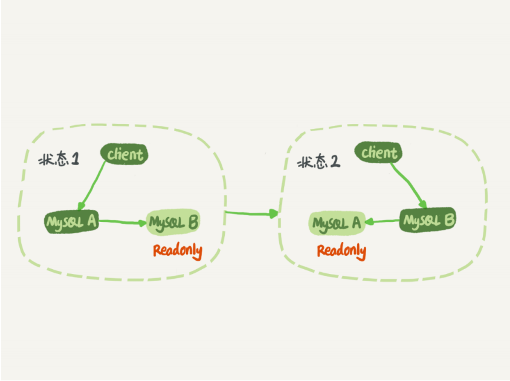
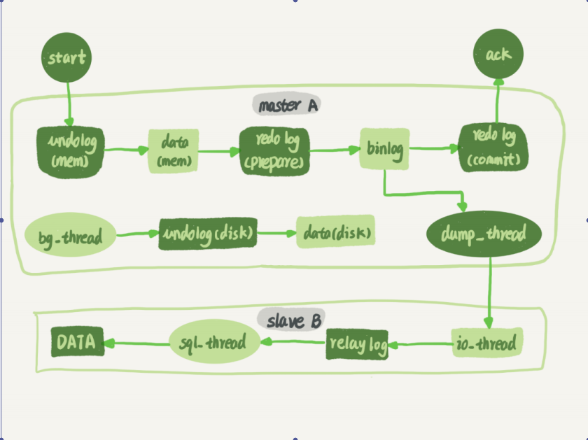

## Mysql 主从同步

Mysql 主从同步主要分为两种方式，一种是基于binlog 进行同步，一种是就有GTID 进行同步

### mysql 主备的基本原理

如图 1 所示就是基本的主备切换流程。

在状态 1 中，客户端的读写都直接访问节点 A，而节点 B 是 A 的备库，只是将 A 的更新都同步过来，到本地执行。这样可以保持节点 B 和 A 的数据是相同的。

当需要切换的时候，就切成状态 2。这时候客户端读写访问的都是节点 B，而节点 A 是 B 的备库。

当我们把备库设置为只读时，不需要担心由于备库的只读模式导致主库同步的数据无法写入，因为 readonly 设置对超级 (super) 权限用户是无效的，而用于同步更新的线程，就拥有超级权限。

下图展示了 mysql 主从同步的基本流程：

备库 B 跟主库 A 之间维持了一个长连接。主库 A 内部有一个线程，专门用于服务备库 B 的这个长连接。一个事务日志同步的完整过程是这样的：

1、在备库 B 上通过 change master 命令，设置主库 A 的 IP、端口、用户名、密码，以及要从哪个位置开始请求 binlog，这个位置包含文件名和日志偏移量

2、在备库 B 上执行 start slave 命令，这时候备库会启动两个线程，就是图中的 io_thread 和sql_thread。其中 io_thread 负责与主库建立连接

3、主库 A 校验完用户名、密码后，开始按照备库 B 传过来的位置，从本地读取 binlog，发给B。

4、备库 B 拿到 binlog 后，写到本地文件，称为中转日志（relay log）

5、sql_thread 读取中转日志，解析出日志里的命令，并执行

### binlog 的三种格式

binlog有三种格式，分别为mixed、statement、row，mixed 是 statement 与 row 格式的混合体，如果我们将格式设置为了mixed 模式，mysql 则会根据当前执行的语句自动判断存入什么样格式的sql语句

